# UT1.1 Introducción a los sistemas informáticos: hardware

## Informática

Según el Diccionario de la Real Academia Española se define a la **informática** como:

```note
Conjunto de conocimientos científicos y técnicas que hacen posible el tratamiento automático de la información por medio de dispositivos digitales, denominados ordenadores o computadoras.
```


Su aparición como ciencia se debe a la presentación del primer ordenador en el año 1936 denominado **Z1** y usado como arma de cálculo durante la 2ª Guerra Mundial.

El objeto de estudio de la Informática es muy amplio:

-   **Aspecto Físico** (Diseño, Arquitectura, Fabricación, Componentes)

-   **Aspecto Lógico** (Almacenamiento, Organización de datos, Programas,
    Información y Comunicación entre dispositivos).


Actualmente es difícil concebir un área que no use el apoyo de la informática. Existen ramas de la informática dedicada a nuevos campos como la Inteligencia Artificial, Ingeniería, Cine, Música, Videojuegos, Realidad Virtual y Robótica, en desarrollo gracias al apoyo de varias ciencias.

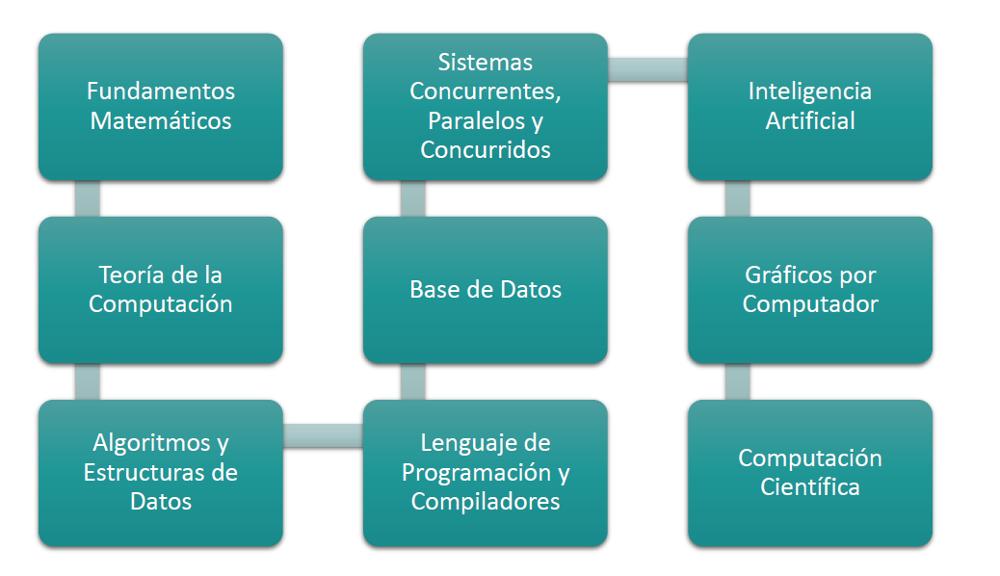

Campos fundamentales de las **ciencias de la computación**:

- **Fundamentos matemáticos:**
   - **Criptografía**. Consta de algoritmos para proteger datos privados, incluyendo el cifrado.

   - **Teoría de grafos** Recursos elementales para almacenamiento de datos y algoritmos de búsqueda.

 


- **Bases de datos:**

    - **Minería de datos y big data**.

      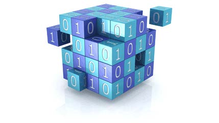

   - **Estudio de algoritmos** para buscar y procesar información en documentos y bases de datos; adquisición de información.

      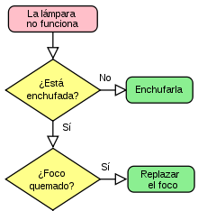

- **Algoritmos y estructuras de datos:**
  
    - Análisis de algoritmos. Procesos formales usados para los cómputos,  y eficiencia de estos procesos.
      
    - Estructuras de datos. Organización y manipulación de los datos.

    
- **Inteligencia Artificial (IA):**

    - La implementación y estudio de sistemas que exhiben (ya sea por una inteligencia autónoma o comportamiento propio, a veces inspirado por las características de los seres vivos.
    - Inteligencia artificial conversacional y generativa.
    - Robótica: algoritmos para el control de robots autónomos

    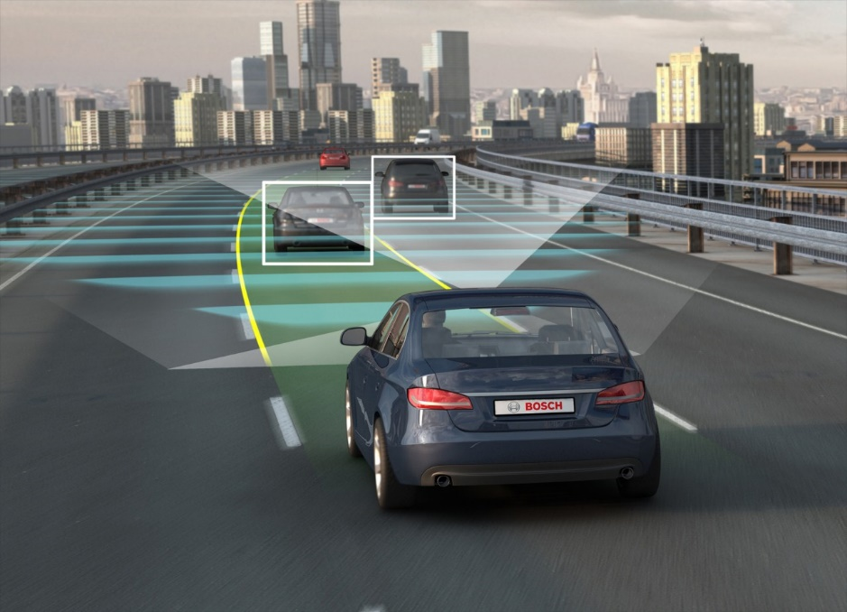

    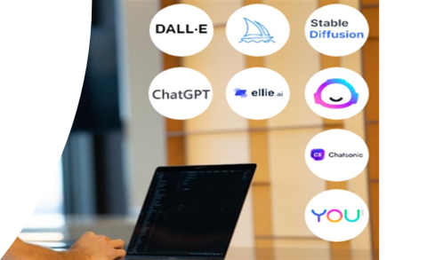

    

- **Gráficos por ordenador:**

    - Algoritmos para generar sintéticamente imágenes fotorrealistas.
    - Reconocimiento y procesamiento de imágenes.

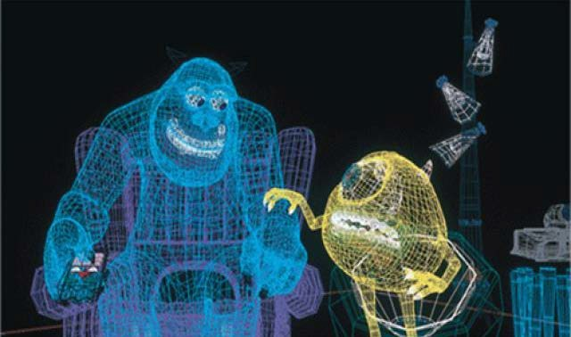

- **Computación científica:**

   - Bioinformática
   - Computación cuántica
   
   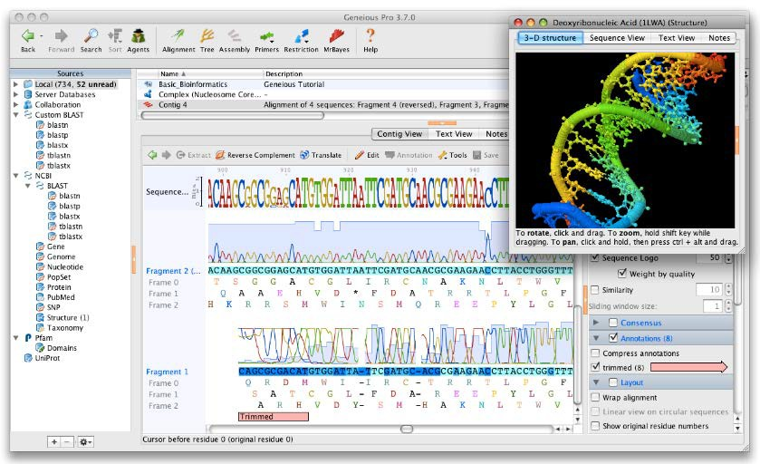


- **Ingeniería del software y de sistemas:**

    - Estudio del diseño de software
    - Análisis del software, soporte y su mantenimiento
    - Testeo y planificación

   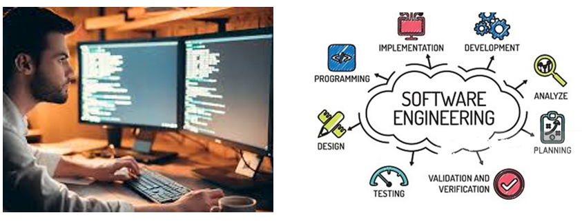

## El ordenador

```note
Un **ordenador** o computadora es una máquina electrónica que sirve para procesar información digital.
```

El ordenador es una máquina compuesta de elementos físicos (**hardware**), en su mayoría circuitos electrónicos, capaces de realizar una gran variedad de trabajos de **procesamiento digital** a gran velocidad.

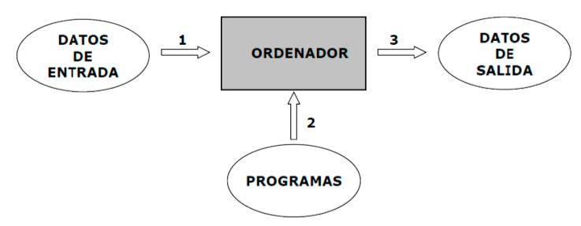

Estos componentes electrónicos necesitan de otros componentes no físicos que los pongan en funcionamiento; los **programas, apps o software**.


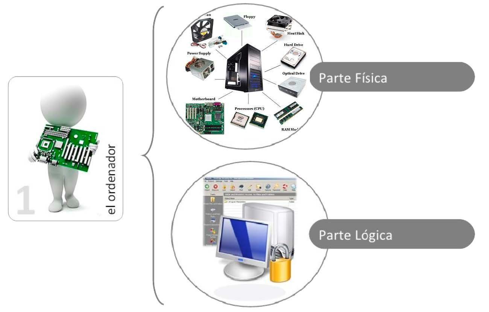

```note
Un ordenador se distingue de otros dispositivos similares, como una calculadora no programable, es que es una máquina de propósito general, es decir, puede realizar tareas muy diversas, de acuerdo a las posibilidades de sus programas y el hardware.
```

Para que los componentes electrónicos de un ordenador sean capaces de funcionar y realizar un proceso determinado, es necesario ejecutar un conjunto de órdenes o instrucciones.

```note
Se denomina **programa** al conjunto de **instrucciones** ordenadas y adecuadas para llevar a cabo un determinado proceso.
```

Cuando un programa está compuesto por varios, forma lo que se denomina como **aplicación informática**.

El **software básico** para hacer funcionar cualquier ordenador se denomina **sistema operativo (SO)**

```note
El **sistema operativo (SO)** es el componente software de un sistema informático capaz de hacer que los **programas** (**software**) procesen información (**datos**) sobre los componentes electrónicos de un ordenador o sistema informático (**hardware**).
```

El **firmware** es otro elemento importante entre software y hardware dentro de un sistema informático. Consta de instrucciones (software) que fijan la lógica primaria sobre los circuitos (hardware) funcionando como el nexo entre las instrucciones que llegan al dispositivo desde el exterior y sus diversas partes electrónicas.

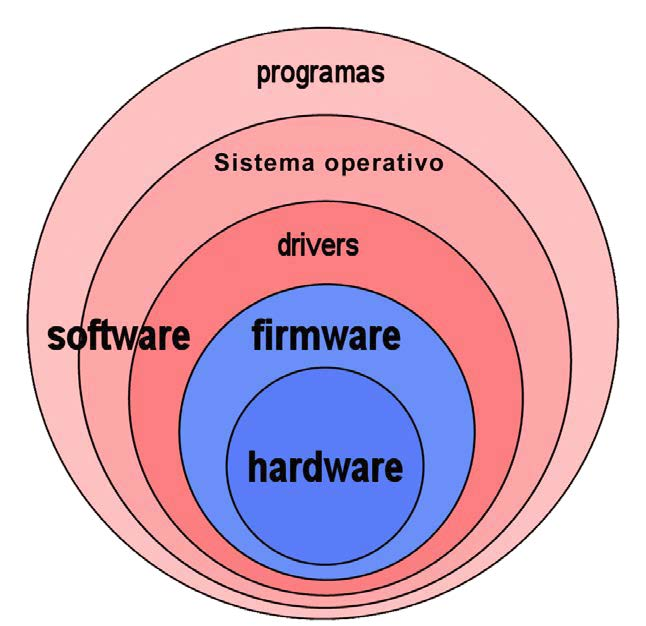


La conexión entre los diferentes subsistemas o componentes de un SI se realiza utilizando una **interfaz**.

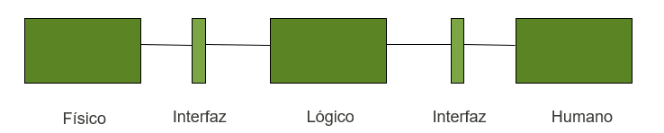

Una interfaz en informática por tanto es la unión que se establece entre dos dispositivos o sistemas independientes para establecer una comunicación y funcionar de forma conjunta. Como concepto, la interfaz es un intérprete o traductor entre dos dispositivos o entre elementos de un mismo dispositivo.


## El Sistema Informático

```note
Un sistema informático está formado a su vez por el hardware del equipo, el software que lo ejecuta y el personal humano que lo controla y programa.
```

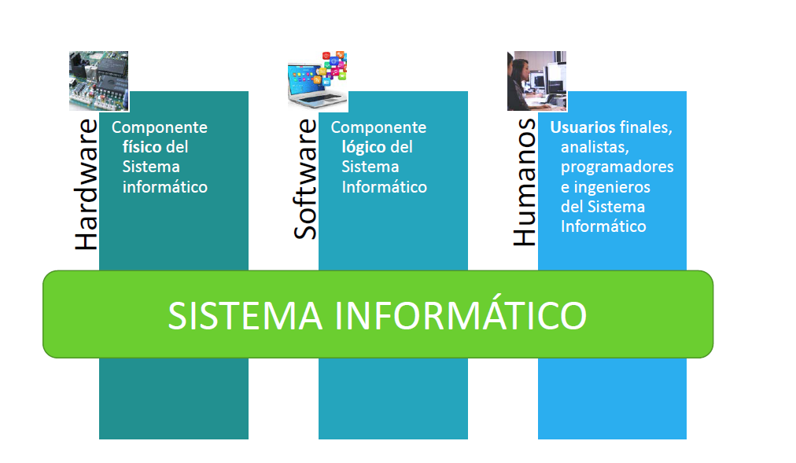

### Hardware

```note
Se denomina **hardware** a todas las partes tangibles de un ordenador o computadora: sus componentes eléctricos, electrónicos, electromecánicos, así como sus periféricos asociados, cables, baterías o carcasas y cajas.
```

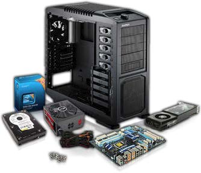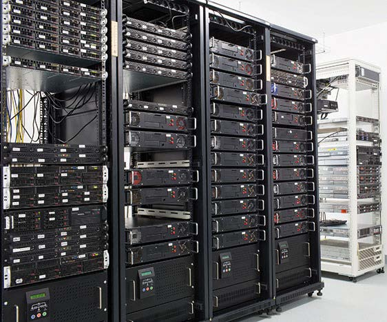

Tipos de hardware:

- **Supercomputador**.
Procesa una gran cantidad de información de forma muy rápida para realizar cálculos complejos. Se emplea sobre todo para la investigación en campos como la medicina (cáncer, Alzheimer, etc.), la meteorología (tsunamis y predicción del tiempo, etc.

- **Ordenador personal o portátil**
(PC o desktop y laptop). Realiza tareas sencillas como navegar por Internet, consumir contenido multimedia, confeccionar documentos, etc. Además, el portátil, gracias a su batería, puede transportarse con relativa facilidad.

- **Dispositivo móvil**
(tablet, smartphone, smartwatch, etc.). Pequeño ordenador con pantalla táctil y batería que, además de hacer las mismas tareas que los ordenadores (con limitaciones en cuanto a capacidad de procesamiento y batería), permiten realizar llamadas, controlar constantes vitales, etc.

- **Mainframe**
(computadora central). Posee una gran capacidad de procesamiento como el supercomputador, pero centrado en el manejo de operaciones de entrada y salida, proporcionando una alta fiabilidad. Se utiliza sobre todo en grandes empresas para dar soporte a una gran cantidad de usuarios.

- **Servidor**
Proporciona servicios como compartición de datos, aplicaciones o dispositivos (como impresoras o discos duros) a través de una red a un conjunto de usuarios. Su capacidad se calcula en función de los servicios que ofrece y del número de usuarios que atiende. Se usa sobre todo para alojar sitios web y compartir recursos.

- **Sistemas de control**
Gestionan y controlan el comportamiento de equipos o máquinas. Suelen ser de tamaño reducido y en ocasiones tienen restricciones de tiempo real. Están instalados en microondas, lavadoras, coches, cajeros, etc.


### Software

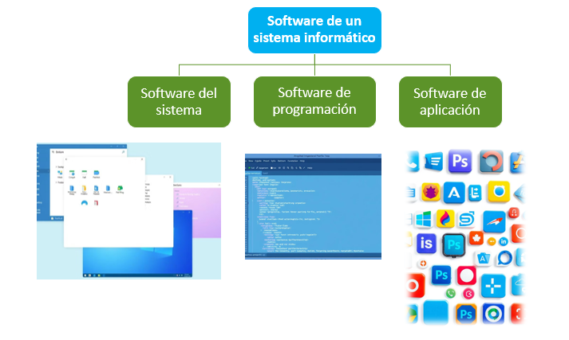

### Personal

- **Usuario básico**: Es aquel que utiliza el ordenador para desarrollar tareas en su puesto de trabajo.

- **Programador**: El programador, también conocido como desarrollador, es el responsable de convertir las especificaciones técnicas del analista en código fuente. Utilizan lenguajes de programación para crear, modificar y mantener software. Deben tener un profundo conocimiento de la lógica de programación, las estructuras de datos y tecnologías de desarrollo.

- **Técnico**: El técnico se encarga de la instalación, configuración, mantenimiento y resolución de problemas en los sistemas informáticos. Su función es asegurar el correcto funcionamiento del hardware y software, brindar soporte técnico a los usuarios y gestionar la infraestructura de red.

- **Jefe de proyecto**: El jefe de proyecto se destaca como la figura clave en la planificación, ejecución y control del proyecto y es el motor que ha de impulsar el avance del mismo mediante la toma de decisiones tendentes a la consecución de los objetivos.

## Tipologías de Sistemas Informáticos

### Sistemas de procesamiento de transacciones

Los sistemas de procesamiento de transacciones **TPS** (Transaction Processing System) son los sistemas empresariales básicos que sirven al nivel operacional de la organización.

Un sistema de procesamiento de transacciones es un sistema computarizado que realiza y registra las transacciones rutinarias diarias necesarias para el funcionamiento de la empresa. Se encuentran en el nivel más bajo de la jerarquía organizacional y soportan las actividades cotidianas del negocio.

### Sistemas de control de procesos de negocio

Los Sistemas de control de procesos de negocio, conocidas también como BPM (Business Process Management) son aquellos sistemas encargados de monitorizar, controlar y gestionar cualquier proceso de industrialización. 

Estos sistemas monitorizan y controlan los procesos industriales o físicos, como puede ser la refinación de petróleo, generación de energía o los sistemas de producción de acero en una planta siderúrgica a través de sensores electrónicos y sistemas en tiempo real.

### Sistemas de apoyo en toma de decisiones

Un Sistema informático de apoyo a la toma de decisiones, también conocido como Sistema de soporte a la decisión o **DSS** (Decision Support System), básicamente es un sistema basado en computadoras diseñado con el propósito de ser usado por una gerencia o gerencia de área para ayudarlos en el proceso de tomar una decisión para resolver problemas y con ello poder diagramar las directrices para seleccionar la mejor opción o predecir los futuros escenarios para afrontar nuevos desafíos.


### Sistemas de colaboración empresarial

Los sistemas **ERP** (Enterprise Resource Planning) son uno de los más claros ejemplos de sistema informático. Los sistemas ERP, también conocidos como Sistemas de colaboración empresarial, son el tipo de sistema informático más utilizado por empresas alrededor del mundo, ya que les permiten a las compañías a gestionar la gran cantidad de información que circula dentro de la misma.

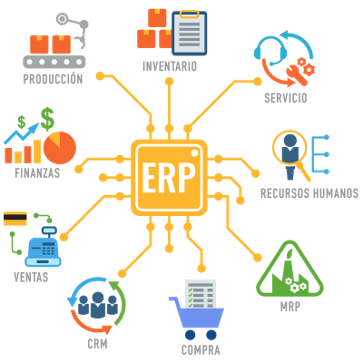

## Evolución histórica del hardware

La evolución histórica de la informática va pareja con la evolución de la mecánica y de la electrónica.

Como antecedentes al inicio de la informática, podemos encontrar a lo largo de la historia de la humanidad distintos instrumentos y máquinas que el hombre ha ido utilizando para facilitar el cálculo.

>   📌 La primera muestra de ello la podemos encontrar en el **ábaco**, que se utilizo en varias culturas de la antigüedad y en la Edad Media y que permitía realizar operaciones de suma y resta con facilidad.

>   En el S XVII podemos encontrar la calculadora que diseñó **Blaise Pascal**, que estaba basada en dispositivos mecánicos y que solo realizaba operaciones limitadas como las sumas y las restas, pero que sentó las bases para que, más adelante, **Leibnitz** desarrollara otra calculadora más potente y con más funciones, como el producto y la división.

>   A principios del siglo XIX **J.M. Jacquard ** desarrolló un telar programable mediante tarjetas perforadas, que fue el antecesor de los primeros dispositivos de cálculo y cuyo diseño fue utilizado posteriormente para la introducción de datos.

La **evolución** del hardware desde el SXX a la actualidad ha sido tecnológicamente vertiginosa y se clasifica en <u>cinco</u> generaciones:

- **1ª Generación** (*1945-1956*): electrónica implementada con válvulas de vacío.

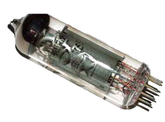


- **2ª Generación** (*1957-1963*): electrónica desarrollada con **transistores**. La lógica discreta era muy parecida a la anterior reduciéndose entre otros factores, el tamaño de un computador en una notable escala.

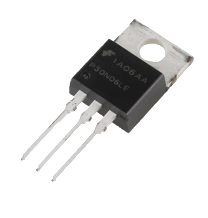

- **3ª Generación** (*1964-1975*): electrónica basada en **circuitos integrados**. Esta tecnología permitió integrar cientos de transistores y otros componentes electrónicos en un único circuito integrado impreso en una pastilla de silicio. Las computadoras redujeron así considerablemente su costo, y tamaño e incrementado su velocidad y fiabilidad.

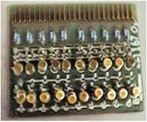


- **4ª Generación** *(1971-1981)* Con la aparición del primer **microprocesador** por parte de Intel (el 4004), junto con mejoras en la miniaturización y la implantación de nuevos lenguajes de alto nivel.	

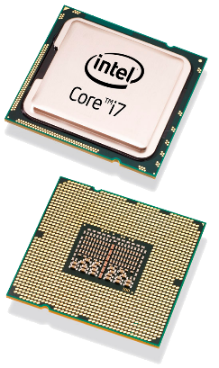


-  **5ª Generación** (*1981-hoy*) Aparece el primer **ordenador personal**, las supercomputadoras actuales y los smartphones. Aparecen los SO en red, móviles y distribuidos.

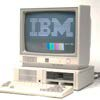

### Primera generación (1945-1956)

- Conmutadores: **válvulas de vacío**
- Poco fiables
- **ENIAC**. Primer ordenador digital fabricado en 1945.
- Un barracón, 30 toneladas.
- Potencia de cálculo: menos que una calculadora de bolsillo.
- Programados en lenguaje máquina.

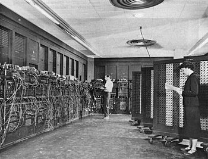

>   ENIAC, construido para la II Guerra Mundial


### Segunda generación (1957-1963)

- Conmutadores: aparecen los **transistores**
- Ejemplo: IBM 7090, 2.900.000\$ en el mercado
- Reducción de tamaño, coste y fiabilidad
- Primeros lenguajes de programación (Algol y Cobol)

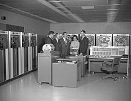

>   Consola de manejo del IBM 7090 en la NASA


### Tercera generación (1965-1975)

- **Circuitos integrados**, con decenas de transistores.
- Las computadoras reducen su costo y tamaño, incrementado velocidad y fiabilidad.
- Ejemplo: IBM 360, 2.000.000 \$ en el mercado.
- Aparecen lenguajes como BASIC, C o Pascal.


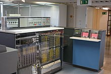

> IBM 360

### Cuarta generación (1971-1981)

-  Aparece el primer microprocesador en 1971: el **4004** de Intel.
-  Se caracteriza por la alta integración de componentes electrónicos y sigue disminuyendo su coste y tamaño.
-  Aparecen las primeras microcomputadoras (Apple II, Spectrum y Commodore)
-  Surgen los primeros sistemas operativos mordernos como Unix.

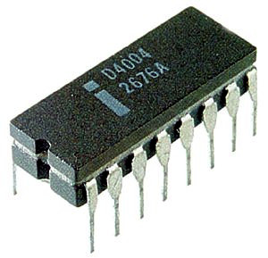

> Intel 4004

### Quinta generación (1981-hoy)

-  Se considera a partir de la aparición del primer ordenador personal o **PC** de IBM
-  El primer **IBM PC** costaba 1.500.000$
-  Primeros ordenadores de Apple
-  Nuevos lenguajes de programación (orientada a objetos) y SO modernos.
-  Más adelante aparecen los primeros smartphones (iPhone, Android..)
-  Electrónica de consumo moderna y tecnología móvil.


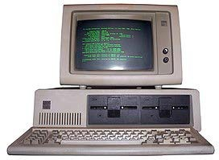

> Ordenador personal IBM PC

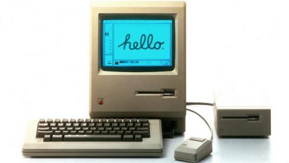 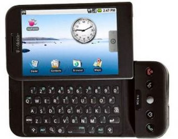

> Primer Apple Macintosh y primer móvil Android


## La Ley de Moore

```note
La **ley de Moore** dice que aproximadamente cada dos años se duplica el número de **transistores** en un procesador.
```

Se trata de una predicción formulada por el cofundador de Intel, Gordon E. Moore, el 19 de abril de 1965, cuyo cumplimiento se ha podido constatar hasta el día de hoy.

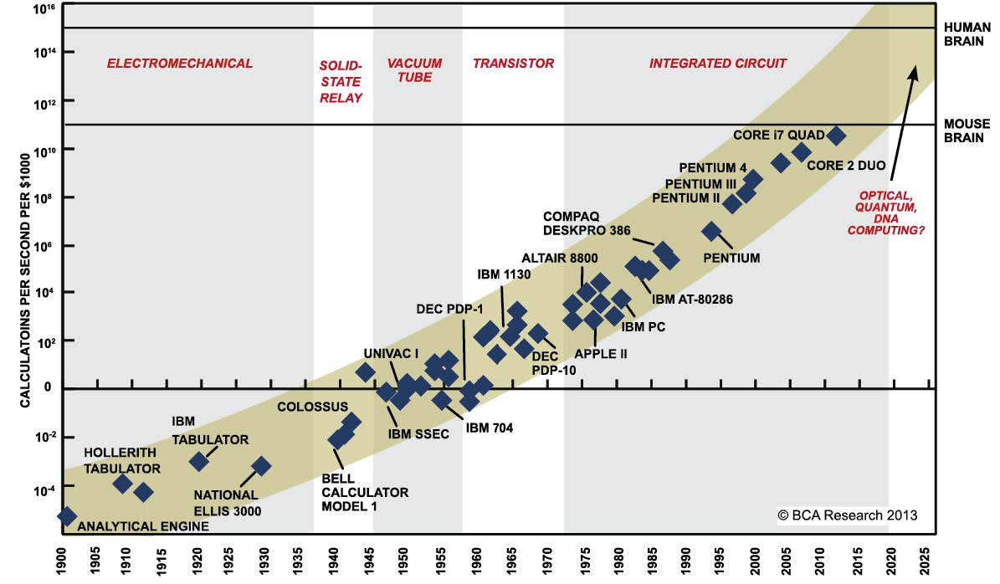

## La ley de Huang

Surgió como resultado a que la ley de Moore ya no parecía describir correctamente el vertiginoso desarrollo que estaban experimentando las GPU.

Durante la década que se extiende entre 2012 y 2022 el rendimiento de los chips de NVIDIA para aplicaciones de inteligencia artificial se ha multiplicado por 1000.

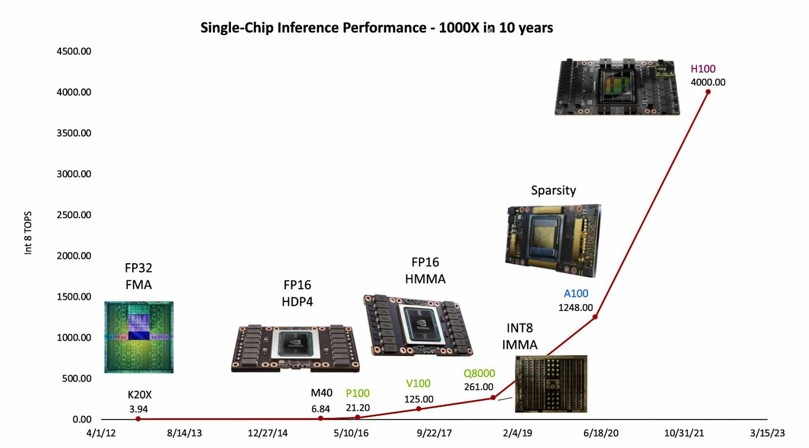
