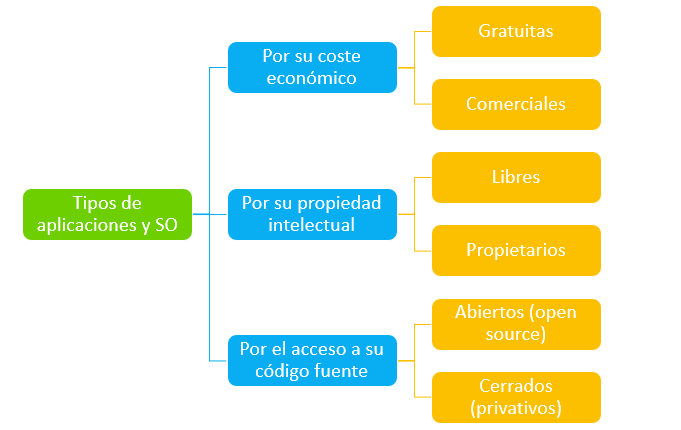
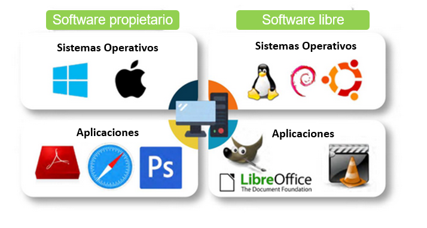
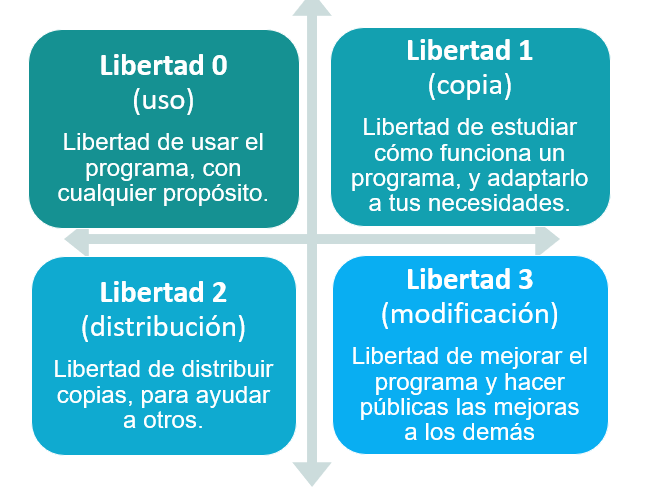
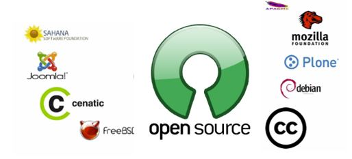
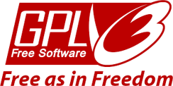
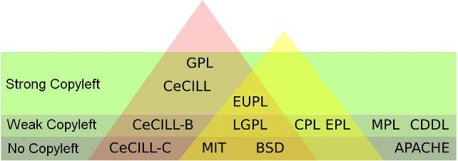
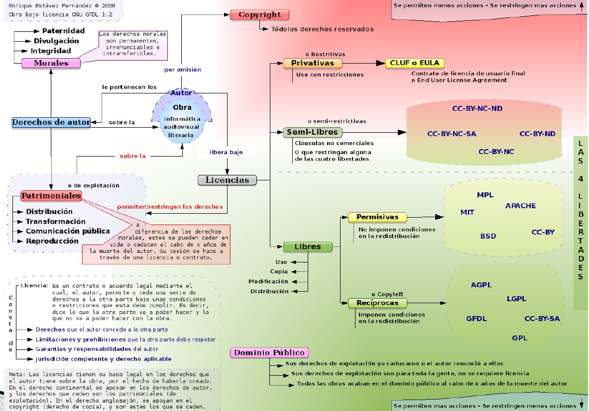
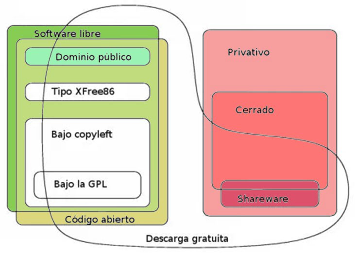

# UT1.2 Introducción a los sistemas informáticos: software 

## El software

```note
El **software** es el conjunto de **instrucciones** y **programas**, parte intangible, que utiliza un ordenador o computadora para funcionar y que se almacena en su memoria.
```

Comúnmente se utiliza este término para referirse de una forma muy genérica a los programas de un dispositivo informático, la parte **lógica** de un ordenador.

Para que un ordenador funcione necesita información o **datos** con los que trabajar. Esta información es de varios tipos dependiendo de su función. El ordenador puede servir para procesar información en forma de datos, los cuales pueden ser textos, imágenes, datos de sensores, hojas de cálculo,
tablas de una base datos, etc.

1.  **Datos de entrada**: Los que se suministran al ordenador desde los periféricos de entrada (teclado, ratón, escáner) o soportes como disocs (HDDs, DVDs, etc). Forman parte de la primera fase del tratamiento de la información denominada **entrada**.
    
2.  **Datos intermedios:** Son los que se obtienen en el tratamiento de la información denominada **proceso**.
    
3.  **Datos de salida**: se denominan también resultados del proceso de tratamiento: **salida**.


Para que los componentes electrónicos de un ordenador sean capaces de funcionar y realizar un proceso determinado, es necesario ejecutar un conjunto de órdenes o instrucciones.

```note
Se denomina **programa** al conjunto de **instrucciones** ordenadas y adecuadas para llevar a cabo un determinado proceso.
```

```note
El **software básico** para hacer funcionar cualquier ordenador se denomina sistema operativo y es lo que estudiaremos en este módulo junto con diversos programas.
```

```note
El **sistema operativo** es el componente software de un sistema informático capaz de hacer que los **programas** (**software**) procesen información (**datos**) sobre los componentes electrónicos de un ordenador o sistema informático (**hardware**).
```


## Clasificación del software

El software se suele clasificar de forma típica en tres tipos según su función como veremos a continuación:

- Software del sistema

- Software de programación

- Software de aplicación

### Software del sistema (base)

> 💡  El software de sistema también llamado **software de base** es el conjunto de programas que sirven para interactuar con el sistema informático, confiriendo control sobre todo el hardware, además de dar soporte a otros programas.

Este software se divide en:

-   Sistemas Operativos

-   Controladores de dispositivos (drivers)

-   BIOS/UEFI

-   Hipervisores de Máquinas Virtuales

-   Gestores de arranque

-   Otros programas (como *OpenGL, directX*..)

### Software de programación

>   💡 El software de programación es un conjunto de herramientas software que permiten al desarrollador informático escribir programas usando diferentes alternativas y lenguajes de programación (muchos de ellos específicos para cada uno de ellos)

Este tipo de software incluye principalmente:

-   Editores de código

-   Compiladores y depuradores de código

-   Intérpretes o ensambladores

-   Entornos de desarrollo integrado (IDEs)

### Software de aplicación

>   💡 El software de aplicación son los programas diseñados para los usuarios para la realización de tareas específicas en los ordenadores o dispositivos para los que han sido diseñados.

Este software se podría dividir en:

-   Aplicaciones de negocio.

-   Aplicaciones ofimáticas.

-   Aplicaciones educativas.

-   Aplicaciones de entretenimiento.

-   Aplicaciones personales.

### Otras clasificaciones

El software también se suele clasificar siguiendo el siguiente esquema:




### Tendencias del software actual

**Inteligencia Artificial**

Integración de algoritmos de IA en aplicaciones para mejorar la toma de decisiones.

**Computación en la Nube**

Transición hacia servicios basados en la nube para mayor accesibilidad y colaboración.

**Desarrollo Ágil**

Adopción de metodologías ágiles para una entrega más rápida y flexible del software.

## Licencias de software

Para cada uno de los tipos de software vistos anteriormente, es necesario distinguir entre software libre o software, dependiendo de las **licencias** y permisos de uso:

**Software libre**

Es aquel al que se le otorga libertad de uso, copia y distribución a los usuarios. Su código puede ser totalmente abierto o estar sometido a ciertas normas según la licencia asociada concreta a ese programa.

**Software propietario**

Es aquel cuyas condiciones de uso, copia y distribución están sometidas a normas o restricciones. Su código fuente es cerrado, es decir, no está disponible para el usuario (el propietario puede mostrarlo, pero esto no implica que pase a ser software libre en cuanto a su uso).

| **Software libre**                                                                                                                                                                                                   | **Software propietario**                                                                                                                                              |
|----------------------------------------------------------------------------------------------------------------------------------------------------------------------------------------------------------------------|-----------------------------------------------------------------------------------------------------------------------------------------------------------------------|
| No está limitado a los usuarios y garantiza las libertades de usar, modificar, copiar y distribuir software                                                                                                          | Tiene licencias que limitan a los usuarios y que, en algunos casos, son costosas. Estas licencias restringen las libertades de usar, modificar y distribuir software. |
| Puede intervenir en su desarrollo cualquier persona, empresa u organización, por lo que se generan gran cantidad de ideas innovadoras, y permite la adecuación a los avances tecnológicos.                           |  El desarrollo, la actualización y la programación de este software solo lo realiza la empresa que tiene los derechos.                                                |
| Los avances, modificaciones y descubrimientos tecnológicos son constantes y se encuentran en Internet de forma gratuita. "La principal meta del software libre es compartir los avances tecnológicos con los demás." |  El futuro del software que adquirió el usuario solo depende de una empresa comercial.                                                                                |
| Compatible tanto en software como en hardware, no obliga al usuario a cambiar de sistema operativo o equipo.                                                                                                         | Siendo creado con fines de lucro, las actualizaciones o mejoras al software quedan estipuladas bajo contrato.                                        



```note
Una **licencia de software** es un contrato entre el licenciante (autor/titular de los derechos de explotación/distribuidor) y el licenciatario del programa informático (usuario consumidor/usuario profesional o empresa), para utilizar el software cumpliendo una serie de términos y condiciones establecidas en sus cláusulas.
```

Cuando compramos o bajamos de Internet un programa, al instalarlo solemos aceptar sin leer (*mala costumbre*) un contrato que especifica el tipo de **Licencia** de uso del software, en inglés **EULA** o *End User License Agreement*: licencia por la cual el uso de un producto sólo está permitido para un único usuario (el comprador). Es un acuerdo unilateral puesto que el usuario no tiene más opción que aceptar o rechazar el contenido del mismo.

### Software libre (GNU)

>   💡 El proyecto GNU fue iniciado en 1984 por Richard Stallman y fundó la Free Software Foundation sin ánimo de lucro.

Se fundamenta en la moral y exige la libertad absoluta del software. 

Las **cuatro libertades** del software libre son:

1.  La libertad de usar el programa, con cualquier propósito (libertad 0)

2.  La libertad de estudiar cómo funciona el programa, y adaptarlo a tus necesidades (libertad 1)
    
3.  La libertad de distribuir copias, para ayudar a otros (libertad 2)
    
4.  La libertad de mejorar el programa y hacer públicas las mejoras a los demás, de modo que toda la comunidad se beneficie (libertad 3)

>   📌 **El software libre no referencia a que sea gratis** (de hecho no siempre lo es)

- Aunque se confunden, software de **código abierto** y el **software libre** no son exactamente lo mismo debido a diferencias sutiles de concepto.



### El software de código abierto (Open Source)

El software de código abierto trata de suavizar las condiciones del *GNU* para facilitar su uso por las compañías.

>   💡 El Open Source o código abierto, es la expresión con la que se conoce al software distribuido y desarrollado libremente.

Es un movimiento más ‘**pragmático**’, que se enfoca más en los beneficios prácticos como acceso al código fuente que en aspectos éticos o de libertad que son tan relevantes en el Software Libre.



### Software propietario

El software propietario es aquel que sin permiso del propietario queda prohibida la copia, redistribución o modificación como hemos visto. Para poder usar se suele pedir permiso a la organización que lo desarrollo. Generalmente para su disponibilidad hay que pagar bajo unos derechos de autor (un **Copyright**).

En conclusión, los propietarios son los que establecen los derechos de uso, distribución, redistribución, copia, modificación, cesión y en general cualquier otra consideración que se estime necesaria. Los fabricantes de programas sometidos a este tipo de licencias por lo general ofrecen servicios de soporte técnico y actualizaciones durante el tiempo de vida del producto, también regulan el número de copias que pueden ser instaladas e incluso los fines concretos para los cuales puede ser utilizado.

## Licencias de software propietario

### Tipos licencias de software propietario

Tipos de licencias de software propietario:

- **Licencias de usuario final**: Es el tipo más común de licencia en software propietario. Define los derechos y responsabilidades del usuario final en el acuerdo EULA, incluyendo las restricciones de uso, instalación y la prohibición de ingeniería inversa, redistribución o modificación del software.

- **Licencias OEM**: se trata de un tipo de licencia que supedita su venta a que forme parte de un equipo nuevo, estando prohibido venderlo si no es bajo esta condición.
    
- **Licencias Retail**: son las versiones a la venta ‘normal’ de software a través de cualquier canal. En este caso, el programa es de la entera propiedad del usuario, pudiendo éste cederlo libremente a terceros o venderlo. Estas licencias permiten utilizar el programa en otros equipos siempre que no se ejecuten ambos a la vez.
    
- **Licencias por volumen (VLM)**: es un tipo de licencia de software destinado a grandes usuarios (empresas), normalmente bajo unas condiciones similares a las de las licencias OEM, aunque sin estar supeditadas a equipos nuevos.
    
- **Alquiler o suscripción**: El cada vez más habitual modelo de suscripción. El tipo más común es el conocido como Software como servicio (SaaS). Estas son cada vez más habituales, especialmente en las implementaciones cloud. Con este modelo de pago de licencias, la empresa paga una cantidad bastante menor de coste inicial. Algunos proveedores permiten que el número de licencias usadas cambie de mes en mes, otros requieren que las licencias se alquilen por periodos de tiempo más largos.

- **Otro tipo de licencias especiales**: Por ejemplo, las licencias de educación, empresariales, desarrollo o de sectores específicos como el militar. También las licencias shareware, demos o freeware.

## Licencias de software libre

### Tipos licencias de software libre

Podemos clasificar las licencias de software en diferentes tipos, ya que no todas cumplen con un grado de libertad absoluto que da la licencia GNU estándar:

- **Licencias libres:** se basan en las cuatro libertades vistas anteriormente

   - Licencias **recíprocas** (o copyleft): requieren que cualquier software derivado se distribuya bajo la misma licencia.
   - Licencias **permisivas**: más flexibles que las anteriores. Permiten redistribuir el software con o sin modificaciones, incluso bajo una licencia diferente.

- **Licencias semi-libres**: permiten la distribución y modificación del software, pero con ciertas restricciones que limitan su uso en ciertos contextos, como el uso comercial o la redistribución en ciertas condiciones.

### Licencias libres recíprocas

- **Licencias GPL (General Public License).** 
Se la puede considerar como Licencia de software libre con protección heredada. Creada por la Free Software Foundation (FSF), es una de las licencias más usadas y estrictas en cuanto a copyleft:

    -   El nuevo software o modificación deberá tener la misma licencia.
    -   El uso de partes en otro software también obliga a hacer uso de la misma licencia.
    -   Gratuito para el programador (salvo gastos de copia o distribución) pero no dice nada que establece restricciones sobre lo que se puede cobrar por distribuir una copia.
    
        


- **Licencia GNU.** 
 El caso de licencia GPL más destacada es Licencia Pública General de GNU (**GNU GPL**) en la que autor conserva los derechos de autor (copyright), y permite la redistribución y modificación bajo términos diseñados para asegurarse de que todas las versiones modificadas del software permanecen bajo los términos de la propia licencia.

    

### Licencias libres permisivas

-  **Licencias BSD (Berkeley Software Distribution).** Es un tipo de licencia conocida por ser menos “restrictiva” lo que permite que desarrolladores puedan modificar, distribuir e incluso vender el software derivado.

   


-  **Licencia MIT** Muy permisiva, permite a los usuarios usar, modificar y redistribuir el software, incluso en productos propietarios, siempre y cuando se mantenga el aviso de copyright original.

-  **Licencia Apache** Ofrece más protección legal que la licencia MIT o BSD, incluyendo cláusulas sobre patentes. Permite la modificación y redistribución del software bajo otras licencias, siempre que se mantengan los avisos de derechos de autor y licencias.

### Licencias semi-libres 

-   **Licencias Creative Commons**: Una de las más conocidas; esta licencia posibilita un modelo legal de distribución y uso de contenidos basada en 4 condiciones principales que pueden ser combinadas para hacer licencias <u>mixtas</u> (libres o semilibres) combinando características:
    
    -  **Atribución** (**BY**).- Se conceden derechos de copia, distribución, exhibición y derivación siempre y cuando se reconozca y cite la obra de la forma especificada por el autor o el licenciante.
    -  **No Comercial** (**NC**).- Se puede copiar, distribuir, exhibir y representar la obra y hacer obras derivadas pero sin fines comerciales.
    -  **No Derivadas** (**ND**).- En este caso podemos copiar, distribuir, exhibir y representar copias literales de la obra pero no producir obras derivadas.
    -  **Compartir Igual** (**SA**) -El usuario tiene el derecho de distribuir obras derivadas pero siempre con una licencia idéntica a la de la obra original.
    
    


- La siguiente licencia **CC-BY-SA** significa que se es libre para:
    - *Compartir:* copiar y redistribuir el material en cualquier medio o formato.
    - *Adaptar*: remezclar, transformar y crear a partir del material
    - Para cualquier propósito, *incluso comercialmente.*
    - El licenciante no puede revocar estas libertades si usted sigue los términos de la licencia. 
    
    Bajo los siguientes términos:
        - **Atribución (BY)** Usted debe reconocer el crédito de una obra de manera adecuada, proporcionar un enlace a la licencia, e indicar si se han realizado cambios . Puede hacerlo en cualquier forma razonable, pero no de forma tal que sugiera que tiene el apoyo del licenciante o lo recibe por el uso que hace.
        - **Compartir Igual (SA)** Si usted mezcla, transforma o crea nuevo material a partir de esta obra, usted podrá distribuir su contribución siempre que use la misma licencia que la obra original.


### Dominio público

Las licencias de **dominio público** (como la **CC-0**) son licencias que otorgan derechos de dominio público o actúan como exenciones. Se utilizan para hacer que los trabajos con derechos de autor sean utilizables por cualquier persona sin condiciones, al tiempo que se evitan las complejidades de la atribución o la compatibilidad de licencias que se producen con otras licencias.

No se requiere ningún permiso o licencia para usar trabajos del dominio público, así como aquellos con un copyright expirado.


## Resumen licencias de software




El **software comercial** se basa en que para usarse hay que realizar un pago. Puede existir software libre y propietario de este tipo. 

Un programa libre debe estar disponible para uso comercial, desarrollo comercial y distribución comercial. El desarrollo comercial del software libre ha dejado de ser inusual; el software comercial libre es muy importante.
   
### Otras licencias


| **Software Libre**  | **Software privativo o propietario**  |
| ------------------------------------------------------------ | ------------------------------------------------------------ |
| **Software Libre** Uso gratuito (existen excepciones) Se puede modificar Se pueden distribuir los cambios.              | **Software privativo o propietario** Se paga por cada licencia No se puede modificar. |
| **Dominio público** Software sin licencia. Se permite uso, copia, modificación o redistribución con o sin fines de lucro. |    **Freeware** Uso gratuito No se puede modificar.                                                            |
|               | **Shareware** Se prueba y luego se paga. No se puede modificar. |
|               | **Adware** Uso gratuito de software a cambio de una gran cantidad de publicidad.
 |




