# UT1.3 Introducción a los SI: sistemas de numeración y codificación

## Tipos de datos

>   💡 Tal y como sabemos componentes internos de un ordenador no almacenan directamente letras ni números o imágenes, si no 1 y 0’s, es decir la presencia de corriente eléctrica (**1**) o su ausencia (**0**).

Cuando un usuario quiere almacenar una letra en memoria, por ejemplo desde un programa procesador de textos (software), usando el sistema operativo se convertirá en un conjunto de *8 bits* que almacenarán esa letra codificada como un conjunto de impulsos eléctricos (1 y 0) en la memoria del ordenador.

En este tema analizaremos los distintos **sistemas de numeración** que se usan en un ordenador (internamente binario) y por parte del sistema operativo (octal y hexadecimal) así como los **sistemas de codificación** o equivalencia utilizados para descifrar esos valores por parte del software.

## Sistemas de numeración

```note
Se define un **sistema de numeración** como el conjunto de símbolos y reglas que se utilizan para representar cantidades o datos numéricos.
```

Estos sistemas se caracterizan por la *base* a la que hacen referencia. 

```note
La **base** de un sistema de numeración se refiere al número de símbolos que componen dicho sistema.
```

>   Los humanos utilizamos en el día a día un sistema de numeración en base 10 (como nuestros dedos), compuesto por 10 símbolos diferentes (del 0 al 9).


Así para el **sistema decimal en base 10**, aplicando el *Teorema Fundamental de la Numeración* visto anteriormente, las cifras que componen un número son las cantidades que están multiplicando a las distintas potencias de diez (10, 100, 1000, 10000, etc.)

Por ejemplo, 
$$
745 = 7 · 100 + 4 · 10 + 5 · 1
$$
O lo que es lo mismo: 
$$
745 = 7 · 102 + 4 · 101 + 5 · 100
$$


Principales <u>sistemas de codificación numérica</u> usados en informática:

-   **Binario** (abreviado como *bin*) Sistema en **base 2** que utiliza dos símbolos diferentes: el cero y el uno (0,1).
    
-   **Octal.** Es un sistema en **base 8** que utiliza los símbolos del 0 al 7 para representar las cantidades, las cuales quedan reproducidas posicionalmente por potencias de 8.
    
-   **Hexadecimal** (abreviado como *hex*). Es un sistema de numeración en **base 16**. Usa 16 símbolos diferentes, del 0 al 9 y los dígitos valores (o letras) A, B, C, D, E y F.

> El sistema que maneja internamente un ordenador es el **binario**, pero, en ocasiones, por comodidad en el manejo de los datos, se suele utilizar el octal y el hexadecimal, ya que mucha de la información que nos muestra el sistema operativo, como direcciones de memoria, se expresa en hexadecimal.

### Binario

| Decimal | Binario |
| :-----: | :-----: |
|    0    |    0    |
|    1    |    1    |
|    2    |   10    |
|    3    |   11    |
|    4    |   100   |
|    5    |   101   |
|    6    |   110   |
|    7    |   111   |
|    8    |  1000   |
|    9    |  1001   |
|   10    |  1010   |
|   11    |  1011   |
|   12    |  1100   |
|   13    |  1101   |
|   14    |  1110   |
|   15    |  1111   |
|   16    |  10000  |
|  ....   |  ....   |


### Hexadecimal

| Decimal | Binario |
| :-----: | :-----: |
|    0    |    0    |
|    1    |    1    |
|    2    |    2    |
|    3    |    3    |
|    4    |    4    |
|    5    |    5    |
|    6    |    6    |
|    7    |    7    |
|    8    |    8    |
|    9    |    9    |
|   10    |    A    |
|   11    |    B    |
|   12    |    C    |
|   13    |    D    |
|   14    |    E    |
|   15    |    F    |
|   16    |   10    |
|   17    |   11    |
|  ....   |  ....   |

### Octal

| Decimal | Octal |
| :-----: | :---: |
|    0    |   0   |
|    1    |   1   |
|    2    |   2   |
|    3    |   3   |
|    4    |   4   |
|    5    |   5   |
|    6    |   6   |
|    7    |   7   |
|    8    |  10   |
|    9    |  11   |
|   10    |  12   |
|   11    |  13   |
|   12    |  14   |
|   13    |  15   |
|   14    |  16   |
|   15    |  17   |
|   16    |  20   |
|  ....   | ....  |


### Nº de bits (dígitos binarios)

Un número binario está por tanto compuesto por bits: a mayor número de bits (dígitos binarios), mayor número de <u>combinaciones</u> posibles:

| Nº de bits | Combinaciones posibles          |
| ---------- | ------------------------------- |
| 1          | 0,1                             |
| 2          | 00,01,10,11                     |
| 3          | 000,001,010,011,100,101,110,111 |


### Implicaciones prácticas

Es necesario saber interpretar el código binario para poder entender las operaciones que en muchas ocasiones se realizan dentro del ordenador. Para ello, debemos aprender a pasar números binarios a decimales y a la inversa, es decir la **conversión entre sistemas de numeración**.

Por extensión, el ordenador utiliza los sistemas de numeración de base 8 y base 16 (por ser múltiplos del sistema binario) para mostrarnos información relativa a algunos procesos que realiza. A la hora de realizar la comunicación entre dispositivos se utiliza así mismo el código binario (base 2)

> Debido a la estructura de 64 bits de un microprocesador las direcciones de memoria se expresan a menudo en hexadecimal. Por ejemplo, para no tener que escribir *111111010100000000000010101100* podemos escribir *3F5000AC* en hexadecimal.

- Un procesador y un bus de **32 bits** permite especificar a la CPU   direcciones de memoria distintas, lo cual a su vez genera un límite de 4GB en el dispositivo.

- Un procesador y un bus de **64 bits** permite especificar a la CPU  direcciones (lo que se traduce en un rango de valores desde 0 hasta 18.446.744.073.709.551.615 de direcciones o 18 exabytes )


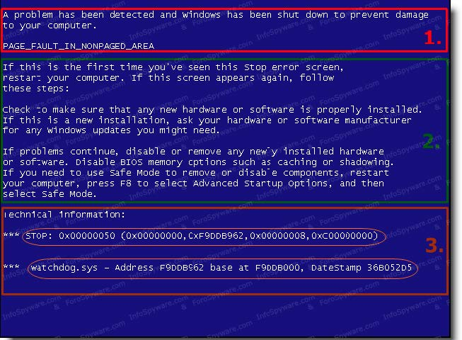

   Pantallazo de la muerte (*blue screen of death*) en un sistema Windows clásico

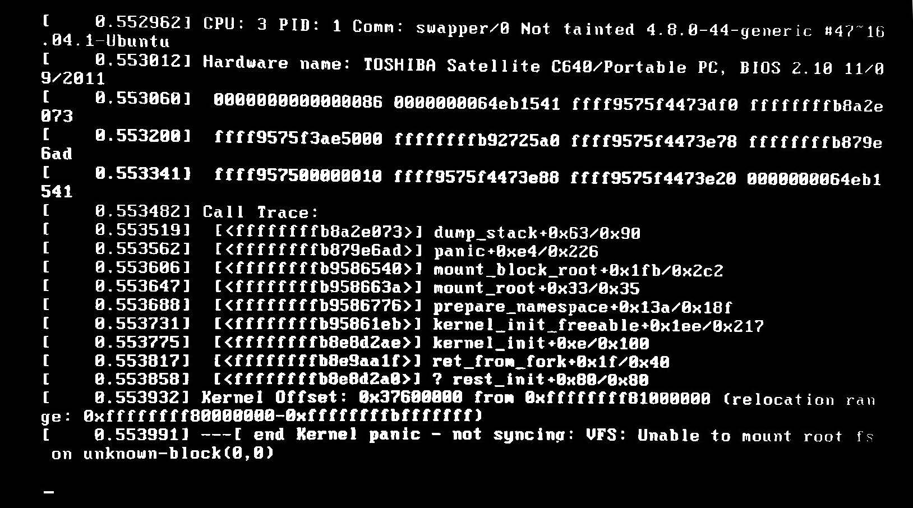

   *Kernel Panic* en un sistema Linux


## Conversiones entre sistemas de numeración

###  Operaciones matemáticas con potencias

- Repaso de las operaciones básicas con potencias:


### Esquema general de conversiones


#### Conversiones de decimal a binario

Para hacer la conversión de decimal a binario, hay que ir dividiendo el número decimal **entre 2** y anotar en una columna a la derecha el resto (un 0 si el resultado de la división es par y un 1 si es impar). La lista de ceros y unos leídos de abajo a arriba es el resultado.

-   Convertir en binario el número decimal **28**:


   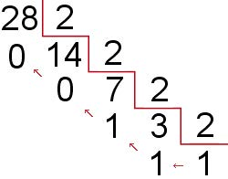

$$
28 = 11100
$$


#### Conversiones de decimal a octal:

Para hacer la conversión de decimal a octal, hay que ir dividiendo el número decimal **entre 8** hasta que el dividendo sea menor que el divisor y anotar en una columna a la derecha el resto. La lista de restos leídos de abajo a arriba es el resultado.

-   Convertir en octal el número decimal **786**:

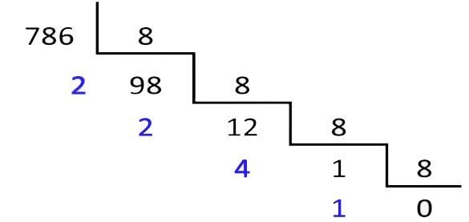
$$
786=1422
$$


#### Conversiones de decimal a hexadecimal 

Para hacer la conversión de decimal a hexadecimal, hay que ir dividiendo el número decimal **entre 16** hasta que el dividendo sea menor que el divisor y anotar en una columna a la derecha el resto con la cifra *hexadecimal* que se corresponda según su tabla del 1 a la F. La lista de restos leídos abajo a arriba será el resultado.

-   Convertir en hexadecimal el número decimal **1869**:

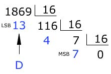
$$
1869 = 74D
$$

#### Conversiones de binario a decimal  

Para realizar la conversión de binario a decimal se toman los dígitos binarios y se van multiplicando por potencias de 2 de izquierda a derecha y comenzando por un exponente 𝑛−1 hasta 0, siendo 𝑛 el número de dígitos del número original. 

- Convertir en decimal el número binario **1000011011**:


#### Conversiones de binario a octal

Para realizar la conversión de binario a octal se puede agrupar la cantidad binaria **en grupos de 3 en 3** empezando por el lado derecho. Si al terminar de agrupar no completa 3 dígitos, entonces habrá que agregar **ceros** a la izquierda.

| nº en binario | 000  | 001  | 011  | 100  | 101  | 110  | 111  |
| ------------- | ---- | ---- | ---- | ---- | ---- | ---- | ---- |
| nº en octal   | 0    | 1    | 2    | 4    | 5    | 6    | 7    |

- Convertir en octal el número binario **110111**

  111= 7        

  110 = 6	→	Luego el número será **67**

  

####	Conversiones de binario a hexadecimal

Para realizar la conversión de binario a hexadecimal hay que agrupar la cantidad binaria **en grupos de 4 en 4** empezando por el lado derecho. Si al terminar de agrupar no completa 4 dígitos, habrá que agregar **ceros** a la izquierda.

| Binario | Decimal | Hexa | Binario | Decimal | Hexa |
| :-----: | :-----: | :--: | :-----: | :-----: | :--: |
|  0000   |    0    |  0   |  1000   |    8    |  8   |
|  0001   |    1    |  1   |  1001   |    9    |  9   |
|  0010   |    2    |  2   |  1010   |   10    |  A   |
|  0011   |    3    |  3   |  1011   |   11    |  B   |
|  0100   |    4    |  4   |  1100   |   12    |  C   |
|  0101   |    5    |  5   |  1101   |   13    |  D   |
|  0110   |    6    |  6   |  1110   |   14    |  E   |
|  0111   |    7    |  7   |  1111   |   15    |  F   |


- Convertir en hexadecimal el número binario **110111010** 

  1010 = 10 = A

  1011 = 11 = B

  0001 =	1	→	Luego el número será **1BA**


#### Conversiones de octal a decimal

Para pasar de octal a decimal se toman los dígitos binarios y se van multiplicando por **potencias de 8** de izquierda a derecha y comenzando por un exponente 𝑛−1 hasta 0, siendo 𝑛 el número de dígitos del número original.

- Convertir en decimal el número octal **421**:

$$
4·8^2 + 2·8^1+1·8^0=4·64+2·8+1=273
$$


#### Conversiones de octal a binario

Para convertir números octales a binarios se sustituye cada dígito octal por su representación binaria **con tres dígitos **de acuerdo a la tabla ya vista.

| nº en binario | 000  | 001  | 011  | 100  | 101  | 110  | 111  |
| ------------- | ---- | ---- | ---- | ---- | ---- | ---- | ---- |
| nº en octal   | 0    | 1    | 2    | 4    | 5    | 6    | 7    |

-   Convertir en binario el número octal **730**

    **7 3 0 **= 111 011 000 → **111011000**


#### Conversiones de hexadecimal a decimal

Para pasar de hexadecimal a decimal se toman los dígitos hexadecimales y se van multiplicando por **potencias de 16 **de izquierda a derecha y comenzando por un exponente 𝑛−1 hasta 0, siendo n el número dígitos del número original.

-   Convertir en decimal el número hexadecimal **9F2**:
    **9**·162+**F**·161+**2**·160 = 9·162+15·161+2·160= 9·256 + 240 + 2 → 2546

-   Convertir en decimal el número hexadecimal **B2F8**:

    **B**·163 + **2**·162+ **F**·161 + **8**·160 = 11·163 + 2·162 + 15·161 + 8·1
    = 11·4096 + 2·256 + 15·16+ 8·1 → 45816
    

#### Conversiones de hexadecimal a binario

Para convertir números octales a binarios se sustituye cada dígito hexadecimal por su representación binaria **con cuatro dígitos** de acuerdo a la tabla vista anteriormente.

- Convertir en decimal el número hexadecimal **70C558**:

  **7 0 12 5 5 8 **→ 0111 0000 1100 0101 0101 1000


#### Conversiones de hexadecimal a octal

Debido a que ambos sistemas se relacionan directamente con el sistema binario, lo mas conveniente en el desarrollo de esta conversión es:

1.  Convertir el número del sistema hexadecimal al sistema binario, como se indicó anteriormente en de **hexadecimal a binario**.
    
2.  Posteriormente hacer la transformación del sistema **binario a octal** como hemos visto también anteriormente.

-   Convertir en octal el número hexadecimal **1D8**: **1  15  8** → 0001 1101 1000 *en binario*
    

## Sistemas de codificación

```note
Bit es el acrónimo *Binary digit* (‘dígito binario’). Un bit es un dígito del sistema de numeración binario. Las unidades de almacenamiento tienen por símbolo bit.
```

>   El **bit** es la unidad mínima de información empleada en informática, en cualquier dispositivo digital, o en la teoría de la información. Con él, podemos representar dos valores cuales quiera, como verdadero o falso, abierto o cerrado, blanco o negro, norte o sur.

Los bits se pueden combinar para dar distintos resultados y generar distintos sistemas de codificación como hemos visto.

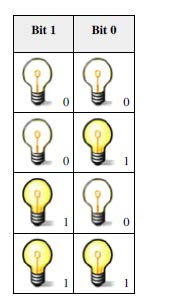

Los **sistemas de codificación** se utilizan para procesar la información que el usuario entiende y el ordenador no.

En dispositivos magnéticos, por ejemplo, una posición magnetizada se convierte en un uno y cada posición no magnetizada en un cero. Se buscará en una **tabla de códigos** y se compara la combinación de esos ocho bits, obteniendo la equivalencia con un carácter concreto en el caso de textos.

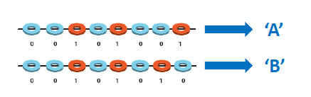

Diferentes tipos de información poseen diferentes codificaciones, pero las más habituales son:

- Codificaciones numéricas:
  Número enteros, números en coma flotante, etc.

- Codificaciones alfanuméricas:
  ASCII, Unicode (UTF-8, UTF-16)

- Codificaciones multimedia:
  Audio (wav, mp3, ogg), Gráficos (jpeg, png, tiff), Video (mpeg, avi)

- Codificaciones de compresión:
  Sin pérdida (GZIP, BZIP2, LHA), con pérdida (mp3, ogg, jpeg, mpeg)

- Otros:
  Cifrado de clave única, cifrado de clave pública, hash.

```note
Se denomina **alfabeto** al **conjunto de caracteres** para representar una lengua cualquiera.
```

- **Código de caracteres:**
  Código numérico asignado a cada carácter de un alfabeto:
   -   **ASCII:** Alfabeto inglés (EEUU) codificado en 7 bits por carácter.
   -   **UNICODE:** Código internacionalizado que soporta muchas lenguas.
  
- **Codificación del UNICODE:**
  Representación binaria interna del UNICODE:
   - **UTF-8**: Código de longitud variable \>= a 1 byte, eficiente para lenguas latinas.
   - **UTF-16**: Codifica planos BMP en 16 bits.
   - **UTF-32**: Código de longitud fija: 4 bytes eficiente con planos que no son BMP.
  

## Codificación alfanuméricas

### ASCII

```note
El código **ASCII** (*American National Standard Code for Information Interchange*) es una codificación alfanumérica usada para el intercambio de información basada en el alfabeto latino del inglés.
```

El conjunto de caracteres de **ASCII** fue creado como estándar en 1967. Fue diseñado en un principio usando 8 bits (1 byte), dejando un bit libre para el control de errores, por lo que puede representar  caracteres *(abecedario, cifras, puntuación y caracteres de control*).

El código ASCII define una relación entre caracteres específicos y secuencias de bits pero sin definir la apariencia o formato del texto.

El código ASCII se divide básicamente en:

 - **Caracteres de control** (del 0 al 31): usados como formato interno de editores y ficheros
   
 -   **Caracteres imprimibles**: letras minúsculas, mayúsculas, signos, etc.


- **Codificación de la tabla ASCII original (7 bits)**:	<https://ascii.cl/es/>


### ASCII extendido (8bits)

>   💡Debido a que 8 bits no son suficientes para representar todos los alfabetos del mundo, continuaron apareciendo variantes ASCII de 8 bits incompatibles entre sí. Estas variantes se llaman a veces ASCII extendido, sin ser parte del estándar ANSI.

Hay varios conjuntos de **ASCII extendido**, cada uno de los cuales contiene codificaciones para muchos lenguajes:

-   **Windows code pages**, usado en aplicaciones gráficas
-   **OEM code pages**, usando en aplicaciones de consola Windows.
-   **ISO-8859** es un estándar ISO para codificación en 8 bits. Tiene 16 partes. La primera se llama *ISO-8859-1*, también conocida como *Latin-1*, que cubre la mayoría de lenguajes de Europa occidental.

En ASCII solo es posible trabajar con un alfabeto a la vez. ASCII tampoco es válido para representar alfabetos asiáticos, porque contienen miles de caracteres.

-   **Codificación de la tabla ASCII extendida (8 bits):**

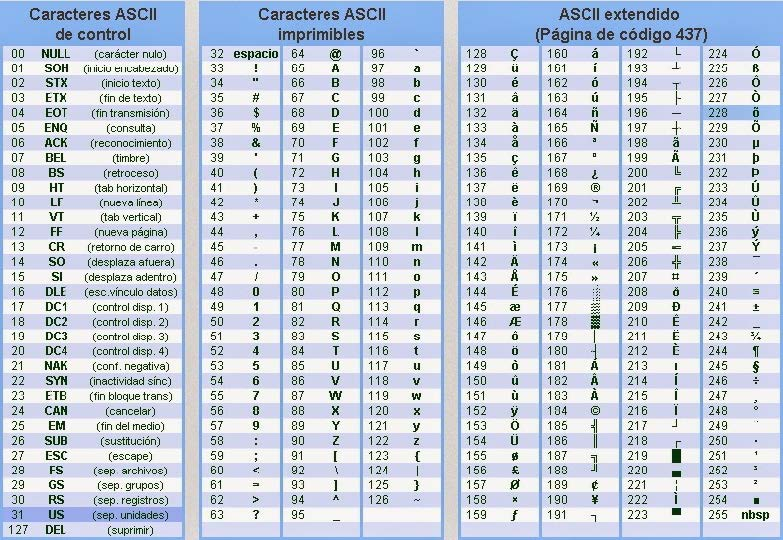


>   Para traducir al código ASCII cualquier texto, sólo es necesario buscar el código hexadecimal de cada símbolo y escribir su equivalente binario, recordando que cada carácter siempre se codifica a 8 bits.

-   Por ejemplo, escribir ‘**Informatica**’ en código ASCII binario:

    Buscar en la tabla ASCII anterior la equivalencia alfanumérica exacta del símbolo con su valor hexadecimal y convertirlo después a binario.

  | **Letra ASCII (dec \| hex).** | **ASCII bin.** | **Letra ASCII hex.**  | **ASCII bin.** |
  |-------------------------------|----------------|-----------------------|----------------|
  | I (73 \| 49)          | 0101001    | a (97 \| 61)  | 1100001    |
  | n (110 \| 6E)         | 1101110    | t (116 \| 74) | 1110100    |
  | f (102 \| 66)         | 1100110    | i (105 \| 69) | 1101001    |
  | o (111 \| 6F)         | 1101111    | c (99 \| 63)  | 1100011    |
  | r (114 \| 72)         | 1110010    | a (97 \| 61)  | 1100001    |
  | m (109 \| 6D)         | 1101101    |                       |                |


### UNICODE

> 💡 **UNICODE** es un consorcio internacional nacido en **1991** que define normas de internacionalización (I18N): Códigos de caracteres (Unicode), símbolos, librerías software, formatos…
>     [http://www.unicode.org](http://www.unicode.org/)

Es un código de caracteres internacionalizado. Es el resultado más conocido del consorcio. 

Puede representar la gran mayoría de lenguas presentes y pasadas.

- Unicode asigna un **código numérico** a cada carácter utilizando 16 bits.

En Unicode existen distintas formas de codificar un mismo carácter según el formato. Existen los siguientes formatos UTF-8, UTF-16 y UTF-32.

- **UTF-8** Usa símbolos de longitud variable de 1 a 4byts. Usa 1 byte para representar caracteres en el set ASCII, dos bytes para caracteres en otros bloques alfabéticos y tres bytes para el resto del BMP. Para los caracteres complementarios se utilizan 4 bytes.
- **UTF-16** utiliza 2 bytes para cualquier carácter en el BMP y 4 bytes para los caracteres complementarios.
- **UTF-32** emplea 4 bytes para todos los caracteres.


- Los caracteres se agrupan a su vez en **planos**

    ► Cada plano por tanto se codifica en 2 bytes 2 bytes (16 bits): 2^16 =**64536** caracteres
    
- Planos más importantes:

   -   **BMP** (Basic Multilingual Plane) Agrupa los símbolos más habituales de la mayoría de lenguas actuales.

   -   **SMP** (Suplementary Multilingual Plane): Lenguas antiguas y más

   -   **SIP** (Supl. Ideographic Plane): Ext. CJK (China, Japón, Korea)

   -   **TIP** (Tiertary Ideographic Plane): Lenguas antiguas asiáticas

   -   **SSP** (Suplementary Special-purpose Plane): usos especiales


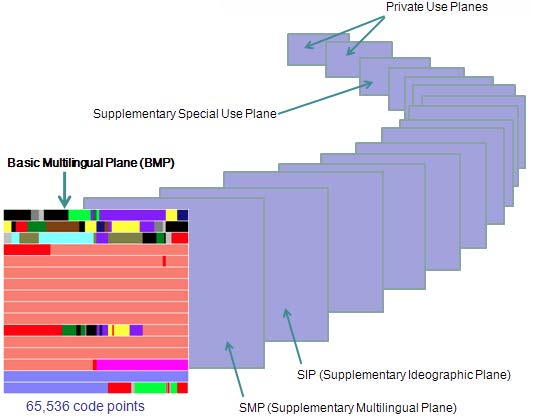


-   Los caracteres en Unicode se escriben usando el formato **U+xxxx** donde las xxxx son de cuatro a seis dígitos en sistema de numeración **hexadecimal**.
-   A partir de *Unicode 7.0* el rango válido de puntos de código va de 0 a 10FFFF16. El hexadecimal se usa por conveniencia en lugar del binario, porque es más fácil recordar. La versión más actual es la 12.0 (marzo 2019) con soporte para 136690 caracteres.
-   Por ejemplo, Unicode asigna el número 65 a la letra a latina mayúscula. El punto de código correspondiente es **U+0041** porque 65 decimal = *0x41*hexadecimal.
-   Unicode es **compatible** con codificaciones anteriores ya que los 256 primeros caracteres de Unicode coinciden con los caracteres de *ISO-8859-1*. Esto hace que la mayoría de texto en uso requiera solo un byte por carácter.
-   UTF-8 y UTF-16 son codificaciones de amplitud variable. Esto significa que si un carácter se puede representar con un sólo byte, UTF-8 empleará sólo un byte. Si requiere dos bytes, usará dos, y así sucesivamente.

    
**Unicode BMP: subconjunto ASCII (Basic Latin)**

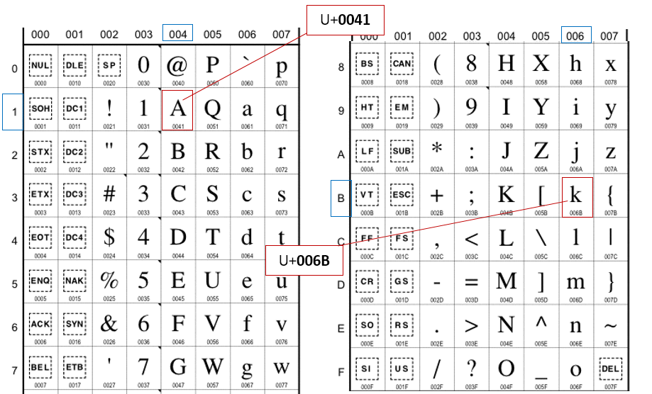


- Buscar en el **mapa de caracteres de Windows** los valores hexadecimales de los siguientes caracteres de texto Unicode:


  | **Carácter Unicode** | **Valor hexadecimal** |
  |----------------------|-----------------------|
  | =                    | U+003D                |
  | µ                    | U+00B5                |
  | T                    | U+0054                |
  | æ                    | U+00E6                |
  | &                    | U+0026                |
  | \@                   | U+0040                |
  | ☺                    | U+263A                |
  | Ф                    | U+0424                |
  | ♠                    | U+2660                |


## Codificaciones numéricas

### Representación de números negativos

Es evidente que si se dispone únicamente de los dos símbolos 0 y 1 usando un código binario natural sólo es posible representar números enteros y positivos.

Para representar un **número negativo**, en matemáticas se hace uso de un signo adicional “-” que precede al número negativo. Dado que en un sistema digital sólo se podrán disponer de los dos símbolos ya mencionados, se han ideado múltiples soluciones para representar y operar con números negativos.

Para representar números con signo existen varias posibilidades que veremos a continuación:

1. Signo y magnitud
1. Complemento a uno
2. Complemento a dos

#### Signo y magnitud

Partiendo de que la forma de operar en un sistema digital es a través de un conjunto definido de bits, por ejemplo grupos de 8 bits (un byte), el enfoque es reservar 1 bit (normalmente el primero) para indicar el signo. Normalmente se asocia un 0 al signo “+” y un 1 al signo “-“. El resto de los bits del grupo indica la magnitud.

La cifra **00000011** equivale a +3 en decimal mientras que **10000011** equivale a -3. 

Se debe tener en cuenta los siguientes aspectos importantes:

- Mientras que en un grupo de 8 bits podemos almacenar desde el valor (en decimal) 0 hasta 255, si es un byte con signo podremos almacenar desde -127 hasta +127.
- A la hora de hacer operaciones debemos tratar de forma separada el signo, es decir, debemos procesar por una parte los signos y por otra las magnitudes.
- El cero está representado dos veces: 00000000 y 10000000, lo cual es poco eficiente.

#### Complemento a uno

Otra forma de representación es utilizar el **complemento a uno** para representar los números negativos. Se reserva igualmente el primer bit para representar el signo y el resto de bits se usan para representar:

- Si es positivo, se pone tal cual.

- Si es negativo, se pone el **complemento a uno**: se cambian todos los 1s por 0s y todos los 0s por 1s.

Así el numero 3 se representa igualmente por **00000011** y el número -3 se representa por **11111100**.

Las operaciones son más fáciles que con la representación “signo y magnitud” pero adolece igualmente del problema de la doble representación del 0. En efecto, tenemos que 00000000 y 11111111 lo representan.

#### Complemento a dos

Un enfoque que solventa algunos de los problemas de los anteriores es la representación de número negativo en **complemento a dos**. 
Al igual que en  el caso anterior, el primer bit le reservamos para el signo y el resto de bits se usan para representar:

- Si es positivo, se pone tal cual.
- Si es negativo, se pone el complemento a 2.

**Para obtener el complemento a dos se halla el complemento a uno como hemos visto anteriormente y se le suma 1.**

Así, el número 3 se representa igualmente por 00000011 y el número -3 se representará como por 11111101.

En este caso, el 0 (decimal) sólo tiene una única representación 00000000 y las operaciones aritméticas se pueden realizar mediante sumadores.

### Código binario BCD

>   💡 En sistemas de computación el código **BCD** (Binary-Coded Decimal) o Decimal codificado en binario es un estándar para representar números decimales en el sistema binario, en donde cada dígito decimal es codificado **con una secuencia de 4 bits**.

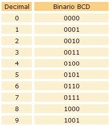


### Codificación números reales: coma flotante (IEE754)


>   💡 La representación en **coma flotante** es una forma de notación científica basada en el estándar **IEE754** usada en los ordenadores con la cual se pueden representar números reales extremadamente grandes (como π) y pequeños de una manera muy eficiente y compacta, y con la que se pueden realizar operaciones aritméticas.

En ciencia se utiliza habitualmente la **notación científica decimal** en la que se basa, donde cada número lleva asociada una mantisa y un exponente.

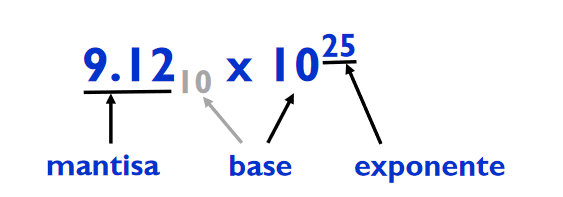

La idea del estándar IEE754 es descomponer el número en dos partes para su representación binaria:

- Una **mantisa** (también llamada coeficiente o significando) que contiene los dígitos del número.

> Por ejemplo, en el número decimal 13.8543, la parte entera es 13 y la mantisa 13.8543–13= 0,8543. Cuando el número decimal es negativo, como –13.8543, la parte entera es –14 y la mantisa= –13.8543 – (–14)= 0.1457.

- Un **exponente** que indica dónde se coloca el punto decimal (o binario) en relación al inicio de la mantisa. Los exponentes negativos representan números menores que uno.

  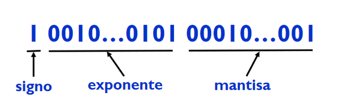


Para convertir un número real a su representación en coma flotante deberemos hacerlo en <u>3 pasos</u>:

1. Pasar el número decimal a **binario** (la parte entera y la decimal)

2. Convertir el binario a **notación científica** (mover la coma flotante)

3. Convertir en **IEE754** de <u>32 bits</u> (existe también uno de 64bits)

- Signo (1 bit: si es positivo 0, si es negativo 1)
- Exponente: sumarle 127 (8 bits)
- Mantisa (23 bits)

#### 32 bits

Para convertir en IEE754 de 32 bits se usan los siguientes bits:
- Signo (1 bit: si es positivo 0, si es negativo 1)
- Exponente: se le debe sumar +127 (8 bits) para que no queden exponentes negativos (2n-1-1)
- Mantisa (23 bits)

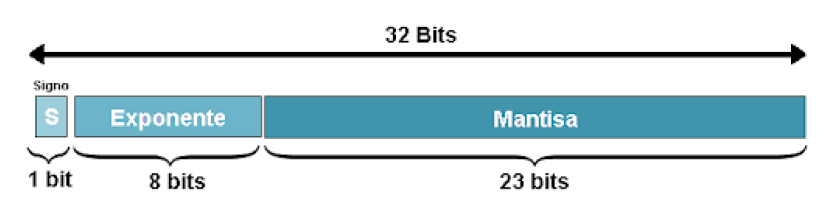

#### 64 bits

Para convertir en IEE754 de 64 bits se usarán en cambio los siguientes bits:
- Signo (1 bit: si es positivo 0, si es negativo 1)
- Exponente: sumarle 1023 (11 bits)  
- Mantisa (52 bits)

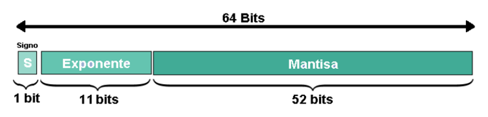


- Convertir el número 134.25 en coma flotante (IEE 754) de 32 bits:

  - Paso 1:

    - Parte entera de 134 en binario es = 10000110
    - Parte decimal 0.25 en binario: 01

  - Paso 2:

    El número 134.25 = 10000110.01
    Se deberá mover la coma tantas posiciones a la izquierda (o derecha) como sea posible para dejarlo de la forma 1.xxxxxxxxx · 2 (^posiciones movidas).

    El exponente será pues el 7.

  - Paso 3:

    $$
    1.000011001 2^7
    $$

    - Signo (1 bit): positivo luego 0
    - Exponente (8 bits): 7+127 = 134 en binario = 10000110 
    - Mantisa (23 bits): 000011001 (se completará con ceros a la derecha)

  - Resultado:

  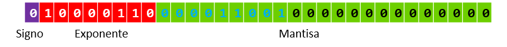

Los números en coma flotante decimales normalmente se expresan en **notación científica** con un punto explícito siempre entre el primer y el segundo dígitos. El exponente o bien se escribe explícitamente incluyendo la base, o se usa una e para separarlo de la mantisa.

| **Mantisa** | **Exponente** | **Notación científica** | **Valor en punto fijo** |
| ----------- | ------------- | ----------------------- | ----------------------- |
| 1.5         | 4             | 1.5 ⋅ 104               | 15000                   |
| \-2.001     | 2             | \-2.001 ⋅ 102           | \-200.1                 |
| 5           | \-3           | 5 ⋅ 10-3                | 0.005                   |
| 6.667       | \-11          | 6.667e-11               | 0.0000000000667         |

Los formatos más comunes del **estándar IEE754** son de 32 o 64 bits de longitud:

| **Formato**        | **Bits totales** | **Bits significativos** | **Bits del exponente** | **Número más pequeño** | **Número más grande** |
| ------------------ | ---------------- | ----------------------- | ---------------------- | ---------------------- | --------------------- |
| Precisión sencilla | **32**           | 23 + 1 signo            | 8                      | \~1.2 ⋅ 10-38          | \~3.4 ⋅ 1038          |
| Precisión doble    | **64**           | 52 + 1 signo            | 11                     | \~5.0 ⋅ 10-324         | \~1.8 ⋅ 10308         |


- Ejemplos:

  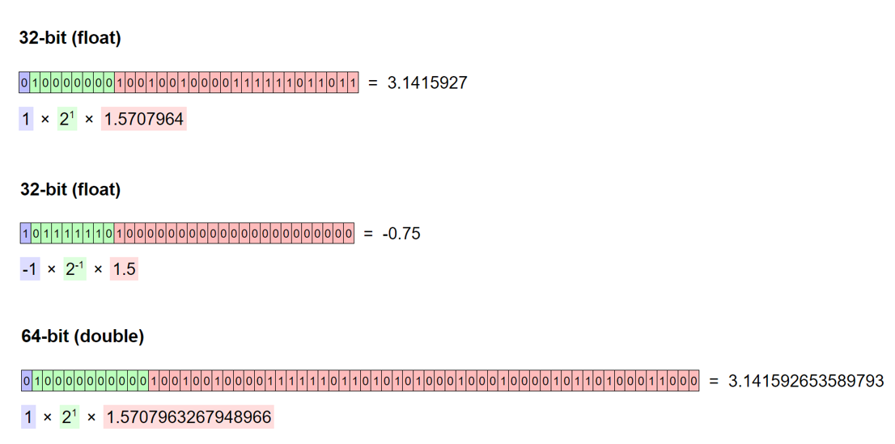


## Unidades de medida de información

Cuando se trata de unidades de medida y la transmisión de datos se puede utilizar el sistema internacional (**SI**) que utiliza en vez de potencias de dos para indicar cantidades de menor a mayor:

| **Nombre** | **Abreviatura** | **Factor**                                   |
| ---------- | --------------- | -------------------------------------------- |
| Kilo       | **K**           | 10^3                              |
| Mega       | **M**           |  10^6                        |
| Giga       | **G**           | 10^9                     |
| Tera       | **T**           | 10^12                |
| Peta       | **P**           | 10^15            |
| Exa        | **E**           | 10^18         |
| Zetta      | **Z**           | 10^21     |
| Yotta      | **Y**           | 10^24 |


En informática se utiliza habitualmente para medir de cantidades de información y sus unidades de medida el sistema *ISO/IEC 80000-13*, que utiliza múltiplos de **potencias de 2**, aumentando en 2^10 cada vez:


| **Nombre** | **Abreviatura** | **Factor**                                   |
| ---------- | --------------- | -------------------------------------------- |
| Kilo       | **K**           | **2^10 **= 1024                              |
| Mega       | **M**           | **2^20 **= 1 048 576                         |
| Giga       | **G**           | **2^30 **= 1 073 741 824                     |
| Tera       | **T**           | **2^40 **= 1 099 511 627 776                 |
| Peta       | **P**           | **2^50 **= 1 125 899 906 842 624             |
| Exa        | **E**           | **2^60 **= 1 152 921 504 606 846 976         |
| Zetta      | **Z**           | **2^70 **= 1 180 591 620 717 411 303 424     |
| Yotta      | **Y**           | **2^80 **= 1 208 925 819 614 629 174 706 176 |


-   **1 Bit**: es la unidad básica de medida de almacenamiento de información utilizada en una computadora.
-   **1 Byte**: combinación de 8 bits.
-   **1 Kbyte (KB)**: 1024 bytes
-   **1 Megabyte (MB)**: 1024 Kbytes
-   **1 Gigabyte (GB)**: 1024 Mb


## Representación interna

>   📌 **Little Endian** y **Big Endian** se refieren al orden que las máquinas asignan a los bytes que representan valores numéricos, cadenas o instrucciones dentro de sus registros internos.

-   **Big Endian** asigna los bytes menos significativos en el extremo más alto. Este formato que puede parecer una forma más "natural" de escritura es utilizado por procesadores usados en máquinas Apple o ARM entre otras.
-   **Little Endian** asigna los bytes menos significativos en el extremo más bajo de la memoria. Este formato es adoptado por la mayoría de procesadores **Intel**, **AMD** o ARM.
  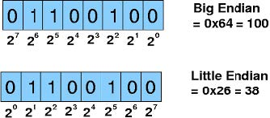


## Conversión analógica-digital

Un ordenador o cualquier sistema de control basado en un microprocesador no puede interpretar señales analógicas, ya que sólo utiliza señales digitales como bien sabemos. Es necesario traducir, o transformar en señales binarias, lo que se denomina <u>proceso de digitalización o conversión</u> de señales analógicas a digitales.

```note
La conversión **analógica-digital** (CAD) o **digitalización** consiste en la transcripción de señales analógicas en señales digitales, con el propósito de facilitar su procesamiento (codificación, compresión, etc.) y hacer la señal resultante la digital más inmune al ruido y otras interferencias.
```

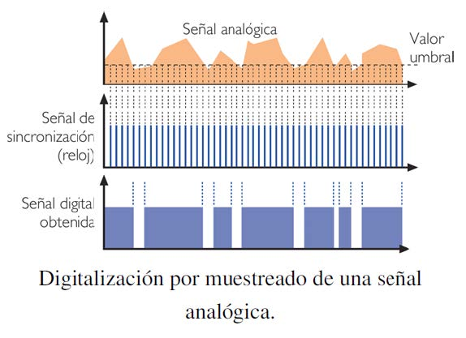

- Ventajas de la **digitalización**:

1.  Cuando una señal digital es atenuada o experimenta perturbaciones leves, puede ser reconstruida y amplificada mediante sistemas de regeneración de señales.

2.  Cuenta con sistemas de detección y corrección de errores, que se utilizan cuando la señal llega al receptor; entonces comprueban (uso de redundancia) la señal, primero para detectar algún error, y, algunos sistemas, pueden luego corregir alguno o todos los errores detectados previamente.
    
3.  Facilidad para el procesamiento de la señal. Cualquier operación es fácilmente realizable a través de cualquier software de edición o procesamiento de señal.
    
4.  La señal digital permite la multigeneración infinita sin pérdidas de calidad.
    
5.  Es posible aplicar técnicas de compresión de datos sin pérdidas o técnicas de compresión con pérdidas basados en la codificación perceptual mucho más eficientes que con señales analógicas.

```note
Una imagen en **mapa de bits**, es una estructura o fichero de datos digital que representa una matriz de píxeles o puntos de color, que se puede visualizar en un monitor o cualquier otro dispositivo de representación.
```

A las imágenes en mapa de bits se las suele definir por su altura y anchura (en píxeles) y por su **profundidad de color** (en bits por píxel), que determina el número de colores distintos que se pueden almacenar en cada punto individual, y por lo tanto la calidad del color de la imagen.

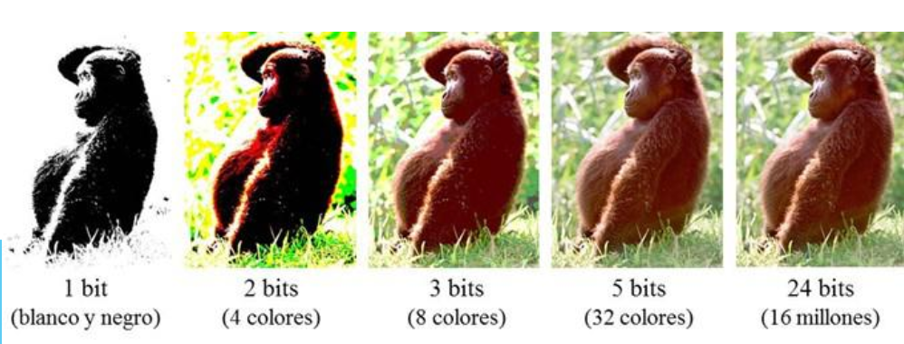