# UT 1.4 Introducción a los Sistemas Informáticos: Redes de telecomunicaciones

## Red de datos de telecomunicaciones

```note
Una **red de datos** es un conjunto de dispositivos conectados entre si, que pueden comunicarse para compartir datos y recursos sin importar la localización física de dichos dispositivos.
```

¿Qué se puede **compartir** en una red de datos?

- **Datos.** Información a modo de paquetes o archivos.
- **Recursos.** Periféricos (impresoras, escáner, etc.), acceso a Internet, etc.
- **Servicios.** Streaming, chat, juegos, correo electrónico, configuraciones automáticas, VoIP, transferencia de ficheros, control remoto, etc.

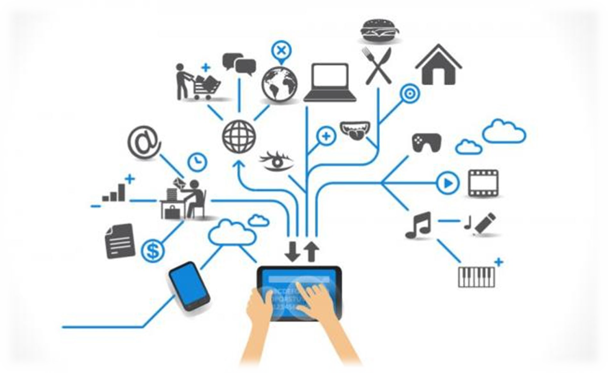

### Proceso de comunicación

En todo **proceso de comunicación**, se requiere de un **emisor**, un **mensaje**, un
**medio** y un **receptor**.

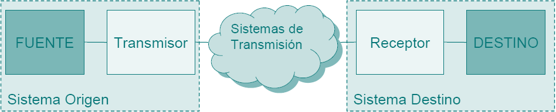

-   **Emisor**: es la entidad que transmite la información.
-   **Receptor**: es la entidad que recibe la información.
-   **Mensaje**: es la información que el emisor transmite al receptor.
-   **Canal**: es el medio por el que se transmite el mensaje.
-   **Código**: es el conjunto de signos, reglas y normas (lenguaje) que se emplean para construir el mensaje.


```note
En el proceso de comunicación, además de estos elementos, habitualmente interviene un factor adicional denominado ruido. 
```

Se considera ruido cualquier interferencia que contamine tanto el mensaje como el canal o el código. Por ejemplo, cuando hablamos con otra persona, el sonido ambiental (coches, televisión, música, etc.) es el ruido de la comunicación.

Cuando el ruido supera un determinado umbral, el proceso de comunicación peligra, de forma que la información que se transmite puede no llegar correctamente.

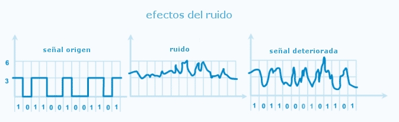

### Objetivos y ventajas

-   **Compartir recursos (objetivo básico)**: Hacer que todos los programas, datos y equipos estén disponibles para cualquiera de la red que lo solicite, sin importar la localización del recurso y del usuario así como permitir la **movilidad**.
- **Proporcionar una alta fiabilidad**, al contar con fuentes alternativas de suministro. Todos los archivos podrían duplicarse en dos o tres máquinas de tal manera que si una no se encuentra disponible, podría utilizarse algunas de las copias.
-   **Ahorro económico**: El compartir recursos y servicios hace que se ahorre en costes ya que no es necesaria la compra de periféricos redundantes, también se aumenta la rapidez en la comunicación, pues se pueden centralizar recursos.
-  Permite mejorar la **seguridad** y control de la
información que se utiliza, permitiendo el acceso de determinados usuarios únicamente a cierta información o impidiendo la modificación de diversos datos.

### Desventajas

-   Las tecnologías evolucionan continuamente, los **estándares** a veces se usan en la práctica sin haberse consensuado e incluso, a veces, ni siquiera existen.
-   Las redes de telecomunicaciones, al ser sistemas distribuidos, necesitan mantenimiento y especialistas TI para mantenerlas operativas.  

-   Muchos programas y dispositivos tienen bugs (agujeros en la seguridad) que pueden aprovecharse para acceder a la configuración de forma remota. La **seguridad** debe ser una cuestión importante, pues algunos usuarios pueden crear problemas voluntaria o involuntariamente.

## Internet

```note
**Internet** es un conjunto inmenso de tecnologías, infraestructura (como cables, satélites y antenas) y protocolos que permiten el intercambio de información entre millones de dispositivos de forma prácticamente instantánea.
```

Internet se basa en una arquitectura de red de telecomunicaciones distribuida que utiliza protocolos de comunicación para conectar dispositivos y permitir la transmisión de datos. Esta red global proporciona una variedad de servicios, como el acceso a información, comunicación, entretenimiento, comercio electrónico y muchas otras aplicaciones.

La tecnología subyacente a Internet ha revolucionado la forma en que vivimos, trabajamos e interactuamos entre nosotros, y continúa evolucionando a un ritmo acelerado.

### Historia y origen

En 1958 los EEUU fundaron la *Advanced Researchs Projects Agency* (**ARPA**) a través del Ministerio de Defensa. El ARPA estaba formado por unos 200 científicos de alto nivel y gran presupuesto. El ARPA se centró en crear comunicaciones directas entre ordenadores para comunicar las diferentes bases de investigación.

En 1962, el ARPA creó un programa de investigación computacional bajo la dirección de John Licklider, un científico del MIT.

En 1967 ya se había hecho suficiente trabajo para que el ARPA publicara un plan para crear una red de ordenadores denominada **ARPANET**. La red recopilaba las mejores ideas de los equipos del MIT, el National Physics Laboratory (UK) y la Rand Corporation.

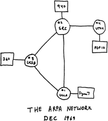

En diciembre de 1969 se habían conectado los cuatro primeros nodos universitarios: Universidad de California en LA, su sede en Santa Bárbara, la Universidad de Utah y Stanford.

La red fue creciendo y en 1971 ARPANET ya tenia 23 puntos conectados.

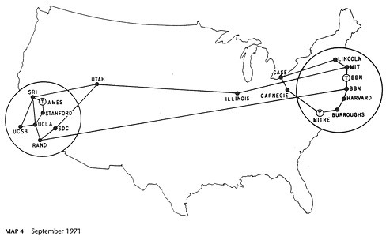

Entre 1974 y 1982 se crearon gran cantidad de redes entre las que destacaron:

-  Telenet (1974): Versión comercial de ARPANET.
-  Usenet (1979): Sistema abierto centrado en el e-mail y que aun funciona.
-  Bitnet (1981): Unía las universidades americanas usando sistemas IBM.
-  Eunet (1982): Unía Reino Unido, Escandinavia y Holanda.

En aquél momento el mundo de las redes era un poco caótico, a pesar de que ARPANET seguía siendo el ‘estándar’. EN 1981, ARPANET adoptó el protocolo **TCP/IP** y en aquel momento se creó **Internet** (*International Net*).

A principios de los 80 se comenzaron a desarrollar los ordenadores de forma exponencial. El crecimiento era tan veloz que se temía que las redes se bloquearan debido al gran número de usuarios y de información transmitida, hecho causado por el fenómeno del e-mail. La red siguió creciendo exponencialmente.

### Historia de la web

El concepto de **WWW** fue diseñado por Tim Berners-Lee y científicos del **CERN** en 1990 en Ginebra. Estos científicos estaban interesados en poder buscar y mostrar fácilmente documentación a través de Internet. Los científicos del CERN diseñaron un navegador/editor y le pusieron el nombre de **World Wide Web**. En 1991 dicha tecnología fue presentada al público a pesar de que el crecimiento en su utilización no fue muy espectacular, a finales de 1992 solamente había 50 sitios web en el mundo, y en 1993 había 150.

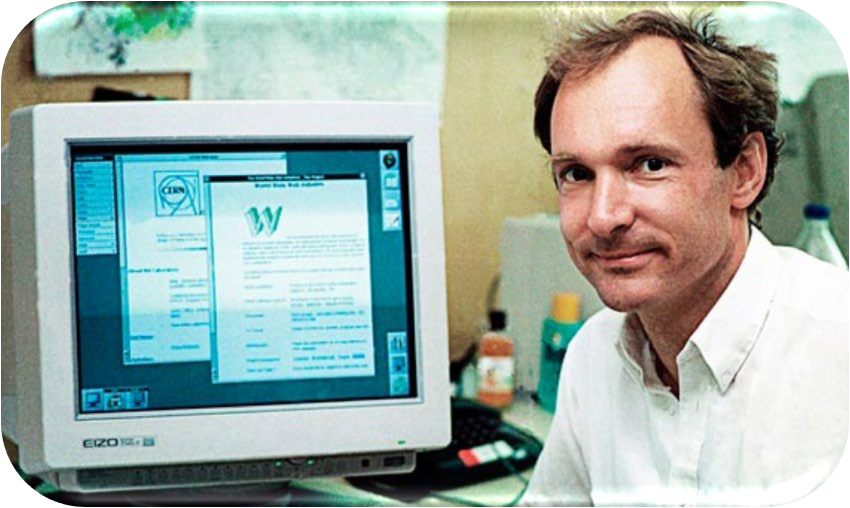

En 1993 Mark Andreesen, del *National Center for SuperComputing Applications* (NCSA) de Illinois publicó el **Mosaic X**, un navegador fácil de instalar y de usar. Sus creadores fundaron a su vez una empresa llamada Netscape en Silicon Valley.

A partir de la publicación de la tecnología **WWW** y de los navegadores se comenzó a abrir Internet a un público más amplio: actividades comerciales, páginas personales, redes sociales junto la explosión de equipos cada vez más potentes y portables.

¿Qué pasa en un minuto en **Internet** en 2024?

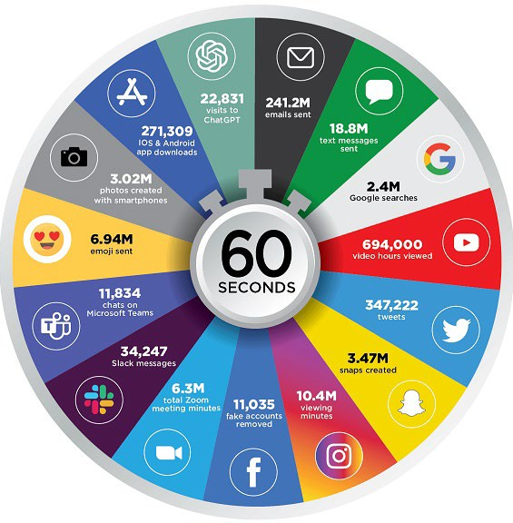

## Características de una red

### Velocidad

Hace referencia a la velocidad a la que se transmiten los datos por segundo a través de una red. La rapidez de subida y descarga de datos será diferente según los estándares que utilicemos y también según el tipo de red o medio a través del que se transmiten los datos (inalámbrica, fibra óptica, cables de teléfono o coaxial).

No se debe confundir la velocidad de una red con su **ancho de banda** o la **latencia** de dicha red. El **ancho de banda** mida la cantidad de datos que se pueden transmitir en la unidad de tiempo, mientras que la **latencia** hace referencia es el tiempo que tarda en transmitirse un paquete dentro de una red y es otro factor clave en las conexiones a Internet.


En función del tipo de actividad para la que se utiliza una red, se ofrecen algunos rangos de velocidad mínima que debería ser suficiente para sus necesidades.

-   **Streaming de video**: Dependiendo del tipo de vídeo, necesitará 3 Mbps para vídeo estándar, 5Mbps para HD, y 25 Mbps para 4k Ultra HD.
-   **Streaming de música**: Una velocidad de 2 Mbps debería ser suficiente para la reproducción de música en streaming.
-   **Juegos**: Los jugadores deben tener velocidades de hasta 10 Mbps para obtener el mejor rendimiento y una latencia baja.
-   **Correo electrónico o redes sociales**: Para acceder a una página de correo o red social sencilla necesitará velocidades de 0,5 — 5 Mbps.
-   **Videollamadas**: 0,5 Mbps para llamadas estándar y 1,5 Mbps si utiliza HD.
-   **Descargar archivos grandes**: Se requiere una conexión rápida para alcanzar velocidades de hasta 50 Mbps.

### Confiabilidad

La confiabilidad o **tolerancia a fallos** mide el grado de probabilidades que existe de que uno de los nodos de la red se averíe y por tanto se produzcan fallos. En parte dependerá de la topología de la red que hallamos instalado y del lugar que ocupa el componente averiado. Cuando uno de los componentes no funciona, puede afectar al funcionamiento de toda la red o por el contrario constituir un problema local.

Por esta razón resulta determinante contar con un **hardware redundante** para que, en caso de fallo en uno de los componentes, haya una gran tolerancia a los errores y los demás equipos puedan seguir trabajando.

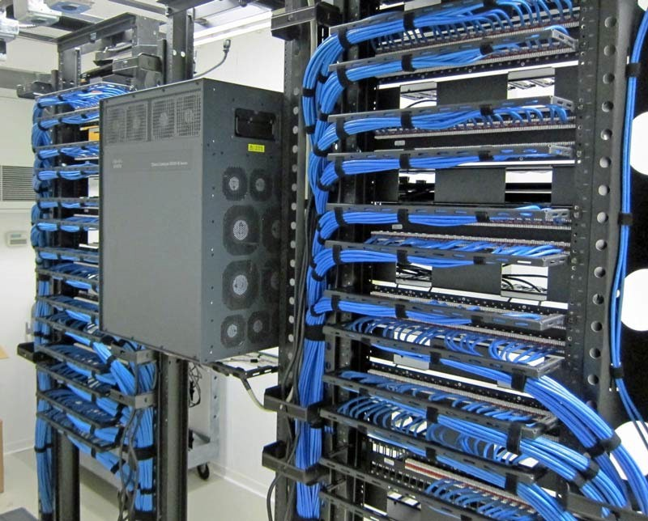

### Seguridad en la red

-   Es un conjunto de estrategias que sirven para proteger una red de accesos indebidos o pérdida de datos. En el caso de redes inalámbricas, la **seguridad** es uno de sus aspectos más peligrosos y controvertidos. El uso de cifrados o contraseñas inseguras junto con la aparición de intrusos que puedan robar información y drenar ancho de banda es una de las razones que convierte estas redes en bastante más vulnerables.
-  Por otro lado, las redes cableadas pueden sufrir interferencias (ruido) como consecuencia del uso de otros aparatos electrónicos. A diferencia de estas, la fibra óptica es la que ofrece una mayor seguridad.

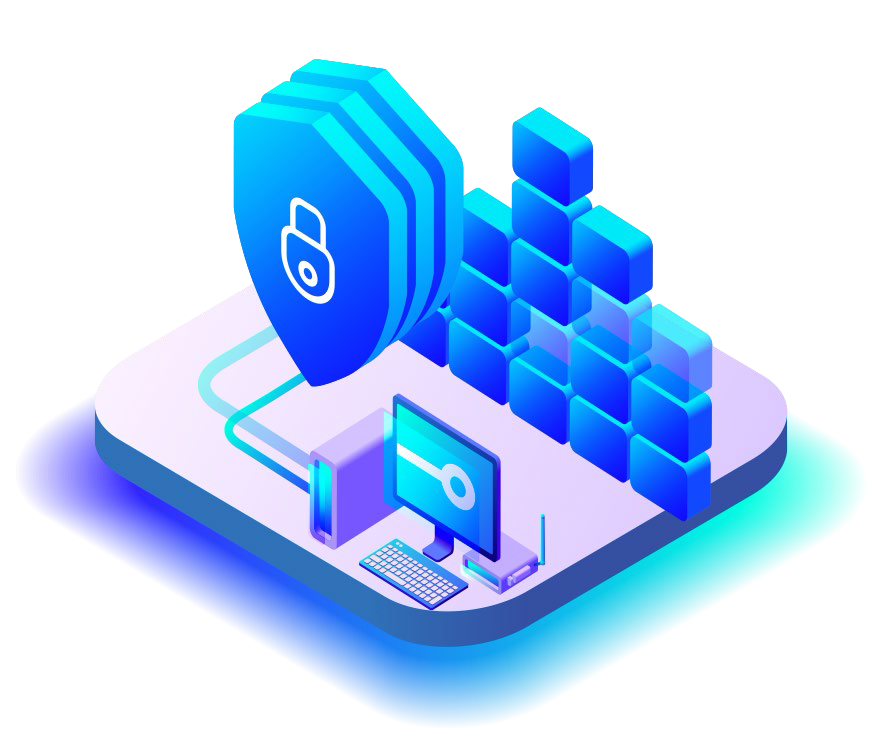


### Escalabilidad

-   La **escalabilidad** hace referencia a la capacidad y facilidad para cambiar de tamaño de una red. Una red no puede añadir nuevos componentes de forma continua y esperar que funcione a la misma velocidad. A medida que añadimos nuevos nodos y estos se hallan funcionando a la vez, la conexión a Internet se reduce, la velocidad de transmisión de datos en general es menor y hay más probabilidad de errores.
-   Es por eso importante ver la facilidad y las posibilidades de añadir o cambiar componentes de hardware y software o nuevos servidores para mejorar el rendimiento de la red.
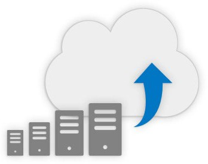

### Disponibilidad

Es la capacidad que posee una red para hallarse disponible y completamente activa cuando la necesitemos. Evidentemente no es lo mismo hablar de una red local del hogar que la de una empresa o institución. Se habla de la cantidad de tiempo posible en que podemos someter los nodos a unas condiciones de rendimiento necesarias en nuestra empresa. El objetivo es conseguir que la red se halle disponible según las necesidades de uso para las que se ha instalado.

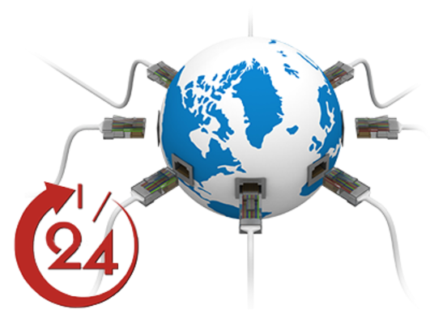


## Modelo cliente-servidor

El **modelo cliente-servidor** es un concepto fundamental en las redes de computadoras. En este modelo, se distingue entre dos tipos de roles principales: el cliente y el servidor, cada uno con funciones específicas y complementarias.

**Cliente**

Es el dispositivo o software que realiza solicitudes para acceder a un servicio o recurso. Por ejemplo, cuando un usuario utiliza un navegador web para acceder a un sitio, el navegador actúa como cliente al enviar una solicitud de información (por ejemplo, acceder a una página web) a un servidor.

**Servidor**

Es el dispositivo o software que responde a las solicitudes de los clientes, proporcionando los recursos o servicios solicitados. Un servidor web, por ejemplo, responde con páginas HTML, imágenes u otros contenidos a los clientes que lo solicitan.

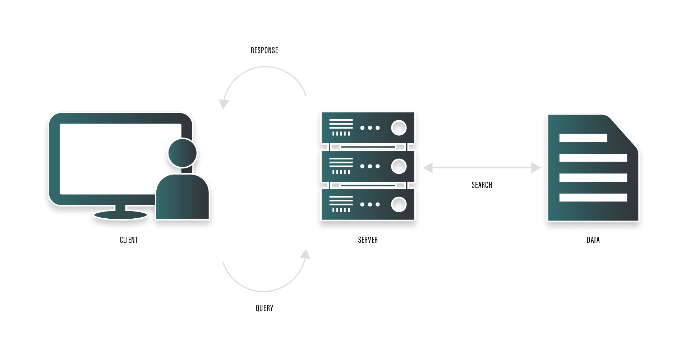
