# UT2.1: Arquitectura funcional de un ordenador 

## Arquitectura de computadores

La arquitectura básica de los ordenadores parte del siguiente esquema básico:


La **CPU** también está compuesta por una memoria (en la cual residen los datos y los programas) y un procesador, que irá ejecutando las órdenes de los programas y la información de los periféricos de entrada para poder generar la salida esperada:


Algunos <u>conceptos</u> importantes que veremos en arquitectura de computadores:

- **Lenguaje máquina**. Conjunto de instrucciones codificadas que un ordenador puede interpretar y ejecutar directamente. Estas instrucciones son combinaciones binarias de la máquina en la que se ejecutan.
    
- **Lenguaje de alto nivel.** Lenguaje de programación que (a diferencia del de máquina) es independiente del ordenador que lo va a ejecutar, y que presenta mayores facilidades para el programador, pues emplea signos cercanos al lenguaje natural; por ejemplo, los lenguajes C,Pascal, Java o Cobol.
    
- **Programa**. Secuencia de instrucciones, escritas para realizar una tarea específica en un ordenador o computadora.
    
- **Memorias de semiconductores**. Tipo de memoria que se emplea actualmente como memoria principal de las computadoras. La RAM pertenece a una clase particular de este tipo de memorias: la de direccionamiento cableado.

Históricamente ha habido **dos arquitecturas** de ordenadores fundamentales:


Ambas arquitecturas constan de los siguientes  **elementos principales**:

- **Unidad Central de Procesamiento (CPU)**
  El cerebro del ordenador, que se compone de: 
  - Unidad de Control (UC) 
  - Unidad Aritmético Lógica (ALU).
  
- **Memoria principal**
Almacena temporalmente datos e instrucciones para un acceso rápido por parte de la CPU.

- **Sistemas de Entrada/Salida**
Permiten la comunicación entre el computador y el mundo exterior, como teclados, monitores y otros dispositivos.

- **Buses de comunicación**
Canales que permiten la transferencia de datos entre los diferentes componentes del ordenador.

### La arquitectura Harvard

Este modelo de arquitectura es el que utilizan los **micro controladores PIC**. Tiene la unidad central de proceso (CPU) conectada a dos memorias (una con las instrucciones y otra con los datos) por medio de dos buses diferentes.

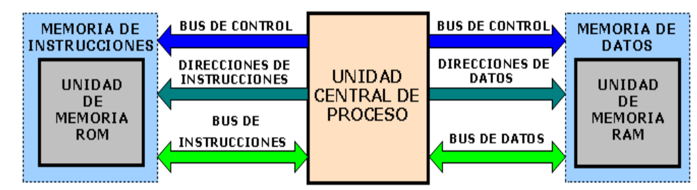

Una de las memorias contiene solamente las instrucciones del programa (Memoria de Programa), y la otra sólo almacena datos (Memoria de Datos). Ambos buses son totalmente independientes lo que permite que la CPU pueda acceder de forma independiente y simultánea a la memoria de datos y a la de instrucciones.

## Arquitectura Von Neumann

>   💡 La arquitectura **Von Neumann** es una arquitectura de computadoras descrita en 1945 por el matemático y físico John Von Neumann. Esta es la arquitectura que rige actualmente en los ordenadores modernos con ligeras modificaciones.

Tradicionalmente los sistemas con microprocesadores se basan en esta arquitectura, en la cual la unidad central de proceso (CPU), está conectada a una memoria principal única (casi siempre sólo RAM) donde se guardan las instrucciones del programa y los datos. A dicha memoria se accede a través de un sistema de buses único (control, direcciones y datos):

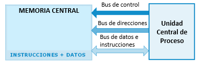

El origen de la arquitectura Von Neumann surge a raíz de una colaboración en el proyecto ENIAC del matemático de origen húngaro, John Von Neumann. Éste trabajaba en 1945 en el Laboratorio Nacional Los Álamos.

El primer computador comercial construido en esta forma fue el **UNIVAC I**, fabricado en 1951 por la Sperry-Rand Corporation y comprado por la Oficina del Censo de Estados Unidos.

## Esquema arquitectura Von Neumann

Las características de esta arquitectura son:

- Tanto programas como datos se almacenan en una memoria en común llamada **memoria principal**.
- Cada celda de memoria de la máquina se identifica con un número único, llamado **dirección**.
- Cada **programa** se ejecuta de forma secuencial comenzando por la primera instrucción. Para cambiar esta secuencia se usan comandos de control.

Dicha arquitectura consta de los siguientes <u>bloques</u>:
- Unidad Central del Procesamiento (**CPU**)
  - Unidad de Control (**UC**)
  - Unidad Aritmético Lógica (**ALU**)
  - Registros
- Memoria principal
- Unidad de Entrada/Salida
- Buses


**De forma esquemática:**

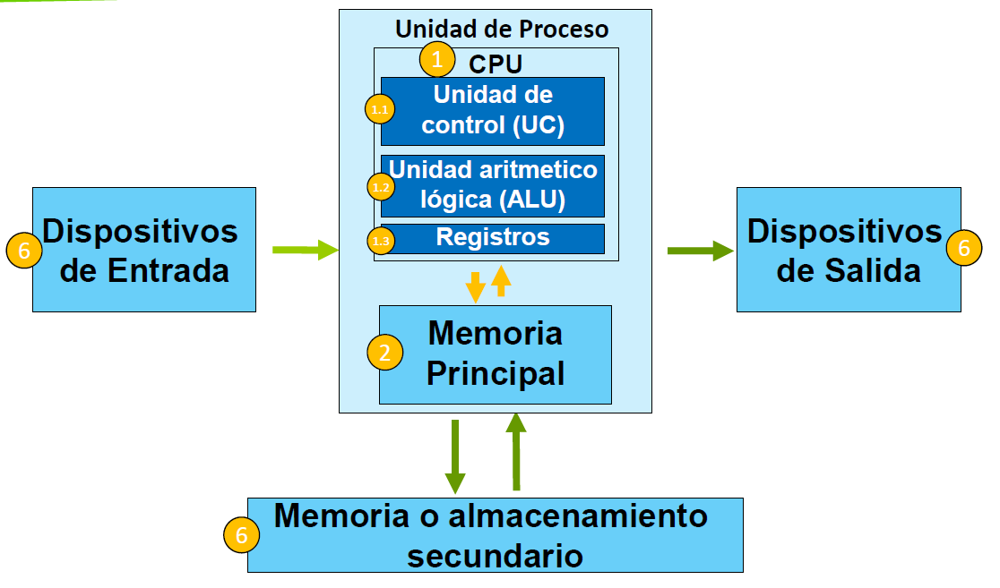

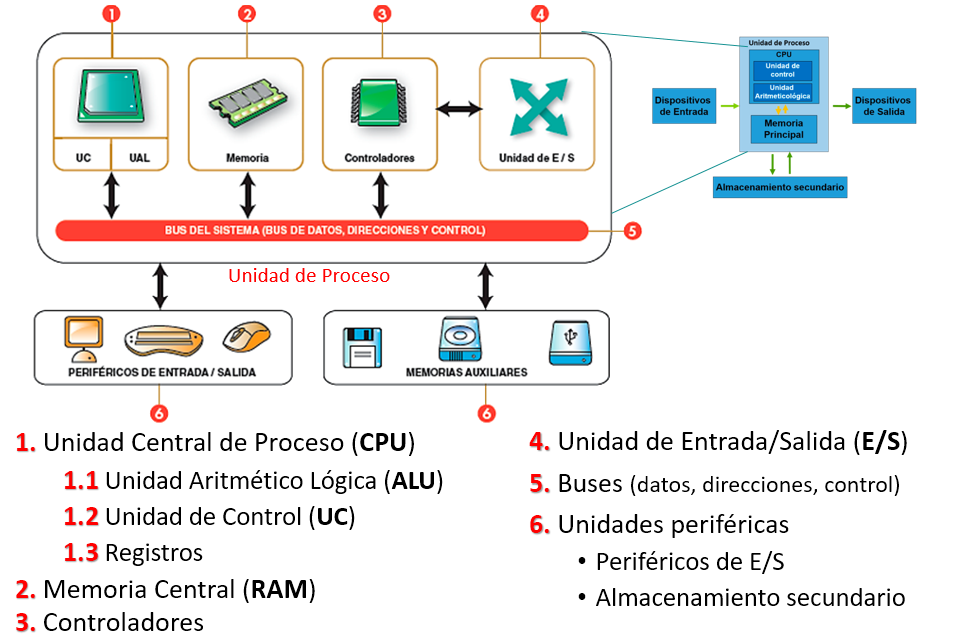


**Esquema más completo del flujo de información:**

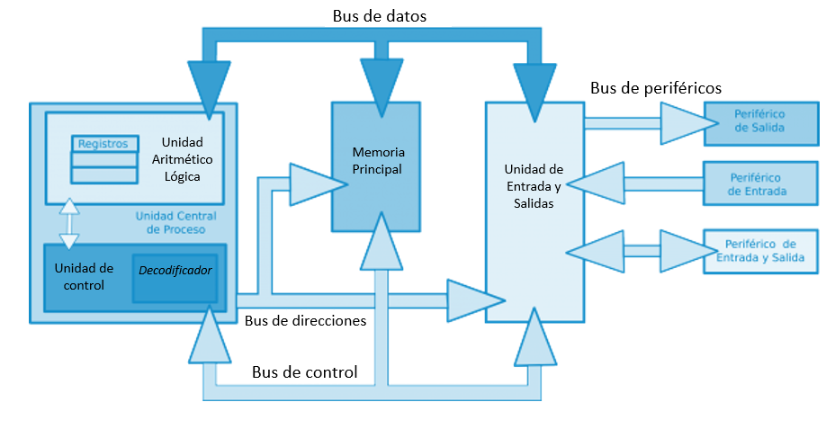


### Cuello de botella del modelo  

>   📌 El canal de transmisión de los datos entre CPU y memoria genera un **cuello de botella** para el rendimiento del procesador. 

En la mayoría de computadoras modernas, la velocidad de comunicación entre la memoria y la CPU es más baja que la velocidad a la que puede trabajar esta última, reduciendo el rendimiento del procesador y limitando seriamente la velocidad de proceso eficaz, sobre todo cuando se necesitan procesar grandes cantidades de datos.

La CPU se ve forzada a esperar continuamente a que lleguen los datos necesarios desde o hacia la memoria.

El término “cuello de botella de Von Neumann” fue acuñado por John Backus en 1977.

El problema de funcionamiento se redujo introduciendo una **memoria caché** entre la CPU y la memoria principal, y mejorando los algoritmos del predictor de saltos que veremos más adelante.

## La CPU	

```note
El **procesador** o CPU es el hardware dentro de un ordenador o cualquier otro dispositivo programable, que interpreta las **instrucciones** de un programa informático mediante la realización de operaciones básicas, lógicas y de entrada/salida en el sistema.
```

Un procesador está compuesto principalmente de:

-   Núcleos:
    -   Unidad de Control (**UC**)
    -   Unidad Aritmetico-Lógica (**ALU**)
    -   Registros de la CPU
-   Memoria Caché (*L1 y L2*)
-   Reloj
-   Otros: Tarjeta gráfica integrada (IGP) u otros elementos auxiliares


>   💡 La **frecuencia de reloj** en relación a un procesador o indica la frecuencia a la cual los transistores que lo conforman conmutan eléctricamente, es decir, abren y cierran el flujo de una corriente eléctrica.

La frecuencia es una magnitud cuya unidad es el **Hertzio** "Hz", que representa un ciclo u oscilación por segundo. En el caso de los procesadores indica las conmutaciones eléctricas en un segundo dentro de un transistor.

$$
2,1 GHz → 2,1·10^9
$$


### Unidad de Control (UC)

Las funciones de la **Unidad de Control (UC)** son las siguientes:

-   Administra los recursos del ordenador, es decir, la memoria, los dispositivos de entrada, de salida y los de almacenamiento.
-   Selecciona e interpreta las **instrucciones** del programa cargado y se encarga de que sean ejecutadas.
-   Transfiere los datos a la Unidad **Aritmético-Lógica (ALU)** para su procesamiento.

La **Unidad de Control** está formada a su vez por:

1.  **Registro de instrucción CPU (RI)**: Es el encargado de almacenar la instrucción que se está ejecutando.
2.  **Registro contador de programas (PC)**: Contiene la dirección de memoria de la siguiente instrucción a ejecutar.
3.  **Controlador y decodificador**: Extrae el código de operación de las instrucciones.
4.  **Secuenciador**
5.  **Reloj:** Proporciona una serie de pulsos a intervalos constantes.

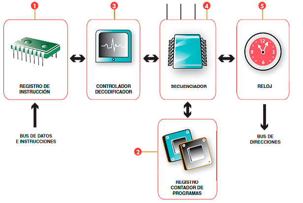

La unidad de control se encarga de leer las instrucciones (de los programas almacenados en la memoria) y se encarga de enviar las órdenes a los componentes del procesador para que ejecuten las instrucciones.

El proceso empieza cuando llega una instrucción al **registro de instrucciones**. Posteriormente el **decodificador** interpreta la instrucción a realizar y como deben de actuar los componentes del procesador para llevarla a cabo. Esta acción se realiza mediante el **secuenciador** que envía micro-órdenes marcadas por el **reloj**.

###  Unidad Aritmético-Lógica (ALU)

>   💡 Las funciones de la **Unidad aritmético-lógica (ALU)** son principalmente la de ejecutar operaciones aritméticas y comparaciones.

-   Cálculos (operaciones aritméticas)
    -   suma, resta, multiplicación y división

-   Comparaciones (operaciones lógicas)
    -   operadores aritméticos: \<, \<=, =\>, \>
    -   operadores booleanos: AND, OR, NOT

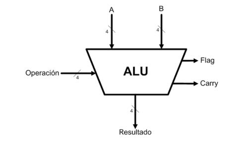

La **Unidad Aritmético lógica** está formada a su vez por:

1. **Circuito operacional**: Realiza operaciones con los datos de los registros de entrada.

2.  **Registros de entrada**: Contienen los operandos de la operación.

3.  **Registro acumulador**: Almacena los resultados de las operaciones.

4.  **Registro de estado:** Registra las condiciones de la operación anterior.

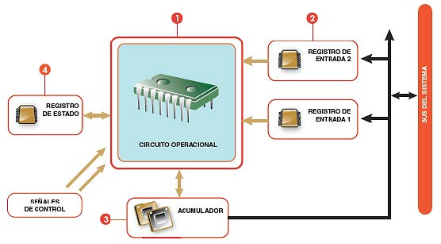

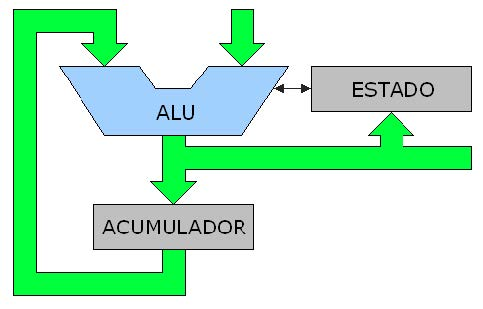

>   El funcionamiento con el diseño que estamos analizando (el básico) comienza cuando le llega al registro de entrada un dato (una cadena de bits que representan un número), posteriormente el **circuito operacional** (en la imagen se representa como "ALU" y coloreado azul) y se procesa junto al
>   contenido del **acumulador** y posteriormente se deposita de nuevo en el acumulador. Repitiendo esta acción se generan los cálculos.

### Registros CPU

> Los **registros de la CPU** son tecnicamente un tipo de memoria de muy alta velocidad formada por celdas de poca capacidad e integrada directamente en el microprocesador, que permite guardar transitoriamente y acceder a valores muy usados, generalmente en operaciones matemáticas.

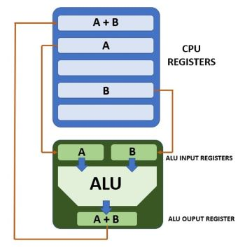

Vamos a trabajar con los siguientes registros de la CPU que ya hemos nombrado:

- **El Registro de Instrucciones (IR)** es un registro de propósito especial. Se utiliza para guardar la instrucción que se ha buscado desde la memoria.
    
- **El Registro Contador de Programa (PC):** Se utiliza para guardar la dirección de memoria de la próxima instrucción a buscar.
    
- **Registro de Direcciones de memoria** se usa para guardar exclusivamente direcciones de memoria.
    
- **Registro de datos (RD):** Almacenamiento temporal entre los datos de la memoria y la ALU
    
- **Registro Acumulador (RA)** en el que son almacenados temporalmente los resultados aritméticos y lógicos intermedios que serán tratados por el circuito operacional de la unidad aritmético-lógica (ALU).
    
- **Registros de Entrada de operandos de la ALU:** Los Registros de Operandos de entrada a la ALU.

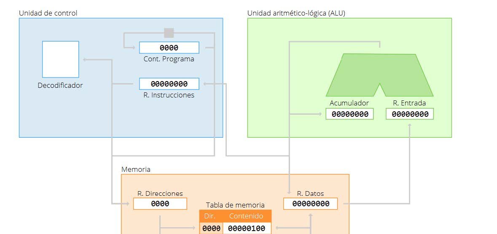

- Funcionamiento del esquema:

1. Se extraerá de la memoria principal la instrucción a ejecutar. Para ello dispone de dos registros: el **Contador de Programa (PC)** en el que se almacena la dirección de la celda de memoria que tiene la siguiente instrucción y el **Registro de Instrucción (RI)** en el que se deposita el código de la instrucción a ejecutar.
2. Una vez conocido el código de operación la UC establecerá las conexiones de los circuitos de la ALU que deberán intervenir en la operación.
3. La UC extraerá de la memoria principal los datos necesarios para ejecutar la instrucción; ordena la lectura de la celda cuya dirección se encuentra en el **Registro de Instrucción (RI)**.
4. La UC ordenará a la ALU que efectúe las operaciones necesarias. El resultado de la operación se almacenará en el **Registro Acumulador**.
5. Finalmente se incrementará en 1 el registro del **Contador de Programa**.

##   La memoria	

```note
Se denomina **memoria** a cualquier dispositivo electrónico que retenga, memorice o almacena datos informáticos durante un período de tiempo determinado.
```

Existen diversos tipos de memoria:

- **Registros CPU**: celdas para operar a gran velocidad en la CPU.
- **Memoria caché**: memoria temporal intermedia de muy alta velocidad.
- **Memoria principal interna**: Son memorias de muy alta velocidad y precio situadas dentro de la propia placa base del ordenador o dispositivo. Existe memoria interna RAM y ROM.
- **Memoria o almacenamiento secundario externo**: Se le da ese nombre a los soportes de almacenamiento masivos que sean capaces de almacenar información en distintos medios y tecnologías.

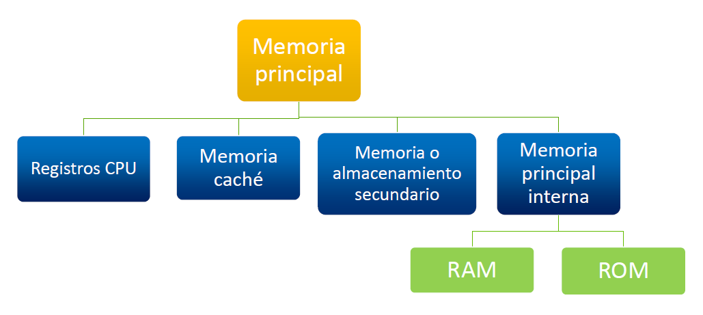

### La memoria principal interna

> 💡 La **memoria interna principal** son chips conectados a la placa base principal de cualquier ordenador o computadora. Son dispositivos caros y rápidos que almacenan información para las operaciones y el procesamiento de los datos de la CPU, gráfica y el sistema operativo.


Existen dos tipos de memoria interna principal: **RAM** y **ROM**:

-  Memoria **RAM** (**R**andom ***A***ccess ***M***emory): en ella es posible almacenar y modificar información. Al irse la corriente o apagarse el dispositivo se borra su información almacenada.
    
-  Memoria **ROM** (**R**ead ***O***nly ***M***emory): es una memoria de solo lectura donde reside el firmware de la máquina para su arranque.

#### La memoria principal interna: RAM

>   📌 **Físicamente** hablando, los componentes internos de la memoria RAM son **celdas** que actúan como pequeños condensadores, del tal forma que si están cargados se traducen como un **1** y en caso contrario como un **0**.

Representación de la **estructura física** de las celdas:

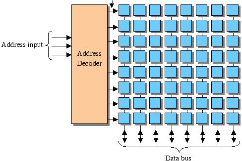


La memoria RAM es básicamente una tabla, que contiene la dirección (o lugar) donde está cierto dato y el contenido del propio dato. La memoria dispone de un **registro de direcciones** y de un **registro de datos de intercambio de memoria**. En el *registro de direcciones* se almacena la dirección en la
que se almacenará o leerá un dato, y en el *registro de intercambio de memoria* se almacena ese dato leído o que se almacenará.

#### La memoria principal interna: ROM

```note
La memoria **ROM** o memoria de solo lectura contiene programas especiales (**firmware**) que sirven para cargar e iniciar el arranque del ordenador.
```

En la memoria ROM se encuentra almacenada la información referente a los componentes hardware de un equipo.

Posteriormente, será labor del sistema operativo realizar el resto de operaciones para poder empezar a utilizar el ordenador.

El software que integra la ROM forma lo que se denomina la **BIOS** del ordenador (*Basic Input Output System*), también conocido como **UEFI**.

### La memoria caché

```note
La **memoria caché** es un tipo de memoria temporal de muy alta velocidad que almacena datos e instrucciones temporalmente con alta probabilidad de volver a utilizarse durante el procesamiento.
```

El objetivo de usar memoria caché es ayudar a la memoria principal mejorando la velocidad de proceso.

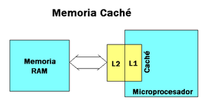

Existe también el concepto de **buffer**, que se usa para compensar la diferencia de velocidades de flujo de datos entre un dispositivo y otro.

Cada vez que el sistema quiere acceder a un nuevo dato, éste es almacenado en la memoria caché. Entonces, cuando se necesita recurrir nuevamente al mismo dato, el sistema se dirigirá directamente a la caché, haciendo así el proceso mucho más rápido.

Existen diferentes niveles de caché denominados *L1, L2 y L3*.

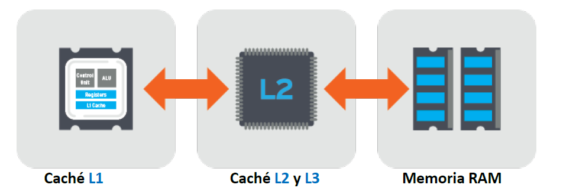


###  Registros CPU

Dentro de la CPU hay una memoria interna compuesta por un conjunto de registros de muy alta velocidad. Este elemento es necesario para transferir datos entre los diversos registros y la ALU, ya que ésta en realidad sólo opera con datos de la memoria interna de la CPU. 

Los registros de la CPU se clasifican en:

- **Registros visibles al usuario:** Permiten al programador de lenguaje de máquina o ensamblador minimizar las referencias a memoria principal optimizando el uso de los registros.

- **Registros de control:** Son utilizados por la unidad de control para controlar el funcionamiento de la CPU y por programas privilegiados del sistema para controlar la ejecución de programas.

- **Registro de estado:** Se utiliza para tomar decisiones en función de operaciones realizadas.

- **Registro puntero a pila.**

###  Memoria secundaria	

```note
La **memoria o almacenamiento secundario** es aquella que se utiliza para guardar los datos en forma permanente.
```

La memoria secundaria es un tipo de almacenamiento masivo y permanente (no volátil), mucho más barato y con mayor capacidad para almacenar datos. No obstante, este tipo de memoria tiene <u>menor velocidad</u> que la memoria principal

Para almacenar información en memoria secundaria se pueden usar los siguientes tipos de tecnología:

-   Magnética (discos duros, cintas magnéticas).
-   Discos en Estado sólido (SSD, NVM2)
-   Memoria Flash (NAND)
-   Óptica (CD, DVD, BD).

## Esquema de memorias


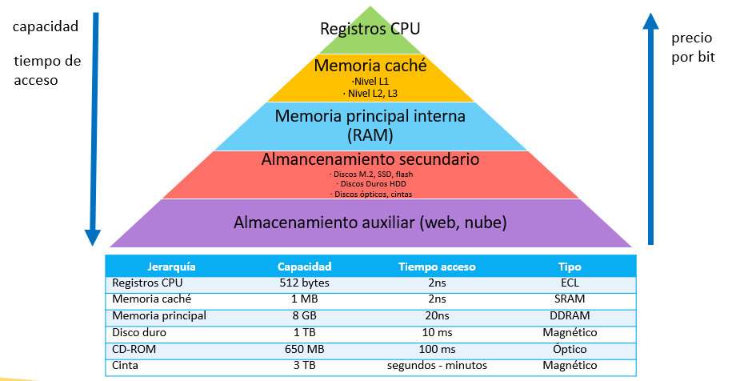


## El bus	

```note
 El **bus** es una autopista o canal de transmisión que transfiere información entre los diferentes componentes internos del ordenador.
 ```

Existen varios tipos de buses:

- **Bus de control**: mandan señales básicas de control a los distintos componentes internos.
  
- **Bus de direcciones**: establece una comunicación directa bidireccional entre la CPU y la memoria RAM del ordenador.

- **Bus de datos**: permite el intercambio de datos entre la CPU y el resto de dispositivos.


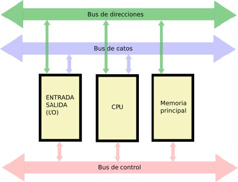

>   La capacidad de un bus de datos depende de los bits que pueda transmitir simultáneamente (conductos de datos que transmiten en paralelo), de la velocidad del bus (frecuencia reloj) y del tipo de procesador o chipset del sistema.


Podemos clasificar los buses también según el tipo de transmisión: 
- **Serie/Paralelo**: un bus en serie envía la información secuencialmente bit a bit, mientras que un bus paralelo puede enviar una palabra completa en un solo ciclo de reloj. Los buses paralelos tienen par tanta la ventaja de su velocidad pero tienen problemas de  sincronización de señales para largas distancias y son más caras 
- **Unidireccional/bidireccional**: en función de si únicamente pueden transmitir información en un sentido o si pue den transmitir en ambos sentidos. 
- **Simplex/semiduplex/fullduplex** el bus simple es unidireccional. Es semiduplex cuando puede enviar en ambos sentidos pero no al mismo tiempo (a bien envía en un sentido o  bien envía en el otro), y es fullduplex cuando puede enviar en ambos sentidos simultáneamente. 
- **Síncrono/asíncrono**: en un bus síncrono las señales se envían siempre atendiendo a un pulso de reloj, mientras que en un bus asíncrono se envían unas señales de inicio de transmisión y fin de transmisión antes de comenzar a emitir y cuando finaliza la emisión. 

Existen dos tipos de transferencia en los buses como ya comentamos: 
- **Serie**: El bus solamente es capaz de transferir los datos bit a bit. Es decir, el bus tiene un único cable que transmite la información.
- **Paralelo**: El bus permite transferir varios bits simultáneamente, por ejemplo 8 bits.

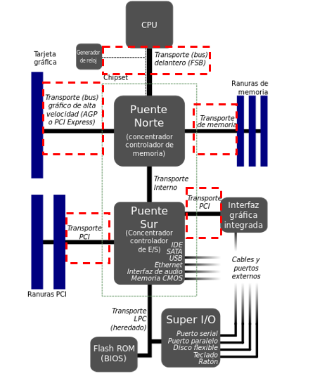

## Unidad de control E/S	

```note
Las **unidades control de entrada/salida o chipsets** sirven para comunicar el procesador y el resto de componentes internos del ordenador con los periféricos de entrada/salida y las memorias de almacenamiento externo o auxiliares.
```

Las placas base solían incluir dos unidades de E/S o chipsets denominadas **puente norte** y **puente sur** o un **chipset general** integrado que hace de ambos. Suelen ser los circuitos integrados más grandes después de la CPU y la GPU.

Sus funciones son:

- Su función básica es dirigir, coordinar y controlar el intercambio de información entre la CPU y los distintos periféricos.
- Sirven para liberar a la CPU para realizar otras tareas.
- Los controladores incluyen una parte tangible (hardware) y una parte intangible (software).

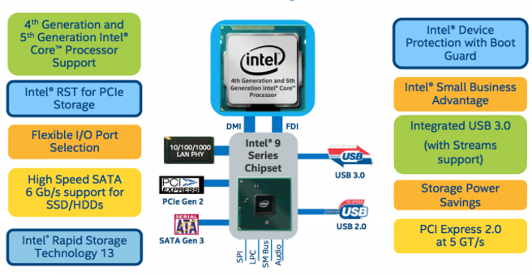

## Los periféricos	

```note
Los **periféricos** son dispositivos hardware con los cuales el usuario puede interactuar con el ordenador (teclado, ratón, monitor), almacenar o leer datos y/o programas (dispositivos de almacenamiento o memorias auxiliares),imprimir, etc
```

Los periféricos se conectan con el ordenador, la CPU y sus componentes, a través de los denominados **puertos** o conectores externos. Esta gestión la lleva a cabo a través de la **unidad de entrada/salida** vista anteriormente.

Muchos de los periféricos de entrada/salida necesitan un tipo de software especial para ser configurados (conocidos como **drivers**)

Los **periféricos** pueden clasificarse en:

-   Periféricos de **entrada**
-   Periféricos de **salida**
-   Periféricos de **almacenamiento**
-   Periféricos de **comunicación**
-   Periféricos **híbridos**

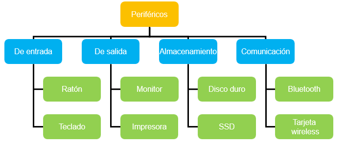