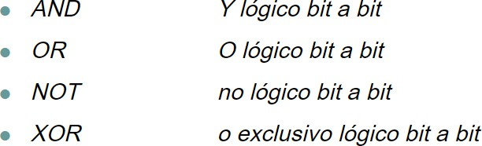
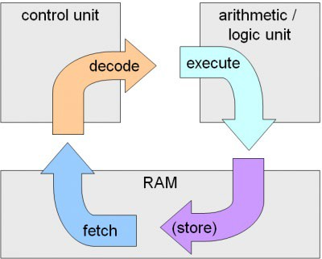

# UT2.2 Funcionamiento elementos CPU

## Instrucciones

```note
Se denomina **instrucción**  al conjunto de datos insertados en un programa de ordenador y que el procesador interpreta y ejecuta.
```

Las instrucciones del computador son las que determinan el funcionamiento de la CPU que las ejecuta.

Los tipos de instrucción permitidos están definidos y determinados dentro de cada plataforma en lo que se **llama** el **conjunto o juego de instrucciones** (*ISA Instruction Set Architecture*).

Las instrucciones a su vez tienen un **formato concreto** (según establece su diseño del juego de instrucciones), que divide cada instrucción de *n bits* (*normalmente 32 o 64*) en **varios campos**.

Para determinar el tipo de instrucción usaremos su *Opcode*.


En todas las CPU modernas se pueden encontrar el siguiente **conjunto de instrucciones**:

-   Instrucciones de transferencia de datos *(mem-cpu)*
-   Instrucciones aritméticas
-   Instrucciones lógicas
-   Instrucciones de control
-   Instrucciones de transferencia Entrada/Salida


Cada instrucción se suele identificar con un **nemotécnico** que hace referencia a la función que realiza la instrucción *(MOVE, STORE, LOAD, ADD, MULTIPLY, SET, INCREMENT...)*

-   Ejemplos de instrucciones de **transferencia** de datos del modelo x86:

    

-   Ejemplos de instrucciones **aritméticas** de datos del modelo x86:

    

-   Ejemplos de instrucciones **lógicas** de datos del modelo x86:

    


-   Ejemplos de instrucciones **de control** de datos del modelo x86:

    

-   Ejemplos de instrucciones **de transferencia E/S**:

    

## Fases de una instrucción

Toda instrucción residente en memoria principal pasa por una serie de fases que van desde su captura a su interpretación y ejecución. Éstas son:

1.  **Carga, búsqueda o lectura (fetch).** La UC envía a la memoria principal la dirección de la instrucción a ejecutar, que está almacenada en el registro contador de programa (PC) y activa las señales de control necesarias para que ésta le entregue la mencionada instrucción.
2.  **Decodificación (decode)**. La UC recibe la instrucción, la analiza y, en su caso, lee los operandos de la memoria principal, enviando su dirección y activando las correspondientes señales de control.
3.  **Ejecución (execution)**. La ALU, bajo las órdenes de la UC, realiza la operación sobre los operandos, y, si es necesario, se graba el resultado en la memoria principal (store) o en un registro.
4.  **Incremento del contador de programa** (PC). Con lo que se puede pasar a ejecutar la instrucción siguiente, aunque existen instrucciones que pueden modificar el contenido del PC dando lugar a ‘saltos’.

## Funcionamiento de un programa




## Funcionamiento arquitectura interna

Una vez estudiada la **arquitectura** podemos deducir que existen una serie de parámetros que sirven para determinar la **capacidad de proceso** de una CPU, que básicamente serían:

-   **Velocidad de procesador**. Determina el ritmo de ejecución de instrucciones. Se mide en hercios y múltiplos de éstos.
-   **Juego de instrucciones**. Cada tipo de CPU tiene un juego de instrucciones característico.
-   **Tamaño del bus de datos y direcciones**. Se mide en bits, siendo hoy día habitual los 64 y 128 bits de tamaño.
-   Número de registros de que dispone.
-   Líneas y señales de interrupción que implementa.

Recordar los registros de la CPU con los que vamos a trabajar vistos previamente:

-  **El Registro de Instrucciones (IR)** es un registro de propósito especial. Se utiliza para guardar la instrucción que se ha buscado desde la memoria.
-  **El Registro Contador de Programa** (PC – *Program Counter*): Se utiliza para guardar la dirección de memoria de la próxima instrucción a buscar.
-  **Registro de Direcciones de memoria** (MAR – *Memory Address Register*) se usa para guardar exclusivamente direcciones de memoria.
-  **Registro de datos** (MDR - *Memory data Register*): Almacenamiento temporal entre los datos de la memoria y la ALU.
-  **Registro Acumulador (RA)** en el que son almacenados temporalmente los resultados aritméticos y lógicos intermedios que serán tratados por el circuito operacional de la unidad aritmético-lógica (ALU).
-   **Registros de Entrada de operandos de la ALU:** Registro de entrada de operandos a la ALU.


