# UT2.3 Puertas y funciones lógicas

## Semiconductores

```note
Los **semiconductores** son elementos que se comportan como conductores o como aislantes dependiendo de diversos factores, como por ejemplo una corriente eléctrica, presión, temperatura o radiación.
```

Los semiconductores más usados son los dos elementos del grupo IV de la tabla periódica, es decir, silicio (*Si*) y germanio (*Ge*). Son los que se han estudiado con mayor detalle debido a que pueden ser obtenidos con alta pureza y crecidos en forma monocristalina con mayor facilidad.


Los semiconductores se usan en aplicaciones electrónicas, en especial para la fabricación de componentes como transistores, diodos y circuitos integrados.

También son usados como accesorios o complementos de sensores ópticos, como láseres de estado sólido, y algunos dispositivos de potencia para sistemas de transmisión de energía eléctrica.

En la actualidad, este tipo de elementos está siendo empleado para desarrollos tecnológicos en el ámbitos de las telecomunicaciones, sistemas de control y procesamiento de señales, tanto en aplicaciones domésticas como industriales.

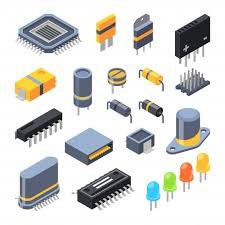

## Componentes electrónicos

### El transistor

```note
Un **transistor** es un dispositivo semiconductor utilizado como interruptor en un circuito electrónico. Posee tres conexiones: **E**misor, **B**ase y **C**olector.
```

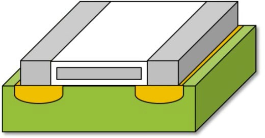

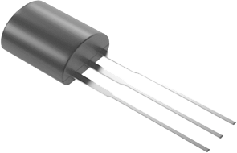


Un procesador moderno está compuesto de miles de millones de diminutos transistores. Estos actúan como unidades muy básicas de procesamiento, que al combinarse son capaces de llevar a cabo todas las operaciones que lleva a cabo un ordenador o computadora.

El **transistor** fue inventado en 1947 y vino a sustituir a las vetustas válvulas de vacío suponiendo toda una revolución en cuanto a tamaño y fiabilidad.

Un transistor es por tanto un dispositivo en estado sólido que esta compuesto por **silicio** permitiendo el paso de corriente a través de cristales semiconductores de **tipo N** y de **tipo P.**


El **transistor** tiene una entrada de corriente (puede ser el emisor - E), una salida de corriente (puede ser el colector - C) y una entrada de señal (la base - B) que cuando actúa facilita la transmisión de electrones entre el emisor y el colector. Dicho de otra manera un transistor actúa como un interruptor, únicamente pasará corriente entre E y C cuando actúe B.

La señal base-emisor puede ser muy pequeña en comparación con la emisor-receptor. La señal emisor-receptor es aproximadamente la misma que la base-emisor pero amplificada. El transistor puede usarse también como **amplificador**.

Los **transistores bipolares** son un tipo de transistor formado por la unión de tres cristales semiconductores, creando por tanto dos tipos de transistores:

-   Transistores **NPN**: Dos del tipo N y uno del P: Usan partículas subatómicas positivas para transportar la corriente. Su material semiconductor es el **silicio**.

-   Transistores **PNP**: Dos del tipo P y uno del tipo N. Usan partículas subatómicas negativas para transportar la corriente. Su material semiconductor es el **germanio**.

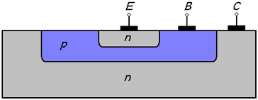

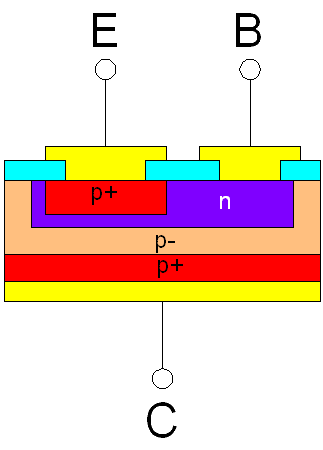

### Fotolitografía

```note
La **fotolitografía** es una técnica que permite construir e integrar chips electrónicos sumamente pequeños y que actualmente ha derivado en *nanolitografía*.
```

Para reducir el tamaño de los transistores, se utilizan obleas de silicio de nanómetros de espesor que, a través de procesos basados en la exposición a la luz de determinados componentes y el uso de otros compuestos químicos, son capaces de crear circuitos de tamaños microscópicos. A su vez, se van apilando estas obleas hasta conseguir un chip 3D sumamente complejo.

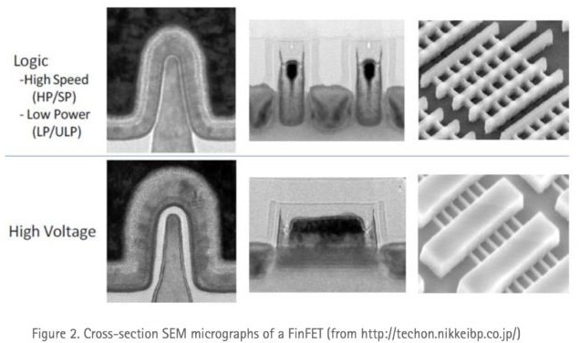
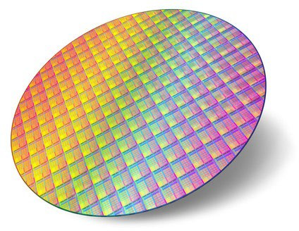

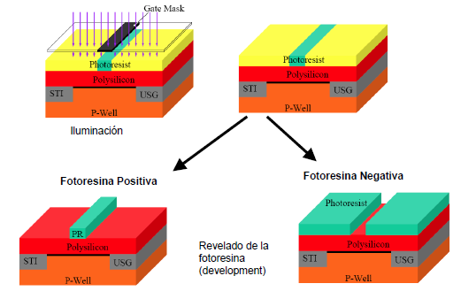

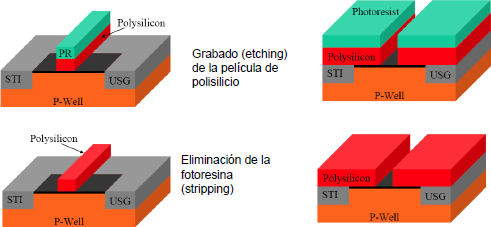

### El diodo

El **diodo** es otro componente electrónico **semiconductor** que tiene la propiedad de permitir el paso del flujo eléctrico únicamente en un sentido entre sus dos bornes; para su construcción, se utiliza principalmente silicio o germanio.

Una combinación de cuatro diodos, dispuestos en la forma adecuada, permite crear un puente de diodos, conocido como **puente rectificador** y utilizado para convertir la corriente alterna (que llega al hogar u oficina) en corriente continua (empleada por aparatos electrónicos).


### Fabricantes componentes

En la actualidad encontrar cuatro grandes potencias que se dedican a la fabricación de chips electrónicos y los problemas de la cadena de suministros que conlleva su escasez:

- **TSMC**: esta empresa de microtecnología es uno de los principales fabricantes de chips del mundo (30%). Fabrica los procesadores de marcas como AMD, Apple, Qualcomm, Nvidia, Huawei o Texas Instrument. Es un fabricante clave en los transistores de 3 nm.
-  **Intel**: el gigante azul, el cual inventó la arquitectura x86, también tiene su propias fábricas de procesadores y actualmente planea nuevas en Europa. Responsable del 10% de la producción mundial.
-  **Samsung**: la empresa coreana también tiene una fábrica propia de silicios, por lo que está en los mismos términos que Intel. Puede crear sus propios procesadores para smartphones y otros dispositivos.
-  **Global Foundries**: otro de los fabricantes pero no puntero, de obleas de     silicio con más clientes, entre los que también están AMD, Qualcomm y otros. En este caso fabrica transistores de 12 y 14 nm entre otros.

    

## Puertas lógicas

```note
Las **puertas lógicas** son circuitos electrónicos construidos con transistores y diseñados para obtener resultados booleanos(0,1), los cuales se obtienen de operaciones lógicas binarias (suma, multiplicación).
```

Este tipo de dispositivos lógicos se encuentran implementados con transistores y diodos en un semiconductor y actualmente podemos encontrarlas en formas de circuitos integrados lógicos.

En apariencia, las puertas lógicas no se distinguen de otro circuito integrado cualquiera. Sólo los códigos que llevan escritos permiten distinguir las distintas puertas lógicas entre sí.

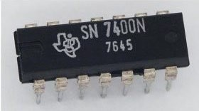

El nivel lógico (0 o 1) se representa mediante un nivel de tensión, generalmente:

-   Tensión alta (5V, 3.3V, 2.5 V) → **1**
-   Tensión baja (0V) → **0**

Las puertas lógicas consumen por tanto energía:

-   Estática: la que se consume por tener alimentada la puerta lógica, sin cambiar los valores lógicos.
-   Dinámica: la que se consume al conmutar de estado.

En la tecnología **CMOS** (la más utilizada actualmente), el consumo estático es muy pequeño. Sin embargo, los circuitos modernos pueden llegar a tener más de 108 puertas lógicas.

> El consumo es un problema importante: La energía consumida se transforma en calor, que hay que disipar. Si el circuito consume mucho, puede ser difícil disipar el calor. En dispositivos portátiles, el tamaño y el peso de la batería es limitado.

Tipos de **puertas lógicas** que estudiaremos:

-   AND
-   OR
-   NOT
-   NAND
-   NOR
-   XOR

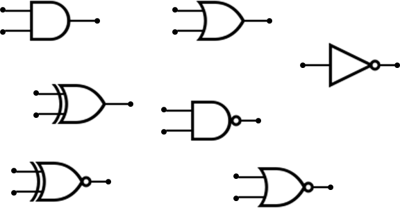

### Puerta AND

En una puerta lógica **AND** la señal de salida se activa sólo cuando se activan todas las señales de entrada. Equivale a la operación lógica multiplicación S = A · B


Una **tabla de verdad** lista todos los posibles valores de una o varias proposiciones simples y el valor de verdad de su salida.

La tabla de verdad de una puerta AND es sencilla de comprender:

| A   | B   | A AND B |
| --- | --- | ------- |
| 0   | 0   | 0       |
| 0   | 1   | 0       |
| 1   | 0   | 0       |
| 1   | 1   | 1       |

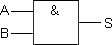

Si suponemos la equivalencia de un circuito eléctrico de tres entradas, su representación y tabla de verdad sería la siguiente:

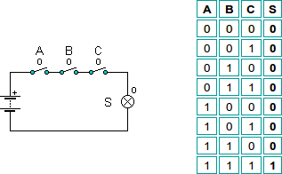

Una puerta **AND** está constituida por **dos transistores** siguiendo la siguiente distribución interna:

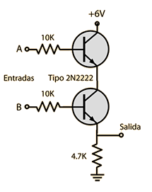

### Puerta OR

En una puerta **OR** la señal de salida se activa si alguna de sus señales de entrada están activas. Equivale a la operación lógica suma S = A + B

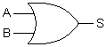

Su tabla de verdad será pues la siguiente:

| A   | B   | A OR B |
| --- | --- | ------- |
| 0   | 0   | 0       |
| 0   | 1   | 1       |
| 1   | 0   | 1       |
| 1   | 1   | 1       |

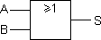

Si suponemos un circuito eléctrico usando tres puertas OR su distribución y tabla de verdad sería la siguiente:

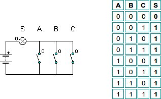

Una puerta **OR** está construida por otros **dos transistores** con la siguiente distribución interna:

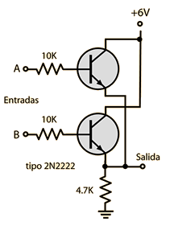

### Puerta NOT

En una puerta **NOT** la señal de salida se activa al apagarse la de entrada. Se denomina también inversor. Equivale a la negación o inversión S = A'

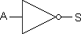

Y su tabla de verdad:

| Entrada A   | Salida A'   | 
| --- | --- | 
| 0   | 1   | 
| 1   | 0   | 

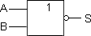

Una puerta **NOT** está construida a su vez de un solo transistor siguiendo la siguiente distribución:

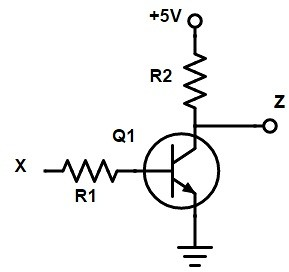

### Puerta NAND

La señal de salida de una puerta **NAND** se activa siempre que **no** se activen todas las de entrada. Equivale a combinar una puerta AND y una NOT. Equivale al inverso del producto lógico S = (AB')

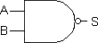

Y su tabla de verdad:

| A   | B   | AB'     |
| --- | --- | ------- |
| 0   | 0   | 1       |
| 0   | 1   | 1       |
| 1   | 0   | 1       |
| 1   | 1   | 0       |

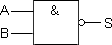

Su correspondencia para un circuito eléctrico sería la siguiente:

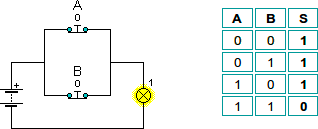

Y equivaldría a una puerta **AND** seguida de un inversor:

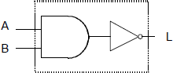

Una puerta **NAND** está construida por **dos transistores** con la siguiente distribución interna:

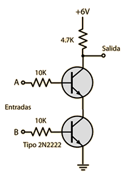

### Puerta NOR

En una puerta NOR la señal de salida se activa cuando todas las señales de entrada están inactivas. Equivale a combinar una puerta OR y una NOT. Equivale al inverso de la suma lógica S = (𝐴+B')

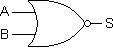

Su tabla de verdad:

| A | B | A+B'    |
|---|---|---------|
| 0             | 0             | 1                  |
| 0             | 1             | 0                  |
| 1             | 0             | 0                  |
| 1             | 1             | 0                  |

La correspondencia para un circuito eléctrico sería la siguiente:

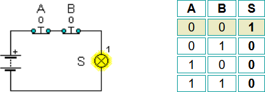

Y equivaldría a una puerta OR seguida de un inversor:

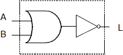

Una puerta **NOR** está construida a su vez de transistores usando alguna de las siguientes distribuciones internas (con uno o dos transistores):

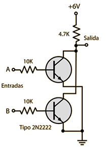

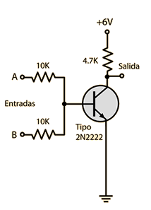

### Puerta XOR

En la puerta **XOR** su salida no se activa únicamente cuando sus dos entradas son iguales. Al mismo tiempo podemos observar que con entradas distintas se activará.

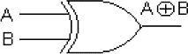

Su tabla de verdad:

| A | B | 𝑨 ⊕ B |
|---------------|---------------|--------------------|
| 0             | 0             | 0                  |
| 0             | 1             | 1                  |
| 1             | 0             | 1                  |
| 1             | 1             | 0                  |

Una puerta **XOR** a su vez está construida por las siguientes puertas lógicas o circuito equivalente:

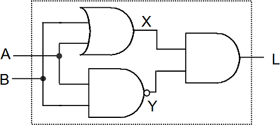

### Resumen

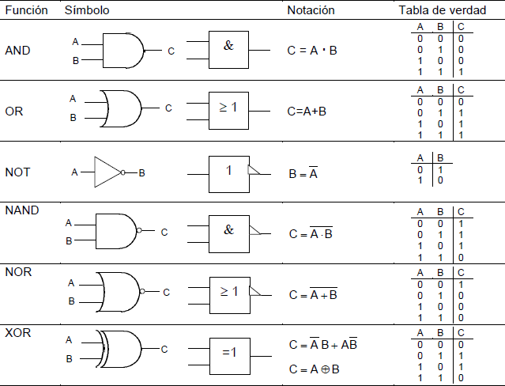

## Funciones lógicas

```note
Se denomina función lógica a la expresión que relaciona las variables de entrada y salida de un circuito digital que utiliza puertas lógicas.
```

La rama de las matemáticas que estudia este tipo de funciones se denomina **álgebra de Boole**.

Así por ejemplo, la función lógica de un circuito que opera construido por una simple puerta lógica inversora sería:

S = A'

Una función lógica más compleja es la que sigue

S = (A + B' + D) (B · D + A' · C)

En ella intervienen un total de cuatro variables lógicas de entrada relacionadas por diversas operaciones lógicas. El circuito en cuestión estará integrado por un total de 8 puertas lógicas.

Existe una serie de **reglas de simplificación** de funciones basadas en el álgebra de Boole y que nos ahorrará el uso de puertas lógicas superfluas, lo cual redundará en un menor consumo energético, tamaño y presupuesto.

**Ley conmutativa**: 

AB = BA

A + B = B + A

**Ley distributiva:**

A(B+C) = AB + AC

A + BC = (A+B) (A+C)

**Ley asociativa:** 

A(BC) = (AB)C 

A+(B+C)=(A+B)+C

**Operación suma lógica (OR)** *(el resultado es 1 si alguno de los sumandos es 1)*

1 + A = 1

0 + A = A A + A = A

A + A' = 1

**Operación producto lógico (AND)** *(el resultado es 0 si alguno de los elementos es 0)*

1 · A = A

0 · A = 0 

A · A = A

A · 𝐴' = 1

**Leyes de DeMorgan:**

A+B' = A' · B'

A·B' = A' + B'

A continuación, veremos tres casos de problemas a resolver usando diagramas de puertas lógicas o una función lógica determinada o una tabla de verdad:

1. Obtención de la función lógica de un circuito analizando su diagrama circuito lógico 
2. Obtención de la función lógica de un circuito a partir de su tabla de verdad.
3. Obtención del diagrama lógico de un circuito dada su función lógica.


### 1. Obtención de la función lógica analizando el diagrama

Analizar un circuito combinacional consiste en obtener la función de salida a partir de las entradas y las puertas a las que se encuentran conectadas.

Por ejemplo, analiza el siguiente circuito simple y obtén su función de la salida:

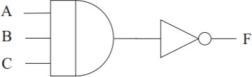

El circuito está constituido por dos puertas, una AND de tres entradas y un inversor. A la salida de la puerta AND se tiene el producto de las tres variables de entrada y al atravesar el inversor se obtiene la expresión final de F, que será:

𝐹 = A' · B' · C'

-   Analiza el diagrama de estos circuitos y obtén su función de la salida:

### 2. Obtención de la función lógica a partir de la tabla de verdad

Analizar un circuito combinacional consiste en obtener la función de salida a partir de las entradas y las puertas a las que se encuentran conectadas.

-   **Método minterm:**

    Consiste en tomar todas las combinaciones de las variables de entrada que provocan que la función lógica presente un **1** en la salida.

    Cada una de estas combinaciones de las variables de entrada será un sumando, constituido por el producto de todas las variables de entrada, en el que las variables estarán negadas cuando tomen el valor 0.

    La expresión de la función lógica será la suma de todos los productos equivalentes a las combinaciones de las variables de entrada que hacen que la salida sea un 1.

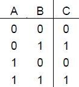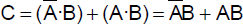

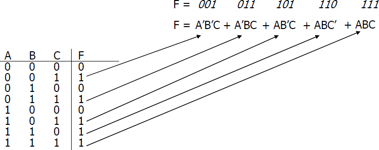

### 3. Obtención diagrama circuito lógico dada una función

Dada cualquier función lógica está podrá ser representada mediante puertas lógicas de una o más formas.

Es posible implementar una función lógica con cualquiera de estos conjuntos de puertas:

-   AND / OR / NOT
-   NAND
-   NOR

Para ello hay que seguir los siguientes pasos:

-   Dibujar las entradas y añadir puertas **NOT** para negar las variables necesarias
-   Realizar las multiplicaciones mediante puertas **AND**
-   Realizar las sumas mediante puertas **OR**

Obtén el diagrama del circuito de la función S = A' · B · C ( A' + D')

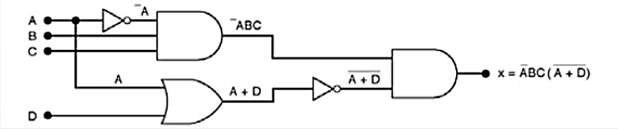

Obtén el diagrama del circuito de la función S = (𝐴 + B) (B' + C)

## Simplificación de funciones

La **simplificación de funciones** puede llevarse a cabo utilizando métodos de simplificación basados en el álgebra de Boole, siguiendo las reglas ya vistas o mediante un método basado en el **mapa de Karnaugh.**

Para aplicar la simplificación de la función lógica por Karnaugh primero es necesario realizar la tabla de la verdad del problema o tener la función lógica del circuito a simplificar. Dicho método se recomienda para sistemas con un número de variables de entrada comprendidas entre **2 o 5 variables**.

A continuación, seguiremos los siguientes pasos:

1.  Dibujar el **mapa de Karnaugh** según el número de variables
2.  Rellenar con los datos de la tabla de verdad
3.  Agrupar los *unos*
4.  Simplificar


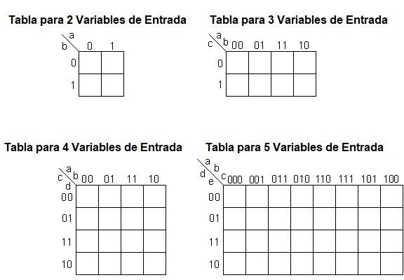


Paresamos los valores de la función que valen 1 (*minterm*) al **mapa de Karnaugh**

Formas de **agrupar** los unos en el mapa de Karnaugh:

Grupos de 2n elementos en los que la fila superior e inferior se consideran adyacentes, al igual que las columnas derecha e izquierda.

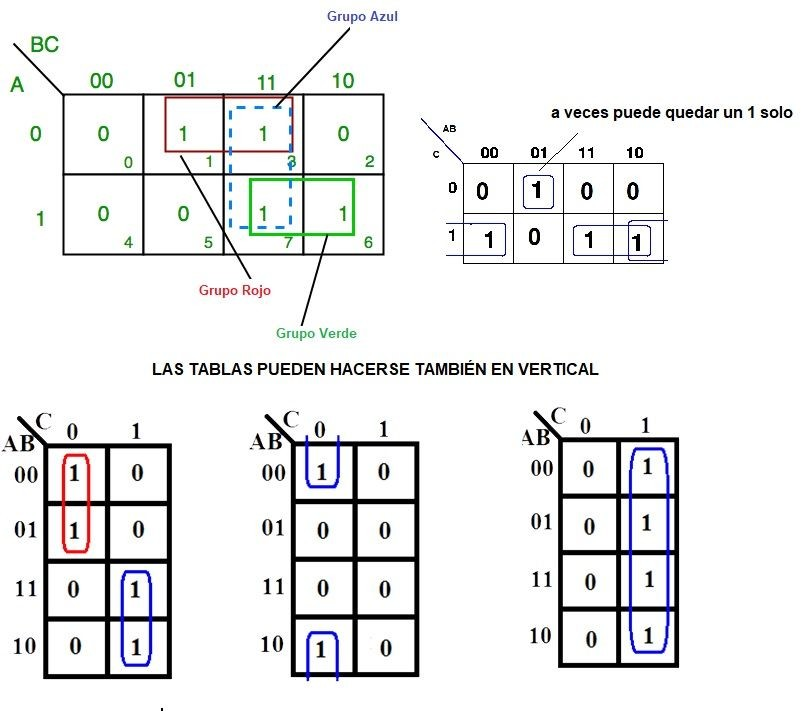


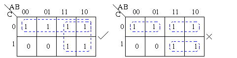

## Implementación con puertas universales

Para la implementación de circuitos lógicos se pueden utilizar cualquier tipo de puertas. Sin embargo, la tendencia más común es implementar un circuito empleando solamente un tipo de puertas. De este modo se abaratan costes.

```note
Es posible implementar cualquier función boolena solo con las puertas universales NAND o NOR.
```

Es decir, se puede implementar cualquier función lógica (con puertas AND, OR, etc) utilizando solo **puertas universales**. Este método de implementación solo se puede realizar con puertas NAND o NOR, ya que solo estas dos puertas lógicas son universales, es decir se puede realizar cualquier circuito lógico y sustituir cualquier puerta empleando únicamente este tipo de puertas.

Para ello aprovechando las leyes del Álgebra Booleana (DeMorgan) en el que una doble negación es igual a una afirmación A = A''

> Siempre podemos negar una expresión lógica dos veces, tantas veces como necesitemos y ésta quedará inmutable, si luego aplicamos el teorema de DeMorgan a una de las dos negaciones anteriores, conseguimos que un producto negado se convierta en una suma de variables negadas, o bien que una suma negada se convierta en un producto de variables negadas.

Para convertir un término producto o un término suma en una operación NAND o NOR debemos aplicarle al término una **doble negación**.

Para poder realizar una función determinada o un circuito digital utilizando solo puertas **NAND** o **NOR**, se deben aplicar el **teorema DeMorgan** tantas veces como sea necesario, hasta que toda la función se exprese en forma de productos o sumas negadas, respectivamente.
 