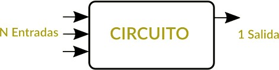

# UT2.4 Circuitos combinacionales y secunciales

## Circuitos digitales

Existen dos tipos de circuitos digitales, de los cuales veremos ejemplos utilizados a continuación:

- **Circuitos Combinacionales**: Los sistemas combinacionales están formados por un conjunto de compuertas interconectadas cuya salida, en un momento dado, esta únicamente en función de la entrada, en ese mismo instante.



- **Circuitos Secuenciales**: Son circuitos capaces de tener salidas no sólo en función de las entradas actuales, sino también de entradas o salidas anteriores, es decir son sistemas que tienen **memoria** de estados anteriores.  

    

## Circuitos combinacionales

Los **circuitos combinacionales**, están implementados en circuitos integrados que son circuitos formados principalmente por transistores, los cuales pueden estar acompañados de diodos, resistencias y condensadores, interconectados y ubicados en una pastilla de silicio.

De esta manera, los chips tradicionalmente se han clasificado según el número de puertas lógicas que puedan integrar.

Así, tenemos la siguiente **clasificación de chips**:

| **SSI** (Small Scale Integration)        | Chips con menos de 12 puertas |
|------------------------------------------|-------------------------------|
| **MSI** (Medium Scale Integration)       | Entre 12 y 99 puertas         |
| **LSI** (Large Scale Integration)        | Entre 100 y 10.000 puertas    |
| **VLSI** (Very Large Scale Integration)  | De 10.000 a 99.999 puertas    |
| **ULSI** (Ultra Large Scale Integration) | Entre 100.000 a 999.999       |
| **GSI** (Giga Scale Integration)         | 1.000.000 o más puertas.      |

```note
Un **circuito combinacional** es un circuito electrónico, en el que el valor de sus salidas dependen del valor de las entradas en ese mismo instante. 
```

Así pues, el siguiente circuito:


Es un circuito combinacional con *"m"* entradas y *"n"* salidas. Las salidas que se obtengan en un determinado instante van a depender de las entradas en ese preciso instante. Estos circuitos se caracterizan porque no almacenan información.


> Ejemplo de circuito **no combinacional**, por tener un bucle de realimentación.

### Sumadores 

```note
El sumadores un circuito combinacional que como su propio nombre indica realiza la adición de números binarios.
```

En muchas computadoras y otros tipos de procesadores se utilizan sumadores en las unidades **aritméticos lógicas**. También se utilizan en otras partes del procesador, donde se utilizan para calcular direcciones, índices de tablas, operadores de incremento y decremento y operaciones similares.

> En la suma binaria de los dígitos 1 + 1, el resultado es 0 y me llevo 1, que debo sumar en la columna siguiente y pudiéndose escribir 10, solamente cuando sea la última columna a sumar. A este bit más significativo de la operación de sumar, se le conoce en inglés como carry (acarreo), equivalente al “me llevo una” de la suma decimal.

#### Semisumador (Half adder) 

Un **semisumador** es un dispositivo capaz de sumar dos bits y dar como resultado la suma de ambos y el acarreo aparte (no tiene en cuenta acarreos previos).

La tabla de verdad correspondiente a esta operación sería:
 
|    |         |    |        |
|----------|-------|---------|-------|
| A        | B     | S       | C     |
| 0        | 0     | 0       | 0     |
| 0        | 1     | 1       | 0     |
| 1        | 0     | 1       | 0     |
| 1        | 1     | 0       | 1     |

- Donde **A** y **B** son los dos bits de entrada 
- **S** (sum) es la suma de los bits de entrada 
- **C** (carry) es el acarreo de la suma.

El diseño de semisumador utiliza una puerta **XOR** para S y una puerta **AND** para C


#### Sumador completo

El **sumador completo** permite sumar dos bits teniendo en cuenta los acarreos provenientes de la adición de bits anteriores; consta de dos semisumadores.

Presenta **tres entradas**, dos correspondientes a los dos bits que se van a sumar y una tercera con el acarreo de la suma anterior. Tiene dos salidas, el resultado de la suma y el acarreo producido.


Un **sumador completo** se puede representar esquemáticamente utilizando para ellos dos semisumadores (*Half adder*)


#### Combinación de sumadores

La combinación de sumadores da un **sumador con propagación de acarreo** y será aquel constituido por la combinación de varios sumadores completos en los cuales el acarreo de salida se conecta a la entrada de acarreo del sumador siguiente.

Por ejemplo, un sumador de acarreo serie **de 4 bits**, construido con 4 sumadores completos:


Sumador completo en serie **para 8 bits:**


(para ver la animación abrir <https://www.homofaciens.de/bilder/technik/computer_031.htm>)

### Multiplexores y codificadores 

#### Multiplexor 

Un **multiplexor** es un circuito combinacional al que entran varios canales de datos, y sólo uno de ellos, el que hallamos seleccionado, es el que aparece por la salida.

Es decir, es un circuito que nos permite *seleccionar* qué datos pasan a través de dicho componente.

Un multiplexor en un circuito combinacional con *2n* número de entradas, *n* entradas de selección y una salida de información.

Un multiplexor de un sistema de la vida real podría ser el sistema de riego de una granja con varias tuberías:


#### Demultiplexor 

En los **demultiplexores** hay un único canal de entrada que sale por una de las múltiples salidas, y sólo una. Las **entradas de selección "n"** definen cual es la línea de salida por la que debe salir el dato de entrada. Por lo que el número de salidas 2n, depende de "n" que es el número de entradas de selección.

Para denominar a los demultiplexores se hace referencia al número de entradas y salidas de datos que tiene; así un demultiplexor con una entrada de datos, tres de selección y 8 de salidas de datos se denomina multiplexor 1:8


#### Codificador 

Un **codificador** es un circuito combinacional integrado que tiene hasta **2n** entradas y **n** salidas y la función que desempeña es mostrar en la salida la combinación correspondiente al código binario de la entrada activada.


En la figura se muestra el circuito integrado combinacional correspondiente a un codificador con prioridad de 9 entradas y cuatro salidas (decodificador 9:4)


Dichos circuitos se integran en circuitos integrados en forma de pastilla de plástico con distribuciones parecidas a la siguiente:


#### Decodificador 

Un **decodificador** es un circuito combinacional, cuya función es inversa a la del codificador. Un decodificador dispone de **n** entradas y un número de salidas igual o menor a **2n**, actúan de modo que según cual sea la combinación de las variables de entrada se activa una única salida, permaneciendo el resto de ellas desactivada.

Por ejemplo, se tiene un decodificador de 2 entradas con 22=4 salidas, su funcionamiento sería el que se indica en la siguiente tabla:


En la siguiente imagen se muestra un decodificador de 2 entradas (A Y B) y 4 salidas (decodificador 2:4) así como una posible tabla de verdad. El valor de E activa (1) o desactiva (0) el decodificador


| DECIMAL | ENTRADA A | ENTRADA B | SALIDA Q3 | SALIDA Q2 | SALIDA Q1 | SALIDA Q0 |
|---------|-----------|-----------|-----------|-----------|-----------|-----------|
| 0       | 0         | 0         | 0         | 0         | 0         | 1         |
| 1       | 0         | 1         | 0         | 0         | 1         | 0         |
| 2       | 1         | 0         | 0         | 1         | 0         | 0         |
| 3       | 1         | 1         | 1         | 0         | 0         | 0         |

Otro ejemplo típico es el decodificador de BCD a decimal, cuya tabla de verdad sería:


El código **BCD** (Binary-Coded Decimal (BCD) es otro conocido estándar para representar números decimales en el sistema binario, en donde cada dígito decimal es codificado con una secuencia de 4 bits.

Un decodificador muy común es el de siete segmentos. Este circuito combinacional activa simultáneamente varias salidas, decodifica la información de entrada en BCD a un código de siete segmentos adecuado para que se muestre en un **display** de siete segmentos, es el procedimiento empleado en todas las calculadoras, los relojes digitales,...


## Circuitos secuenciales

```note
Un **circuito secuencial** es un circuito combinacional cuya salida depende de los valores actuales y pasados de las señales de entrada.
```

Se trata de circuitos en los que aparecen **lazos de feedback** (salidas del circuito pueden actuar como valores de entrada).

Los Componentes de un circuito secuencial son:

-   Señales de Entrada y Salida (señales binarias).
-   Una señal de Reloj (señal binaria de forma periódica).
-   Lógica combinacional
-   Almacenamiento (mantiene información sobre el estado actual).

### Latch AND-OR

Un **Latch** (cerrojo) es el elemento de memoria más sencillo que se podría crear. Su funcionamiento es sencillo y depende de dos entradas **Set** y **Reset**, utilizados para almacenar un dato o resetearlo.

Para almacenar un 1 binario o resetearlo podemos disponer de la siguiente forma:


###  Contador de unos

En un contador de unos la salida depende del valor que tengo en input (valor actual) y de los *unos* que llevo contados hasta el momento (valor pasado).


### Latch SR (Set Reset)

Un **Latch** SR es el elemento de **memoria** más sencillo que se utiliza. Consiste en un dispositivo de almacenamiento temporal de dos estados conocido como **biestable.**

Almacenan información en forma **asíncrona** (no necesitan reloj)

Es un biestable con un estado SET y otro de RESET (puesta a 1 y a 0) que pueden montarse utilizando puertas **NAND** o puertas **NOR**


#### Latch SR NOR


#### Latch SR NAND


#### Latch SR Sincronizado

Es una mejora de los biestables anteriores, siendo estos últimos dispositivos **síncronos** (cambian de estado únicamente en un instante especifico de una entrada de disparo denominado **reloj**)

Los cambios de salida se producen sincronizadamente con el reloj (**CLK**)


Los circuitos secuenciales básicos que funcionan también como unidades de memoria elementales se denominan multivibradores biestables (por tener dos estados estables –alto y bajo-), también conocidos como Flip-Flops.

Son capaces de memorizar un bit de información.

Existen varios tipos de Flip-flops y variaciones de estos que permiten realizar funciones específicas, dependiendo de la aplicación.

### Latch SR NOR Sincronizado

Un latch o biestable sincronizado se construye del Latch SR asíncrono visto en el punto anterior, añadiéndole dos puertas AND para **controlar la conmutación**.


## Circuito combinacional ALU

### ALU - 74LS181

La ALU es un **circuito integrado combinacional** con la capacidad de realizar diferentes operaciones aritméticas y lógicas, utilizando dos registros de n bits. Se pueden encontrar como circuitos independientes, y también como un bloque funcional dentro de los microprocesadores y microcontroladores.

Las operaciones matemáticas están codificadas en binario natural y en complemento a 2 para las restas, pero se pueden codificar en otros códigos como el BCD.

La ALU comercial más sencilla de implementar es el modelo **74LS181**, que es un chip de una ALU de 4 bits, que puede realizar hasta 32 funciones diferentes (16 lógicas y 16 aritméticas) y que trabaja con números binarios de 4 bits, aunque se pueden conectar en cascada para aumentar el número de bits.


El chip **74LS181** es una unidad aritmético lógica bit implementada como un circuito integrado TTL de la serie 7400.

Fue la primera ALU completa en un simple chip. Fue utilizado como el núcleo aritmético/lógico en los CPU de muchos minicomputadores históricamente significativos y en otros dispositivos de la época.

Aunque el 74181 es solamente un ALU y no un microprocesador completo, simplificó enormemente el desarrollo y la fabricación de computadores y de otros dispositivos que requirieron cómputo de alta velocidad durante finales de los años 1960 hasta principio de los años 1980, y todavía es referido como un diseño "clásico" de ALU.


-   El modelo **74LS181** tiene como **entradas**:
    -   Los cuatro bits del operando **AN**.
    -   Los cuatro bits del operando **BN**.
    -   Entradas de selección **SN**: para seleccionar la operación a realizar, entre 16.
    -   Entrada de acarreo **CN**: por si viene de un integrado con el resultado de menor peso.
    -   Entrada de control **M**: para seleccionar si la operación deber ser aritmética o lógica.
-   Y tiene las siguientes **salidas**:
    -   Los 4 bits del resultado **FN**.
    -   Una salida de comparación **A=B**
    -   Salidas de acarreo anticipado (**G,P**).

 


