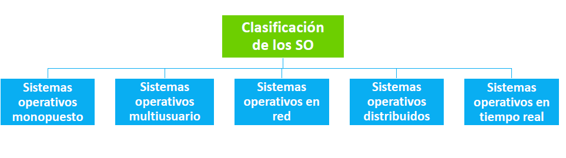
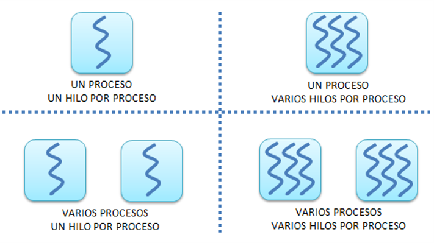
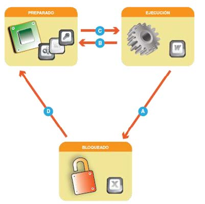
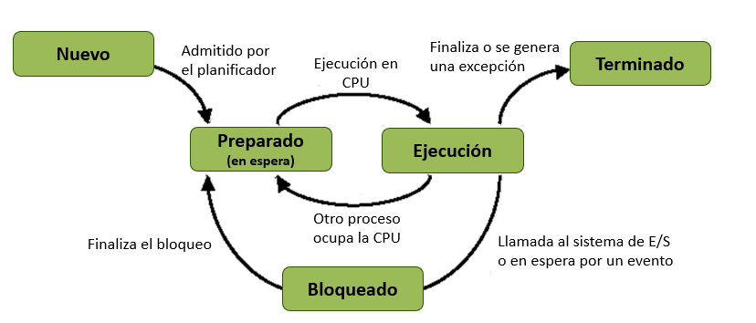
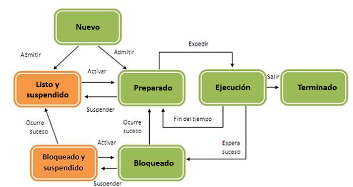
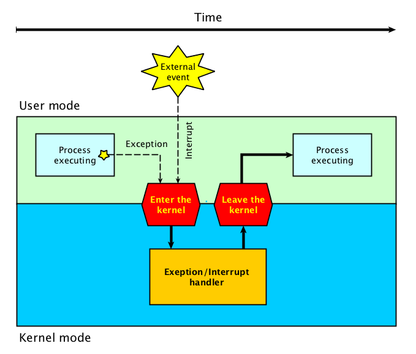
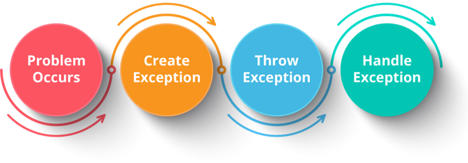

# UT3.1 Clasificación, evolución y funciones de un SO

## Sistema Operativo

```note
💡 El **Sistema Operativo (SO)** es el software básico de cualquier ordenador o computadora. Este software gestiona los recursos hardware del sistema informático y proporciona una base para la creación y ejecución del software de diferentes aplicaciones e interacción con el usuario.
```

Gracias al Sistema Operativo, el hardware se identifica, se reconoce y el Sistema Informático empieza a funcionar.

Gracias a los programas y aplicaciones del propio Sistema Operativo (SO), el usuario podrá realizar determinadas funciones específicas.

📌 El **Sistema Operativo** ofrece al usuario la forma de comunicarse con el  ordenador, bien mediante el teclado (**interfaz texto**) , bien mediante  otros dispositivos como el ratón, la pantalla táctil, etc. (**interfaz  gráfica**) . El SO es el medio que el usuario utiliza para realizar sus funciones en un sistema informático u ordenador.

## Clasificación de los SO

### Clasificación según su forma de gestión  

Se pueden clasificar los SO teniendo en cuenta la gestión que hacen del software y el hardware, y la forma en que el usuario los puede utilizar:



1.  **Sistemas operativos monopuesto** (SOMO): Un solo usuario utiliza a la vez el Sistema Operativo y sus recursos. Se denominan también de escritorio.

2.  **Sistemas operativos multiusuario** (SOMU): Permiten que varios usuarios puedan ejecutar a la vez distintos programas y hacer uso de los recursos de una máquina al mismo tiempo.

3.  **Sistemas operativos en Red** (SORED): Son aquellos que permite la interconexión de ordenadores a través de una Red para poder acceder a servicios, recursos, hardware y software.

4.  **Sistemas operativos distribuidos** (SOD): administran una colección de nodos distribuidos que trabajan en red, se comunican entre ellos y comparten recursos.

5.  **Sistemas operativos en tiempo real**: Son sistemas orientados a la respuesta en tiempo real, usados en sistemas críticos o cuando el tiempo de respuesta debe ser inmediato.

### Clasificación (según su forma de procesamiento) 

#### Sistemas Operativos Monopuesto (*SOM*)

   Los Sistemas Operativos Monopuesto (*SOM*) o de escritorio, son aquellos que se instalan para un uso personal o particular o en estaciones de trabajo. Solo un usuario utiliza dicho equipo en un momento determinado y tiene todos los recursos (tanto hardware como software) disponibles para él mismo.

   Los usuarios que inician sesión en estos equipos se denominarán usuarios locales y están dados de alta en el mismo equipo que utiliza dicho usuario.

#### Sistemas Operativos Multiusuario (*SOMU*)

   Un Sistema Operativo Multiusuario (*SOMU*) permite acceder de manera simultánea a más de un usuario a la vez en un mismo equipo. Por tanto, dicho SO será capaz de proveer de servicio y procesamiento a múltiples usuarios a la vez. En los SOMU existe un equipo principal. A dicho equipo podrían estar conectados varios terminales, en los que los usuarios realizan su trabajo.
   Existe un solo conjunto de memoria RAM y uno o varios discos duros dentro del mismo equipo, etc. 

   

   Supongamos que hay cinco usuarios utilizando este sistema y que cada uno ejecuta un programa distinto. El SO deberá trabajar mucho, ya que tendrá que ubicar en memoria cinco programas diferentes, e ir ejecutando rotativamente, en principio, instrucciones de cada uno de los programas para que a todos los usuarios se les dé una respuesta en el menor tiempo posible. La velocidad de respuesta por tanto será inferior a la que daría un SOMO o un sólo usuario. 
   De esta forma, todo se procesa en un ordenador principal. Primero se ejecutan unas instrucciones del primer programa lanzado por el primer usuario. Acto seguido, este programa se queda detenido para dar un poco de tiempo en la CPU al proceso lanzado por el segundo usuario. 
   Este proceso se repetirá secuencialmente para dar servicio a todos los programas de todos los usuarios.


#### Sistemas Operativos en Red (*SORED*)

   En los *SORED*, cada usuario tendrá su proprio ordenador personal con un SO, normalmente monousuario. Cada usuario encenderá su ordenador y establecerá comunicación con el ordenador principal que dispone del SORED. 

   Si partiéramos del mismo ejemplo anterior con cuatro usuarios ejecutando cada uno un programa diferente, dispondríamos de cinco CPUs, cinco bloques de memoria independientes, cinco o más dispositivos de almacenamiento, etc.

   

#### Sistemas Operativos distribuidos (*SOD*)

   Un sistema distribuido se define como una colección de equipos informáticos separados físicamente y conectados entre sí por una red de comunicaciones distribuida; cada máquina posee sus componentes de hardware y software de modo que el usuario percibe que existe un solo sistema (no necesita saber qué cosas están en qué máquinas). El usuario accede a los recursos remotos de la misma manera en que accede a recursos locales ya que no percibe que existan varios ordenadores, sino que solo es capaz de ver uno formado por todos los anteriores.

   Una ventaja fundamental de los sistemas distribuidos es que permiten aumentar la potencia del sistema informático, de modo que 100 ordenadores trabajando en conjunto, permiten formar un único ordenador que sería 100 veces más potente.

   

#### Sistemas Operativos en tiempo real

   Son sistemas en los que los procesos requieren un tiempo de respuesta prácticamente inmediato. Se utilizan en sistema críticos, en los que un tiempo de respuesta alto podría tener serias consecuencias, como sistemas médicos, sistemas aeroespaciales o en centrales energéticas.

  


## Evolución histórica de los SO

En general, podemos hablar de **cuatro generaciones** de sistemas operativos, relacionadas siempre con la evolución del hardware:

- Primera generación (1945-1955)
- Segunda generación (1955-1965)
- Tercera generación (1965-1980)
- Cuarta generación (1980-actualidad)

Los primeros Sistemas Operativos se denominaban **monolíticos** . La característica fundamental de estos sistemas operativos es que su software básico era prácticamente imposible de modificar una vez creado e instalado en un sistema informático.

### Primera generación (1945-1955)

En esta generación los ordenadores utilizaban las **válvulas de vacío** y tableros enchufables. Eran máquinas de gran tamaño de diseño único, programadas en lenguaje de máquina puro y complejas interconexiones con sus válvulas.

Llegaron de la mano de diseños de Howard Aiken y Jon Von Neumann. Sus operaciones se reducían a cálculos y operaciones matemáticas previamente programadas y no poseían sistema operativo como tal (programadas a mano).


### Segunda generación (1955-1965)

Se produce la aparición de los **transistores** lo cual reduce el tamaño de los ordenadores aumentando su eficiencia. En esta generación aparece el **procesamiento por lotes** que constaba de tres fases:

1.  Se introducían datos en las tarjetas perforadas, cinta magnética o soportes magnéticas.
2.  Se transportaba e introducía el soporte con datos en la computadora para que los procesara devolviendo resultados en otro soporte.
3.  Se lleva ese soporte a otro distinto a la computadora para la generación de los resultados.


Estas aún grandes computadoras (solían ocupar una habitación) se usaban primordialmente para cálculos científicos y de ingeniería, como la resolución de ecuaciones diferenciales parciales. Generalmente se programaban en lenguaje FORTRAN o en lenguaje ensamblador.


Aparecen los primeros sistemas operativos típicos como **FMS** (Fortran Monitor System) e **IBSYS** , el sistema operativo de IBM para la 7094

### Tercera generación (1965-1980)

La aparición de los **circuitos integrados** y de la **multiprogramación** supuso toda una revolución.

**Multiprogramación**

-   Varios trabajos en memoria: cuando uno espera para E/S, otro se puede ejecutar
-   Necesidad de planificación y protección

**Tiempo compartido (multitarea)**

-   Variante del anterior
-   Cambio rápido entre tareas: uso interactivo
-   Más complejo

Se redujo el tamaño y consumo de energía de los ordenadores gracias a la sustitución de transistores por **circuitos integrados** , aún más baratos, rápidos y fiables.

En esta generación destaca el IBM 360 como una máquina capaz de realizar cualquier tipo de cálculo, con su sistema operativo denominado **OS/360**.


MIT, Bell laboratories y General Electric favorecen el desarrollo de la “computadora de servicio publico” así como el Sistema Operativo para ella **MULTICS** (*Multiplexed information and computing service*)

Se produce un gran crecimiento de las **minicomputadoras**.

>  🔔 Ken Thompson, empezó a escribir un nuevo Sistema Operativo conocido como **UNICS**(*Uniplexed information and computing service*) su ortografía cambió más tarde por **UNIX**.


###  Cuarta generación (1981-actualidad)

Se produce la aparición de las **computadoras personales** . Se utilizan complejas técnicas de miniaturización de componentes electrónicos.

Se produce la aparición de los sistemas operativos modernos que conocemos en la actualidad. Mucho más fáciles de utilizar y con la creación de interfaces gráficas para una mejor comunicación entre máquina y usuario.


Aparición de los primeros ordenadores personales (PC): Apple II (1978) e IBM PC (1981)


La disponibilidad de una cada vez mayor potencia de cómputo, junto con una cada vez mayor potencia gráfica, y disponibilidad de discos de almacenamiento masivo en ordenadores personales, dio pie al crecimiento de la importante industria de software que conocemos hoy en día.

Los sistemas operativos que cobran gran popularidad inicialmente en este período (abuelos de los actuales) son **MS-DOS** y **UNIX**:

-   **MS-DOS** de Microsoft fue el primer sistema operativo creado para ordenadores personales en la década de los 80 y su sucesor fue Windows (inicialmente se ejecutaba encima de MS-DOS). Se trata de un sistema operativo grabado en un disco, de modo que se encontraba permanentemente activo y residente en memoria.

-   **UNIX** dominaba las estaciones de trabajo y servidores en red, así como máquinas de alto rendimiento.

En periodo cronológico:

-   **MSDOS** fue creado como tal en 1981 después de que Microsoft comprara *QDOS* modificándolo y haciéndolo compatible con *IBM-PC*.

-   En 1984 se lanzaba el primera ordenador Macintosh incluyendo su sistema operativo **MacOS** , cuyas características novedosas eran una GUI avanzada, multitarea y ratón.

-   A mediados de los años 80 nace la primera versión de **Windows** , un mero gestor de ventanas que corre sobre MSDOS, pero no es hasta Windows 95 que se considera un SO separado. La familia siguió creciendo con Windows 98, NT, Me, 2000, XP, 7, 8 y 10.

-   Respecto a **Linux** nace en 1991 creado por Linus Towards como una versión mejorada de Unix con licencia **GNU** . Hoy ha evolucionado a un entorno gráfico con gestores de ventanas como KDE, GNOME así como distintas distribuciones que se han ido haciendo famosas (Ubuntu, Debian, Suse, Fedora, Mint…)

-   Entre 2003-2007 surgen los SO para smartphones, a partir del primer iPhone con su SO **iOS** y le sigue Google con su SO Android, basado en Linux, que en la actualidad es el más utilizado en el mundo. Dichos SO se han diversificado a otros dispositivos como tabletas, wereables e IOT.

```note
> 📌 En esta generación aparecen las distintas variantes conocidas en la actualidad; los sistemas operativos **multiusuario**, los SO en **red**, SO **distribuidos**, SO móviles y SO en **tiempo real**.
```

### Cuadro resumen evolución histórica

Evolución histórica	


| **Generación** | **Fecha**       | **Tecnología**                           | **Sistemas Operativos**                                |
| -------------- | --------------- | ---------------------------------------- | ------------------------------------------------------ |
| **1ª**         | 1945-1955       | Tubos de vacío y Tableros                | S.O. no existía                                        |
| **2ª**         | 1955-1965       | Transistores y Sistemas por lotes        | FMS e IBSYS de IBM                                     |
| **3ª**         | 1965-1980       | Circuitos integrados y multiprogramación | OS/360, MULTICS, UNICS                                 |
| **4ª**         | 1980-actualidad | Computadoras Personales                  | MS-DOS, UNIX, WINDOWS, LINUX, SO. de Red, iOS, Android |


## Funciones y arquitectura

```note
El fin fundamental de todo Sistema Operativo es coordinar la utilización que se hace del hardware, dependiendo de los programas o aplicaciones que se estén utilizando.
```

Las partes de un SO se estructuran de la siguiente forma **jerárquica**:

- Aplicaciones
- Sistema Operativo
- Hardware

> La comunicación entre los distintos niveles se realiza mediante **interfaces**, que permiten que software y hardware interoperen sin necesidad de conocer los detalles de implementación.

Si dejamos al margen los antiguos sistemas operativos monolíticos, actualmente todos los sistemas operativos se organizan en **capas**.

En la actualidad la mayoría de los sistemas operativos son sistemas operativos en red y que trabajan en multitarea.

Estos sistemas operativos pueden funcionar en varias plataformas de hardware gracias a la **abstracción de hardware** uno de sus roles clave (como Linux, Windows, MacOS y Android)

La **jerarquía o arquitectura** de los sistemas operativos (SO) que veremos en unidades posteriores puede verse de la siguiente forma ampliada:


El sistema Operativo está formado por:
- El núcleo o kernel
- Los servicios
- La interfaz de usuarios y aplicaciones

Las **funciones** principales que realiza todo sistema operativo son las siguientes:

1. **Control y ejecución de programas**
   Para ello, acepta los trabajos, administra la manera en que se realizan, les asigna los recursos y los conserva hasta cerrarse.

2. **Administración de hardware, red y periféricos**
   Coordina y manipula los componentes internos y dispositivos conectados al equipo.

3. **Gestionar de ficheros, usuarios y permisos**
   Adjudica los permisos de acceso a los usuarios y a los archivos de un ordenador.

4. **Control de concurrencia y errores**
   Establece prioridades cuando diferentes procesos solicitan un mismo recurso. Gestiona errores de hardware y de datos.

5. **Administración de memoria (procesos)**
   Asigna memoria a los procesos y gestiona su uso.

6. **Control de seguridad**
   Proporciona seguridad tanto para los usuarios como para el software y la información almacenada en los sistemas.


## Gestión de los recursos	

### La Memoria

La gestión de la memoria es una de las funciones más importantes del sistema operativo, ya que garantiza que los programas y dispongan del espacio necesario para ejecutarse correctamente sin interferir entre ellos.

La parte del sistema operativo que gestiona la memoria se denomina **administrador de memoria**.

```note
💡  El **administrador de memoria** es una parte crítica del sistema operativo que se encarga de reservar espacio en la memoria para los nuevos procesos (programas o servicios) y liberarla cuando estos ya no se sigan utilizando así como el intercambio de datos entre memoria y almacenamiento secundario.
```

En los sistemas operativos modernos, que son **multitarea**, se ejecutan varios programas al mismo tiempo. Esto hace que la gestión de memoria sea muy importante, ya que el sistema debe decidir cómo repartir los recursos entre todos los procesos activos de forma eficiente y segura.

```note
Cuando un programa se abre, se carga en memoria y entonces se convierte en lo que denomina como un **proceso**.
```

El **administrador de memoria** proporcionará por tanto protección y **uso compartido** , es decir, debe proporcionar un espacio de memoria para cada proceso que lo necesite y controlar que ningún otro proceso trabaje en zonas de memoria que no le correspondan produciendo colisiones o inconsistencias en los datos. Un error o colisión de zona de memoria provocará un fallo en cascada del SO provocando un cuelgue del sistema.

La memoria se divide a su vez en particiones de tamaño fijo o variable, a las que se asigna cada proceso según las necesidades del sistema y según se van cargando.

Los errores de gestión de memoria, o en espacios protegidos por parte del SO, suelen derivar en cuelgues graves del sistema que dan como resultado los famosos BSOD (Blue Screen of The Dead) en SO como Windows o kernel panics en Linux.


Un programa cargado en memoria se organiza en varias zonas con diferentes propósitos:


- Código (text): instrucciones ejecutables
- Datos estáticos/globales: variables permanentes.
- Heap: memoria dinámica, crece hacia arriba.
- Pila (stack): variables locales, argumentos y direcciones de retorno; crece hacia abajo desde las direcciones altas. 

Entre heap y stack queda un espacio libre para evitar que colisionen.

### Memoria virtual

Todos los dispositivos cuentan con una determinada cantidad de memoria RAM, pero esta es limitada y muchas veces resulta insuficiente para los requerimientos del sistema. Además en varios dispositivos si una app o programa lleva tiempo sin usarse se envía a disco para ahorrar batería.

```note
La memoria virtual es una técnica de gestión de la memoria que permite que un sistema operativo disponga, tanto para el software como para sí mismo, de mayor cantidad de memoria que la que está disponible físicamente.
```

Fotheringam diseño este método en 1961 pensando en la posibilidad que, al cargar un programa en memoria, este fuera muy grande y así que creó una técnica de forma que solo una parte del proceso que se estaba ejecutando estaría en memoria, y el resto quedaría en los discos de almacenamiento secundario, en un sitio llamado **espacio de intercambio**.


> Cuando se cargan muchos procesos a la vez el equipo se ralentiza puesto que tiene que pasar mucha información del disco a memoria RAM y los sistemas de almacenamiento secundario, que son mucho más lentos que la memoria.

En teléfonos móviles y tablets, la memoria RAM suele ser más limitada en comparación con los  PCs. Android, iOS y otros sistemas operativos móviles aprovechan la memoria virtual para manejar aplicaciones en segundo plano sin que consuman toda la RAM disponible. 

Además, en dichos dispositivos es crucial mantener el consumo de **batería** bajo, con lo cual los procesos que no se utilizan por demasiado tiempo se guardan en la memoria virtual.


### El procesador (procesos)

Un **proceso**, tal y como vimos anteriormente, consiste en un programa en ejecución gestionado en memoria por el administrador de memoria y que se va a mandar a ejecutar al procesador o CPU.

```note
Cualquier programa que se esté ejecutando en un ordenador se convierte en un proceso, ya que desde ese momento el programa, denominado **proceso** , se puede **ejecutar** , se pueda **detener** o se puede **bloquear** , entre otras muchos estados.
```

Existen dos tipos de procesos:

-   **Procesos de usuario** : creados por cualquier usuario del sistema y que se ejecutan en **modo usuario**. Se tiene acceso limitado a los recursos del sistema.
-   **Procesos del Sistema Operativo** : creados por el SO o sus servicios y que se ejecutan en **modo privilegiado** o **modo supervisor**. Los procesos se ejecutan teniendo acceso directo a toda la memoria y recursos hardware de la máquina.


Durante la ejecución de un proceso, este **compite** con el resto de los procesos que se están ejecutando de forma concurrente en el sistema por el uso de los recursos hardware (ya sea la CPU o la gráfica)

```note
El reparto de los recursos del sistema entre los distintos procesos y su ejecución **concurrente** se conoce como **multiprogramación** y es gestionada en el **núcleo o kernel** del sistema operativo.
```

>   Un programa no es un proceso, sino que se convierte en tal en el momento en que se pone en **ejecución**. La aplicación Visual Studio, por ejemplo, cuando no se está ejecutando no deja de ser un archivo sin más. Y cuando se ejecuta, el archivo *vscode.exe *sigue estando almacenado donde estaba originalmente. Al ejecutarse el programa, las instrucciones necesarias pasan a la memoria principal y ser procesadas por la CPU.

####	Núcleo o kernel del SO

```note
>  La parte crítica de un sistema operativo encargada de gestionar los recursos básicos de un SO se denomina **núcleo** o **kernel**.

```

El núcleo o kernel se encarga del manejo de las interrupciones, la asignación del trabajo al procesador y el proporcionar una vía de comunicación entre los distintos procesos.

- El núcleo tiene un submódulo denominado “**planificador**” el cual se encarga de asignar tiempo del procesador a los procesos, de acuerdo a una cierta política de planificación que varia de un sistema operativo a otro. El **administración de memoria** visto anteriormente también se controla desde el núcleo del SO.
- La administración de **memoria** vista anteriormente también se controla desde el núcleo del SO.


###  Gestión E/S

La otra tarea fundamental de cualquier sistema operativo es la gestión de cualquier **unidades periféricas** (ya sean de *entrada*, *salida*, *mixta* o de *comunicación*) que se conecten al ordenador o dispositivo.

> Recordemos que la comunicación de los diferentes periféricos de E/S se lleva a cabo a nivel de hardware a través del chipset de la placa base, el cual comunica dichos componentes con la CPU y la memoria a través de buses internos.


```note
>  El sistema operativo se encarga de atender todas las particularidades de los dispositivos de E/S como su velocidad de operación, una técnica es la salida es el uso de **spoolers,** también llamadas colas.
```

Los datos de salida se almacenan de forma temporal en una cola situada en un dispositivo de almacenamiento masivo (**spool**) hasta que el dispositivo periférico requerido se encuentre libre, para evitar que el programa quede retenido porque el periférico no esta listo.


## Interfaces de usuario

```note
Una **interfaz de usuario (UI)** es el punto de interacción entre el usuario y un sistema o dispositivo, a través del cual una persona puede comunicarse y controlar el software o hardware. 
``` 

Su principal objetivo es facilitar el uso y la interacción con un sistema de manera eficiente y con diversos objetivos según quien la esté utilizando. 

### Tipos de interfaces

- **Interfaz tipo gráfico (GUI)**. Hoy en día, la mayoría de los sistemas operativos utiliza medios de comunicación entre máquina y ordenador de  tipo gráfico.

- **Interfaz tipo texto (CLI)**. La primera forma de interacción con ordenadores. Las CLI utilizan comandos de texto para ejecutar funciones.

- **Interfaz mixta** . Las interfaces mixtas combinan elementos gráficos y de texto, ofreciendo una experiencia híbrida.

- **Interfaz natural (NUI)**. Las interfaces naturales utilizan voz, biometría o realidad virtual/aumentada para una interacción más natural con la tecnología.


### Interfaces del programador

Los programadores tienen a su vez acceso a tipos específicos de interfaces llamadas API para comunicarse con el SO o con un programa a través de dicho SO.

Un **SDK** (Software Development Kit) es un conjunto de herramientas, bibliotecas, documentación y ejemplos de código que permiten a los desarrolladores crear software o aplicaciones que interactúan con un sistema operativo, hardware o plataforma específica. Se utiliza como un medio de comunicación entre las aplicaciones creadas por el desarrollador y el sistema operativo moderno, facilitando la integración con sus características y funciones.


Los SDK (Software Development Kit) van relacionados con la definición de API (Application Programming Interface) y a veces son conceptos que se confunden:

- Un **SDK** es un un conjunto completo de herramientas, documentación, ejemplos de código y entornos de desarrollo que permiten a los programadores crear aplicaciones para una plataforma o sistema específico.

- Una **API** (Application Programming Interface): Una API es una interfaz que permite la comunicación entre diferentes piezas de software. La API actúa como un intermediario, facilitando el acceso a determinadas funcionalidades.


##  Servicios y procesos

### Procesos

Los **procesos** son otro importante concepto manejado por el sistema operativo, que veremos en la próximas unidades en profundidad:

```note
Un **proceso** son el conjunto de instrucciones de un programa que se encuentra en ejecución en ese momento (van a procesarse en la CPU)
```

Los **procesos** son gestionados por el sistema operativo y están formados por:
- Las **instrucciones** de un programa destinadas a ser ejecutadas por el microprocesador.
- Su **estado de ejecución** en un momento dado, esto es, los valores de los registros de la unidad central de procesamiento para dicho programa.
- Su **memoria de trabajo**, es decir, la memoria que ha reservado y su contenido.

### Servicios

Para llevar a cabo las funciones descritas anteriormente un Sistema Operativo hace uso de un tipo de aplicaciones especiales denominadas servicios (o demonios) funcionando en segundo plano.

```note
Un **servicio** (o demonio) es un tipo de proceso cargado por el sistema operativo que normalmente se ejecuta en segundo plano y que permite llevar a cabo funciones básicas de éste.
```

Muchos de los servicios (también llamados demonios o daemons en Linux) son esenciales para el funcionamiento de muchas de las aplicaciones y del propio Sistema Operativo.

Si estos programas, es decir, los servicios, no estuvieran ejecutándose, muchas aplicaciones no funcionarían o algo tan frecuente como el acceso a Internet no sería posible.


### Diferencias entre servicios y procesos:

Un **proceso** es la instancia en memoria de un programa ejecutable (un archivo ejecutable .exe o binario) que se ejecuta. Una aplicación puede tener varios procesos que se ejecutan simultáneamente. Por ejemplo, algunos navegadores modernos como Google Chrome o Firefox, ejecutan varios procesos a la vez (cada uno de los cuales representa una pestaña).

Un **servicio** es también un proceso, pero que se ejecuta en segundo plano y no interactúa con nosotros de forma directa como un programa o aplicación. En sistemas Windows, los servicios casi siempre se ejecutan como una instancia del proceso *svchost*, también identificado como host de servicio (En Linux systemd) 

## Gestión de procesos

### Hilos (threads)

```note
💡 Se denomina **hebra** o **hilo** a un punto de ejecución cualquiera en un proceso. Un proceso tendrá siempre una hebra, en la que corre el propio programa, pero puede tener más hebras.
```

Un proceso clásico es aquel que solo posee una **hebra**.

[^1]: Si por ejemplo ejecutamos un procesador de textos como Word, con un solo documento abierto, el programa Word convertido en proceso estará ejecutándose en un único espacio de memoria (con acceso a archivos, galerías de imágenes, corrector ortográfico..). Este proceso, de momento, tendrá una hebra. Si en esta situación, sin cerrar Word abrimos un nuevo documento, Word no se volverá a cargar como proceso. Simplemente el programa, convertido en proceso, tendrá a su disposición **dos hebras **o hilos diferentes, de tal forma que el proceso sigue siendo el mismo (el original). Word se está ejecutando una sola vez y el resto de documentos de texto que abramos serán hilos o hebras del proceso principal, que es el propio procesador de textos.



### Estados y transiciones de los procesos	

Existen **tres estados** para los procesos (o hilos correspondientes):

- **En ejecución:** El procesador está ejecutando instrucciones del proceso cargado en ese momento (tiene su atención y prioridad)

- **Preparado, en espera o activo:** El proceso está preparado para ser ejecutado y esperando su turno para ser atendido por la CPU.
    
- **Bloqueado:** El proceso ha entrado en un estado de bloqueo que puede darse por causas múltiples (acceso a un mismo fichero, errores..)
    
    [^2]: En algunas biografías pueden utilizarse también los estados **nuevo** y **terminado** .
    
    
Una vez que un programa se ha lanzado y se ha convertido en proceso, puede atravesar varias fases o **estados** hasta que termina.



Los cambios de estado en los que se puede encontrar un proceso es lo que se denomina **transiciones**:

- **Transición A**. Ocurre porque el proceso que está en ejecución necesita algún elemento, señal, dato, para poder continuar ejecutándose.

- **Transición B**. Ocurre cuando un proceso ha utilizado el tiempo asignado por la CPU y deja paso al siguiente proceso.

- **Transición C**. Ocurre cuando el proceso que está preparado pasa a estado de ejecución en la CPU. 

- **Transición D**. Ocurre cuando el proceso pasa a preparado, es decir, al recite la orden o señal que estaba esperando en estado de bloqueado.






### Bloque de control de procesos (BCP)	

```note
💡 La información de un proceso que el sistema operativo necesita para controlarlo se guarda en un **bloque de control de procesos o BCP**. 
```

En el **BCP** cada proceso almacena información como:


| BCP básico de un proceso |
| ------------------------ |
| Nombre del proceso       |
| PID del proceso y PPID   |
| Estado del proceso       |
| Prioridad del proceso    |
| Ubicación en memoria     |
| Tamaño en memoria        |
| Recursos                 |

Los procesos se marcan en su creación con un número único llamado identificador de proceso (**PID**). Salvo el proceso raíz, todos los procesos llevan dos números:
- El *PID* que lo identifica a él.
- El *PPID* que identifica a su padre.
Después de que un proceso genera un hijo, ambos continúan ejecutándose desde el punto en el que se hizo su creación.


## Interrupciones y excepciones

Las interrupciones y las excepciones son mecanismos que tienen los sistemas operativos para gestionar situaciones que requieren atención inmediata o especial, interrumpiendo el flujo normal de ejecución de las instrucciones de un programa. 

A pesar de que ambos conceptos están relacionados con la alteración del flujo de un programa, se diferencian tanto en su origen como en la forma en que son manejados. 

### Interrupciones

```note
Una **interrupción** es una señal que obliga al SO a tomar el control del procesador para estudiarla y tratarla.
```

Las interrupciones son un mecanismo que permite que el hardware comunique eventos y es fundamental en sistemas multitarea y en el manejo de dispositivos de entrada/salida. A cada momento se producen miles de interrupciones manejadas con total normalidad por el SO.

Por ejemplo, si un usuario pulsa una tecla en un teclado, o si un paquete de datos llega a una tarjeta de red, se genera una interrupción de hardware. El sistema operativo detiene temporalmente la ejecución del programa actual, gestiona el evento (por ejemplo, leyendo el valor de la tecla pulsada), y luego vuelve a continuar la ejecución del programa en el punto en que fue interrumpido, dando la impresión de que todo funciona a la vez (multitarea).




### Excepciones

```note
💡 Una **excepción** es un evento que ocurren durante la ejecución de las instrucciones de un programa, como resultado de una operación que genera una condición anómala o un **error**.
```

A diferencia de las interrupciones, que son provocadas por señales externas, las excepciones son generadas internamente por el procesador como respuesta a situaciones inesperadas durante la ejecución de un programa o aplicación (que puede ser el propio SO).

Es el proceso o el propio programa el que intenta llevar a cabo el manejo y control de dicho error abortando su ejecución.





### Comparativa entre interrupciones y excepciones


|                      **Interrupciones**                      |                       **Excepciones**                        |
| :----------------------------------------------------------: | :----------------------------------------------------------: |
| Las interrupciones se presentan inesperadamente y sin relación con el proceso en ejecución. Son parte intrínseca del funcionamiento de cualquier sistema. | Las excepciones se producen como efecto directo de una instrucción concreta del proceso que se esta ejecutando. |
| El SO atiende la interrupción y a continuación continúa con al ejecución del proceso con la que estaba. | Aparecen por defectos de programación y errores graves. Son fallos no recuperables. |
| Si se producen varias interrupciones simultáneamente, sólo se tratará una, quedando bloqueadas el resto. |          Las excepciones se producen de una en una.          |


