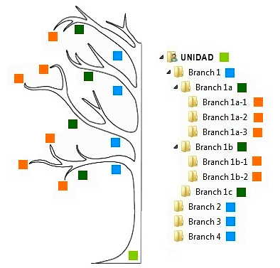

# UT3.1 Gestión del almacenamiento en los SO

## Contenido y debate introductorio

<iframe width="560" height="315" src="https://www.youtube.com/embed/V7qg1WGSdvc" title="YouTube video player" frameborder="0" allow="accelerometer; autoplay; clipboard-write; encrypted-media; gyroscope; picture-in-picture; web-share" allowfullscreen></iframe>

## Unidades de almacenamiento secundario

Al hablar de unidades de almacenamiento nos referimos a la memoria secundaria de almacenamiento permanente de la información.

Todos los sistemas operativos se caracterizan por tener una estructura jerárquica de **almacenamiento** de información en directorios de **unidades lógicas**.

💡  La información se guarda en **unidades de almacenamiento** y se representa en forma de árbol de directorios conteniendo ficheros o archivos. 

La estructura de árbol comienza desde la propia unidad de almacenamiento física en la que se van a almacenar los datos. Esta puede ser un disco duro, un pendrive, etc.



```note
💡 Una **unidad física** es un dispositivo de almacenamiento de datos o pieza de hardware independiente.
```

```note
💡 Una **unidad lógica** (o volumen) es una parte de un disco que el sistema operativo reconocerá como una unidad de disco independiente.
```

Las unidades lógicas de un sistema, por tanto, pueden ser distintas de sus correspondientes unidades físicas.

Las unidades **lógicas **utilizan una *nomenclatura* específica dependiente del sistema operativo utilizado:

-   Sistemas **Windows**: Letras individuales para las unidades lógicas: ***A,C,D,E***..
-   Sistemas **Linux**: **hd** o **sd** (si es un disco *IDE* o *SATA*) seguido de:
-   Una letra para las unidades físicas: *sda, sdb, sdc*
-   Un número para las lógicas (particiones que veremos más adelante)
    *sda1, sda2, sdb1 \| hda1..*


Listado en un supuesto equipo:

- **F**\| (*hda*): Unidad CD-ROM
- **G**\| (*hdb*): Unidad DVD-ROM
- **H**\| (*sdd*): Lector tarjetas
- **I**\| (*sde*): Memoria USB 3.0
- **C**\| (*sda*): Disco SSD 1
- **D**\| (*sdb*): Disco duro 1
- **E**\| (*sdc*): Disco duro 2


## Ficheros

```note
💡 Un **fichero** o **archivo** es un mecanismo de abstracción que sirve como unidad lógica de almacenamiento de información en forma de bytes.
```

Un **fichero** agrupa una colección de datos relacionadas entre sí y definidas por su creador, que son sus **registros** o sus **campos**.


A todo fichero además le corresponde un **nombre** y **ruta** únicos que lo identifiquen entre los demás ficheros.

### Objetos en una unidad

La forma de almacenar información de forma estructurada en las diferentes unidades de almacenamiento puede tener los siguientes objetos lógicos (u elementos):

- **Ficheros Regulares**: son los ficheros ‘normales’ que contienen datos, es decir almacenan de información de cualquier tipo (Ej. un archivo creado con Word, otro archivo creado con el editor de notas, etc)
    
- **Directorio** (o carpeta): son otro tipo de fichero especial ficheros que sirven únicamente para almacenar archivos regulares u otros directorios.
    
    En sistemas Linux también existen los denominados **ficheros de dispositivo,** debido a que en ese sistema existen dispositivos cuya *E/S* se realiza como si fuesen ficheros y por lo tanto se les asocia ficheros especiales para simplificar y hacer más transparente el intercambio de información con dichos dispositivos.

### Características

Cada fichero o archivo tiene las siguientes **características**:

-   Un nombre (y extensión) junto sus datos.
-   Unos **atributos** adicionales (varían mucho entre SO).

Algunos de los posibles **atributos** de un fichero o archivo pueden ser:

  -  *Propietario:*  propietario actual.  
  -   *Permisos:* (de solo lectura o lectura/escritura) .
  -   *Protección:* quién debe tener acceso y de qué forma.  
  -   Si el fichero es *oculto*.
  -   Fichero del *sistema*.
  -   Su tipo de contenido: Ascii o binario.
  -   Fecha y hora de creación del fichero.
  -   Fecha y hora de modificación del fichero.
  -   Fecha y hora del último acceso al fichero.
  -   Tamaño actual: número de bytes del fichero.

### Tipos de ficheros

-   **Ejecutables**: Pertenecen a los programas o apps instalados y están creados para ejecutar las instrucciones que contienen. Específicos para cada SO o arquitectura.
    
-   **No ejecutables**: Almacenan información y deben de ser utilizados con ayuda de algún programa o aplicación para poder consultar o modificar su información. Existen diferentes categorías de ficheros no ejecutables:
    
    -   Sistema: Los programas encargados del sistema operativo. No es recomendable moverlos, editarlos o borrarlos (*ini, inf,msi,…,dll,..sh…)*
    -   Audio (*mp3, wma, cda,…)*
    -   Video (*mp4, avi, mpg, mkv…)*
    -   Comprimidos *(rar, zip, arj, tar, gz,…)*
    -   Imágenes *(jpg, png, gif, raw, tif,…)*
    -   Imágenes cd-dvd *(iso, img, cue, dmg,…)*
    -   Formatos propietarios *(doc, xls, pps, psd, odt,…)*

## Organización del espacio en disco

```note
Se puede definir el disco duro (*HDD*) de cualquier dispositivo como el soporte **electromagnético** que almacena permanentemente la información.
```

```note
Los discos SSD y las memorias usb utilizan **memoria flash** y los DVDs y CDs son un de tipo de **almacenamiento óptico** .
```

Al ser dispositivos de almacenamiento <u>no volátil</u>, no pierden la información si se les deja de suministrar corriente eléctrica.

Cualquier tipo de **disco de almacenamiento** *(HDD, SSD, DVD..)* consta de una estructura física y otra lógica como ya hemos intuido:

- La **estructura física** se crea cuando se construye el disco en la fábrica y es el fabricante quien indica sus características según el dispositivo que se trate (como número de caras, sectores del disco…)
- La **estructura lógica** se crea cuando un usuario procede a **formatear** o dar formato al disco.

### Formateo 

```note
💡 La operación de **dar formato** a una unidad consiste en aplicar un proceso por el que se prepara la superficie o elementos físicos de un disco para recibir datos por primera vez, o en caso de existir, borrarlos para partir de cero.
```

El efecto que causa la acción de formatear cualquier unidad es perder de forma definitiva la información que contuviese, solo recuperable bajo ciertas condiciones.

Para asegurarse que esta información no pueda recuperarse por ningún método, puede aplicarse un **formateo a bajo nivel** repetido varias veces. Se trata de un proceso más lento que reestablece el dispositivo a salido de fábrica.

Las operaciones de organización del espacio de disco se llevan a cabo mediante herramientas de formateo o particionado (dividir una unidad física en unidades lógicas) del SO o con herramientas específicas:

-   **MS-DOS** y versiones de Windows hasta *Windows ME*: se particionan con el comando *fdisk* y se formatean con *format*.
-   **Windows modernos** (*NT, XP, Vista, 7, 8 y 10*): incluyen herramientas propias para formatear y particionar los discos como el administrador de discos.
-   **Unix/Linux** y sus distribuciones: utilizan herramientas como *fdisk*, *parted* o del entorno gráfico como Gparted.    
-   Otras utilidades: como Partition Wizard, Partition Magic, Partition Comander, la utilidad de discos en sistemas **Mac** y muchas más.

💡 No confundir **formateo** con **particionado**. La primera borra todos los datos o prepara una unidad nueva mientras que la segunda organiza en distintas unidades lógicas los datos como veremos más adelante.


###  Estructura física HDD

La **estructura física** de un disco duro tiente: platos, caras, cabezas, pistas y sectores:

-   **Caras:** Cada disco puede tener una o dos caras. Hoy en día todos tienen como mínimo dos caras. Dependiendo el nº de **platos** que el disco el nº de caras oscila entre 4 y 30.
-   **Pistas**: Las pistas son los círculos concéntricos en los que se divide  cada cara. Generalmente se habla de **cilindros,** ya que los discos tienen más de un plato. Un cilindro sería al conjunto de pistas iguales de todos los platos.
- **Sectores o bloques físicos:** es la cantidad de información que se lee o se escribe de una vez en una sola operación de lectura (normalmente 512kb)
- Se llama **clúster** a un conjunto contiguo de sectores. La información es leída y escrita a su vez por **cabezas** de lectura/escritura.

  

💡  Un **sector del disco** es la sección de la superficie del mismo que corresponde al área encerrada entre dos líneas radiales de una pista.

> Pueden almacenar una cantidad fija de bytes, generalmente suele ser de 0,5 KB hasta 64 KB, pasando por todas las potencias de 2. Esto se puede configurar al formatear una unidad de almacenamiento, en la opción de tamaño de unidad de asignación.


### Estructura física SSD

```tip
Las memorias de estado sólido (flash) almacenan los datos en una matriz de celdas de memoria mediante transistores de puerta flotante. La velocidad del almacenamiento flash es lo que le dio el nombre: escribe datos y realiza operaciones de I/O aleatorias a la velocidad del flash.
```

Dicho almacenamiento se lleva a cabo usando dos tipos de tecnología: la memoria *NAND* y la memoria *NOR*, denominadas así por el tipo de puerta lógica que usan los transistores que forman parte de estos chips de memoria.


### Estructura lógica

```note
En cuanto a la **estructura lógica**, cuando se compra un disco, este ha sido sometido en fábrica a un formateo de bajo nivel, listo para aplicar ahora otro formateo lógico.
```

En el caso de un disco duro el SO almacena la información teniendo en cuenta la estructura física y lógica del disco. La estructura lógica de un HDD es la siguiente:

1. Sector de arranque o boot *(MBR)*.
2. Tabla de asignación de particiones y tabla maestra de archivos  (*FAT,NTFS,ext*)
3. Directorio raíz (C:\\ o **/**)
4. Área de datos (ficheros y directorios).


#### Sector de arranque

```tip
El **Sector de arranque** es el primer sector de todo disco duro (*cabeza 0, cilindro 0, sector 1*). En él se almacena la tabla de particiones y un pequeño programa de inicialización llamado **MBR** (Master Boot Record) o registro maestro de arranque. Se carga desde el BIOS.
```

El *MBR* es el encargado de leer la tabla de particiones y ceder el control del arranque al sistema operativo que tengamos instalado. Si no existiese partición activa, disco o estuviera dañado mostraría un error de “sistema operativo no encontrado”.


#### Tabla maestra de archivos

En cada partición existe una tabla maestra de asignación de archivos llamada generalmente **FAT** (*File Allocation Table* ). La FAT es un índice con los datos contenidos en el disco duro. En ella se indica dónde comienza cada archivo o fichero, donde termina, cuántos sectores ocupa, etc.

En realidad cuando se borra un archivo no se está borrando como tal (a menos que se formatee). En su lugar lo que se hace es borrar su entrada del índice de la tabla de asignación de archivos (lo que viene a ser lo mismo, al final). Al no aparecer en el índice no se podrá encontrar, pero existen herramientas para intentar recuperar dicho archivo que todavía existe físicamente grabado, siempre y cuando no se sobrescriba el sitio en el que estaba grabado (y que ahora figura como vacío en la tabla).


💡 *Nota*: En la actualidad en vez de FAT se utilizan los sistemas *NTFS* en Windows o *Ext* en Linux como veremos más adelante.


### Particionado

```note
Las **particiones** de disco sirven para delimitar el espacio del disco que estemos utilizando de forma lógica.
```

Esto quiere decir que podemos dividir un disco duro en, por ejemplo, dos particiones (dos unidades lógicas dentro de una misma unidad física) y trabajar como si tuviésemos dos discos duros con su propio SO.

El particionado es utilizado para instalar varios SO dentro de un mismo disco y para crear particiones con datos e información relevante que queremos mantener a salvo.

Existen tres tipos diferentes de particiones:

-   Partición **primaria** (máximo de 4 en MBR)
-   Partición **extendida**.
-   Unidad o **partición lógica.**

Las **particiones** pueden ser **primarias o lógicas**. Las particiones lógicas se definen dentro de una partición primaria especial denominada  **partición extendida**. De esta forma podríamos compartimentar un disco duro de la siguiente forma:


## Los Sistemas de archivos

```note
💡 El **sistema de archivos** es la parte del Sistema Operativo responsable de la administración y gestión de la información en memorias secundarias.
```

Los **sistemas de archivos** (*file systems*) estructuran la información guardada en cualquier unidad lógicas de almacenamiento (ya sea física o lógica). Para que sea posible trabajar en una partición es necesario asignarle previamente un sistema de archivos, que como sabemos se denomina **formateo**.

Existen diversos sistemas de archivos diseñados para un sistema operativo o medio de almacenamiento en concreto:

| Sistema Operativo | Sistema de archivos                              |
| ------------------------- | -------------------------------- |
| MS-DOS y unidades extraíbles | FAT32, extFAT                         |
| Windows XP, 7, 8, 10, 11     | NTFS, reFS                            |
| Linux                        | ext2, ext3, ext4, reiserFS, swap |
| MacOS                        | HFS, HFS+, APFS                  |
| Discos ópticos               | UDF                              |

> Los sistemas de archivos son específicos y no suelen ser compatibles entre sí.

Principales **funciones** del sistema de archivos:

-   Crear y borrar archivos así como directorios.
-   Permitir el acceso a los archivos.
-   Automatizar la gestión de la memoria secundaria.
-   Permitir referenciar un archivo por su nombre simbólico.
-   Proteger los archivos frente a fallos del sistema (*journaling*).
-   Restringir el acceso a ficheros del sistema o sin permisos.
-   Permitir el uso compartido de los archivos a usuarios autorizados

### Journaling

```note
💡 El **journaling** es un mecanismo que permite mantener la integridad de los datos de un disco ante un evento imprevisto que los pudiera corromper o perder.
```

El journaling entra en acción únicamente cuando se escribe en un disco y actúa como si fuera un tipo de reloj de personal para todas las escrituras.
Esto soluciona el problema de una posible corrupción en el disco ante un posible inconveniente: por ejemplo, cuando se está escribiendo y la computadora crashea o se corta la luz. Sin el journal, el sistema operativo no tendría forma de saber si el archivo fue escrito de forma completa y correcta. Si se corta la corriente en plena operación el archivo quedará en su versión original sin corrupción o pérdida de datos.

### Sistemas de archivos conocidos 

-  **Sistemas de archivos de disco:** 

|         |   |
|---------------------|----------------------------|
| Unix/Linux          | ext2, ext3, ext4, reiserFS |
| Sistemas Windows    | FAT32, NTFS, ReFS          |
| Mac                 | HFS, HFS+, APFS            |
| Unidades extraíbles | extFAT                     |


-   **Sistemas de archivos de red:**

|     |     |
|--------------------------------------|-------|
| Sistemas de archivos distribuidos    | NFS   |
| Sistemas de archivos de compartición | Samba |
| Sistemas de archivos de big Data     | HDFS  |


-   **Sistemas de archivos de propósito especial:**

|                |   |
|--------------------------|---------|
| Discos CD                | ISO9660 |
| Discos DVD               | UDF     |
| Partición de intercambio | Swap    |
| Android                  | F2F     |

#### FAT y extFAT

**FAT** (*File Allocation Table*) es el sistema de archivos más sencillo compatible con prácticamente todos los SO. El sistema **FAT32** es probablemente el más veterano de todos. Su limitación es que **sólo permite guardar archivos de hasta 4 GB** y particiones de hasta 2TB. Es compatible con Windows, MacOS, Linux, y memorias USB.

Las tablas de FAT y el directorio raíz deben almacenarse en una ubicación fija para que se puedan encontrar correctamente los archivos de inicio del sistema.

Su sustituto o mejora es el sistema **extFAT** utilizado especialmente para unidades de almacenamiento externos ya que permite ficheros de más de 4GB a diferencia del FAT antiguo.

#### NTFS

**NTFS** (*New Technology File System*) a diferencia de FAT no tiene ninguna dependencia del hardware subyacente, como sectores de 512 bytes ni ninguna ubicación especial en el disco, como las tablas de FAT. Es utilizado en la actualidad por los sistemas **Windows** con tamaño de ficheros de hasta 16TB.

Algunas de las características y objetivos de NTFS son:

- Mayor confiabilidad.
- Una plataforma para tener mayor funcionalidad.
- Eliminación de las limitaciones de los sistemas de archivos FAT.
- Posibilidad de encriptación usando bitlocker.
- Cuotas de disco.


#### Ext4

En SO **Linux** y la mayoría de móviles **Android**, **ext4** es el sistema de archivos generalmente usado, siendo uno de los más rápidos y eficientes. El sistema de archivos ext4 es capaz de trabajar con volúmenes de gran tamaño, hasta 1 ExaByte y ficheros de tamaño de hasta 16 TB. También permite encriptación.

```warning
Los sistemas previos denominados ext2 y ext3 actualmente están en desuso debido a que son más lentos y pueden producir pérdida de datos al apagar el equipo bajo ciertas condiciones (no tienen *journaling*)
```


#### APFS

El sistema **APFS** (*Apple File System*) es el sistema de ficheros que supone una mejora importante respecto al veterano **HFS+** hasta 2008 para sistemas operativos basados en MacOS e iOS. Dicho sistema de ficheros está optimizado para unidades flash y estado sólido, con un enfoque principal en la **encriptación**. Los sistemas que utilizan APFS, como los iPhone, son muy difíciles de desencriptar.


#### ReFS

El sistema de archivos **ReFS** (Resistent File System) es el nuevo sistema de archivos más reciente de Microsoft. Diseñado para sistemas **servidores** con la idea de optimizar la disponibilidad de grandes cantidades de datos y garantizar la integridad de datos mediante “resistencia” a la corrupción de archivos y pensado para sustituir a NTFS. ReFS fue diseñado para hacer frente a los escenarios de servidores de datos modernos y está adaptado al uso de SSDs en vez de discos duros tradicionales.

ReFS se introdujo con Windows Server 2012 y las últimas versiones de Windows 10 y 11. Incluye tecnologías como Integrity stream y corrección de errores proactiva y mejoras específicas para cargas de trabajo virtualizadas y sensibles al rendimiento.


## Resumen

El sistema **FAT32** es el más veterano de todos. Su importante limitación es que sólo permite guardar archivos de hasta 4 GB, por lo que si se quiere guardar un único archivo mayor habrá que formatear con otro sistema de archivos. Su punto positivo es que es compatible con Windows, MacOS, Linux, y viejos USB.

El sistema **extFAT** nació posteriormente para cubrir dichas limitaciones para memorias flash y tarjetas SD siendo aún utilizado en la actualidad.

El sistema **NTFS** (New Type File System) es el usado en sistemas Windows (ficheros de hasta 16TB) y permite operaciones de permisos y seguridad avanzadas.

En SO Linux y la mayoría de móviles Android, ext4 es el sistema de archivos generalmente usado, siendo de los más rápidos y eficientes. 

MacOS por otra parte usa su propio sistema denominado *HFS+* que ha evolucionado a **APFS** y tiene su propio sistema de permisos.


## Rutas del sistema de archivos

Existen distintas formas de hacer referencia a un fichero o directorio dentro de la estructura jerárquica del sistema de archivos, dependiendo de en qué parte de la estructura jerárquica se encuentre el archivo o directorio y dónde estemos ubicados nosotros en el sistema de archivos.

En los sistemas de archivos jerárquicos se declara la ubicación de cualquier fichero usando una cadena de texto llamada **ruta** (*path en inglés*)

`C:\\Princip\\Docs\\Word\\practica4.docx`


```tip
Se llama **unidad activa** a la letra que indica la unidad lógica (partición) que corresponde a la unidad física sobre la que el sistema operativo tiene el control o está situado en ese momento.
```

Para poder acceder a un fichero o directorio concreto hay que saber en qué unidad lógica o partición en la que estamos situados; es decir, necesitamos conocer la unidad activa.

Para poder movernos por la estructura de directorios y subdirectorios de la misma unidad o de otra, es necesario saber en qué subdirectorio nos encontramos, es necesario conocer el **directorio activo**.

Existen además dos caracteres comodín que podremos usar:

-   El punto **.** Se refiere al directorio activo sobre el que estemos situados.
-   El doble punto **..** Se referirá al directorio anterior al activo en el árbol de directorios de la unidad activa actual.

En Windows y UNIX/Linux en modo comando (interfaz texto) existen varios tipos de **rutas** (o trayectorias) para referenciar los ficheros y directorios que se encuentran dentro de la estructura del sistema de archivos. Para explicar las rutas, partimos que estamos en siempre en determinada unidad/directorio activo:

1.  **Rutas absolutas.** Con este tipo de trayectorias se pueden identificar ficheros y directorios sin tener en cuenta ni la unidad ni el directorio activo.
    
2.  **Rutas relativas.** Para utilizar estas trayectorias es importante tener en cuenta tanto el directorio activo como la unidad activa.
    
3.  **Rutas semiabsolutas o completas**. Son una combinación de las dos anteriores ya que contienen siempre la unidad lógica a la que referencian, y además contienen referencias a los directorios **.** y **..** dentro de ellas.

### Rutas en sistemas Windows

Partamos de la siguiente ruta de ejemplo para un SO Windows:

    C:\\Users\\Javier\\Documents\\cancion.mp3

En donde:

-   **C:** indica la unidad lógica de almacenamiento en la que se encuentra el archivo.
-   **\\Users\\Javier\\Documents\\** es la ruta del archivo.
-   **cancion** es el nombre del archivo.
-   **.mp3** es la extensión del archivo

```tap
El símbolo **\\** es el utilizado en sistemas **Windows** para separar los nombres de directorios y subdirectorios.
```

`C:\\Users\\Javier\\Desktop`

`C:\\Users\\Javier\\Documents\\archivo.html`

-   Una **ruta semiabsoluta** o completa comenzará siempre con la letra de unidad seguida de dos puntos, por ejemplo C: o D:

`C:\\..\\fichero.txt`

-   Una **ruta relativa** hará referencia a una ubicación que es relativa al
    directorio activo actual.

`..\\Documentos\\archive.html`

### Rutas en sistemas Linux

```tip
>   El símbolo **/ **es el utilizado en sistemas **Unix/Linux **para separar los nombres de directorios y subdirectorios.
```

En Linux el manejo de trayectorias es similar al de Windows.

La importante diferencia es que en Linux <u>no existe la referencia de la letra de unidad</u> como ocurre en Windows.

```tip
Una **ruta** en sistemas Linux es una lista de nombres de directorio separados por el símbolo **/**, seguida por un nombre de directorio o por el nombre de un archivo.
```

`/home/javier/desktop`

`/home/javier/documentos/archivo.txt`

-   Una **ruta relativa** hará referencia a una ubicación que es relativa al directorio activo actual.

`../documentos/file.html`

### Rutas en entornos gráficos

El manejo de rutas en entornos gráficos es más sencilla que en modo comando ya que los exploradores de archivos de los distintos sistemas operativos facilitan la navegación y la operativa general sobre el árbol de directorios de forma abstracta.

### Rutas web (URL)

Las rutas web, conocidas también como URL son diferentes a las que podamos usar localmente dentro del sistema de archivos de nuestro ordenador, aunque guardan ciertas similitudes y conviene conocerlas.

Una **URL** típica puede ser del tipo:

http://es.wikipedia.org:80/wiki/Special:Search?search=tren&go=Go

En donde

-   http es el protocolo.
-   es.wikipedia.org es el anfitrión.
-   80 es el número de puerto de red en el servidor (*puerto por defecto*).
-   /wiki/Special:Search es la ruta de recurso.
-   ?search=tren&go=Go es la cadena de búsqueda (opcional).

