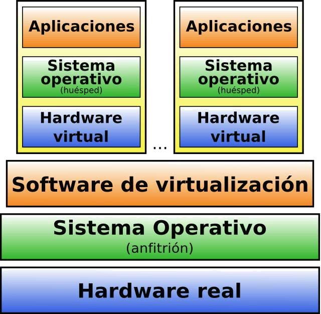
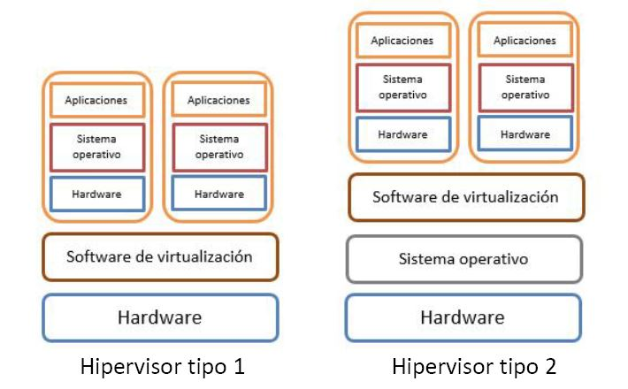
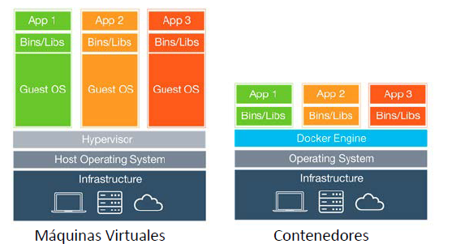
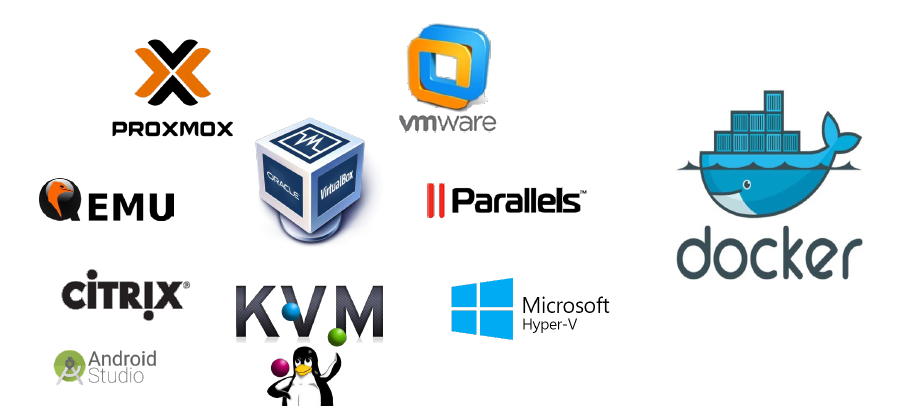

# UT4.1 Virtualización

## Contenido y debate introductorio

<iframe width="560" height="315" src="https://www.youtube.com/embed/teRd3y9PfZ8" title="YouTube video player" frameborder="0" allow="accelerometer; autoplay; clipboard-write; encrypted-media; gyroscope; picture-in-picture; web-share" allowfullscreen></iframe>

## Virtualización

```note
💡 La **virtualización** consiste en la creación a través de software específico de una versión virtual de un recurso tecnológico, como puede ser una plataforma de hardware, un sistema operativo, un dispositivo de almacenamiento y otros recursos de red.
```

La virtualización es una tecnología relativamente reciente, ya que hasta poco solo estaba disponible para grandes empresas con alto poder económico, pero hoy en día existe multitud de soluciones para la virtualización al alcance de las pequeñas y medianas empresas.

```note
💡 Una **máquina virtual** se crea con un software de virtualización conocido también como **hipervisor** y que emula a un ordenador real con sus recursos y componentes virtuales: disco duro, memoria RAM, tarjetas de red, tarjeta gráfica…
```

Que los componentes sean de una máquina virtual sean virtuales no quiere decir que <u>no existan</u>.

>   Por ejemplo, una máquina virtual puede tener unos recursos reservados de 8 GB de RAM y 50 GB de disco duro, que obviamente salen de algún sitio: del PC donde está instalada la máquina virtual.

```note
El sistema operativo de la máquina real se conoce como **sistema anfitrión** (host).
```

```note
Los diferentes sistemas que podemos disponer desde el sistema anfitrión en modo virtual se denominan **sistemas huésped**.
```

Cada **máquina virtual** (sistema huésped) puede interactuar de forma independiente con otros dispositivos, aplicaciones, datos y usuarios, como si se tratara de un recurso físico independiente.

Diferentes máquinas virtuales pueden ejecutar diferentes sistemas operativos y múltiples aplicaciones al mismo tiempo utilizando un solo equipo físico. Debido a que cada máquina virtual está aislada de otras máquinas virtualizadas, en caso de ocurrir un bloqueo esto que no afecta a las demás máquinas virtuales.

A continuación veremos las características de las máquinas virtualizadas con más detalle y luego otra especie o clase de virtualización nueva denominada como **contenedores**.

Esquema básico de dos máquinas virtuales huésped dentro de una misma máquina anfitrión que utiliza un software de virtualización o hipervisor tipo 2:




## Características de la virtualización

**Aislamiento**

Aunque las máquinas virtuales comparten los recursos del sistema anfitrión en el que residen, **están totalmente aisladas** como si se trataran de máquinas <u>independientes</u>.

**Encapsulación**

El estado completo de la máquina virtual se guarda en **archivos**. Se  pueden mover, copiar y clonar máquinas virtuales como archivos.

**Compatibilidad**

Las máquinas virtuales son totalmente compatibles con los sistemas operativos, aplicaciones y controladores de dispositivos x86 y x64 estándar.

> 💡 Esto último no es cierto para todos los modelos de procesadores.

**Independencia del hardware**

Se puede configurar una máquina virtual con componentes virtuales (CPU, tarjeta de red, controladores) que sean diferentes a los componentes físicos del hardware subyacente del anfitrión.

## Tipos de soluciones de virtualización

Existen diferentes **tipos de soluciones de virtualización**, dependiendo el uso final al que vayan destinadas dichas máquinas virtuales:

- **Virtualización de sistemas operativos**
- **Virtualización de servidores**
- **Virtualización de redes**
- **Virtualización de almacenamiento**
- **Virtualización de escritorios**
- **Virtualización mediante contenedores**

### Virtualización de sistemas operativos

💡 La **virtualización** aplicada a los **sistemas operativos**, consiste en compartir una misma infraestructura de hardware por varios sistemas operativos funcionando de forma totalmente independiente. Es el tipo de virtualización que vamos a trabajar en este módulo.

Cada huésped “verá” su propia CPU, memoria, discos, etc. independientemente de los recursos de que disponga el anfitrión o el resto de huéspedes.

### Virtualización de servidores

La **virtualización de servidores** permite que varios servidores virtuales se ejecuten en un mismo dispositivo físico permitiendo a su vez aprovechar su máxima potencia en una misma máquina y no en distintos servidores que podrían quedar infrautilizados.

### Virtualización de redes

La **virtualización de redes** es la reproducción completa de una red física por medio de un software de virtualización.

Las aplicaciones de la red virtual se ejecutan exactamente igual que en una red física. La virtualización de red expone los dispositivos y servicios de redes lógicos (puertos, conmutadores, enrutadores, cortafuegos, VPN, etc.) a las cargas de trabajo conectadas. Las redes virtuales cuentan con las mismas características que las redes físicas, con las ventajas operativas y la independencia del hardware que ofrece la virtualización.

### Virtualización de almacenamiento

La **virtualización de almacenamiento** consiste en unir múltiples dispositivos de almacenamiento en red, dando la apariencia de ser una única unidad de almacenamiento (como el almacenamiento en la nube).

La virtualización de almacenamiento es utilizada con frecuencia en redes de área de almacenamiento de alta velocidad, que comparten dispositivos y realizan tareas de respaldo y recuperación de datos de manera más fácil y rápida.

### Virtualización de escritorios

La **virtualización de escritorios** consiste en llevar a una plataforma virtual, los escritorios de los usuarios finales, disminuyendo los costos y la complejidad de la administración. 

La virtualización de escritorios también permite disponer de las aplicaciones empresariales siempre que se necesiten, indistintamente del lugar donde se encuentre el usuario en el momento de acceder a dicho escritorio.

### Virtualización mediante contenedores

La virtualización basada en **contenedores** es una aproximación a la virtualización en la cual la capa de virtualización se ejecuta como una aplicación en el sistema operativo (OS). La veremos en el siguiente apartado.

En este enfoque, el kernel del sistema operativo se ejecuta sobre el nodo de hardware con varias máquinas virtuales (VM) invitadas aisladas, que están instaladas sobre el mismo. Los huéspedes aislados se denominan contenedores

## El Hipervisor

```note
💡 El **hipervisor**, también llamado *monitor de máquina virtual (VMM)*, es el núcleo central de algunas de las tecnologías de virtualización de hardware más populares y eficaces que veremos a continuación.
```

Los hipervisores son aplicaciones que presentan a los sistemas operativos virtualizados (sistemas invitados) una plataforma operativa virtual (hardware virtual), a la vez que ocultan a dicho sistema operativo virtualizado las características físicas reales del equipo sobre el que operan.

Los hipervisores se pueden clasificar según su forma de funcionar:

-   **Tipo 1** (nativos): Se ejecutan directamente sobre el hardware sin necesidad de SO.
-   **Tipo 2** (anfitriones): Usan un SO anfitrión para ejecutarse sobre este.



### Ventajas y desventajas de la virtualización

**Ventajas de la virtualización**

-   **Ahorro de costes**: Principalmente en energía, personal, espacio físico y equipos hardware individuales.
    
-   **Aislamiento y seguridad**: las máquinas virtuales son independientes entre sí. El fallo de una no afecta a las demás.
    
-   **Flexibilidad y portabilidad**: se manejan ficheros (encapsulación) lo que permite hacer copias rápidamente y recuperaciones de forma rápida.
    
-   **Re-uso** de aplicaciones antiguas o de **tecnologías** diferentes dedicadas para cada máquina.
    
-   **Mantenimiento** desde una sola máquina (parches, actualizaciones, aumento de memoria o hardware)
    
-   **Balanceo de recursos**: nos permite asignar la carga de recursos según necesidades a las máquinas (ya sea CPU, memoria, disco..)
    
-   Realización de **pruebas**: se utiliza para evitar riesgos innecesarios.

**Desventajas de la virtualización**:

-   **Rendimiento inferior**: una máquina virtual nunca alcanzará el mismo rendimiento que el de un sistema instalado directamente en una máquina dedicada, ya que el hipervisor introduce una capa intermedia para la gestión de recursos. Esto implica que un mal diseño a la hora de virtualizar o unos requisitos insuficientes en la máquina host afectan al rendimiento de las máquinas virtuales.
    
-   **Limitaciones de hardware**: solo podremos utilizar/emular el hardware soportado por el software de virtualización y limitado por el del equipo host.
    
-   **Fallos en el hardware y software en cadena**: el fallo de un componente de hardware en la máquina física o de su propio SO afectará a todas las máquinas virtuales que utilicen dicho recurso.
    
-   **Licencias**: algunas soluciones requieren licencias muy costosas.

-   **Soporte de aceleración 3D y video**: la mayoría de máquinas virtuales no soporta aceleración 3D ni tiene por asomo el rendimiento gráfico de la máquina anfitrión.

## Virtualización mediante contenedores

El último avance de la virtualización es la utilización de **contenedores**, lo cual ha generado una rama completamente nueva respecto la virtualización clásica.

Con esta tecnología no se virtualiza el sistema entero, sino que, partiendo de una imagen de base, se registran los cambios realizados tanto por instalaciones como por desinstalaciones, de aplicaciones y servicios. De esta manera los ficheros de las imágenes de las máquinas son mucho menores y las necesidades de espacio se reducen considerablemente.




Los **contenedores** ofrecen mejoras sustanciales en cuanto rendimiento respecto a las maquinas virtuales clásicas:

-   Pueden arrancar en segundos.
-   Ocupan menos espacio en disco.
-   Se puede ejecutar mas contenedores en un servidor que maquinas  virtuales.
-   Despliegue de aplicaciones mucho mas rápido.

### Contenedores vs máquinas virtuales

En general no podemos afirmar cual de estas dos soluciones es la mejor, aparte del tema de rendimiento, ya que dependerá de la finalidad del proyecto o desarrollo a implantar.

Las preocupaciones de seguridad y los usos prácticos de las máquinas virtuales implican por tanto que los contenedores no necesariamente reemplazarán a los hipervisores, sino que las empresas utilizarán una
combinación de ambos.

En cuanto al tema de seguridad, algunos consideran que los contenedores son menos seguros que los hipervisores, debido a que los contenedores solo tienen un sistema operativo que las aplicaciones comparten, mientras que las VM aíslan no solo la aplicación, sino también el sistema operativo.


## Software y hardware de virtualización

Existen diversas soluciones de software de virtualización; tanto hipervisores como de contenedores: software libre, propietario, orientado a servidores, a SO concretos, etc.




Intel y AMD han desarrollado independientemente **extensiones de virtualización** a la arquitectura x86 que no viene preparada para dar soporte a la virtualización.

Las extensiones no son directamente compatibles entre sí, pero proporcionan las mismas funciones. Ambos permiten que una máquina virtual se ejecute en un huésped no modificado sin incurrir en penalizaciones de emulación y deben de ser habilitadas previamente en la máquina a través de su BIOS.

- **VT Intel (IVT):** La extensión de Intel para virtualización de la arquitectura de 32 y 64 bits se llama IVT *(Intel Virtualization Technology)*

- **AMD-V:** La extensión de virtualización AMD para la arquitectura de 64 bits x86 se llama *AMD Virtualization*, y también se la referencia por el nombre "Pacífica".

- **ARM Virtualization Extensions (VE)**. Estas extensiones están diseñadas para permitir que el hardware de alta gama de ARM (móviles, tablets) soporte la virtualización.

​           