# UT5.1 Arquitecturas de sistemas de comunicación

## Arquitectura de red

Algunos **conceptos** importantes sobre la arquitectura de redes y comunicaciones:

-   **Sistemas de comunicación**: brindan los medios para que la información, codificada en forma de señal, se transmita o intercambie mediante un protocolo a través de los medios adecuados (guiados o no guiados)
-   **Protocolo**: un acuerdo entre partes que se comunican sobre cómo se va a proceder durante la comunicación, para que ésta se pueda llevar a cabo de manera satisfactoria.
-   **Protocolo de comunicación**: conjunto de reglas que posibilitan que dos entidades puedan intercambiar información de manera ordenada y libre de error.
-   **Topología de red**: es el mapa físico o lógico de una red para intercambiar datos.
-   **Enrutamiento**: El enrutamiento consiste en buscar un camino óptimo entre todos los posibles en una red de paquetes cuyas topologías poseen una gran conectividad.

Cuando hablamos de arquitectura de red, se suele pensar en cómo está construida dicha red, los cables, los equipos, pero en realidad es un concepto más amplio que incluye las cuestiones relacionadas con el diseño, hardware y software de una red.

```note
Se define como arquitectura de red al conjunto de capas o niveles, junto con los protocolos definidos en cada una de estas capas, que hacen posible que sus componentes se comuniquen independientemente de la red en la que se estén.
```

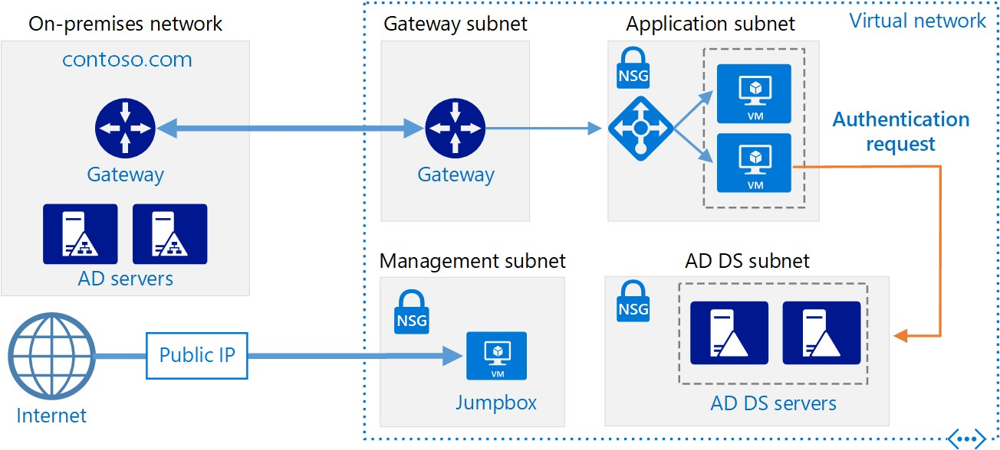

La arquitectura de una red viene definida por 3 características fundamentales:

-   **La topología**: la topología de una red es la organización de su cableado, ya que define la configuración básica de la interconexión de estaciones y en algunos casos, el camino de una transmisión de datos sobre el cable.
-   **Método de acceso a la red**: cada tipo de red tiene definido un método de acceso al cable que evita o reduce los conflictos de comunicaciones y controla el modo en que la información es enviada de una estación a otra.
-   **Protocolos de comunicación**: existen diferentes niveles de protocolos:
    -   Los de alto nivel definen como se comunican las aplicaciones o programas y los de bajo nivel definen como se transmiten las señales por el medio (pj cableado).
    -   Existen protocolos que realizan otras funciones como establecer y mantener sesiones de comunicaciones y controlar las transmisiones para detectar errores.
    -   Los protocolos de bajo nivel son específicos del tipo de medio utilizado y sus características (cableado o inalámbrico)
    -   Lo habitual es que los protocolos estén expuestos y sean públicos.

Los problemas que tratan de solucionar las arquitecturas de red son:

-   **Enrutamiento**: Decidir cuál de las rutas existentes entre origen y destino es la más adecuada.
-   **Direccionamiento**: Identificar cada equipo de manera inequívoca, independientemente del nivel de la red en el que esté trabajando, gestionando la correspondencia entre las distintas direcciones de un mismo dispositivo.
-   **Acceso al medio**: Para controlar el orden de transmisión.
-   **Saturación del receptor**: Ajustar las diferentes velocidades entre emisor-receptor.
-   **Mantenimiento del orden**: Si se utiliza la conmutación de paquetes, estos pueden llegar desordenadamente.
-   **Control de errores**: Comprobación de que todos los paquetes han llegado correctamente.
-   **Multiplexación:** En determinadas ocasiones, la red puede tener tramos en los que existe un único medio de transmisión, que debe ser compartido por diferentes comunicaciones.

Clasificar la arquitectura de la red es complejo ya que se puede hacer de una forma general basada en los servicios que ofrece, seguridad, gestión y varios niveles.

Nosotros nos centraremos en cambio en el apartado técnico, es decir el que permite que funcione a nivel físico y lógico desde su concepción y creación.

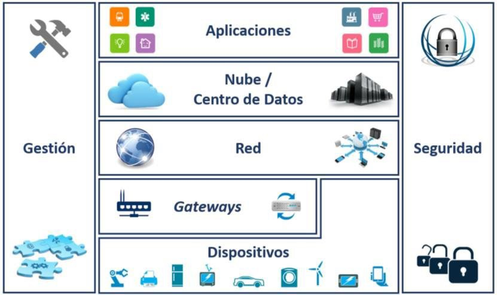

A continuación, estudiaremos con más detalle cómo funcionan las arquitecturas basadas en niveles, los protocolos y veremos los dos **modelos** más importantes en el desarrollo de las redes; el modelo de referencia **OSI** y la pila de protocolos **TCP/IP**, que podemos considerarla como la arquitectura base para las comunicaciones por Internet actual.

La arquitectura de red se divide por **niveles o capas** para reducir la complejidad de su diseño. Esta división por niveles conlleva que cada uno de estos niveles tenga asociados, **uno o varios protocolos** que definirán las reglas de comunicación de la capa correspondiente.

Cualquier arquitectura de red basada en capas facilita las compatibilidades, tanto de software como de hardware, así como las modificaciones futuras, ya que no es necesario cambiar todas las capas cuando queremos mejorar el sistema.

## Modelo OSI

Si nos remontamos al principio de la década de los 80, la rápida expansión de redes corporativas por parte de las incipientes empresas tecnológicas supuso un creciente caos, pues cada tecnología de conexión que se desarrollaba era propietaria, no compatible con las demás, suponiendo todo un desafío tecnológico para el futuro desarrollo de Internet.

Para arreglar este desaguisado, la ISO buscó un estándar que no tuviera en cuenta la estructura ni tecnología interna de una red, pero que pudiera comunicarse con el resto de redes. Una especie de “traductor” entre idiomas diferentes. Así nació el **modelo OSI**.

El modelo OSI se compone de 2 componentes principales:

-   Una arquitectura de **7 capas**
-   Un conjunto de **protocolos**

```note
El modelo OSI (Open System Interconnection) está basado en la propuesta de la ISO en 1984 para el avance hacia la normalización mundial de protocolos.
```

Aunque el modelo OSI no está realmente desarrollado en ningún sistema, sirve para poder entender el funcionamiento de los procesos de comunicación que se producen en una red y su división en capas, siete en concreto:

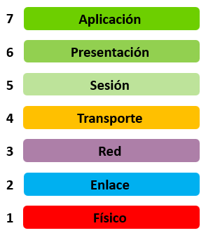

El modelo **OSI** por tanto tiene siete niveles separados, pero relacionados, cada uno de los cuales define un segmento del proceso necesario para mover la información a través de una red.

La base del sistema de capas del modelo es el **encapsulamiento**.

La información de más alto nivel de la Capa 7, donde se trabaja con datos de aplicación, que se van encapsulando y transformando hasta llegar a la Capa 1 o de más bajo nivel, que gestiona bits puros, transmitiéndolos a un medio físico (señales eléctricas, ondas de radio, pulsos de luz…).

Cada capa tiene por tanto unos servicios asignados, aunque se pasan los datos de una a otra. Para poder hacer esto, las capas adyacentes tienen una **interfaz**.

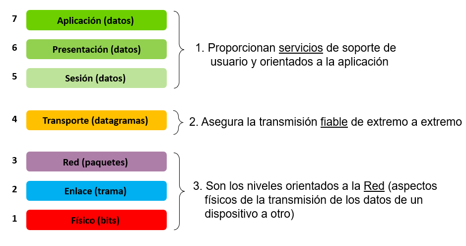


El **encapsulamiento** es el proceso por el cual los datos que se deben enviar se deben colocar en encapsulados (o *PDUs*) que administrar y rastrear.

- Las **tres capas superiores** del modelo OSI (*aplicación, presentación y sesión*) preparan los datos para su transmisión creando un formato común para la transmisión.
- La **capa de transporte** divide los datos en unidades llamadas *segmentos o datagramas*. Asigna números de secuencia para asegurarse que los receptores vuelvan a unir los datos en el orden correcto. 
- La **capa de red** encapsula el segmento creando un *paquete*. Le agrega una dirección de red destino y origen, por lo general una *dirección IP*.
-En la **capa de enlace** continúa el encapsulamiento del paquete, con la creación de una *trama*. Le agrega a la trama la dirección local (*MAC*) origen y destino.
- La **capa física** es la encarga de transmitir los *bits* binarios de la trama a través de los medios físicos utilizados.

Esquema del modelo OSI junto el nombre de los datos **encapsulados** (*PDU o Protocol Data Unit*) en cada capa, así como sus relaciones:

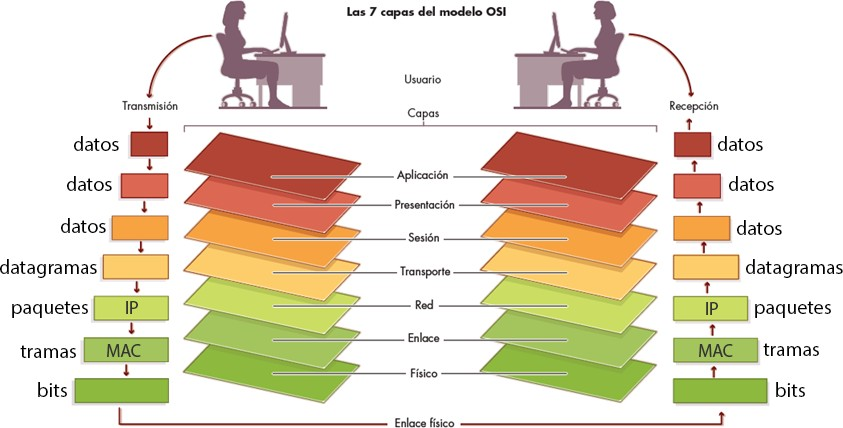

> PDU hace referencia a la unidad de datos usada en dicha capa por su protocolo

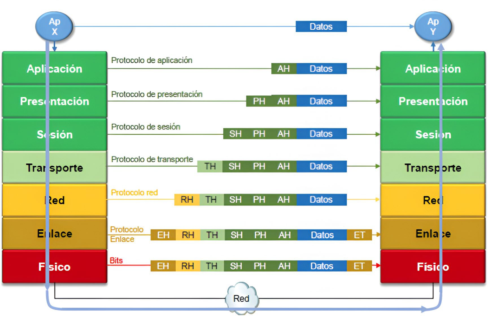Datos Datos Datos

### 1. Capa física

```note
Es la capa de más bajo nivel. Se encarga de la transmisión de bits a lo largo de un canal de comunicación definiendo sus características eléctricas y físicas. 
```

Debe asegurarse en esta capa que, si se envía un bit por el canal, se debe recibir el mismo bit en el destino.

En esta capa se ubican los cables, tarjetas, repetidores, amplificadores, antenas, concentradores, módems, conectores, etc.

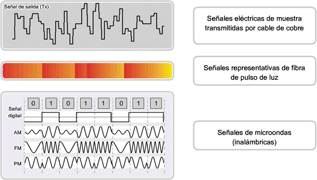

### 2. Capa de enlace

```note
La capa de enlace de datos proporciona tránsito de datos confiable a través de un enlace físico que pueda ser utilizado por el nivel superior (de red). 
```

Como el nivel físico opera con bits, la capa de enlace debe fraccionar el mensaje en bloques de datos llamados **tramas** de direcciones hardware o **MAC**. Dichas tramas serán enviadas en secuencia por la línea de transmisión física.

El nivel de enlace es también el encargado del **tratamiento de errores** que se produzcan en la recepción de las tramas y adecuar el flujo si hay transmisores más rápidos o lentos.

En resumen, la capa de enlace se ocupa del **control de acceso al medio** y la entrega ordenada de tramas (control del tráfico) así como de la detección y corrección de errores.

 

La capa de enlace se suele dividir por tanto en **dos subniveles** dadas sus funciones:

-   **Subnivel de acceso al medio (MAC)**. Se encarga de averiguar si el canal está libre para efectuar una transmisión de datos. En caso de que haya canales compartidos se encarga del control y reparto de recursos de transmisión en los nodos de la red (por ejemplo, *CSMA/CD*). En este subnivel se define una dirección física o dirección **MAC** (*Media Access Control*) que identificará a cada dispositivo en la red de forma única.
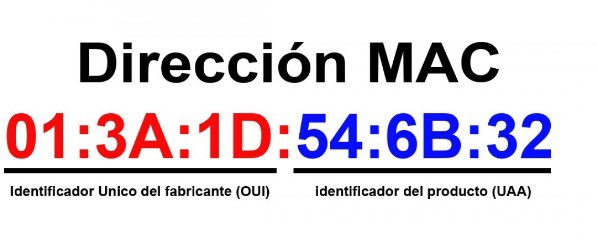
-   **Control lógico de enlace (LLC):** Se gestiona el control de errores, la formación de tramas y el diálogo entre emisor y receptor.

    |  **Capa Enlace** | Subcapa **MAC** |
    |------------------|-----------------|
    |                  | Subcapa **LLC** |
    | **Capa física**  |                 |

```note
Se denomina método de acceso al conjunto de reglas que definen la forma en que un equipo se conectará a la red y enviará o recibirá datos de esta. 
```

Por ejemplo, en el caso de **Ethernet** todos los equipos estarán conectados a la misma línea de transmisión, con lo que la comunicación se llevará a cabo usando una técnica llamada **CSMA/CD**: Esta técnica se utiliza para evitar colisiones que se producen cuando dos o más equipos acceden a la red. Si se encuentra el canal ocupado se espera un tiempo aleatorio hasta que vuelva a estar libre.

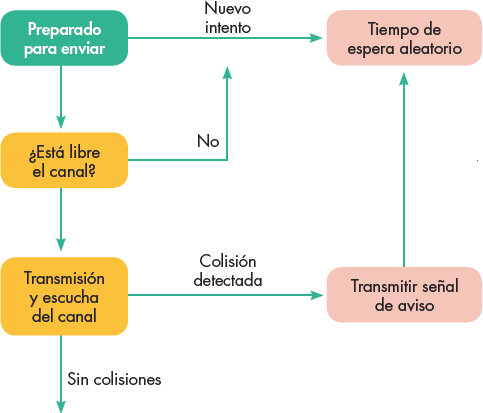

>Para redes inalámbricas se utiliza otra técnica llamada *CSMA/CA*

Control de acceso al medio para medios compartidos:
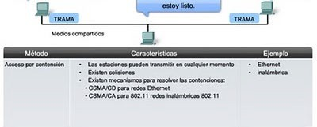

| **Método control acceso** | **Características**                                                                                                                                                              | **Ejemplo**          |
|---------------------------|----------------------------------------------------------------------------------------------------------------------------------------------------------------------------------|----------------------|
| Acceso por contención     | Las estaciones pueden transmitir en cualquier momento. Existen colisiones Mecanismos para resolverlo: **CSMA/CD** para redes Ethernet **CSMA/CA** para redes inalámbricas 802.11 | Ethernet Inalámbrica |

### 3. Capa de red

```note
La **capa de red** es una capa compleja que proporciona conectividad y selección de rutas entre sistemas que pueden estar ubicados en redes geográficamente distintas. 
```

La misión principal por tanto de dicha capa es el **direccionamiento** y **enrutamiento** de los datos que en este nivel se llaman paquetes. Dicha capa es la responsable de elegir la ruta más adecuada para que el **paquete** de datos llegue a su destino.

En este nivel a cada entidad se le asigna un código lógico llamado **dirección IP** y se realiza el direccionamiento lógico y el enrutado de datos hasta su receptor final.

Otra función de esta capa es el tratamiento de la **congestión**. Un sistema de red avanzado evitará los problemas de congestión.

En esta capa se ubican a los **routers**. Los protocolos conocidos de esta capa son los archiconocidos **IPv4** e **IPv6** que estudiaremos más adelante.

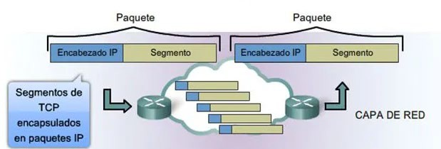

Las funciones principales de esta capa se dividen en cuatro partes:
-   **Direccionamiento:** Es capaz de proporcionar un mecanismo para direccionar los datos a los equipos finales.
-   **Enrutamiento:** Proporciona un servicio que es capaz de dar la ruta más rápida y eficaz para llegar a dirección final, teniendo en cuenta los protocolos con lo que el enrutador cuenta.
-   **Encapsulamiento:** Agrega un encabezado o etiqueta que contiene la dirección de origen y destino de los datos.
-   **Desencapsulamiento:** Al igual que la encapsulación, esta parte se encarga de leer el encabezado del paquete recibido para verificar si su dirección de destino es la suya, en caso que no, lo vuelve a encapsular y lo manda por una ruta conocida.
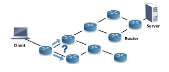

### 4. Capa de transporte

```note
Esta capa se ocupa de garantizar la fiabilidad del servicio, describe la calidad y naturaleza del envío de datos.
```

Esta capa define cuando y como debe utilizarse la retransmisión para asegurar su llegada. Si un datagrama no llega al destino se podrá pedir su reenvío.

Se divide el mensaje recibido de la capa de sesión en trozos llamados **segmentos**

(TCP) o **datagramas** (UDP), los numera y entrega a la capa de red para su envío.

Un ejemplo típico de protocolos usado en esta capa es el **TCP** (*Transport Control Protocol*), que con su homólogo IP de la capa de Red, configuran el **TCP/IP** utilizado en Internet, aunque existen otros como **UDP** (*Universal Datagram Protocol*) usado también en Internet por muchos programas de aplicación.

Esta capa permite las comunicaciones entre ordenadores **peer to peer**, es decir, un programa emisor puede comunicarse con uno receptor directamente. En capas inferiores esto no se cumple. Por ejemplo, en el nivel inferior hay tramas, pero puede que para que llegar al receptor haya que pasar por varios equipos intermedios que redirijan las comunicaciones o cambien de red los diferentes paquetes.

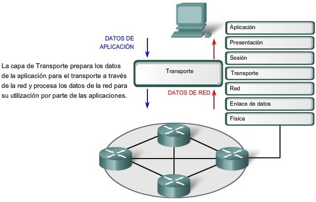

### 5. Capa de sesión

```note
Esta capa permite que los usuarios de diferentes máquinas puedan establecer sesiones entre ellos a través de una negociación previa con las condiciones de envío/recepción. 
```

Una sesión podría permitir al usuario acceder a un sistema de tiempo compartido a distancia, o transferir un archivo entre dos máquinas.

El nivel de sesión mantiene la sesión de cada usuario, identificando a cada usuario para diferenciar su sesión de las demás.

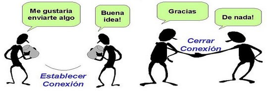

### 6. Capa de presentación

```note
La **capa de presentación** garantiza que la información que envía la capa de aplicación de un sistema pueda ser leída por la capa de aplicación de otro. 
```

Se ocupa de la sintaxis y semántica del contenido de los datos. De ser necesario, la capa de presentación traduce entre varios formatos de datos utilizando un **formato común**.

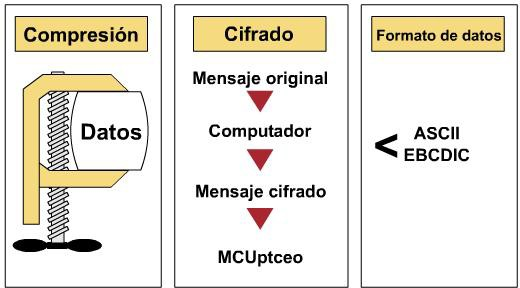

### 7. Capa de aplicación

```note
El nivel de **aplicación** es la capa superior del modelo contiene los programas, aplicaciones o servicio que utiliza el usuario final. 
```

En este nivel se incluyen todos los **protocolos de alto nivel** que utilizan los programas para comunicarse.

Cuando dos procesos o aplicaciones dentro de un mismo equipo desean comunicarse utilizarán las funciones del propio SO. Si residen en equipos distintos, la capa de aplicación desplegará los mecanismos para establecer la comunicación con ellos haciendo uso de los servicios de las capas vistos anteriormente.

El concepto de aplicación al que se refiere esta no es lo mismo que el de utilidad de software. En comunicaciones se entiende por aplicación a un modo concreto de comunicarse. Por ejemplo, una aplicación es el correo electrónico, otro es la consulta de una web, otro la carga/descarga de ficheros, etc.

Cada una de estas aplicaciones dará lugar a uno o varios protocolos libres o propietarios (o familia de protocolos) de la capa de aplicación. Por ejemplo, los *SMTP*, *POP* e *IMAP* constituyen una familia de protocolos de nivel de aplicación para la gestión del correo electrónico, mientras que *HTTP* es utilizado para la web.

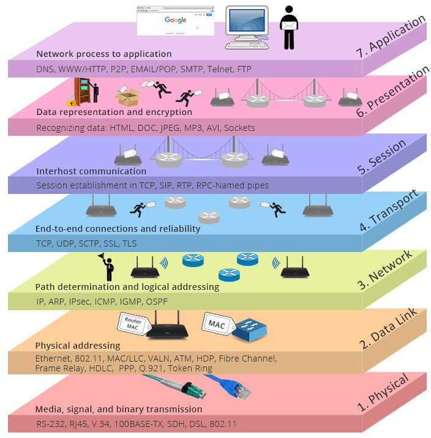

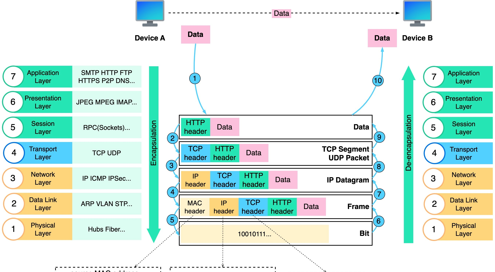


| **Nivel OSI**            | **Ejemplo**                                                                                                                                                                                                                                                               |
|--------------------------|---------------------------------------------------------------------------------------------------------------------------------------------------------------------------------------------------------------------------------------------------------------------------|
| **Nivel 7 Aplicación**   | Una cooperativa recoge frutas de unos agricultores, negocia un precio de venta en el mercado y decide proceder a su transporte para vender.                                                                                                                               |
| **Nivel 6 Presentación** | Una vez recogida las frutas deben empaquetarse y presentarse como cestas con un peso bruto determinado. Las cajas irán además precintadas.                                                                                                                                |
| **Nivel 5 Sesión**       | El comprobador y el vendedor se ponen de acuerdo para enviar todos los lunes y viernes 10 toneladas de fruta. Los pagos se harán el día 1 de cada mes por transferencia.                                                                                                  |
| **Nivel 4 Transporte**   | Hoy es lunes y habrá que efectuar un transporte de 10 toneladas de fruta. Se avisa a una compañía de transportes que se compromete a entregarlo en el plazo fijado, sin perder ninguna caja y en condiciones adecuadas. Si no llegara se notificará para valorar reenvío. |
| **Nivel 3 Red**          | La compañía de transporte determinará las rutas posibles para efectuar el traslado de la fruta en el menor tiempo posible. Cada una de las cajas se empaquetará adecuadamente y se etiquetará para identificar la dirección de origen y de destino de forma única.        |
| **Nivel 2 Enlace**       | A los contenedores se les añada un control de seguridad adicional y se precintan por su seguridad. Si el precinto de una caja llegara roto, esa carga se declararía inservible.                                                                                           |
| **Nivel 1 Física**       | Se utilizarán para el transporte la carretera y un modelo de camiones con una capacidad y velocidad máximas, regulándose que no circule más de uno a la vez.                                                                                                              |
## Modelo TCP/IP

**TCP**/**IP** es junto con OSI una arquitectura de protocolos que ha sido determinante y básica en el desarrollo de los estándares de comunicación.

Es un modelo que surge a partir de la investigación de diferentes protocolos, y el nombre del modelo lo toma de los sus principales protocolos: **TCP** e **IP**.

TCP/IP fue desarrollado y demostrado por primera vez en 1972 por el departamento de defensa de los EEUU, ejecutándolo en el *ARPANET* una red de área extensa del departamento de defensa tal y como vimos en unidades anteriores.

```note
El modelo TCP/IP es la base de Internet que sirve para enlazar computadoras que utilizan diferentes sistemas operativos, incluyendo PC, minicomputadoras y servidores y dispositivos móviles sobre redes de área local y área extensa. 
```

A diferencia del modelo de referencia OSI, el modelo TCP/IP no tiene una división tan clara y estricta de sus capas. Es más, sus protocolos pueden llegar a actuar en más de una. Es un modelo más adecuado a la realidad práctica de Internet y no tan teórico como el modelo OSI.

Toda arquitectura de protocolos se descompone en una serie de niveles, usando como referencia el modelo OSI. A diferencia de OSI, formado por siete niveles, TCP/IP se descompone en cinco niveles, cuatro de software y un nivel hardware:

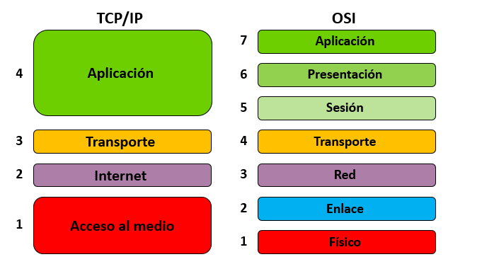

### Capa de acceso al medio

Se corresponde con las capas 1 y 2 del modelo OSI. Su función es permitir que los bits (**tramas**) de información viajen a través del cableado o redes inalámbricas **llegando a su destino** y definir una **dirección MAC** única.

Gestiona el acceso al medio compartido así como el control de errores.

Hay que tener en cuenta que está arquitectura está pensada para conectar ordenadores diferentes en redes diferentes, por lo que las cuestiones de nivel físico no se tratan, y se dejan lo suficientemente abiertas para que se pueda utilizan cualquier estándar o protocolo de conexión.

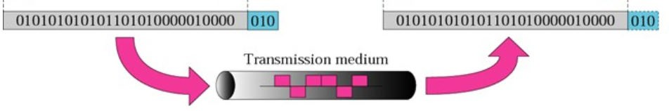

La **dirección MAC** es un identificador de **48 bits**, que suele representarse en forma de números hexadecimales, en un formato de 6 bloques de dos números hexadecimales, divididos por dos puntos. El formato es el siguiente:

    FF:FF:FF:FF:FF:FF

En este nivel hay un protocolo relacionado con el direccionamiento físico. Este protocolo es el **ARP**.

El control acceso al medio utiliza un sistema por turnos tal y como vimos anteriormente llamados **CSMA/CD** o **CSMA/CA**

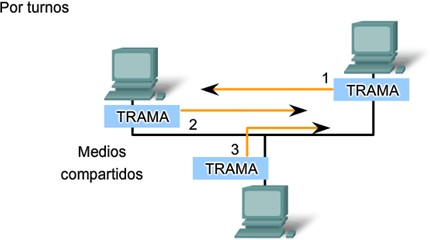

### 2. Capa de Internet

Se corresponde con la capa 3 del modelo OSI. Al igual que sucedía con esta, su misión es conseguir los dispositivos puedan **conectarse** encontrando una **ruta** (direccionamiento) entre estos. La capa Internet maneja la comunicación de un equipo a otro. Éste acepta una solicitud para enviar los **paquetes** desde la capa de transporte, junto con una identificación de la máquina, hacia la que se debe enviar el paquete.

La capa de Internet define entonces cómo será el enrutamiento de los datagramas a partir de la administración de las **direcciones IP**. Por esto la otra función básica de la capa es la identificación del host en la red mediante una dirección y el direccionamiento de estos datagramas dando saltos entre enrutadores hasta llegar al destino.

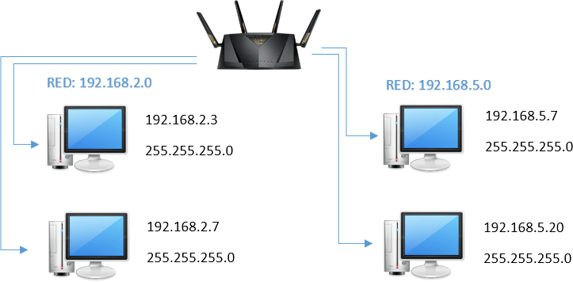

Es aquí en donde trabaja el protocolo **IP** (IPv4 o IPv6), así como otros protocolos muy conocidos que veremos más adelante como **ICMP, RIP, OSPF y ARP**.

### 3. Capa de transporte

Se corresponde con la capa 4 del modelo OSI. Una vez que el protocolo IP ha determinado la manera en que serán transmitidos los datos de un mensaje entre un dispositivo y otro, los protocolos de la capa de transporte (TCP y UDP) entran en acción para codificarlo y enviarlo a la dirección determinada por el protocolo IP.

Para implementar el nivel de transporte se utilizan dos los protocolos TCP y UDP que aunque son diferentes resultan complementarios entre sí:

-   **UDP** (*User Datagram Protocol*) – Es un protocolo que proporciona un transporte simple pero no fiable de **datagramas**, ya que apenas añade información al paquete que envía al nivel inferior.
-   **TCP** (*Transport Control Protocolo*) – Es el protocolo que proporciona un transporte fiable y controlado de **segmentos**.


La *PDU* de la capa 4 se llama por tanto **segmento** si corresponde a TCP o **datagrama** si corresponde a UDP.

Para comunicarnos extremo a extremo necesitamos usar lo que denomina **puerto de red**, ya que TCP y UDP se ubican en la capa de transporte del modelo TCP/IP.

```note
Un puerto de red es una interfaz para comunicarse con un programa a través de una red que se identifica con 16 bits (valor numérico entre el 0 y el 65535)
```

Existen diversas categorías de **puertos** según su valor:

-   **Puertos bien conocidos**: Los valores de puertos inferiores a 1024 son puertos reservados al SO y normalmente estandarizados por la *IANA* (servicios estándar)
-   **Puertos registrados**: Comprendidos entre 1024 y 49151. Para aplicaciones no estándar instalas por el usuario y que no tienen puerto conocido asociado.
-   **Puertos privados**: Comprendidos entre 49152 y 65535. Se suelen emplear en conexiones iniciadas desde el cliente de forma dinámica.

| **Servicio**                               | **Protocolo** | **Nº puerto** |
|--------------------------------------------|---------------|---------------|
| **SMTP** (email)                           | TCP           | 25            |
| **SSH** (terminal remoto encriptado)       | TCP           | 22            |
| **Telnet** (terminal remoto sin encriptar) | TCP           | 21            |
| **DNS** (nombres de dominio)               | UDP y TCP     | 53            |
| **HTTP** (páginas web sin encriptar)       | TCP           | 80            |
| **HTTPS** (páginas web encriptadas)        | TCP           | 443           |
| **SMTPS** (email encriptado)               | TCP           | 465           |
| **POP** (descarga de correo)               | TCP           | 110           |
| **POPS** (descarga de correo encriptado)   | TCP           | 995           |
| **IMAP** (descarga de correo)              | TCP           | 143           |
| **IMAPS** (descarga de correo encriptado)  | TCP           | 993           |
| **SMB** (compartición de archivos)         | TCP           | 445           |
| **DHCP** (configuración automática de red) | UDP           | 68            |

### 4. Capa de aplicación

Se corresponde con las capas 5, 6 y 7 del modelo OSI. Es la capa más alta del modelo *TCP/IP* e incluye las aplicaciones, servicios y procesos con los que se produce el intercambio de datos de la capa anterior.

Ejemplos de servicios de la capa de aplicación y sus protocolos:

-   Protocolo de hipertexto (*HTTP*)
-   Correo electrónico (*MAIL*).
-   Transferencia de archivos (*FTP*).
-   Login remoto (*SSH*).


En esta capa están conocidos protocolos como **HTTP, HTTPS, SMTP, DNS, DHCP, SSH, LDAP, FTP.**

Una vez que conocemos los diferentes niveles de la arquitectura podemos definir el concepto de **socket** utilizado habitualmente por los programadores.

```note
Un **socket**, es una conexión que está formada por la unión de la dirección IP más el puerto que se utiliza para la conexión
```

Como cada puerto está asociado a una aplicación, podemos decir que no habrá dos conexiones iguales en un mismo instante de tiempo.

Por ejemplo: **172.217.7.238:80**, esto significa que el ordenador cuya dirección es 172.217.7.238 está utilizando el puerto 80, que está asociado al protocolo http del nivel de aplicación, por tanto esto puede significar que el ordenador está visitando una página web o sirviendo una página web.

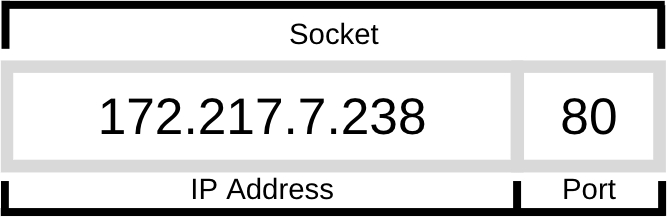

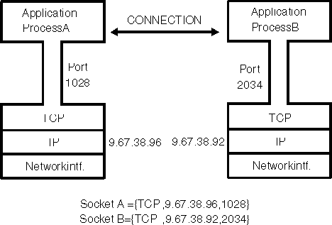

### Modelo cliente-servidor

- **Servidor** 
    - Cualquier programa que ofrece un servicio que se pueda obtener por la red.
    - Acepta peticiones, realiza el servicio y devuelve el resultado.

- **Cliente**
    - Envía peticiones al servidor y espera respuesta.
    - Interactúa con el usuario.

    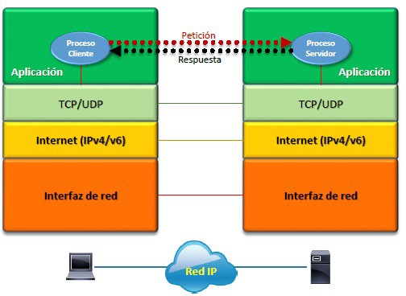

### Modelo P2P e híbrido 

- **P2P**
    - En el modelo Peer to Peer (P2P) todos los nodos de la red son igualmente responsables.
    - No hay un elemento central.

- **Híbrido**
    - El servidor no presta el servicio como tal.
    - El servidor se pone en contacto con los clientes.
    - Los clientes se comunican entre sí.

