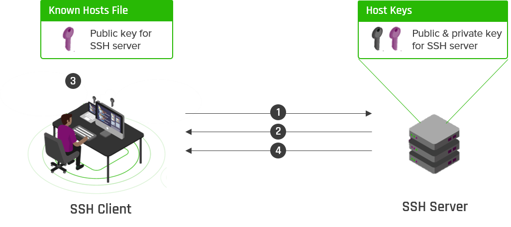

# UT5.2 Protocolos de comunicación y de red

## Familia de protocolos

Dependiendo de las funciones de cada capa descritas anteriormente, existe a su vez un conjunto de **protocolos** para cada una de estas capas que estudiaremos a continuación, siendo los más conocidos los de la **familia TCP/IP**.

```note
Un protocolo de comunicación está formado por un conjunto de reglas y formatos de mensajes establecidas a priori para que la comunicación entre el emisor y un receptor sea posible.
```

> Las **reglas** definen la forma en que deben de efectuarse las comunicaciones de las redes, incluyendo la temporización, la secuencia, la revisión y la corrección de errores.

La comunicación exitosa entre los hosts de una red requiere la interacción de gran cantidad de protocolos diferentes. Un grupo de protocolos interrelacionados que son necesarios para realizar una función de comunicación se denomina suite de protocolos. Estos protocolos se implementan en el software y hardware que está cargado en cada host y dispositivo de red.

Entre los protocolos necesarios para poder establecer una comunicación se necesitan protocolos para:

-   Definir el lenguaje común a utilizar.
-   Método por el que los dispositivos comparten de rutas
-   Identificar el emisor y el receptor.
-   Definir el medio o canal que se puede utilizar en la comunicación.
-   Definir la forma y estructura de los mensajes.
-   Establecer la velocidad y temporización de los mensajes.
-   Definir la codificación y encapsulación del mensaje.


Definir el lenguaje común a utilizar:


Método por el que los dispositivos comparten de rutas


Conjunto de protocolos **TCP/IP** y proceso de comunicación:


## Protocolos de la capa de acceso al medio


Los protocolos de **acceso al medio** hacen alusión al tipo de medio físico que se utilizará para establecer la conexión, mediante cableado o inalámbrica, así como a las características de dicho medio.

Recordar que los medios físicos más representativos son:

-   El **cable de par trenzado**: Es el cable más utilizado en redes de área local. Existen distintos tipos (UTP, FTP, STP) cada uno con características y velocidades máximas distintas.
-   El **cable coaxial**: utilizado en las primeras redes. Lo hay de distintos grosores, con diferentes características.
-   **La fibra óptica**: empleado mayoritariamente en redes de gran longitud. Es el medio que resulta más veloz para transmitir grandes cantidades de información con un elevado ancho de banda.
-   Las **ondas**: infrarrojas, microondas, de radio, etc.

### Protocolo ARP

El protocolo **ARP** (*Address Resolution Protocol*) es uno de los protocolos fundamentales de Internet y de las redes locales. Este protocolo trabaja junto con el protocolo IP para mapear las direcciones IP en relación a las direcciones de hardware MAC utilizados por los protocolos de enlace datos.

A las direcciones de hardware se las denominan **direcciones MAC** tal y como hemos visto. Estas direcciones sirven de código de identificación para cada una de las interfaces de red de los dispositivos. ARP opera en el medio de la capa de red y la capa de acceso al medio (según el modelo *TCP/IP*).


ARP se utiliza en cuatro casos referentes a la comunicación entre dos hosts:
-   Cuando dos hosts están en la misma red y uno quiere enviar un paquete a otro.
-   Cuando dos hosts están sobre redes diferentes y deben usar un *gateway* o *router*  para alcanzar otro host.
-   Cuando un router necesita enviar un paquete a un host a través de otro router.
-   Cuando un router necesita enviar un paquete a un host de la misma red.

**Tablas ARP**

Cada equipo tiene una **tabla** donde almacena las direcciones IP de las cuales conoce su MAC. Por ejemplo:

| **IP**      | **MAC**           |
|-------------|-------------------|
| 192.168.1.1 | D1:3C:54:68:1A:DB |
| 192.168.1.3 | 00:31:A4:68:CA:DC |
| 192.168.1.5 | C8:7C:91:63:FD:BD |

### Protocolo Ethernet 802.3

**Ethernet** es una de las dos tecnologías LAN más utilizadas hoy en día, siendo la otra LAN inalámbricas (WLAN). Ethernet funciona en la capa de enlace de datos y en la capa física. Ethernet utiliza comunicaciones por cable, incluyendo pares trenzados, enlaces de fibra óptica y cables coaxiales. Es una familia de tecnologías de red definidas en los estándares **IEEE 802.2** *y* **802.3.** Las WLAN usan el 802.11.


Ethernet utiliza un método de acceso al medio basado en contención llamado **CSMA/CD** (*Carrier sense multiple access with collision detection*) del que ya hemos hablado, que garantiza que sólo un dispositivo esté transmitiendo a la vez. Cualquier estación conectada a una red **IEEE 802.3** debe poseer una tarjeta de red que cumpla con este estándar y con los componentes electrónicos y el software adecuado para la generación y recepción de *tramas*.


> Las LAN Ethernet de hoy utilizan switches que funcionan en dúplex completo. Las comunicaciones dúplex completo con switches Ethernet **ya no requieren control de acceso a través de CSMA/CD**.

El modo en que las tramas IEEE 802.3 son puestas en el medio de transmisión físico depende de las especificaciones de hardware y de los requerimientos del tipo de cableado elegido. Se definen para ello varios subestándares, todos ellos integrados dentro de la IEEE 802.3

| **Estándar Ethernet** | **Denominación**                                                                    | **Velocidad** | **Tecnología cables**                        | **Año publicación** |
|-----------------------|-------------------------------------------------------------------------------------|---------------|----------------------------------------------|---------------------|
| 802.3                 | 10Base5                                                                             | 10 MB/s       | Cable coaxial                                | 1983                |
| 802.3a                | 10Base2                                                                             | 10 MB/s       | Cable coaxial                                | 1988                |
| 802.3i                | 10Base-T                                                                            | 10 MB/s       | Cable de par trenzado                        | 1990                |
| 802.3j                | 10Base-FL                                                                           | 10 MB/s       | Cable de fibra óptica                        | 1992                |
| 802.3u                | 100Base-TX100Base-FX100Base-SX                                                      | 100 MB/s      | Cable de par trenzado, cable de fibra óptica | 1995                |
| 802.3z                | 1000Base-SX1000Base-LX                                                              | 1 GB/s        | Cable de fibra óptica                        | 1998                |
| 802.3ab               | 1000Base-T                                                                          | 1 GB/s        | Cable de par trenzado                        | 1999                |
| 802.3ae               | 10GBase-SR, 10GBase-SW, 10GBase-LR, 10GBase-LW, 10GBase-ER, 10GBase-EW, 10GBase-LX4 |  10 GB/s      |  Cable de fibra óptica                       |  2002               |
| 802.3an               | 10GBase-T                                                                           | 10 GB/s       | Cable de par trenzado                        | 2006                |

### Familia protocolos inalámbricos

Las redes inalámbricas son redes que utilizan medios aéreos (ondas) para conectar dispositivos. Además de la conocida familia de protocolos de **WLAN**, existe toda una amplia gama de protocolos inalámbricos para *WMAN* y *WWAN*, que veremos.


### Protocolo WLAN 802.11

**Wi-Fi** es un conjunto de especificaciones para las redes de área local inalámbricas (WLAN) basadas en el estándar **IEEE 802.11**. El nombre de ‘Wi-Fi’ es tenido como una abreviatura del término inglés “Wireless Fidelity”, aunque no de forma oficial.

Estas redes no requieren el uso de cables, ya que efectúan la transmisión de datos por medio de **radiofrecuencia**. Este esquema ofrece varias ventajas, entre ellas: permite al usuario utilizar la red en cualquier punto dentro de los límites de alcance de la transmisión; posibilita la inserción rápida de otros equipos y dispositivos de la red; evita que las paredes o estructuras de la propiedad inmobiliaria sean de plástico o adaptadas para el paso de cables.


La primera versión del estándar fue lanzada en 1997 y su evolución ha sido constante con aumento de velocidades y rangos de frecuencias de **2.4Ghz** a **5Ghz**.


Cada rango de frecuencias está subdividido a su vez en varios **canales** que pueden ser compartidos. Una parte de un canal se solapa con los adyacentes, creando interferencias. Lo más conveniente es usar canales distintos para varias conexiones y con una separación entre ellos de 30 MHz. Por ejemplo, los canales 1, 7 y el 13 evitarían el solapamiento completamente.


Tal y como vimos anteriormente, las comunicaciones en WiFi son bidireccionales en semidúplex y puede trabajar en dos bandas: la de **2.4Ghz** y la de **5Ghz**.

| **Banda de 2.4Ghz**                                                                                                                                                                     |
|-----------------------------------------------------------------------------------------------------------------------------------------------------------------------------------------|
| Atraviesa paredes con menores pérdidas. 
Mayor cobertura. 
Mayor saturación del entorno. 
Dividida en 14 canales separados por 5 Mhz. 
Mayor compatibilidad con dispositivos más antiguos.  |
| **Banda de 5Ghz**                                                                                                                                                                       |
| Mayor ancho de banda. 
Velocidades mayores que 2.4Ghz. 
Cubren un rango menor que las redes 2.4Ghz 
No atraviesan bien objetos sólidos. 
Tiene menos canales que la de 2.4Ghz y se solapan. |

### WIMAX (802.16)

En redes de área metropolitana (**WMAN**) se utiliza el estándar **802.16**, que define las redes **WIMAX**, aunque no han tenido mucho éxito y el 5G ha tomado su lugar.

Este tipo de redes permiten llevar una conexión de Internet a zonas donde la red cableada (zonas rurales o de difícil acceso).


Cuando se contrata este servicio se instala una antena en el exterior, que se conecta a un tipo de router en el interior del inmueble para recibir y tratar la señal.


### Protocolo Bluetooth (802.15.1) 

En redes de área personal (**WPAN**) se utiliza el estándar **802.15.1**, que define las redes **Bluetooth**. Estas redes emplean un topología **piconet**, que es una red de 2 a 7 dispositivos, donde uno de ellos es el maestro (encargado de establecer y gestionar las conexiones). Cuando comunicamos dos piconet, formamos una *scatternet*. Los dispositivos Bluetooth utilizan la banda de frecuencias de **2,4 GHz** y su cobertura está entre 1 y 100 metros.


| **Versión**  | **Año lanzamiento** | **Características/Novedades**                                       |
|--------------|---------------------|---------------------------------------------------------------------|
| 1.0/1.1      | 1999/2001           | Velocidad de 1 Mbps, problemas de interoperabilidad iniciales.      |
| 1.2          | 2003                | Frecuencia adaptativa (AFH) para evitar interferencias.             |
| 2.0 + EDR    | 2004                | Enhanced Data Rate (EDR): hasta 3 Mbps de velocidad.                |
| 2.1          | 2007                | Mejora del emparejamiento simple                                    |
| **3.0** + HS | 2009                | High Speed: uso de Wi-Fi para velocidades de hasta 24 Mbps.         |
| **4.0**      | 2010                | Introducción de Bluetooth Low Energy (BLE) para dispositivos IoT.   |
| 4.1          | 2013                | Mejoras en conectividad y coexistencia con redes LTE.               |
| 4.2          | 2014                | Mayor seguridad y soporte para IPv6.                                |
| **5.0**      | 2016                | Rango aumentado (4x) y velocidad (2x) para BLE; mejor conexión IoT. |
| 5.1          | 2019                | Funcionalidad de localización con mayor precisión.                  |
| 5.2          | 2020                | LE Audio y soporte para canales Isochronous para audio mejorado.    |
| 5.3          | 2021                | Optimización de energía y mejoras en la transmisión de datos.       |
| 5.4          | 2023                | Soporte para conexiones masivas IoT y mejoras de seguridad.         |

### Protocolo Zigbee (802.15.4)

**Zigbee** se basa en el estándar de red de área personal (WPAN) **802.15.4**. Zigbee es una especificación que existe desde hace más de una década, y se considera una alternativa a Wi-Fi y Bluetooth para algunas aplicaciones como

dispositivos de baja potencia que no requieren mucho ancho de banda. La mayoría de redes grandes están pensadas para formar un clúster de clusters. También puede estructurarse en forma de **malla** o como un solo clúster.

Por ejemplo, los sensores de un hogar inteligente que utilizan muchas soluciones de domótica de Amazon, Apple y otras compañías.


### Tecnologías redes WWAN

Las redes inalámbricas de área extensa (WWAN) están basadas en la tecnología aplicada a la telefonía móvil. Ha pasado por protocolos para redes llamadas 1G, 2G (GMS), 3G, 4G o LTE y por último el más reciente 5G.

**1990s 1990s 2003 2009 2020**

| **Sistemas 1G**                                                                                            |
|------------------------------------------------------------------------------------------------------------|
| Transmisión analógica (FM) y sólo aplicaciones de voz                                                      |
| **Sistemas 2G (GSM) – 9600 bps**                                                                           |
| Transmisión digital. Aplicaciones de voz y datos SMS. Telefonía móvil y PC’s                               |
| **Sistemas 2.5 G (GPRS) – 56--114 kbps**                                                                   |
| Transmisión digital. Aplicaciones de voz y datos pero a mayor velocidad Empaquetado de datos. Protocolo IP |
| **Sistemas 3G (UMTS) – 384 kbps/2 Mbps**                                                                   |
| Transmisión digital. Aplicaciones de voz y datos pero a mayor velocidad                                    |
| **Sistemas 4G (LTE) – 50/200 Mbps**                                                                        |
| Transmisión digital. Aplicaciones de voz y datos pero a mayor velocidad Empaquetado de datos. Protocolo IP |
| **Sistemas 5G – 500/10000Mbps**                                                                            |
| Latencia mínima (1ms) y altísima velocidad digital                                                         |

## Protocolos de la capa de Internet (red)


### Protocolo IP

El protocolo de IP es un estándar con especificaciones respecto a cómo deben funcionar los dispositivos conectados que se encuentran en Internet. Por un par de razones: el **direccionamiento** y el **routing**.

El **Protocolo IP** *(Internet Protocol)* es el encargado de proporcionar una dirección IP a todos los equipos conectados a una red**,** ya sean hosts cliente, servidores o incluso el propio router.

Opera en la capa de red OSI o de Internet en TCP/IP y **es un protocolo no orientado a conexión,** lo que quiere decir que el intercambio de datos se puede hacer sin un acuerdo previo entre cliente y servidor o emisor y receptor.


Mediante el protocolo IP, cada **paquete de datos** buscará el camino más rápido por la red hasta llegar al destino, dando saltos de enrutador en enrutador.

Este protocolo **no asegura que los paquetes lleguen a su destino, ni tampoco que lo hagan en orden.** Para ello intervendrán otros protocolos como TCP o UDP que asegurarán este hecho.

IP agrega la conocida como cabecera IP en ella se incluye la dirección IP de origen y destino entre otras cosas.


Para los usuarios corrientes su función más conocida es la de identificar a los hosts en la red a través de una **dirección IP.**

Existen a su vez dos versiones del protocolo IP, la **IPv4** y la **IPv6**:
-   IPv4 es un **código de 32 bits dividido en 4 octetos separados por puntos** que se representa de forma decimal desde el 0 hasta el 255 en cada octeto. Por ejemplo *192.168.2.15*
-   IPv6 es su actualización, formado por **128 bits separados en grupos de 16 bits separados por dos puntos** y representado en formato hexadecimal. Mientras que IPv4 es capaz de direccionar unos 4 mil millones de hosts, **IPv6** llega hasta unos cientos de miles de billones. Por ejemplo *2000:0db8:85a3:0000:0000:8a2e:0370:7334*


### Protocolo ICMP

**ICMP** (*Internet Control Message Protocol*) es un protocolo sencillo utilizado para el control de errores. Esto es así ya que el protocolo IP no cuenta con un mecanismo para la gestión de errores en general.

Es utilizado para enviar mensajes de error e información operativa indicando, por ejemplo, que un host no puede ser localizado o que un servicio que se ha solicitado no está disponible. Estos mensajes del protocolo ICMP se envían a la dirección IP de origen del paquete. Este protocolo se encuentra justo por encima del protocolo IP en la capa de protocolos TCP/IP.


### Protocolo NAT

**NAT** (*Network Address Translator*) es un protocolo encargado de traducir direcciones de red, también llamado enmascaramiento de IP o NAT. Se trata de un mecanismo utilizado por routers IP para cambiar paquetes entre dos redes que asignan mutuamente direcciones IP incompatibles. Consiste en convertir, en tiempo real, las direcciones utilizadas en los paquetes transportados.

Cada uno de los dispositivos que hay conectados en nuestra red tienen una **dirección IP única**. Aquí podemos mencionar ordenadores, móviles o cualquier otro equipo. El traductor de direcciones de red mediante *NAT* lo que hace es proporcionar una dirección IP pública a toda esa red, a todo el conjunto de equipos.


## Protocolos de la capa de transporte


Antes de pasar a detallar los protocolos de la capa de red y transporte vamos a ver un concepto importante utilizados a partir de ahora.

El concepto de protocolos orientados y los no orientados a conexión:

-   Un protocolo **no orientado a la conexión** significa una comunicación entre dos puntos finales de una red en los que un mensaje puede ser enviado desde un punto final a otro sin acuerdo previo.  El dispositivo en un extremo de la comunicación transmite los datos al otro, sin tener que asegurarse de que el receptor esté disponible y listo para recibir los datos. El emisor simplemente envía un mensaje dirigido al receptor.
-   Un protocolo **orientado a conexión** en cambio es un modo de comunicación de redes donde se debe establecer una conexión antes de transferir datos. Se identifica el flujo de tráfico con un identificador de conexión en lugar de utilizar explícitamente las direcciones de la fuente y el destino.


### Protocolo TCP

El **TCP** *(Transfer Control Protocol)*. Se trata de unos de los protocolos fundamentales de Internet habiendo sido creado en 1974 por los fundadores de ARPANET.

Este protocolo es el encargado de **establecer y permitir la conexión entre dos hosts** y asegurar el intercambio de datos entre ellos. TCP asegura además una comunicación segura entre los dos puntos, ya que cuenta con **acuse de recibo** independiente de las capas inferiores. TCP básicamente coge un datagrama IP y le **añade su propio encapsulado** y cabecera para asegurar su correcto transporte.

Sus características por tanto son:

-   Evita que se pierdan los paquetes de datos.
-   Controla el orden de llegada de los paquetes de datos.
-   Control de posible saturación que pueda producirse.
-   Prevención del duplicado de paquetes.

Funcionamiento del protocolo **TCP**:

1.  Se establece la conexión entre ambas partes.
2.  Intercambio o **negociación en tres pasos**:
    1.  Envío cliente del paquete *SYN.*
    2.  Servidor devuelve *SYN-ACK.*
    3.  Cliente devuelve *ACK* y comenzará su envío de datos.
3.  Transferencia de los datos.
4.  Fin de la conexión.


### Protocolo UDP

A diferencia de TCP, **UDP** *(User Datagram Protocol)* es un protocolo **no orientado a conexión** y no es tan confiable tal y como hemos visto. UDP no cuenta con posibilidad de realizar revisiones en búsqueda de errores o correcciones de transmisiones de datos. Sin embargo, hay ciertas aplicaciones en donde UDP es más factible de utilizar en vez de TCP. Un ejemplo de esto es una sesión de juegos en línea, en donde UDP permite que los paquetes de datos se descarten sin posibilidad de reintentos.

Este protocolo no estaría recomendado para realizar transferencia de datos, ya que si algunos paquetes se pierden durante el proceso de transferencia, el resultado final es que el archivo se corrompería, y sería detectado por las capas superiores (capa de aplicación). Igualmente, para el escenario de juegos en línea o sesiones de *streaming* de vídeos, UDP sería el protocolo recomendado porque es el más rápido.


### TCP vs UDP

|                                   | **TCP**                                 | **UDP**                            |
|-----------------------------------|-----------------------------------------|------------------------------------|
| Fiabilidad                        | Alta                                    | Más baja                           |
| Velocidad                         | Más baja                                | Alta                               |
| Método de transferencia           | Los paquetes se envían en una secuencia | Los paquetes se envían en un flujo |
| Nombre *PDU*                      | Datagrama                               | Segmento                           |
| Detección y corrección de errores | Sí                                      | No                                 |
| Control de congestión             | Sí                                      | No                                 |
| Acuse de recibo                   | Sí                                      | Solo el *checksum*                 |

**TCP** y **UDP** utilizan números de puerto, tal y como vimos anteriormente, para distinguir entre aplicaciones:

 

## Protocolos de la capa de aplicación


### Protocolo HTTP

**HTTP** el protocolo que permite que los navegadores y servidores web se comuniquen adecuadamente. Este es utilizado por navegadores web para solicitar archivos HTML de parte de los servidores remotos. Así mediante el servicio **WWW**, los usuarios podrán interactuar con dichos archivos mediante la visualización y navegación por páginas web que cuentan con imágenes, música, vídeos, texto, etc.

-   El protocolo **HTTP** tiene como base a **TCP**, el cual implementa un modelo de comunicación cliente-servidor.
-   El protocolo **HTTPS** es actualmente el predominante, proporcionando seguridad y encriptado punto a punto (entre el cliente y el servidor). HTTPS utiliza el protocolo **TLS** (*Transport Layer Security*) que también utiliza TCP por encima.


| **Nivel de la pila protocolos**  |                             |
|----------------------------------|-----------------------------|
| **Aplicación**                   | **HTTP** o **(HTTP + TLS)** |
| Transporte                       | TCP                         |
| Red                              | IP                          |

Cuando una dirección web o **URL** (*Uniform Resource Locator*) se escribe en un navegador web, el navegador web establecerá una conexión con el servicio web. El servicio web se ejecuta en un servidor que utiliza el protocolo HTTP.


El **navegador web** interpreta las tres partes de la URL:

-   https (es el protocolo o esquema)
    -   [www.miweb.com](http://www.miweb.com/) (el nombre del servidor)
    -   index.html (el nombre de archivo específico solicitado)

Una vez interpretadas las partes de la URL por el navegador ocurrirá lo siguiente:

-   El explorador consulta un servidor de nombres (DNS) para convertir

    [www.miweb.com](http://www.miweb.com/) en una dirección numérica.

-   Mediante los requisitos del protocolo HTTP, se envía una solicitud *GET* al servidor y solicitará el archivo index.html.
-   El servidor envía el código HTML y CSS para la página Web.
-   El explorador descifra el HTML y CSS para dar formato y contenido a la página.
-   Se cerrará la conexión.


HTTP es un protocolo de solicitud/respuesta. Funciona siguiendo cuatro pasos: conexión, solicitud, respuesta y desconexión. Cuando un cliente, generalmente un navegador web, envía una solicitud a un servidor, HTTP usará alguno de los siguientes **mensajes**; los más comunes son *GET, HEAD, POST y PUT*.

-   **GET**: El mensaje de petición más utilizado. Al conectarse a cualquier sitio web, el navegador enviará varias peticiones GET para recibir los datos que necesita para cargar la página.
-   **HEAD**: Con una petición HEAD, sólo recibes la información de la cabecera de la página que quieres cargar. Puedes utilizar este tipo de petición HTTP para conocer el tamaño de un documento antes de descargarlo mediante GET.
-   **POST**: El navegador usará POST cuando necesite enviar datos al servidor. Por ejemplo, al rellenar un formulario de un sitio web y enviarlo.
-   **PUT**: similar a POST pero cuando se actualizan datos ya existentes en el servidor.


**Peticiones del cliente (navegador)**

-   **GET** /index.html HTTP/1.0
    -   HEAD: solo cabecera
        -   POST: envío de información (pj. Formulario)
        -   1.1 añade PUT, DELETE, etc.

**Respuestas del servidor**

-   HTTP/1.0 200 OK + Página
    -   400 Bad Request
    -   404 Not Found
    -   Etc.

### Protocolos de correo electrónico

Uno de los servicios ofrecidos por muchos *ISP* es el alojamiento de correo electrónico. Para ejecutarse en cualquier dispositivo final, el correo electrónico requiere varias aplicaciones y protocolos, como se muestra en la imagen. El correo electrónico permite el envío, almacenamiento y recuperación de mensajes electrónicos a través de una red. A continuación, veremos los protocolos utilizados para el correo electrónico que son **SMTP**, **POP3** e **IMAP**.


### Protocolo SMTP

**SMTP** *(Simple Mail Transfer Protocol)* es el protocolo para el envío de correo electrónico. Es un protocolo de red utilizado para el intercambio de mensajes de correo electrónico entre dispositivos.

Los formatos de mensaje SMTP requieren un encabezado de mensaje y un cuerpo de mensaje. Aunque el cuerpo del mensaje puede contener cualquier cantidad de texto, el encabezado del mensaje debe tener una dirección de correo electrónico del destinatario con el formato correcto y una dirección del remitente.


| **Nivel de la pila protocolos**  |          |
|----------------------------------|----------|
| **Aplicación**                   | **SMTP** |
| Transporte                       | TCP      |
| Red                              | IP       |

### Protocolo POP3

**POP** es un protocolo estándar utilizado por los distintos clientes de correo electrónico para recuperar correo de un servidor de correo, concebido en el año 1984, aunque cada vez es menos usado.

Con POP, el correo se descarga del servidor al cliente y luego se elimina del servidor donde estaba almacenado.


### Protocolo IMAP

**IMAP** es otro protocolo que describe un método para recuperar mensajes de correo electrónico. A diferencia de POP, cuando el usuario se conecta a un servidor compatible con IMAP, las copias de los mensajes se descargan a la aplicación cliente y los mensajes originales se mantienen en el servidor hasta que sean eliminados manualmente si fuera el caso. Los usuarios ven copias de los mensajes en su software de cliente de correo electrónico.


| **Nivel de la pila protocolos**  |          |
|----------------------------------|----------|
| **Aplicación**                   | **IMAP** |
| Transporte                       | TCP      |
| Red                              | IP       |

### Protocolo DNS

El protocolo DNS (*Domain Name Server*) es el encargado del servicio para **traducir/interpretar nombres de dominio** a **direcciones IP**. Se puede hacer también al contrario, dar una IP y averiguar su dominio, conocido como **búsqueda DNS inversa**.

| **Nivel de la pila protocolos**  |          |
|----------------------------------|----------|
| **Aplicación**                   | **DNS**  |
| Transporte                       | TCP/UDP  |
| Red                              | IP       |


Recordar que los nombres de dominio se constituyen en base a caracteres alfabéticos (letras), los cuales son más fáciles de recordar. Para el usuario, es más fácil recordar un nombre que una serie numérica de cierta longitud.

Siempre que se use un nombre de dominio en un navegador, el servicio DNS recibirá dicha información para interpretarla y redirigir a la dirección IP adecuada.


El protocolo DNS utiliza un sistema jerárquico para crear una base de datos que proporcione la resolución de nombres. Cada dominio tiene asignado unos DNS (*Nameservers*), permitiendo traducir el nombre de dominio a la IP correspondiente. Se trata de los *Dominios Raíz*, los *Top Level Domain (TLD),* los *Second Level Domain* (SLD) y los *Subdominios*.


*Subdominio SLD TLD*

Existe una **caché DNS local** que guarda un historial las direcciones IP de las webs que visitadas desde el equipo local. Si no tenemos guardada la dirección IP en la caché de nuestro navegador, habrá que realizar la petición a un servidor DNS, el cual a su vez si no la tiene se lo pasará al siguiente usando la estructura jerárquica vista.


Los pasos concretos más detallados del funcionamiento de la resolución DNS los veremos en la unidad 5, pero básicamente funciona de la siguiente forma:

1.  El cliente consulta si una resolución de DNS está en la caché del equipo y el servidor DNS local; si no está se iniciará su búsqueda en los pasos siguientes:
2.  Se consultará primeramente a un *Root Server* que dará la dirección de un servidor DNS del TLD.
3.  El servidor DNS del TLD dará a su vez la dirección del servidor DNS autoritativo.
4.  Se enviará la resolución al servidor DNS local que se la enviará al equipo cliente local.


### Protocolo DHCP

**DHCP** *(Dynamic Host Configuration Protocol)* es un protocolo donde un servidor DHCP asigna automáticamente una dirección IP y otra información (máscara, puerta enlace, dns..) a cada host en una red.

Existen 3 modos en DHCP para poder asignar direcciones IP a otros equipos:
-   **Asignación manual**: El administrador configura manualmente las direcciones IP del cliente en el servidor DCHP. Cuando la estación de trabajo del cliente pide una dirección IP, el servidor mira la dirección MAC y procede a asignar la que configuró el administrador.
-   **Asignación automática**: Al cliente DHCP (ordenador, impresora, etc.) se le asigna una dirección IP cuando contacta por primera vez con el servidor DHCP. En este método la IP es asignada de forma aleatoria y no de antemano.
 -   **Asignación dinámica**: El servidor DHCP asigna una dirección IP a un cliente de forma temporal. Cuando este tiempo acaba, la IP es revocada y ya no podrá conectarse a la red hasta que no solicite otra.

| **Nivel de la pila protocolos**  |          |
|----------------------------------|----------|
| **Aplicación**                   | **DHCP** |
| Transporte                       | UDP      |
| Red                              | IP       |

Los mensajes de funcionamiento del protocolo:

1.  *DISCOVERY*
2.  *OFFER*
3.  *REQUEST*
4.  *ACKNOWLEDGE*

 

### Protocolo FTP

El protocolo **FTP** (*File Transfer Protocol*) permite la transferencia de archivos desde un modelo cliente servidor. Los archivos se suben desde un cliente FTP a un servidor FTP donde una aplicación o cliente pueden accederlos. El servidor FTP estará pendiente de solicitudes FTP de clientes.

Admite autentificación y tiene dos modos de funcionamiento (activo y pasivo). 

Actualmente existen versiones más seguras del protocolo tales como SFTP.


| **Nivel de la pila protocolos** |         |
|---------------------------------|---------|
| **Aplicación**                  | **FTP** |
| Transporte                      | TCP     |
| Red                             | IP      |

El protocolo **SSH** (*Secure SHell*) nació para hacer que las comunicaciones en Internet fuesen más seguras. Ello se consigue eliminando el envío de contraseñas sin cifrar y mediante la encriptación de toda la información que se transmite.

La función de SSH por tanto es la del acceso remoto a un servidor a través de un canal seguro en el que dicha información estará cifrada de extremo a extremo.



### Protocolo Matter

Con el fin de unificar todos los dispositivos *IOT* en un mismo protocolo, un grupo de fabricantes (Apple, Google, Samsung y Amazon)  han lanzado **Matter**.

Este protocolo funciona como capa adicional a los protocolos de la capa de acceso al medio existentes tales como Ethernet, WiFi, Bluetooth o Zigbee. Precisamente a este último es al que los dispositivos inteligentes deben de ofrecer compatibilidad para poder funcionar con Matter.


## IPsec

```note
**IPsec** es un conjunto de reglas o protocolos de comunicación para configurar conexiones seguras a través de una red. 
```

El conjunto de **IPsec**, se utiliza habitualmente para establecer túneles a través de redes IP, conocidas como **Redes Privadas Virtuales** (VPN).

Actua en la **capa 3 de red**, permite proteger a los protocolos de red, transporte y aplicación. Ello lo hace mucho más seguro y flexible que, por ejemplo HTTPS, que solamente protege a nivel de la capa de aplicación.


Los servicios que proporciona **IPSec** son los siguientes:

-   **Autenticación mutua**: Cada extremo de la comunicación verifica su identidad. Ya sea a través de contraseñas, *smart cards*, certificados, datos biométricos, etc.
-   **Confidencialidad**: Todos los paquetes se encriptan para protegerlos de intercepciones de terceros no deseadas.
-   **Integridad**: En destino se verifica que todos los paquetes fueron recibidos y que por lo tanto no se han modificado por el camino.
-   **Protección de Repetición**: Los paquetes enviados cuentan con una identificación única que luego será descartada. Hecho que asegura que alguien que captura los paquetes no pueda volver a enviarlos al receptor modificados con su dirección IP para conseguir información privilegiada.
-   **Protección contra monitorización**: Todos los anteriores puntos dan como resultado una conexión muy segura que impide saber quiénes se están comunicando y con qué frecuencia.

### VPN

Una **VPN** (*Virtual Private Network*) es una tecnología que permite establecer una conexión segura entre dos o más puntos a través de una red pública (como internet).

Las VPNs protegen la confidencialidad, integridad y autenticidad de los datos transmitidos en línea mediante el uso de técnicas de cifrado y autenticación.

Una red privada virtual crea un **túnel de datos** seguro entre su máquina local y otro servidor VPN situado a miles de kilómetros. Cuando se conecta, este servidor VPN se convierte en el origen de todos sus datos. El proveedor de servicios de Internet (ISP) y otros terceros ya no podrán ver el contenido del tráfico en Internet. 

Los protocolos VPN como **IPSec** codifican sus datos antes de enviarlos a través del túnel de datos.


