# UT5.3 Componentes físicos de una red

## Medios de transmisión

```note
En las redes de ordenadores, el medio de transmisión es el camino físico entre el emisor y el receptor.
```

- En los **medios guiados** las ondas electromagnéticas se transmiten a través de un medio sólido, por ejemplo, un cable de pares trenzados, cable coaxial o cable de fibra óptica.
- En los **medios no guiados**, la transmisión inalámbrica se realiza a través de la atmósfera (aire).

## Medios guiados: cable de par trenzado

```note
El cable de pares trenzados tiene una cubierta de PVC y en su interior un total de ocho cables  más pequeños de cobre de diferentes colores.
```
El uso del **trenzado** entre cables tiende a reducir las interferencias electromagnéticas entre los pares que hay dentro de una misma cubierta.

El cable de pares trenzados es el medio más económico utilizado. Este tipo de cable se encuentra normalizado según el estándar **TIA/EIA-568-B**, que define diferentes categorías en función de sus prestaciones.

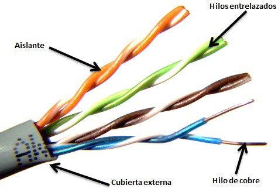

### Trenzado

Los colores del aislante del cobre están estandarizados en el caso del multipar de cuatro pares (ocho cables), y son los siguientes:

1.  Blanco-Naranja
2.  Naranja
3.  Blanco-Azul
4.  Azul
5.  Blanco-Verde
6.  Verde
7.  Blanco-Marrón
8.  Marrón

Cuando ya están fabricados los cables unitariamente y aislados, se trenzan según el color que tenga cada uno.

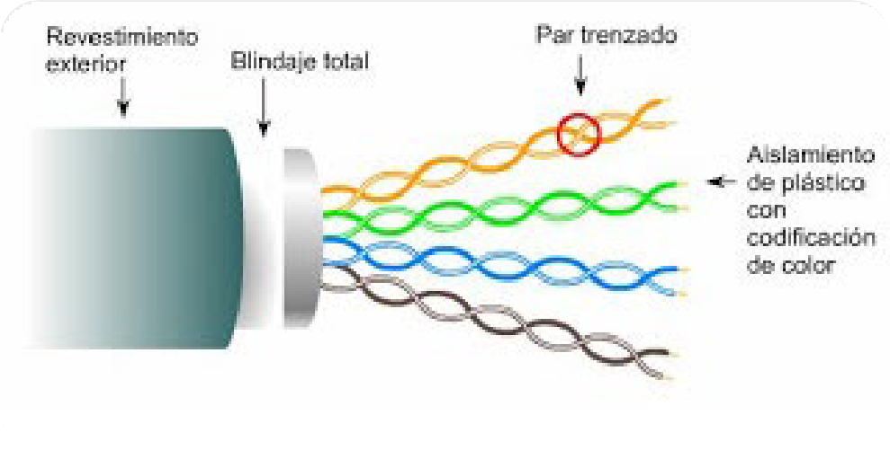

Las **agrupaciones de los pares** dentro del cable es la siguiente:

-   Par 1: Blanco-Azul con Azul
-   Par 2: Blanco-Naranja con Naranja
-   Par 3: Blanco-Verde con Verde
-   Par 4: Blanco-Marrón con Marrón


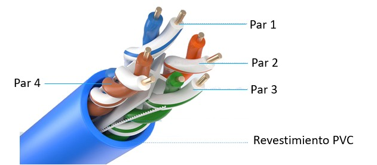


### Estándar TIA/EIA 568A y 568B

Existen dos estándares que dan lugar al **cable directo** o al **cable cruzado** según sus combinaciones en el **conector** *RJ-45*; el **TIA/EIA-568-A** o el **TIA/EIA-568-B**:


### Cable directo

Para el cable de red **directo** se aplica un solo estándar de cableado: ambos extremos del cable en el conector usan el mismo estándar (TIA/EIA-568-A o TIA/EIA-568-B)

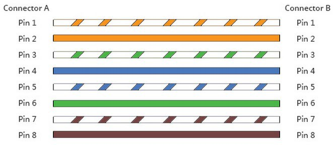

### Cable cruzado

Para el **cable de red cruzado** en un extremo se aplica un estándar y en el otro extremo del conector el contrario.

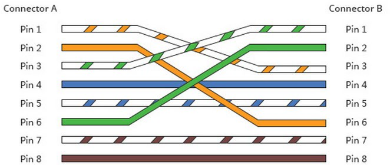

### Cable directo vs cruzado

Existe una diferencia importante en el uso de un cableado u otro:

-   En general, el **cable cruzado** se utiliza para conectar dos dispositivos del mismo tipo, como por ejemplo un PC a un PC o un switch a otro switch.

-   Por otro lado, el **cable directo** conecta dos dispositivos diferentes entre sí, como por ejemplo un PC y un switch.

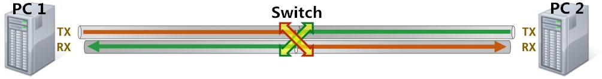

### Tipos cable par trenzado

El cable trenzado puede a su vez clasificarse en los siguientes **tipos** según su grado de protección externa (o blindaje):

-   **UTP** (*Unshielded Twisted Pair o Cable trenzado sin apantallar*) Son cables de pares trenzados sin apantallar que se utilizan para diferentes tecnologías de red local. Son de bajo costo y de fácil uso, pero producen más errores que otros tipos de cable y tienen limitaciones para trabajar a grandes distancias sin regeneración de la señal.
-   **FTP** (*Foiled Twisted Pair o Par trenzado con pantalla global*) Los pares se recubren de una malla conductora global en forma trenzada. De esta forma mejora la protección frente a interferencias, teniendo una rigidez intermedia. Más caros que los cables UTP.
-   **STP** (*Shielded Twisted Pair o Par trenzado apantallado*) Se trata de cables de cobre aislados cada uno de ellos dentro de una cubierta protectora. Se utilizan para redes que requieren altas prestaciones con protección frente al ruido. Son cables bastante rígidos.

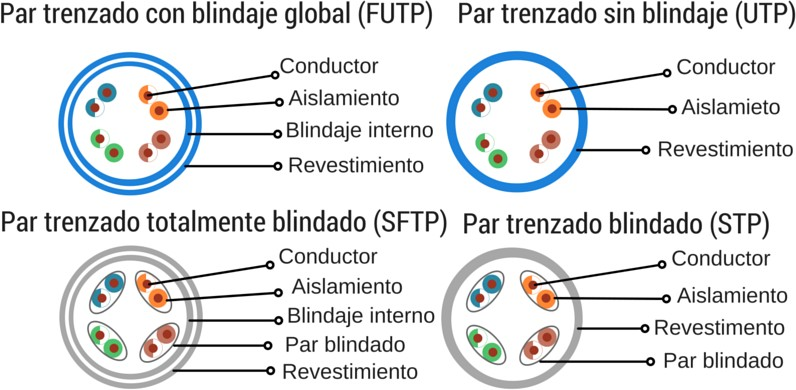

De acuerdo con la norma internacional *ISO / IEC11801*, se debe usar una letra de código especial para designar uno u otro par trenzado tipo.

### Categorías cable par trenzado

Según la calidad y el tipo, los cables de red se clasifican en las siguientes categorías, las cuales nos ayudan a saber las características de los mismos:

|  **Categoría**   | **Dista. (m)** |  **Aplicaciones** | **Velocidad** |  **Mhz** |  **Uso** |         |         |               |
|------------------|----------------|-------------------|---------------|----------|----------|---------|---------|---------------|
|                  |                |                   | 10 Mb/s       | 100 Mb/s | 1 Gb/s   | 10 Gb/s |         |               |
| **Categoría 3**  | 50             | 10Base-T          | X             |          |          |         | 16Mhz   | Telefonía     |
| **Categoría 4**  | 100            | Token-Ring        | X             |          |          |         | 20Mhz   | En desuso     |
| **Categoría 5**  | 100            | 10/100Base-T      | X             | X        |          |         | 100Mhz  | Ethernet      |
| **Categoría 5e** | 100            | 100/1000Base-T    | X             | X        | X        |         | 100Mhz  | Ethernet      |
| **Categoría 6**  | 100            | 1000Base-T        | X             | X        | X        |         | 250Mhz  | Ethernet      |
| **Categoría 6a** | 100            | 10GBase-T         | X             | X        | X        | X       | 500Mhz  | Ethernet      |
| **Categoría 7**  | 100            | 10GBase-T         | X             | X        | X        | X       | 600Mhz  | Ethernet      |
| **Categoría 7a** | 100            | 10GBase-T         | X             | X        | X        | X       | 1000Mhz | Ethernet y Tv |
| **Categoría 8**  | 100            | 40GBase-T         | X             | X        | X        | X       | 1200Mhz | Ethernet y Tv |

### Conectores RJ

Registered Jack (**RJ**) es el conector estándar que se usa para el cableado de telecomunicaciones de par trenzado.

El conector **RJ** de destino se llama **roseta**.

Se denotan a partir de las posiciones y el número de contactos de las mismas.


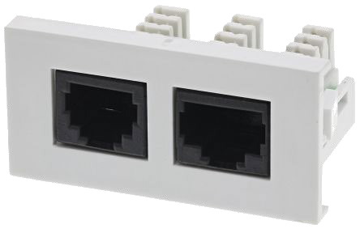

### Categorías conectores RJ

```note
El cable de par trenzado utiliza conectores de tipo RJ-45, diseñados para la conexión de equipos en redes de datos y voz digitales.
```

No obstante, existen diversos tipos de conectores RJ, algunos ya en desuso:

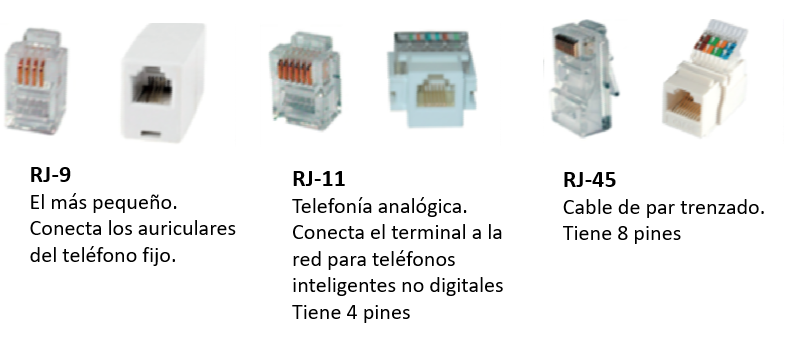


### Ventajas y desventajas

**Ventajas del par trenzado:**

-   Bajo costo.
-   Alto número de estaciones de trabajo por segmento.
-   Facilidad para el rendimiento y la solución de problemas (mantenimiento).

**Desventajas del par trenzado:**

-   Altas tasas de error a altas velocidades.
-   Ancho de banda limitado.
-   Baja inmunidad al ruido.
-   Distancia limitada (100 metros por segmento).

## Medios guiados: cable coaxial

```note
El cable coaxial está compuesto por dos conductores concéntricos. En el interior va el conductor, un hilo de cobre sólido o hilos trenzados de cobre. El recubrimiento exterior es una malla de hilos de cobre o de aluminio. 
```

Las dos capas están separadas por una capa aislante de un material *dieléctrico* (por lo general, polietileno), y en ocasiones también por una pantalla de aluminio. El cable, al igual que el UTP, está recubierto por un *material aislante*, como el PVC.

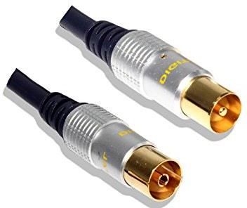
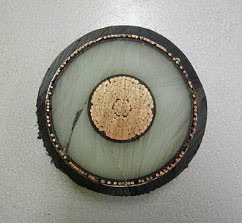
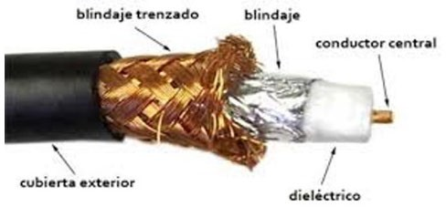

Este tipo de cable es más resistente que el cable de par trenzado a las interferencias y otras adversidades, y tiene poca pérdida por lo que es una opción bastante eficiente cuando hay grandes distancias.

En redes locales su uso ha quedado relegado a las que se fijan con topología de bus, que prácticamente están obsoletas. Su conector más habitual solía ser el BNC.

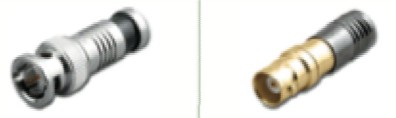

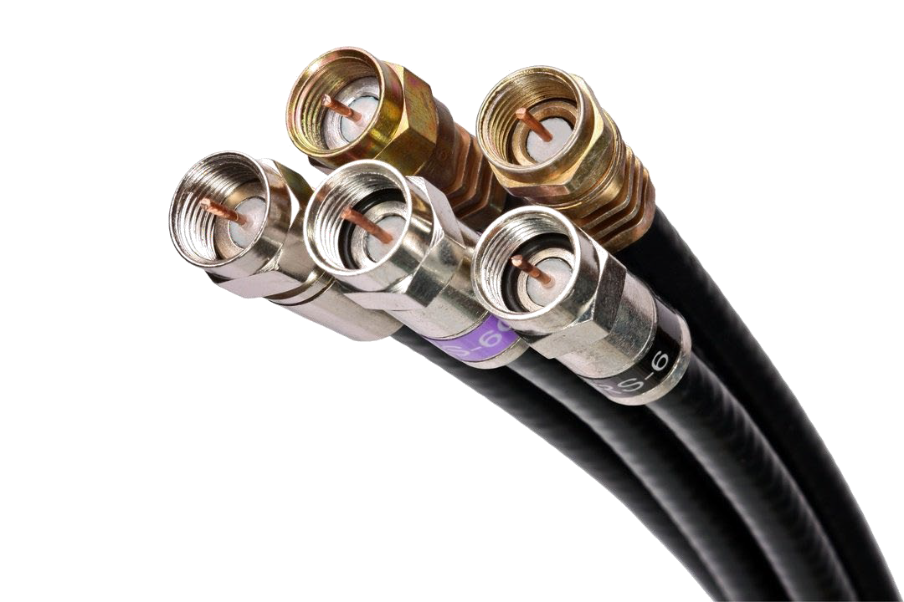

## Medios guiados: fibra óptica

```note
La fibra óptica está diseñada para transportar señales de luz. Se trata de un cilindro de pequeña sección flexible (diámetro del orden de 2 a 125 micras) por el que se transmite la luz. 
```

A continuación, viene una cubierta plástica delgada para proteger el revestimiento e impedir que cualquier rayo de luz del exterior penetre en la fibra.

Finalmente, varias fibras suelen agruparse en haces protegidos por una funda exterior.

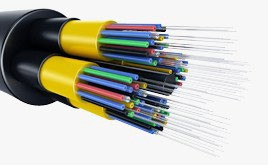
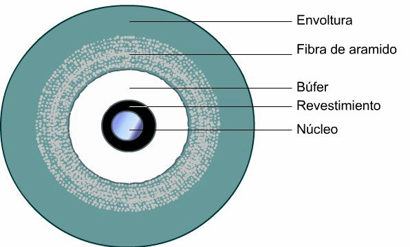

### Estructura y características


**Estructura:**

-   Revestimiento rígido (nailon o poliéster).
-   Sustancia que protege la fibra (acrilato).
-   Hilo de vidrio o plástico.

**Características de la fibra:**

-   Pérdidas bajas en larga distancia.
-   Muy alta capacidad de transmisión y ancho de banda
-   La información se transmite por luz que rebota en el cable.

### Tipos fibra óptica

Según la trasmisión de la luz, existen de dos tipos de cables de fibra óptica:
-   **Monomodo**: la fibra es tan delgada que la luz se transmite en línea recta. El núcleo tiene un radio de 10 micrones y la cubierta, de 125 micrones.
-   **Multimodo**: La luz se transmite por el interior del núcleo incidiendo sobre su superficie interna, como si se tratara de un espejo. Las pérdidas de luz en este caso también son prácticamente nulas. El núcleo tiene un diámetro de 50 micrones y la cubierta, de *140 micrones*.

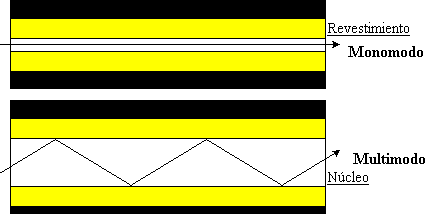

### Conectores fibra óptica

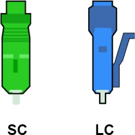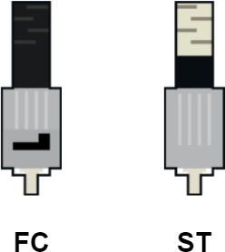

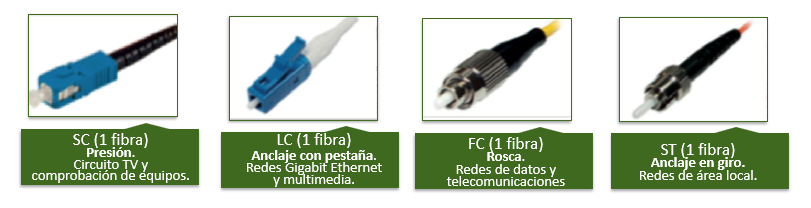

## Medios no guiados: transmisión inalámbrica

La transmisión de información a través del aire se realiza utilizando **ondas electromagnéticas**. Se transmiten, reciben o propagan desde un punto de la Tierra a otro, a la atmósfera o al espacio.

Este tipo de ondas se propaga por el espacio (independientemente de cuál sea su frecuencia) a la velocidad de la luz; a la particularidad que tiene este tipo de ondas de viajar por el espacio es a lo que se le denomina técnicamente como propagación de las ondas electromagnéticas.

Una onda electromagnética se define con tres parámetros:

1.  La **frecuencia**: nos define el número de ondas que se transmiten en un segundo.
2.  La **velocidad**: que como decíamos es siempre la misma, ya que es independiente de la frecuencia. Esta velocidad es igual a la velocidad de la luz (300.000 km/s)
3.  La **longitud de onda**: que es el resultado de dividir la velocidad de propagación (la velocidad de la luz) por la frecuencia. El resultado viene expresado en metros.

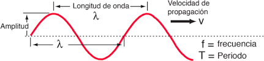

### Espectro electromagnético

```note
El espectro electromagnético es el conjunto de radiaciones electromagnéticas que se propagan a través del espacio en forma de ondas ordenadas en función de su energía (de izquierda a derecha, de menor a mayor energía).
```

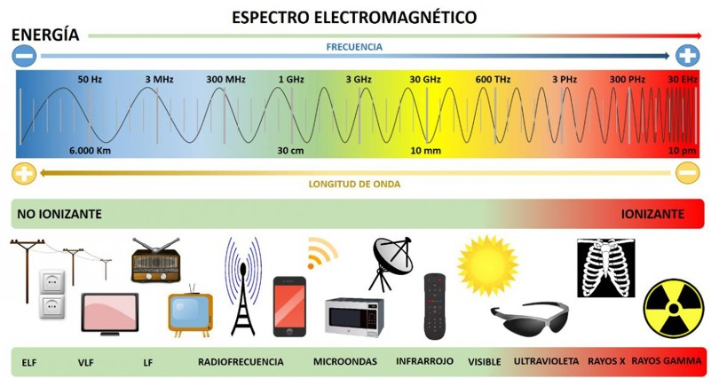

Para la **transmisión inalámbrica** nos vamos a fijar en el espectro relativo a los campos electromagnéticos, en las **ondas de radio** y las **microondas**.

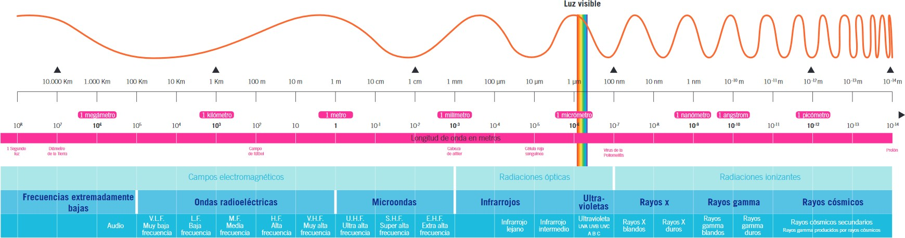


|            | **Espectro de bandas de frecuencia** | **Frecuencia**  | **Longitud onda** | **Usos**                |
|------------|--------------------------------------|-----------------|-------------------|-------------------------|
| Radioondas | ELF (Extremely Low Frequency)        | 3 – 300 hz      | 10.000km          | Submarinos              |
|            | VLF (Very Low Frequency)             | 3 - 30 kHz      | 100 – 10 km       | Geofísica, GPS          |
|            | LF (Low Frequency)                   | 30 - 300 kHz    | 10 – 1 km         | Radiofaros              |
|            | MF (Medium Frequency)                | 300 kHz - 3MHz  | 1 km – 100 m      | Radio AM                |
|            | **HF** (Very High Frecuency)         | 30 – 300 MHz    | 10 – 1 m          | Radio FM, TV            |
|            | VHF (High Frequency)                 | 3 – 30 MHz      | 100 – 10 m        | Radioaficionados        |
| Microondas | **UHF** (Ultra High Frequency)       | 300 MHz – 3 GHz | 1 m – 10 cm       | Telefonía, 4G, TV, WiFi |
|            | **SHF** (Super High Frequency)       | 3 – 30 GHz      | 10 – 1 cm         | WiFi, satélite, radar   |
|            | **EHF** (Extremely High Frequency)   | 30 – 300 GHz    | 1 – 0,1 cm        | Satélite, militar, 5G   |


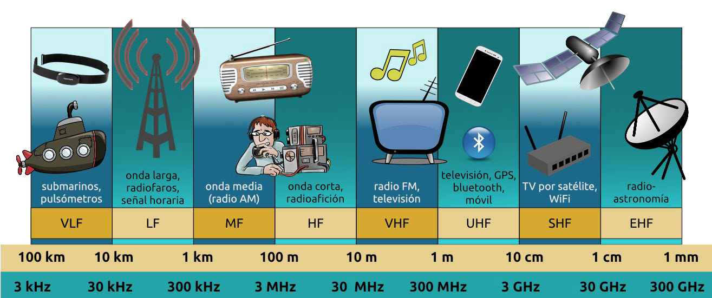
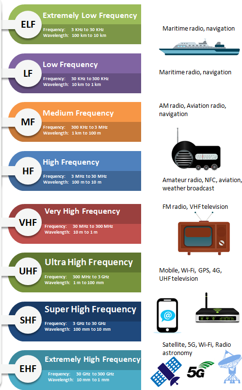Medios no guiados: transmisión inalámbrica

### Radioondas y microondas

Las **radioondas** u **ondas de radio** operan entre el **ELF** y **UHF** (entre *3hz a 300Mhz*)
-   Se transmiten en todas las direcciones y se difractan por el terreno llegando lejos.
-   Poco sensibles a inclemencias meteorológicas.
-   Ejemplo: submarinos, radio AM, radio FM y televisión.


Las **microondas** operan entre el **UHF** y **EHF**
-   Para punto a punto, casi en línea recta.
-   Puede utilizar antenas o antenas parabólicas:
    -   Microondas terrestres: para menor distancia.
    -   Satélite: en grandes distancias.
-   Ejemplo: redes de telefonía móvil, redes WiFi.

### Bandas de telefonía

-   La telefonía móvil en España utiliza las bandas de *700, 800, 900, 1500, 1800, 1900, 2100, 2600 y 3500 MHz.*

-   Están reguladas. En España el **Cuadro Nacional de Atribución de Frecuencias** (*CNAF*) se encarga de distribuir las frecuencias mediante subasta pública.

    <https://www.mincotur.gob.es/telecomunicaciones/Espectro/Paginas/CNAF.aspx>

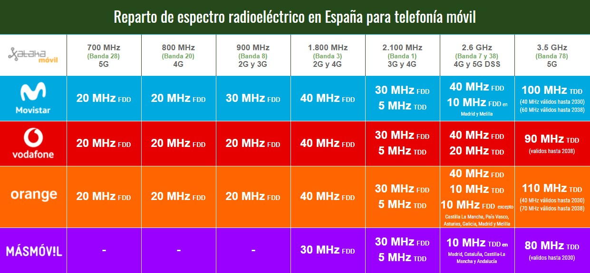

### Banda ISM
-   Las bandas ISM *(Industrial, Scientific and Medical)* son bandas reservadas internacionalmente utilizadas para fines no comerciales y sin licencia.
-   Funcionan entre **2,4 GHz y 5 GHz**.
-   Segmentada en canales para uso **WLAN** (WiFi) y **WPAN** (Bluetooth), teléfonos inalámbricos, etc.

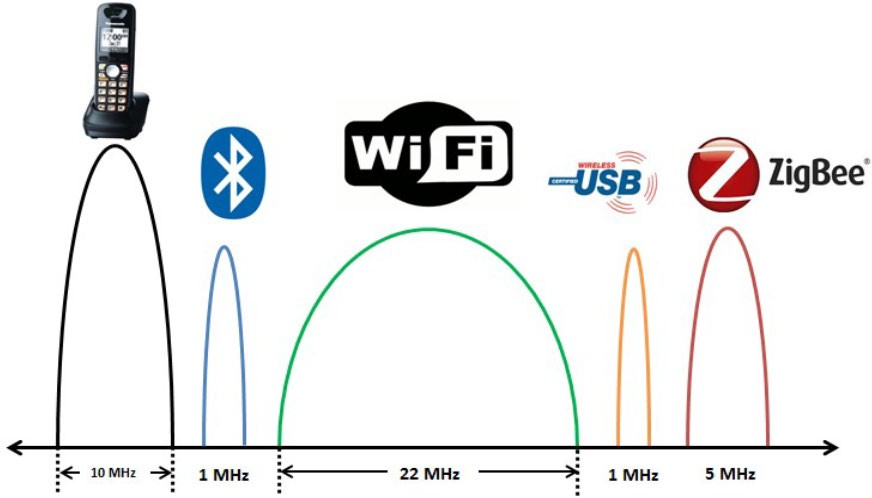

### Infrarrojos

-   Permiten la comunicación usando una serie de leds rojos.
-   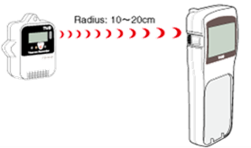Frecuencias entre 300 GHz y 384 GHz.
-   Los dispositivos deben estar alineados cerca el uno del otro y la información enviada suele ser bastante limitada.
-   Puede ser:
    -   Por haz directo: sin obstáculos entre emisor y receptor.
    -   Por haz difuso: con potencia para salvar obstáculos.

### Infraestructura redes WiFi 

El **SSID** de una WiFi es una cadena alfanumérica de 32 caracteres de longitud, que sirve para identificar a la red.

A la hora de crear una red inalámbrica WiFi se utilizan dos alternativas:
-   **Modo infraestructura**: extiende una red de cable de modo que sea accesible por otros dispositivos inalámbricos a través de un **punto de acceso inalámbrico** (AP).
-   **Modo Ad-hoc**: son redes de equipo a equipo creadas por los propios dispositivos inalámbricos, sin ningún punto de acceso ni controlador central, es decir, cada dispositivo se conecta con otros dispositivos directamente.

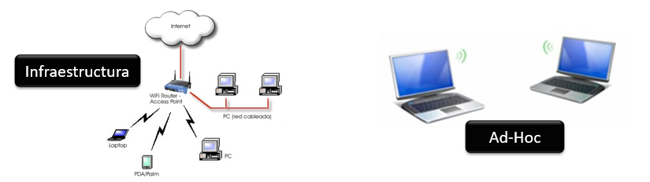


- **STA** *(Station)*

    Cualquier equipo capaz de conectar inalámbricamente con un AP.

-   **AP** *(Access point)*

    Estación que da conexión inalámbrica a las STAs asociadas.

-   **BSS***(Basic service set)*

    Conjunto de un AP con sus STAs asociados.

-   **ESS** *(Extended service set )*

    Conjunto de 2 o más BSS integrados formando un único segmento de red lógico. Cada ESS está identificado por un **SSID**.

-   **DS (Distribution system)**

    Es el sistema que interconecta BSS.

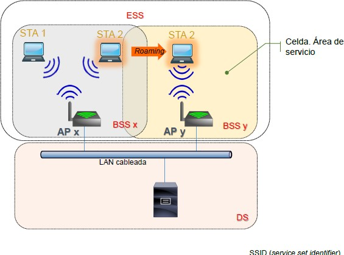

### Infraestructura redes de telefonía

Tanto las antenas como los terminales móviles son emisores-receptores de ondas electromagnéticas con frecuencias entre *900 y 2000* MHz.

La operadora reparte el área de cobertura en varios espacios llamados células, normalmente hexagonales, como en un juego de tablero, creando una inmensa **red de hexágonos**, de donde proviene el nombre de red celular.

En cada célula hay una **estación base** que será una antena que tiene una amplitud para emitir y recibir en ese hexágono de espacio (célula).

Las operadoras de telefonía móvil tienen **centrales de conmutación**, que son las que permiten en última instancia la conexión entre dos terminales concretos.

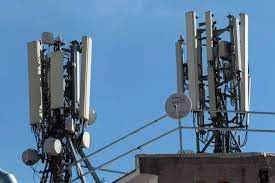

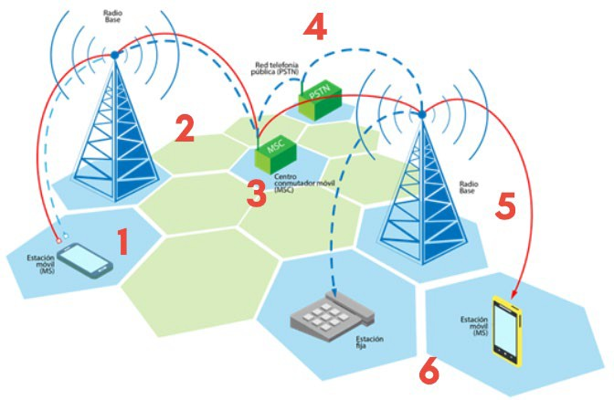

1.  La llamada inicia al usar el terminal móvil (Estación Móvil MS).
2.  La llamada es captada por la antena de transmisión más cercana.
3.  La llamada es enviada a la Central de Conmutación Móvil MSC.
4.  La llamada se envía a la Red de Telefonía Pública (PSTN).
5.  La llamada pasa por otras antenas y centrales o hasta la misma red fija convencional
6.  La llamada llega al teléfono con el que se desea hablar sea fijo o móvil

## Medios no guiados: estándares inalámbricos

La gran mayoría de los estándares inalámbricos están desarrollados por el grupo de trabajo **IEEE 802**. Los distintos estándares inalámbricos los hemos visto y estudiado en la unidad anterior.

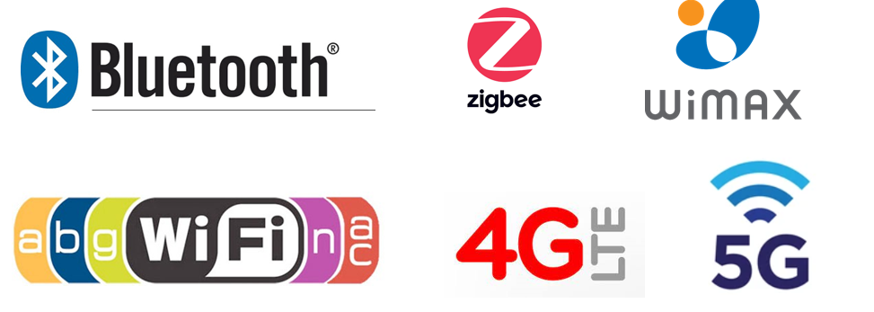

## Topología de cableado en edificios

```note
La topología más empleada al montar una red de datos es la topología estrella. 
```

Esta topología es adecuada para edificios de pequeño tamaño, donde las distancias entre los equipos de trabajo y el centro de cableado no supera los 100m.

Para edificios más grandes o de varias plantas se utiliza una topología de **estrella extendida**, haciendo que cada planta tenga un **distribuidor de planta**.

Cada uno de estos distribuidores se comunicará con un **distribuidor de edificio**, creando una estrella entre todos estos núcleos.

Las líneas de cada planta que enlazan los equipos de trabajo con el distribuidor de planta se llama **cableado horizontal** y las líneas que comunican el distribuidor de edificio con cada distribuidor de planta se llama **cableado vertical** o **backbone**.

En redes más complejas, con más de un edificio, existe un **distribuidor de campus**

que conecta los diferentes distribuidores de edificio.

### Cableado horizontal


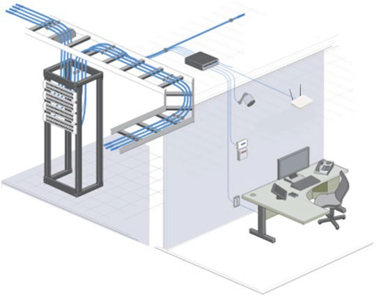

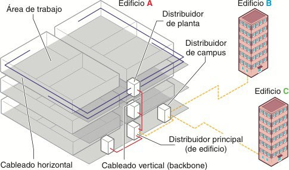


## Armario de distribución (racks)

```note
Los armarios de distribución, también llamados racks, son los puntos donde se centraliza el cableado de una red de diferentes niveles (edificio, planta, aula..)
```

El **rack** recibe todo el cableado de la zona. En el interior del armario se pueden ubicar los siguientes elementos:

1.  **Paneles de parcheo**: donde se conecta el cableado que entra y sale del armario.
2.  **Dispositivos de red**: se utilizan para implementar la red de comunicaciones a nivel lógico (hubs, switches, routers, bridges, gateways…)
3.  **Elementos de suministro eléctrico**: proporcionan electricidad a los dispositivos de red y al sistema de ventilación o sistemas SAI.
4.  **Otros accesorios**: elementos para ordenar cableado, bandejas, etc.

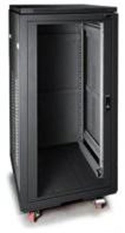

La parte delantera de los racks es una puerta, habitualmente de cristal o un material transparente, que permite visualizar el contenido del armario sin tener que abrirlo.

Las paredes, la puerta y el techo son desmontables para facilitar la instalación de los elementos que se colocarán dentro.

Además, el suelo y el techo pueden tener una abertura para pasar todo el cableado.

> El interior de un armario rack tiene 4 bastidores que forman un armazón de **19 pulgadas de anchura**.  

```note
Los bastidores tienen agujeros cada 5 cm, esta distancia se llama unidad U, de modo que la altura de un armario se mide en unidades U Los elementos para racks también se miden en unidades U.
```

Podemos encontrar los siguientes tipos de racks:

-   Menores de **12U**: se utilizan en instalaciones de pequeñas redes o como distribuidores de espacios con pocos ordenadores.
-   Entre **12U** y **24U**: se usan para redes de tamaño medio. Ideales para distribuidores principales o de planta.
-   Más de **24U**: se emplean en redes de tamaño medio o grande como distribuidores de planta o principales.

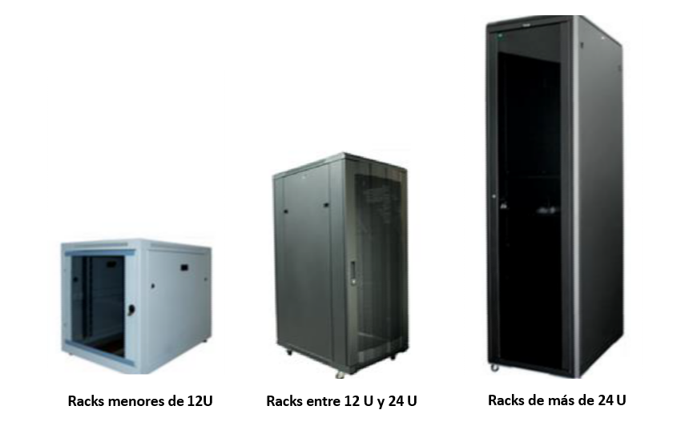 


## Tarjeta o adaptador de red (NIC)

```note
Una tarjeta o adaptador de red, conocida también como NIC (Network Interface Card), básicamente realiza la función de intermediario entre el ordenador y la red de comunicación.
```

En dicha tarjeta se encuentran grabados los protocolos de comunicación de la red, en los niveles físico, enlace de datos y red.

Se conecta al ordenador a través de sus ranuras de expansión PCI o mediante un puerto USB, aunque la mayoría de los equipos disponen de esta tarjeta integrada directamente en la placa base.

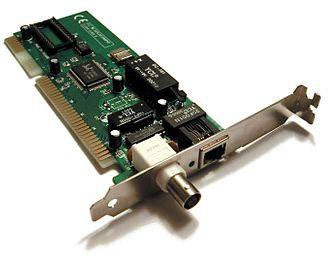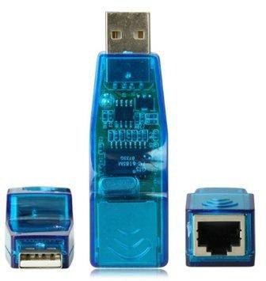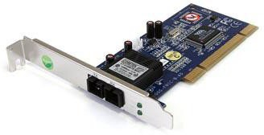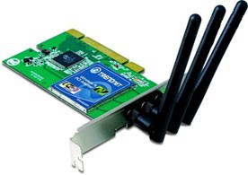

Los pasos que sigue una NIC para transmitir información por el medio son:

-   Determinar la velocidad de transmisión, la cantidad de bits a transmitir, el tamaño de la memoria intermedia (buffer), etc.
-   Convertir el flujo de bits en paralelo a una secuencia en serie.
-   Codificar la secuencia de bits en serie formando una señal eléctrica adecuada.

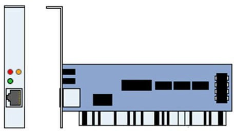

Una tarjeta de red por lo general tiene dos indicadores luminosos (LEDs):

-   El indicador verde se activa cuando la tarjeta esta recibiendo electricidad.
-   El indicador naranja (10Mb/s) o rojo (100Mb/s) muestra actividad de red utiliza (envió o recepción de datos).

### Características

-   **Modo de transmisión**: Soporte Half o Full duplex
-   **Velocidad de conexión**. (10/100/1000) Megabits por segundo.
-   **Tipo de conexión** (PCI, PCMCIA, USB, Inalámbrica…)
-   **Conectores y Topología** (AUI, BNC, RJ45)
-   **Wake-On-LAN** (WOL)
-   **Normas compatibles.** (*Ethernet, IEEE 802.x*…)
-   **Controladores de LAN** (Sistemas Operativos en que funciona)

**Modo de transmisión:**
-   **Half duplex**: el canal de comunicación no se puede utilizar para enviar y recibir información simultáneamente.
-   **Full-duplex**: el canal de comunicación permite enviar y recibir información simultáneamente.

**Conectores:**

-   Para **Ethernet:** RJ-45 10/100/1000
-   Para **coaxial: BNC**.. (en desuso)
-   Para **fibra FC:** ST, LC, FC, ST
-   **Inalámbricos**: Antenas WiFi o bluetooth

**Modo Wake On LAN (WOL):**

Permite encender/apagar un equipo a través de la tarjeta de red de forma remota.

### Dirección MAC

```note
Cada tarjeta de red (NIC) tiene un número de identificación único de 48 bits, codificado en hexadecimal, que asignan los fabricantes legales de Hardware denominado dirección MAC (Media Access Control) también conocido como dirección física y que es independiente al protocolo de red que se utilice.
```

Estas direcciones únicas MAC son administradas por el “Instituto de Ingeniería Eléctrica y Electrónica” (**IEEE**, Institute of Electronic and Electrical Engineers) como ya vimos en temas anteriores.

Cada dispositivo tiene su propia dirección MAC determinada y configurada por el IEEE (los últimos 24 bits) y el fabricante (los primeros 24 bits).


## Dispositivos de interconexión

```note
Un dispositivo de interconexión de red permite la conexión de los dispositivos de una red. Dependiendo el tipo de red y el medio físico usará unos protocolos u otros.
```

Estos dispositivos se concentran normalmente en los armarios de distribución. Los principales dispositivos de red que podemos encontrar son:

1.  Repetidor (Repeater)
2.  Concentrador (Hub)
3.  Conmutador (Switch)
4.  Puente de red (Bridge)
5.  Enrutador (Router)
6.  Pasarela (Gateway)
7.  Punto de acceso (Wireless Access Point)

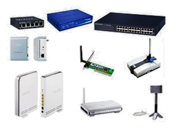

Símbolos generales utilizados para representar los distintos dispositivos de red:

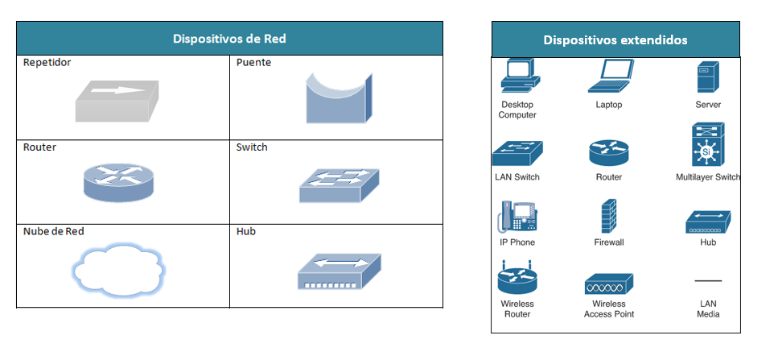 

### Repetidor (repeater)

```note
El repetidor es un dispositivo de red cuya función es captar una señal, amplificarla y enviarla, sin darle ningún tipo de tratamiento.
```

El repetidor trabaja en la **capa física** (nivel 1) del modelo OSI.

Se utilizan repetidores cuando hay zonas de la red donde la señal no llega con suficiente potencia y su función es amplificar la cobertura de redes inalámbricas. En este caso, el repetidor se coloca en un punto estratégico de la red que garantice que los equipos a los que se pretende dar cobertura reciban adecuadamente la señal.

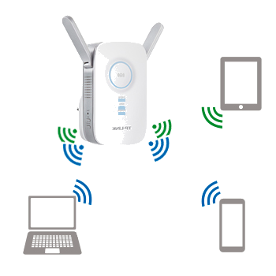


El repetidor inalámbrico dispone de al menos una antena y una conexión de entrada RJ-45. Se puede utilizar de dos formas:

-   **Vínculo inalámbrico**: la red que se quiere ampliar debe disponer de una antena emisora a la que conectar el repetidor para amplificar la señal.
-  **Extensión cableada**: el repetidor es un dispositivo que está en la red cableada que se quiere ampliar.


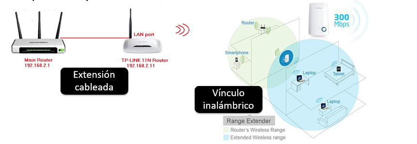

## Concentrador (Hub)

```note
Un hub o concentrador es un dispositivo de red empleado para unir tramos de red, favoreciendo la ampliación de redes. El hub recibe una señal por uno de sus puertos y la repite emitiéndola por cada uno de los demás puertos.
```

Es un dispositivo que también trabaja en la **capa física** (nivel 1) del modelo OSI.

Un hub *Ethernet* tiene entre 4 y 48 tomas RJ-45. Los modelos rackeables tienen al menos 16 tomas RJ-45, con una toma especial en uno de los extremos, marcada como **up-link**.

La finalidad de la toma Up-link es vincular dos hubs para poder extender la red. A esta operación se le llama **poner los hub en cascada.**

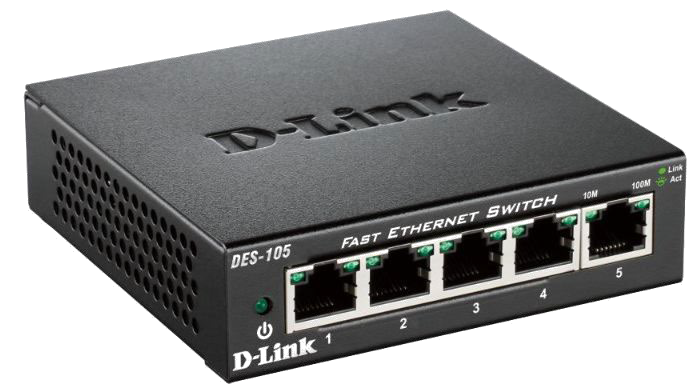

El hub se parece al repetidor en tanto que trabaja también en la capa física del modelo OSI: toda la información que llegue a él proveniente de un equipo se replica a todas las tomas con cable, llegando así a todos los equipos conectados a la red.

El hecho de que no funcione en redes por encima de Fast-Ethernet, unido al alto tráfico que produce en la red, con los consiguientes problemas de seguridad, han hecho que en la actualidad sus tareas hayan sido reemplazadas por los switch.

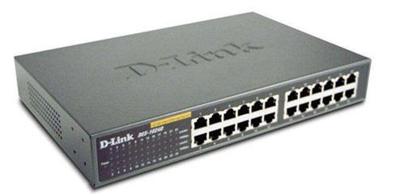

### Switch (Conmutador)

```note
El switch o conmutador es un dispositivo de red cuya función es interconectar varios segmentos de red a nivel de enlace.
```

El switch es un dispositivo que opera en la **capa de enlace de datos** (nivel 2) del modelo OSI. Los switch pueden interpretar la dirección de destino de los paquetes de información que llegan a él, y remitirlos al segmento que les corresponde.

> Los switch utilizan un mecanismo de autoaprendizaje usando el protocolo *ARP* que le permite construir **tablas con las direcciones MAC** de los equipos presentes en cada segmento de red (puerto).

Cuando se envía un paquete de un segmento a otro, el switch lo detecta y lo deriva al segmento correspondiente en función de su dirección MAC. Cuando el equipo de destino está en el mismo segmento, el switch lo detecta e impide que pase a otros segmentos, reduciendo el tráfico redundante en la red.

Este dispositivo se aplica normalmente a redes estrella y árbol. Podemos encontrar switch de cable coaxial o de fibra óptica, pero los más comunes son los de cable de par trenzado.

El switch puede trabajar a varias velocidades, según el protocolo que admita *(Ethernet/ Fast-Ethernet/ Gigabit-Ethernet).*

Algunos modelos de switch tienen una o dos tomas de fibra óptica para enlazar segmentos de red construidos en cable de par trenzado con segmentos de fibra óptica, o para vincular tramos de red utilizando fibra óptica como medio de conexión.

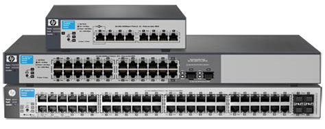


La mayor parte de los switch modernos incorporan PoE. El estándar **PoE** *(Power over Ethernet)* es un estándar definido en la noma **IEEE 803.af** que permite suministrar energía eléctrica a un dispositivo de red a través del cable de datos de la conexión Ethernet.

El consumo del dispositivo alimentado debe ser reducido, pero puede ser suficiente para alimentar por ejemplo una cámara web, que no necesitaría de una fuente de alimentación alternativa, proporcionándole mayor independencia y flexibilidad.

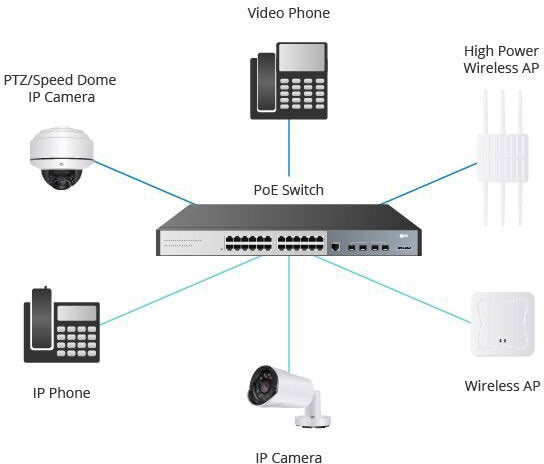

Esquema de switches:


 

### Puente (bridge)

```note
Un puente o bridge es un dispositivo que conecta dos redes de distintas topologías y protocolos a nivel de enlace, por ejemplo una red Ethernet y una Token-Ring.
```

Es un dispositivo que funciona a nivel de la **capa de enlace** (nivel 2) del modelo OSI.

Los puentes, al igual que los switch, reciben los paquetes enviados por cada red acoplada a él, y los reenvían selectivamente entre las redes de área local, utilizando sólo las **direcciones MAC** para determinar donde retransmitir cada paquete. Los puentes reenvían sólo aquellos paquetes que están destinados a un nodo del otro lado del puente, descartando (filtrando) aquellos que no necesitan ser retransmitidos. A diferencia de los switch suelen tener solo 2 puertos.


Las funciones de un puente son:

-   Dividir una red de área local en dos subredes. Cuando una red de área local se hace demasiado grande, en cuanto a número de nodos, debe ser dividida para que su rendimiento sea mejor.
-   Interconectar dos redes de área local, pudiendo tener protocolos de nivel de enlace o medios de transmisión distintos. Como puede ser la interconexión de una red inalámbrica a una de cable o una red Ethernet a otra Token Ring.
-   Controlar las tramas defectuosas.


Un brigde se diferencia por tanto de un switch en que:

 -   Tiene solo 2 puertos.
 -   No es configurable.
-   No existe en formato rackeable.

### Router (enrutador)

```note
El router o enrutador es un dispositivo permite la interconexión de redes locales, pudiendo ser diferentes entre sí hasta el nivel de red.
```

El router es por tanto un dispositivo que trabaja a nivel de la **capa de red** (nivel 3) del modelo OSI.

> Mientras que el hub, el switch y el brigde trabajan con segmentos de una misma red, el router es capaz de conectar redes diferentes.

El router independiente es conocido también como SoHo (*Small Office Home Office*)

- Están orientados a las pequeñas empresas.
- Integran servicios como pueden ser el DHCP, filtrado de conexiones por MAC, etc.


Un **router rackeable** ofrece:

-   Conexiones de diferente tipo y velocidades, desde conexiones COM (puerto serie) hasta conexiones de fibra óptica, pasando por conexiones RJ-45.
-   Slots de conexión en la parte delantera para instalar tarjetas de ampliación con las conexiones que se necesiten.


Se utiliza a su vez el término **router neutro**, para diferenciar aquellos routers que unen dos redes locales y los que permiten conectarse externamente a Internet.

Un router suele integrar además:

-   Un sistema operativo propio. El más conocido se llama IOS y es de Cisco.
-   Memoria RAM y flash.
-   Funciones de capas inferiores a la 3, esto implica que puede funcionar como un switch o un brigde.


### Pasarela (Gateway) 

La **pasarela** (**Gateway)** o **puerta de enlace** es un dispositivo que actúa de interfaz de conexión entre aparatos o dispositivos, y se utiliza de dispositivo principal de conexión a la red.

Se trata, por tanto, de una definición abstracta de una función que pueden desempeñar ciertos modelos de router o un **servidor** que haga dicha función. En caso de utilizar un servidor u ordenador dedicado, se usarán varias tarjetas de red y programas de conversión y comunicación.

Es un dispositivo que puede funcionar a todos los niveles de la capa OSI, aunque generalmente lo hace en la **capa de aplicación** y que por tanto permite interconectar arquitecturas diferentes a todos los niveles de comunicación.


Sus principales funciones pueden ser:

-   **Cortafuegos**: es un elemento de seguridad que controla el tráfico de datos entrante y saliente de una red, de acuerdo a unas **reglas** que establecen qué se puede admitir y qué no.
-   **Proxy**: es un elemento de seguridad que actúa como intermediario entre dos equipos. También funciona con reglas para regular el tráfico de datos, pero las reglas se hacen a nivel de equipo, en lugar de a nivel de la red completa.
-   **VPN (Virtual Private Network):** la red privada virtual es una función que permite conectarse de forma segura a una LAN privada desde una red pública (Internet).

Además, un Gateway puede realizar funciones de capas inferiores, comportándose como un switch o un router. A cambio de todas sus funcionalidades y flexibilidad, el retardo de propagación para la comunicación que atraviesa una pasarela es mucho mayor que en otros dispositivos ya vistos.

> No confundir con la puerta enlace predeterminada que veremos más adelante.

### Punto de acceso (WAP)

```note
Un punto de acceso o WAP (Wireless Access Point) es un dispositivo inalámbrico de red empleado para extender redes cableadas, ofreciendo conexión a las mismas a través de ondas electromagnéticas.
```

Muchos de los WAP funcionan a nivel de la capa de red (capa 3) del modelo OSI, y hacen también función de routers; en ese caso se denominan **routers WiFi**.

No obstante, no siempre es así en todos los modelos y muchos WAP solo funcionan a nivel de la capa 1, teniendo como ventaja su configuración más sencilla.

Los WAP, al igual que los repetidores, se ubican en lugares estratégicos de la red, para dar cobertura a los equipos inalámbricos o zonas de trabajo establecidas.


Muchos de los WAP pueden actuar como **repetidor** o **bridge**. Para ello, debe integrar la **tecnología WDS** (*Wireless Distribution System*), que permite la interconexión de este tipo de dispositivos entre sí.


Los **puntos de acceso mesh** (o sistemas de redes mesh) son dispositivos de interconexión que forman una red **inalámbrica distribuida**, diseñada para proporcionar una cobertura Wi-Fi amplia y estable.


A diferencia de los puntos de acceso WAP convencionales, que dependen de un único enrutador o repetidor, los sistemas mesh trabajan en conjunto para ofrecer una experiencia uniforme y sin interrupciones.

Además de cara al usuario funcionan de forma transparente creando una única red Wifi con el mismo SSID y contraseña.

Las redes mesh son capaces de redirigir el tráfico por la red de la forma óptima para disponer siempre de la mejor señal posible.

Diseño de una **topología física** con sus diferentes dispositivos de interconexión:


