# UT5.4 Direccionamiento IP y creación de subredes

## Direcciones IP

Cualquier equipo conectado a una red necesita estar perfectamente identificado a nivel de la **capa 3 (red)** que ya vimos. De ello se encargan las **direcciones IP**.

El protocolo más utilizado en redes es el *TCP/IP*. Los sistemas operativos siempre lo tienen instalado. El **direccionamiento** es una de las funciones básicas del protocolo.

Una dirección IP se representa y se almacena internamente mediante un número binario de **32 bits** para IPv4 o de **128 bits** para IPv6.

```note
Las direcciones IP se expresan normalmente con una notación decimal con puntos para IPv4 o hexadecimal dividida por dos puntos en IPv6.
```

Esto se hace así porque a los humanos nos resulta más fácil entender la notación decimal con puntos que la binaria. 

Ejemplos de direcciones IP:

192.168.0.10 172.26.3.1 10.0.0.4 2001:DB8:2de::e13

Una **dirección IP** se utiliza por tanto como identificador lógico y jerárquico en redes IP para identificar alguno de los siguientes elementos:
-   **Host o equipo.** Es lo más habitual, identifica un solo host en una red. Por ejemplo, una interfaz de red de un ordenador, un teléfono móvil o cualquier dispositivo conectado a la red.
-   **Red o subred**. Una dirección IP identifica a toda una red de ordenadores.
-   **Difusión o broadcast**. Identifica a todos los equipos (host) de una red o subred.

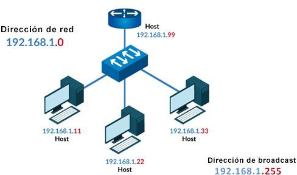

## Direcciones IPv4

```note
Una dirección IPv4 es un número de 32 bits que identifica el punto de conexión (la interfaz) entre un host y una red.
```

El espacio de direccionamiento es 2^32 = 4.294.967.296

Un host con conexiones a varias redes debe tener (al menos) una dirección IP por cada interfaz.

Cada dirección IPv4 tiene a su vez dos partes:
-   Un **NetID** o parte de **red** que identifica la porción de red (designado por una autoridad global), la IANA (*Internet Assigned Number Authority*)
-   Un **HostID** o parte de **host** que identifica dicho host dentro de esa red.

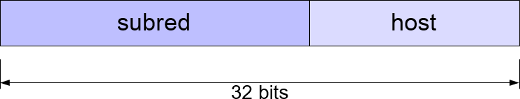

### Tipos de direcciones IPv4

En general existen dos tipos de direcciones IPv4: las **públicas** y las **privadas**. Cada una de ellas, se puede subdividir según su forma de asignación a su vez en direcciones IP **estáticas** o direcciones IP **dinámicas**.

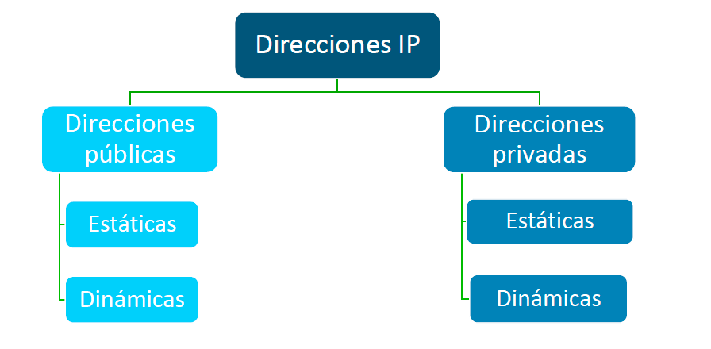

-  Una **dirección IP privada** es utilizada para identificar un dispositivo dentro de una red privada, por ejemplo, en un aula o en una oficina. Las veremos con detalle más adelante.
-  Una **dirección IP pública** son las que se utilizan para conectarse de forma pública directamente a Internet.


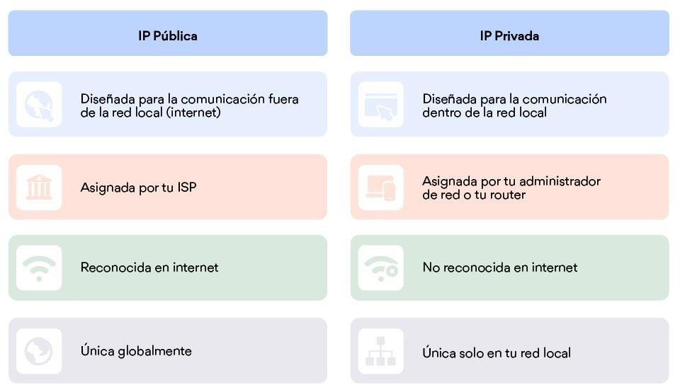

Según su forma de asignación, vimos que las direcciones IP se subdividían en:
-   **Direcciones IP estáticas** se asignan de forma manual por el administrador de la red (en el caso de las privadas) o por la *IANA* en caso de las direcciones públicas.
-   **Direcciones IP dinámicas** son las que se utilizan de manera habitual para conectarse a Internet a través de nuestro *ISP*, en el caso de cliente finales usando direcciones públicas. Dicha asignación se borra tras cada sesión o cambia automáticamente a intervalos regulares, normalmente cada 24 horas. En el caso de una red interna que utilice direcciones IP privadas, las direcciones dinámicas de dicha red se asignarán mediante el protocolo *DHCP* que ya conocemos.

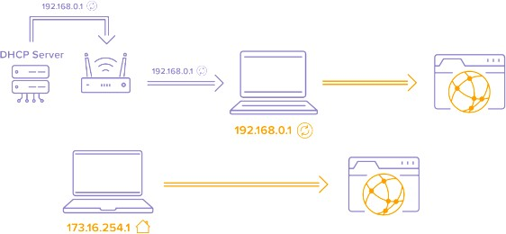

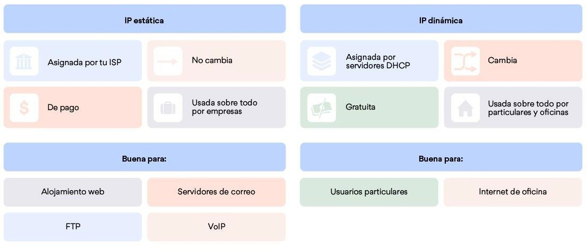

El organismo que regula la asignación de direcciones IPv4 tal y como hemos dicho es el **IANA**. El estado actual de disponibilidad de direcciones IPv4 es claramente insuficiente y está prácticamente agotado.

IANA a su vez delega sus funciones en 5 organismos repartidos por los continentes:

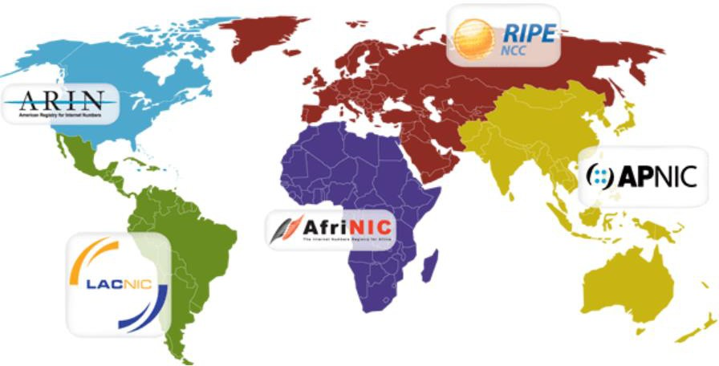

<http://www.iana.org/numbers>

## Clases y direccionamiento IPv4

```note
Cada dirección IPv4 consta por tanto de 32 bits agrupados en grupos de 8 bits. Una dirección IPv4 se expresa con 4 números decimales separados por puntos.
```

Conviene repasar las conversiones entre decimal y binario vistas anteriormente:

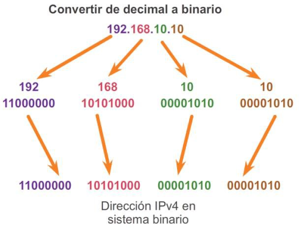


Tal y como hemos comentado las direcciones IPv4 tienen dos partes: una porción de **Red** (*NetID*) y otra de **Host** (*HostID*):

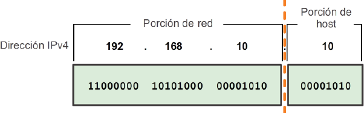

Para definir las porciones de red y de host de una dirección, los dispositivos utilizan un patrón de 32 bits separado conocido como **máscara de subred** (*netmask*), las cuales estudiaremos a continuación:

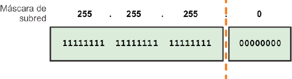

### Clases de direcciones IPv4

Hay 5 **clases de direcciones** IPv4, las cuales se identifican según sus bits más significativos y que definen sus bits dedicados a **red** y a **host**:

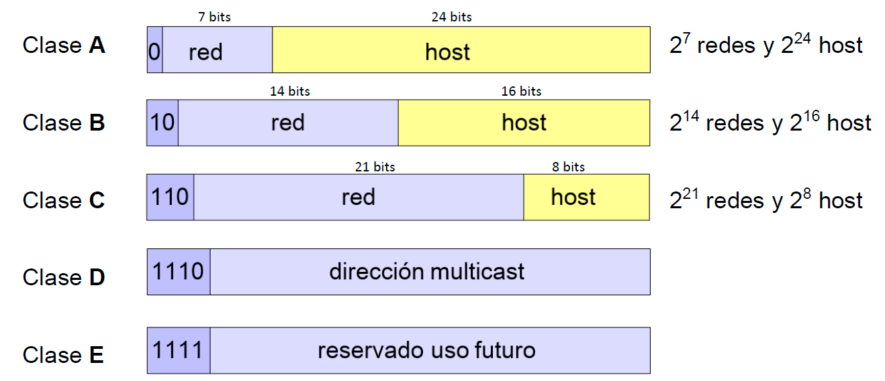

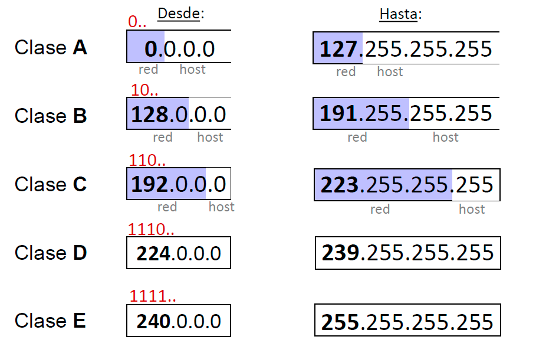

### Máscaras de red

Podemos definir la **máscara de red** como un número de 32 bits tal que al hacer un *AND* con una dirección IP dada obtenemos su **dirección de red** correspondiente:

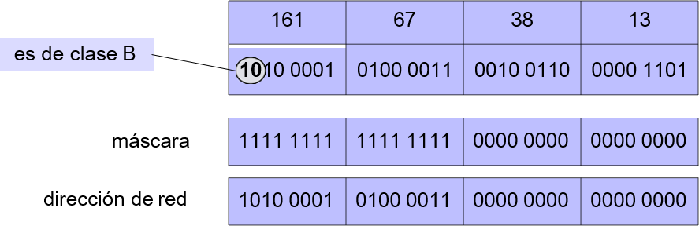

Las **máscaras de red** se pueden expresar de dos formas: en **notación decimal** (*x.x.x.x*) o en **notación de prefijo de red** (indicando tras la dirección mediante la barra **/** el número de unos que tiene la máscara).

Las siguientes son las máscaras para las direcciones clase A, B. y C:

- Máscara para direcciones **clase A**: 255.0.0.0 /8
- Máscara para direcciones **clase B**: 255.255.0.0 /16
- Máscara para direcciones **clase C**: 255.255.255.0 /24

| **Clase** | **Máscara red** | **Prefijo red** | **Identificación** |
|-----------|-----------------|-----------------|--------------------|
| A         | 255.0.0.0       | /8              | R.H.H.H            |
| B         | 255.255.0.0     | /16             | R.R.H.H            |
| C         | 255.255.255.0   | /24             | R.R.R.H            |

### Clase A

En una red de **clase A**, los primeros ocho bits de la dirección, o el primer punto decimal, son la parte de la red, y la parte restante es la del host.

Hay **128** redes de clase A posibles.

**0.0.0.0 a 127.0.0.0**

Sin embargo, cualquier dirección que comience con *127* se denomina dirección de **loopback**, es decir, que apunta al propio host.

La **máscara de subred** predeterminada para la clase A era **255.0.0.0** (/8)

**0**RRRRRRR.HHHHHHHH.HHHHHHHH.HHHHHHHH

### Clase B

En una red de **clase B**, los primeros 16 bits de la dirección son la parte de la red. Todas las redes de clase B tienen el primer bit a 1 y el segundo bit a 0.

Si dividimos la dirección en octetos, nos queda que las direcciones **128.0.0.0** a **191.255.0.0** corresponden a redes de clase B. 

Hay 2^14 = **16.384** redes de clase B posibles.

La **máscara de subred** predeterminada de la Clase B era **255.255.0.0** (/16)

**10**RRRRRR.RRRRRRRR.HHHHHHHH.HHHHHHHH

### Clase C

En una red de **clase C**, los dos primeros bits están puestos a 1 y el tercero a 0. Eso hace que los primeros 24 bits de la dirección sean la parte de la red, y el resto, la del host.

Las direcciones de red de clase C van desde **192.0.0.0** a **223.255.255.0**. 

Hay más de 2 millones de redes (221) de clase C posibles.

Su máscara será **255.255.255.0** (/24)

**110**RRRRR.RRRRRRRR.RRRRRRRR.HHHHHHHH

### Clase D

Las direcciones de **clase D** se utilizan para aplicaciones de **multidifusión**.
A diferencia de las clases anteriores, la Clase D no se utiliza para operaciones de red comunes.

Las direcciones de clase D tienen los primeros tres bits a 1 y el cuarto bit establecido a 0. Las direcciones de clase D son direcciones de red de 32 bits, lo que significa que los valores que podemos encontrar en el rango 224.0.0.0 - 239.255.255.255 se utilizan para identificar grupos de multidifusión de forma única.

No hay direcciones de host dentro del espacio de direcciones de clase D, puesto que todos los hosts dentro de un grupo comparten la dirección IP del grupo a la hora de recibir datagramas.

### Clase E

Las redes de **clase E** se definen marcando los primeros cuatro bits de la dirección de red a 1, lo que genera las direcciones que van desde 240.0.0.0 a 255.255.255.255.

A pesar de que esta clase está **reservada**, nunca se definió su uso, por lo que la mayoría de las implementaciones de red descartan estas direcciones como ilegales o indefinidas, a excepción, claro está, de **255.255.255.255**, que se utiliza como una dirección de difusión (**broadcast**).

### Direcciones IPv4 privadas

Las **direcciones privadas** se crearon para utilizar en redes privadas (intranets) por el *RFC 1918*. Estas IP no vuelven a ser reasignadas por la *IANA* y tampoco se dirigen a Internet fuera del router.

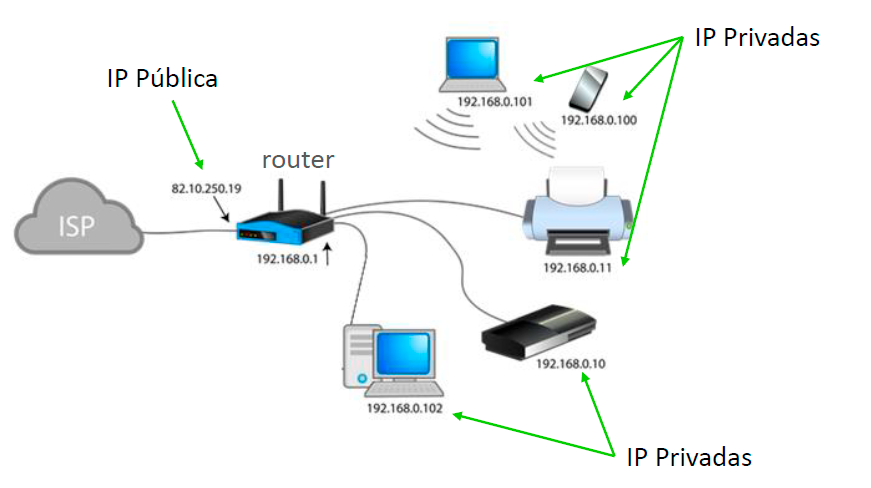

Existen 3 rangos de estos conjuntos numéricos destinados exclusivamente para escribir direcciones **IP privadas** y distinguirlas, los cuales se catalogan en 3 clases distintas:

- **Clase A:** Direcciones que van desde **10.0.0.0** a **10.255.255.255**, y que son utilizadas generalmente para grandes redes privadas, por ejemplo de alguna empresa trasnacional.
- **Clase B**: Direcciones desde **172.16.0.0** a **172.31.255.255**, que son usadas para redes medianas, como de alguna empresa local, escuela o universidad.
- **Clase C:** Direcciones desde **192.168.0.0** a **192.168.255.255**, que son usadas para las redes más pequeñas, como redes domésticas.

### Direcciones IPv4 reservadas

Existen también las siguientes direcciones IPv4 **reservadas** especiales:

-   Las direcciones (**0.0.0.0** a **0.0.0.255**) de uso interno para tablas de enrutamiento.
-   La dirección de **loopback** (**127.0.0.1**) también llamado localhost es una dirección asignada por defecto a una tarjeta de red virtual que está presente en todos los ordenadores y actúa como un circuito cerrado. Cualquier paquete IP enviado por el ordenador por esta interfaz le será devuelto a esta.
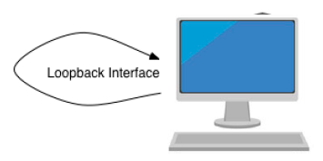
-   La dirección de difusión o **broadcast** es el envío de un mensaje a todos los ordenadores que se encuentran dentro de una misma red. Consiste en terminar una dirección en 255. *Pj* 172.10.255.**255**
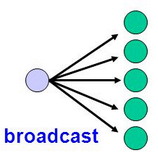
-   Las direcciones 169.254.0.0 a 169.254.255.25 son reservadas para direcciones IP dinámicas DHCP que no fueron correctamente asignadas.

Resumen de clases, rangos y tipos/usos (*público, privado, reservado*):

|                | **Rango**   | **Tipo**        |           |
|----------------|-------------|-----------------|-----------|
|    **Clase A** | 0.0.0.0     | 0.255.255.255   | Reservado |
|                | 1.0.0.0     | 9.255.255.255   | Público   |
|                | 10.0.0.0    | 10.255.255.255  | Privado   |
|                | 11.0.0.0    | 126.255.255.255 | Público   |
|                | 127.0.0.0   | 127.255.255.255 | Reservado |
|   **Clase B**  | 128.0.0.0   | 169.253.255.255 | Público   |
|                | 169.254.0.0 | 169.254.255.255 | Reservado |
|                | 172.16.0.0  | 172.31.255.255  | Privado   |
|                | 172.32.0.0  | 191.255.255.255 | Público   |
|  **Clase C**   | 192.0.0.0   | 192.167.255.255 | Público   |
|                | 192.168.0.0 | 192.168.255.255 | Privado   |
|                | 192.169.0.0 | 223.255.255.255 | Público   |
| **Clase D**    | 224.0.0.0   | 239.255.255.255 | Reservado |
| **Clase E**    | 240.0.0.0   | 255.255.255.255 | Reservado |

En el siguiente esquema vemos un ejemplo de una **red privada**, que hace uso de direcciones privadas del rango de **192.168.x.x**:

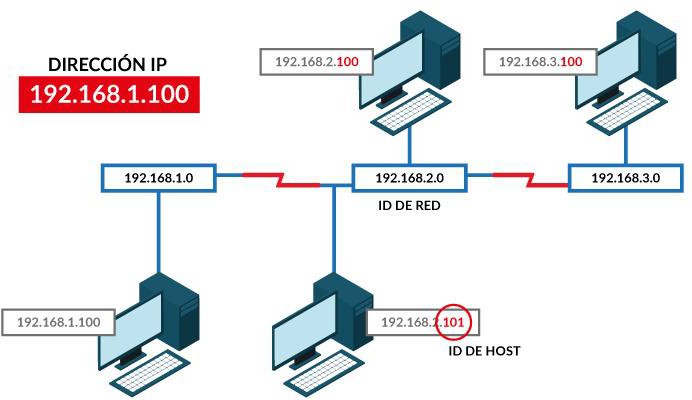

En este otro esquema se muestran varias redes completas con diferentes subredes, que utilizan diferentes clases de direcciones IP privadas. No olvidar que las direcciones IP privadas no pueden enrutarse a través de Internet:

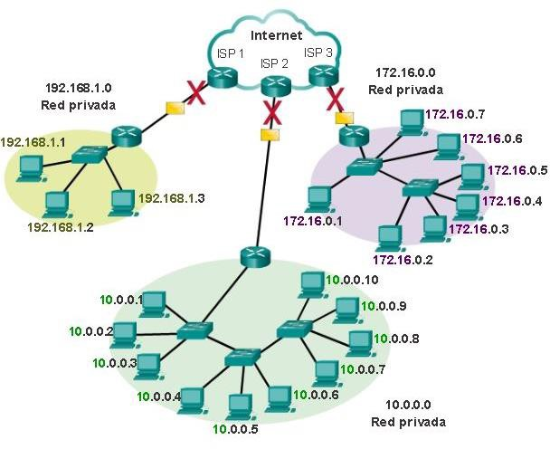

Resumen general:

| **Clase**               | **Bits** **clase** | **Bits de** **red** | **Bits de** **host** | **Máscara**    | **Número de** **redes** | **Direcciones por** **red (host)** | **Primera** **dirección** | **Última dirección** |
|-------------------------|--------------------|---------------------|----------------------|----------------|-------------------------|------------------------------------|---------------------------|----------------------|
|  **Clase A**            |  **0**..           |  8                  |  24                  |  255.0.0.0     |  128 (27)               |  16,777,216 (224)                  |  0.0.0.0                  |  127.255.255.255     |
|  **Clase B**            |  **10**..          |  16                 |  16                  |  255.255.0.0   |  16,384 (214)           |  65,536 (216)                      |  128.0.0.0                |  191.255.255.255     |
|  **Clase C**            |  **110**..         |  24                 |  8                   |  255.255.255.0 |  2,097,152 (221)        |  256 (28)                          |  192.0.0.0                |  223.255.255.255     |
| **Clase D** (multicast) |  **1110**          | No definido         | No definido          |  -             |  No definido            |  No definido                       |  224.0.0.0                |  239.255.255.255     |
| **Clase E** (reservada) | **1111**           | No definido         | No definido          | -              | No definido             | No definido                        | 240.0.0.0                 | 255.255.255.255      |


## Creación de subredes

A menudo es necesario segmentar las redes suficientemente grandes en **subredes** más pequeñas, con lo que se crean grupos más pequeños de dispositivos y servicios con los siguientes fines:
-   Controlar el tráfico mediante la contención del tráfico de broadcast en la subred.
-   Reducir el tráfico general de la red y mejorar el rendimiento de esta.
-   Mejorar la seguridad del sistema y su gestión.

Se necesitará al menos un router o un switch para que los dispositivos en diferentes redes y subredes puedan comunicarse.

La división en subredes de cualquier sistema es algo fundamental por esos motivos.

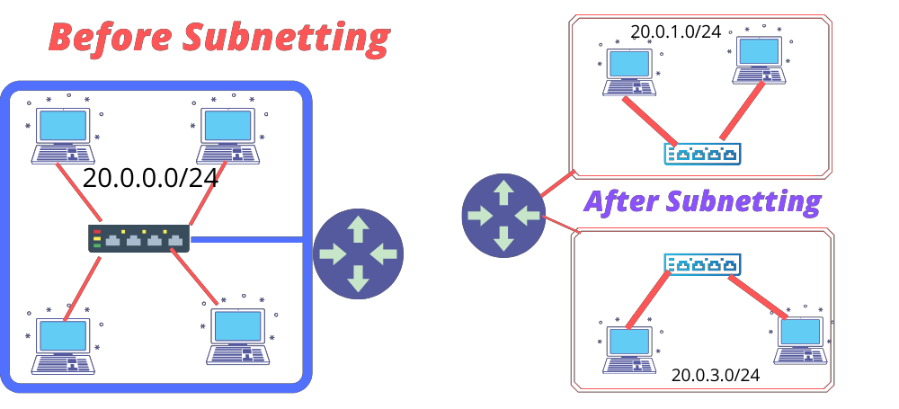

A la hora de estudiar la creación de **subredes**, podremos abordarlo de dos formas distintas:

1.  Mediante modificaciones en la máscara de subred a nivel de la capa 3 de red. Para ello veremos el **subnetting** y el **CIDR.** Será necesario el uso de **routers** para llevarlo a cabo.
2.  Mediante la creación de **VLANs**, las cuales trabajan a nivel de la capa 2 de enlace. Será necesario para ello el uso de **switches** específicos.

## Creación de subredes: subnetting

Hemos visto que con la máscara es posible identificar las direcciones que pertenecen a nuestra red. En ciertos casos, es posible segmentar una red en subredes las cuales pueden estar en contacto entre sí por medio de un **gateway**, lo cual es vital para un uso más eficiente y controlado de recursos.

Es posible, por ejemplo, que tenga dos redes de servidores con 60 servidores cada una y se desee que estén visibles en Internet. Si se utilizan dos redes públicas de clase C se están desaprovechando los recursos de la empresa, ya que una red pública de clase C podría 254 equipos y en el ejemplo, la empresa solo requiere 60.

Así por ejemplo para **192.168.3.0/24**, con 256 direcciones, podría dividirse en cuatro subredes, cada una de 64 direcciones (64×4=256). Las máquinas de cada subred pueden verse la una a la otra; sin embargo, para que una subred contacte a otra deberán pasar por un **gateway** o un **router** (común a todas las subredes).

El subnetting se logra **agregando bits 1 a la máscara de subred**, de modo de que se utilicen esos bits adicionales para determinar las subredes y se utilicen en cambio menos bits para determinar los hosts.

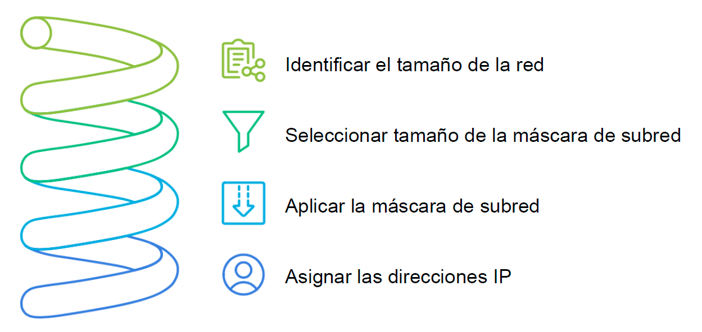

Las redes de clase A y B están claramente infrautilizadas. El subnetting coge por tanto bits de host para crear **subredes** más pequeñas.

-   Dirección clase B:

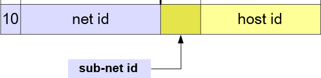

- El esquema de la figura coge 4 bits del host para la **subred**, de modo que se dispondrá de 16 subredes con 2^12 – 2 hosts cada una.
- El esquema de subredes lo decidirá el administrador de la red según sus necesidades.

- Dada la siguiente dirección **193.147.12.0** subdivídela en 4 subredes y describe qué direcciones se pueden asignar a host y cuáles no:

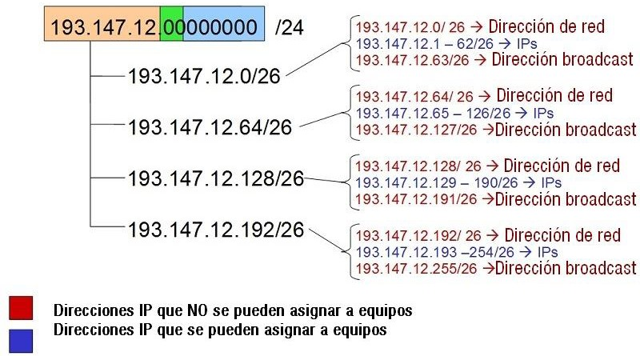

    
-   Dada una red **192.168.30.0** subdivídela de forma adecuada para crear 4 subredes de equipos:

    -   Al estar ocupando dos bits extra, podemos direccionar 2^2=4 nuevas redes.
    -   Como nos quedan 6 bits para direcciones, podemos asignar 2^6=64-2  direcciones para cada subred.


| **Subredes de** 192.168.30.0/26    | **Direcciones**                                                                           |
|------------------------------------|-------------------------------------------------------------------------------------------|
| Primera subred: **00** (.0→.63)    | 192.168.30.0 ⇒ **red** 192.168.30.1→192.168.30.62 ⇒ hosts 192.168.30.63 ⇒ broadcast       |
| Segunda subred: **01** (.64→.127)  | 192.168.30.64 ⇒ **red** 192.168.30.65→192.168.30.126 ⇒ hosts 192.168.30.127 ⇒ broadcast   |
| Tercera subred: **10** (.128→.191) | 192.168.30.128 ⇒ **red** 192.168.30.129→192.168.30.190 ⇒ hosts 192.168.30.191 ⇒ broadcast |
| Cuarta subred: **11** (.192→.255)  | 192.168.30.192 ⇒ **red** 192.168.30.193→192.168.30.254 ⇒ hosts 192.168.30.255 ⇒ broadcast |

-   Dada una red **141.14.0.0** subdivídela de forma adecuada para crear 4 subredes de equipos y dibújala:

| **Subredes de** 141.14.0.0/18 | **Direcciones**                                                                       |
|-------------------------------|---------------------------------------------------------------------------------------|
| Primera subred: 00            | 141.14.0.0 ⇒ **red** 141.14.0.1→141.14.63.254 ⇒ hosts 141.14.63.255 ⇒ broadcast       |
| Segunda subred: 01            | 141.14.64.0 ⇒ **red** 141.14.64.1→141.14.127.254 ⇒ hosts 141.14.127.255 ⇒ broadcast   |
| Tercera subred: 10            | 141.14.128.0 ⇒ **red** 141.14.128.1→141.14.191.254 ⇒ hosts 141.14.191.255 ⇒ broadcast |
| Cuarta subred: 11             | 141.14.192.0 ⇒ **red** 141.14.192.1→141.14.255.254 ⇒ hosts 141.14.255.255 ⇒ broadcast |


### CIDR para el subnetting

El **CIDR** (*Classless Inter-Domain Routing*) es una forma de representar y manejar direcciones IP y máscaras de manera más flexible, ya que las divisiones de clases de direcciones IP era muy ineficiente para aprovechar las escasas direcciones en IPv4.

En CIDR no existen clases A, B o C. El valor de la dirección IP no implica ninguna máscara implícita, como sucedía antes con los primeros bits de la dirección. Toda definición de una red IP debe ser acompañada de una definición de máscara que concrete la red.

Por ejemplo, cuando hablamos en términos de CIDR no podemos decir que la dirección 172.17.25.12 pertenezca a la red 172.17.0.0 a menos que se especifique como 172.16.25.12**/16**.

En CIDR ya no se utiliza el término clase de una red, ya no hay clases como tal, sino redes definidas por el **prefijo obligatorio** que acompaña a la dirección de red. CIDR da por tanto flexibilidad al subnetting permitiendo crear subredes más pequeñas o más grandes sin estar limitado por las clases tradicionales.

Así por ejemplo, hablando en términos de **subnetting**, podemos decir que la red 172.17.11.25 con máscara 255.255.255.0 (que no es en realidad una red de clase C) es una subred (o subnet) de la red de clase B 172.17.0.0.

Evidentemente existe una coincidencia entre las máscaras tradicionales de las clases de red IP y las equivalentes en CIDR como se muestra en la siguiente tabla:

| **Clase** | **Bits de inicio** | **IP Subred** | **IP Broadcast** | **Máscara en decimal** | **CIDR** |
|-----------|--------------------|---------------|------------------|------------------------|----------|
| A         | 0000               | 0.0.0.0       | 127.255.255.255  | 255.0.0.0              | /8       |
| B         | 1000               | 128.0.0.0     | 191.255.255.255  | 255.255.0.0            | /16      |
| C         | 1100               | 192.0.0.0     | 223.255.255.255  | 255.255.255.0          | /24      |
| D         | 1110               | 224.0.0.0     | 239.255.255.255  | 255.255.255.255        | /32      |
| E         | 1111               | 240.0.0.0     | 255.255.255.254  | 255.255.255.255        | /64      |

Tabla de posibles valores de la **máscara de red** usando *CIDR*:

| **Máscara de subred** | **CIDR** |
|-----------------------|----------|
| 255.255.255.254       | /31      |
| 255.255.255.252       | /30      |
| 255.255.255.248       | /29      |
| 255.255.255.240       | /28      |
| 255.255.255.224       | /27      |
| 255.255.255.192       | /26      |
| 255.255.255.128       | /25      |
| 255.255.255.0         | /24      |
| 255.255.254.0         | /23      |
| 255.255.252.0         | /22      |
| 255.255.248.0         | /21      |
| 255.255.240.0         | /20      |
| 255.255.224.0         | /19      |
| 255.255.192.0         | /18      |
| 255.255.128.0         | /17      |
| 255.255.0.0           | /16      |
| ……….                  |          |
| 254.0.0.0             | /7       |
| 252.0.0.0             | /6       |
| 248.0.0.0             | /5       |
| 240.0.0.0             | /4       |
| 224.0.0.0             | /3       |
| 192.0.0.0             | /2       |


## Creación de subredes: VLANs

```note
Podemos definir una VLAN (Virtual LAN) como un método que nos permite crear distintas redes virtuales, separades entre sí, dentro de una misma red física sin
hacer uso del direccionamiento.
```

Para ello es necesario el uso de **switches gestionables** que soporten VLANs para segmentar adecuadamente la red. También es importante que si se utilizan routers soporten VLAN, aunque la gestión de estas redes se lleve a cabo a nivel de capa 2.

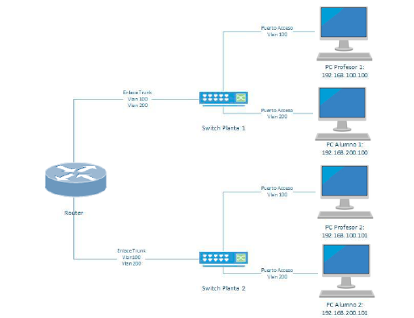

El uso de VLANs para crear subredes proporciona las siguientes características:
-   **Seguridad**. Las VLAN nos permite crear redes **lógicamente independientes**, por tanto, podemos aislarlas para que solamente tengan conexión a Internet, y denegar el tráfico de una VLAN a otra. Por defecto no se permite a las VLANs intercambiar tráfico con otra VLAN.
-   **Segmentación**. Las VLAN nos permite segmentar todos los equipos en diferentes subredes, a cada subred le asignaremos una VLAN diferente. Por ejemplo, podremos crear una subred de gestión interna de todos los routers, switches y puntos de acceso, podremos crear una subred principal para los administradores, otra subred para dispositivos IoT y otra subred diferente para invitados.
-   **Flexibilidad**. Gracias a las VLAN podremos colocar a los diferentes equipos en una subred o en otra, de manera fácil y rápida, y tener unas políticas de comunicación donde permitimos o denegamos el tráfico hacia otras VLANs o hacia Internet. Por ejemplo, si creamos una VLAN de invitados, podríamos prohibirles el uso de servicios de streaming de vídeo.

Una VLAN nos va a permitir *segmentar* una la red local en varias subredes más pequeñas, enfocadas específicamente a una tarea en cuestión, además, podremos proporcionar seguridad porque las VLAN entre ellas no se podrán comunicar (o sí, dependiendo de la configuración de las ACL que nosotros queramos). Gracias a las VLAN el rendimiento de la red mejorará, porque estaremos conteniendo el *broadcast* en dominios de difusión más pequeños.

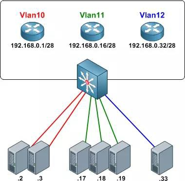Profesores: VLAN10 Estudiantes: VLAN20 Mantenimiento: VLAN30

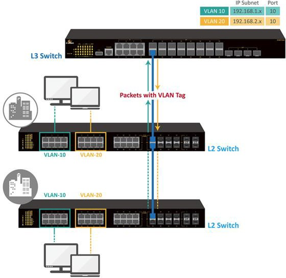

## Dominios de colisión y difusión

### Dominio de colisión

```note
Un dominio de colisión es un segmento de red que comparte las comunicaciones con todos los equipos conectados a este y en la cual las tramas colisionan entre ellas.
```

Cuando un equipo transmite, lo hace para todos los dispositivos del segmento de red al que está conectado (cableado), con independencia de con cuál de ellos quiera comunicarse. El protocolo *CSMA/CD* en redes Ethernet gestiona estas colisiones.

-   Los equipos unidos a un **hub** o a un **repetidor** (capa 1) formarán un **dominio de colisión** (todo lo que se envía por un puerto se reenvía a todos)
-   Cualquier dispositivo de capa 2 o superior, en cambio, **limita los dominios de colisión**. Por ejemplo, cada toma o puerto de un **switch** formará un **dominio de colisión diferente** y dará lugar a tantos dominios de colisión como puertos tenga conectados. Los switches eliminan el problema de los dominios de colisión al segmentar el tráfico y asignar dominios de colisión individuales por puerto.

### Dominio de difusión

```note
Un dominio de difusión (broadcast domain) es el área lógica en una red de computadoras en la que cualquier equipo host conectado a la red puede transmitir
directamente a cualquier otro en dicho dominio sin precisar ningún dispositivo de encaminamiento o router.
```

Un switch, por defecto, permite que los paquetes de broadcast se propaguen a todos los puertos dentro de la misma VLAN. Sin embargo, un **router** segmenta los dominios de difusión, evitando que los paquetes de broadcast se propaguen más allá de su segmento de red.

Un dominio de difusión funciona con la última dirección IP de una subred tal y como ya hemos visto.

Se utilizan enrutadores (**routers**) para segmentar los **dominios de difusión**.

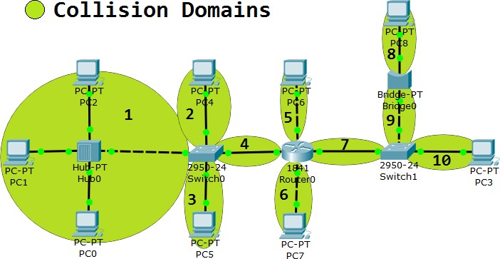

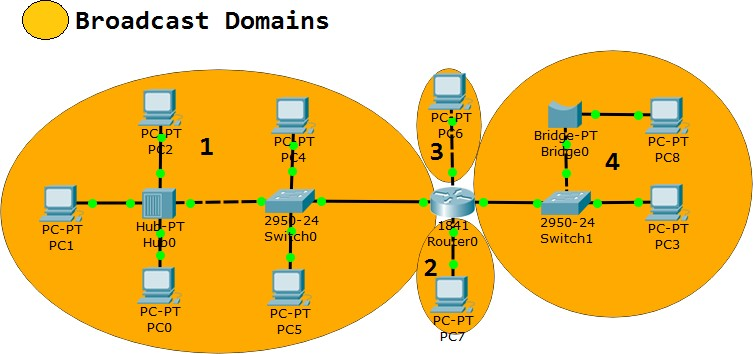


## Seguridad en redes inalámbricas

Hay que tener en cuenta que las redes WiFi son muy vulnerables a la interceptación de paquetes, a los ataques o a que usuarios no autorizados se aprovechen de la conexión. Por tanto, los administradores de red deben de implementar medidas de seguridad para prevenir un uso indebido de la red.

Una medida que no proporciona ningún tipo de seguridad, pero dificulta a ciertos usuarios conectarse, consiste en **ocultar el SSID**. Desde los puntos de acceso se difunde el SSID, para que los dispositivos dentro de la cobertura puedan conectarse. Esto se hace mediante broadcast o emisión del SSID. Si esta función se desactiva los ordenadores deberán configurar manualmente el SSID, por tanto, aquellos que no lo conozcan, puede que no detecten la red. Esto es fácilmente salvable ya que existen herramientas que detectan el *SSID* oculto, pero es un primer paso.


La medida de seguridad más utilizada consiste en encriptar o codificar la información de la red utilizando protocolos de seguridad inalámbricos.

Actualmente existen cuatro **protocolos de seguridad inalámbrica**:

-   Privacidad equivalente por cable (**WEP**)
-   Acceso Wi-Fi protegido (**WPA**)
-   Acceso Wi-Fi protegido 2 (**WPA 2**)
-   Acceso Wi-Fi protegido 3 (**WPA 3**)

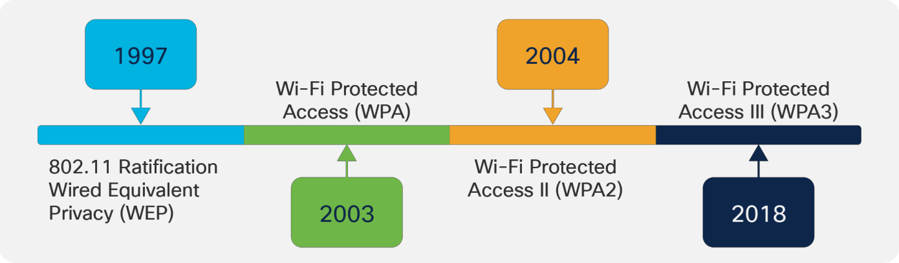

### WEP

**WEP** fue creado en 1999 para cifrar el tráfico con una clave en hexadecimal de 64 o 128 bits. Se trata de una **clave estática**, por lo que todo el tráfico se cifra con una única clave, sin importar el dispositivo. Una clave WEP permite que los ordenadores de una red intercambien mensajes cifrados ocultando su contenido a los intrusos.

Esta clave es la que se utiliza para conectarse a una red con seguridad inalámbrica.

No obstante, y debido a sus vulnerabilidades y el diseño de esta clave estática, la WiFi Alliance la retiró oficialmente de uso en 2004.

Es un método muy débil y prácticamente desuso, ya que es fácilmente descifrable con los equipos actuales (en apenas unos segundos).


### WPA

WiFi Alliance introdujo **WPA** en 2003, como reemplazo para WEP. Mientras que WEP proporciona la misma clave a cada sistema autorizado, en WPA se generan claves nuevas de manera **dinámica** con lo que dificulta su descifrado usando el protocolo **TKIP** y claves de 256 bits para el cifrado.

WPA no está exento de defectos ya que el protocolo *TKIP* se diseñó para implementarse en los sistemas con WEP a través de actualizaciones de firmware. Esto hizo que el WPA siguiera basándose en elementos fácilmente explotables.


### WPA2

El **WPA2** (acceso WiFi protegido 2) es la segunda generación del protocolo de seguridad inalámbrica de acceso WiFi protegido.

Una de las ventajas del sistema WPA2 fue que introdujo el sistema de cifrado avanzado **AES** para sustituir al sistema TKIP, más vulnerable, usado en el protocolo WPA original.

El AES proporciona un cifrado potente y lo utiliza el gobierno de Estados Unidos para proteger los datos clasificados.


### WPA3

El **WPA3** (acceso WiFi protegido 3) es el protocolo de seguridad inalámbrica más reciente, diseñado para cifrar datos mediante un tipo de cifrado frecuente y automático denominado *Perfect Forward Secrecy*.

Es más seguro que su predecesor, WPA2, pero aún no se ha adoptado ampliamente. No todo el hardware es compatible automáticamente con WPA3, y usar este protocolo suele requerir costosas actualizaciones.


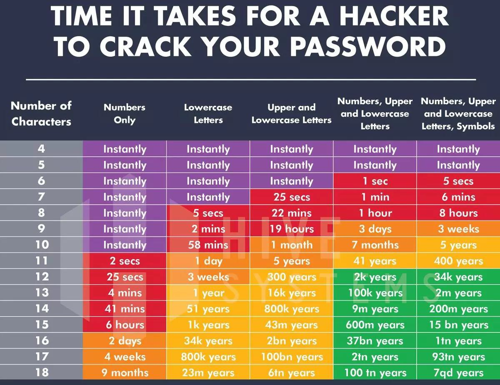

Otra forma de mejorar la seguridad de redes inalámbricas sería mediante el uso **servidores de encriptación**, usualmente *Radius*. Estos servidores utilizan protocolos de autenticación y autorización, de esta manera es el servidor el que se encarga de distribuir claves diferentes entre los usuarios. Este método es el más seguro, pero también el de mayor coste.

El **filtrado de direcciones MAC** es otra medida de seguridad adicional y se recomienda utilizarla como complemento de algunos de los métodos de encriptación. Consiste en configurar el punto de acceso o router de tal forma que tenga un listado de direcciones MAC de los equipos autorizados a conectarse a la red inalámbrica, para que aquellos equipos que no estén en la lista no puedan conectarse.

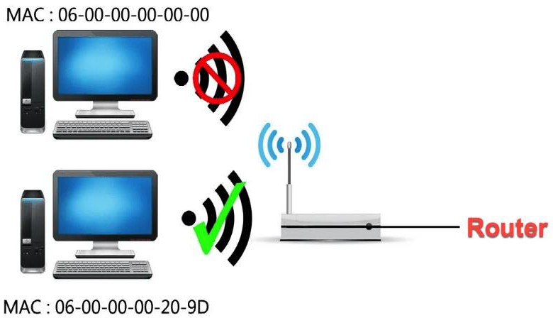

Muchos routers traen de serie un botón con las siglas WPS. **WPS** (*Wifi Protected Setup*) es un sistema que tiene por funcionalidad al pulsarlo, la de ofrecer una forma fácil de conectarse a una WiFi escribiendo tan sólo un PIN de 8 dígitos, en lugar de la contraseña inalámbrica completa, y conectar rápidamente dispositivos a la red.

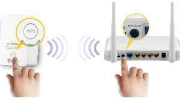

WPS no obstante puede hacer insegura a la red WiFi ya que su PIN de tan solo 8 dígitos hace que, en el momento en que se pulsa el botón, sea vulnerable a un ataque por fuerza bruta.

## Direcciones IPv6

```note
IPv6 (Internet Protocol Version 6) es la nueva versión del protocolo IP (Internet Protocol) que utiliza direcciones de 128 bits en vez de 32 bits.
```

Ha sido diseñado por el IETF (*Internet Engineering Task Force*) para reemplazar de forma gradual a la versión actual IPv4 y desde 2012 ya está operativo. Está definido por la *RFC 2460.*

El motivo principal de este cambio fue la escasez de direcciones IPv4, que para este nuevo protocolo de 128 bits se hace prácticamente inagotable (2^128 ≈ 3.4 · 10^38 ).


Además, IPv6 incorpora diversas novedades:

-   IPv6 incorpora además mejoras en las tablas del backbone de Internet.
    -   Proporciona igualmente autenticación y cifrado (IPSec) integrado, cosa que en IPv4 era opcional.
    -   Con IPv6 se elimina la Traducción de Direcciones de Red (*NAT*) y se permite la conectividad de extremo a extremo en la capa IP.

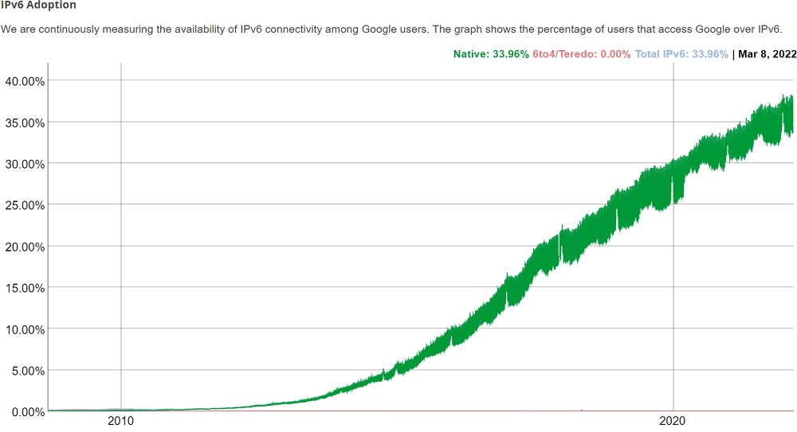

La **conversión** entre hexadecimal y binario se realiza tal y como ya vimos usando 4 bits por cada dígito (16 bits por bloque u 9 hextetos)

Por ejemplo:

| **2** | **0** | **0** | **1 :** | **0** | **D** | **D** | **8** |
|-------|-------|-------|---------|-------|-------|-------|-------|
| 0010  | 0000  | 0000  | 0001 :  | 0000  | 1101  | 1101  | 0100  |


### Formato IPv6

- *x:x:x:x:x:x:x:x*, donde cada *x* representa 16 bits en **formato hexadecimal (8)**

11010001.11011100.11001001.01110001.11010001.11011100.11001100. 01110001.11010001.11011100.11001001.01110001.11010001.11011100. 11001001.01110001 > A524:72D3:2C80:DD02:0029:EC7A:002B:EA73                                

- Las direcciones IPv6 abarcan desde 0000:0000:0000:0000:0000:0000:0000:0000 hasta FFFF:FFFF:FFFF:FFFF:FFFF:FFFF:FFFF:FFFF.
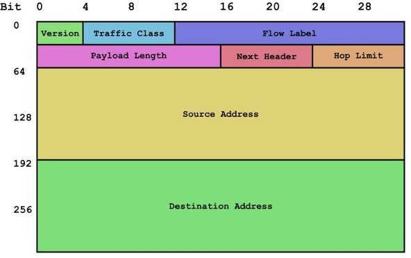

### Notación abreviada IPv6

- En cada bloque, los ceros a la izquierda pueden suprimirse. 000A → A
- Las cadenas de ceros seguidos se pueden comprimir usando el símbolo **::**

    1080:0:0:0:8:800:200C:741A → 1080::8:800:200C:741ª

    -   Si hay varias secuencias de ceros, se acortará la más larga.
    -   Si hay más de una secuencia con la misma longitud, se usa la primera.
-   El símbolo **::** solo puede aparecer una vez por dirección:
    21AB:0:0:A:0:0:1234:5678 → 21AB::A:0:0:1234:5678

-   Una dirección IPv6 debe tener 8 bloques en total. Si falta alguno después de la compresión con ::, se deben inferir los ceros restantes.
    ::1 equivale a 0000:0000:0000:0000:0000:0000:0000:0001

### Formato general IPv6

IPv6 permite una jerarquía flexible, que acomoda diferentes tipos de direcciones.
-   El **prefijo de red** siempre contiene 64 bits: Estos bits pueden incluir 48 del prefijo de sitio, además de 16 bits para el ID de subred.
-   El **identificador del ID de interfaz** siempre tendrá los otros 64 bits.

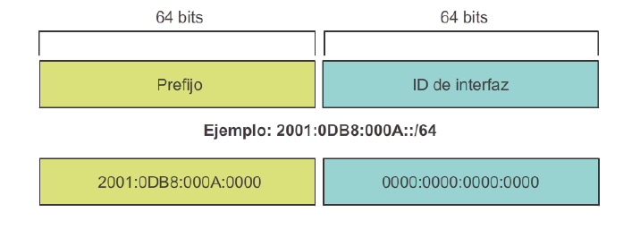

### Tipos de direcciones IPv6

Al igual que con IPv4, hay diferentes tipos de direcciones IPv6. De hecho, hay tres categorías amplias de direcciones IPv6:

-   **Unicast/Unidifusión**: una dirección de unidifusión IPv6 identifica de forma única una interfaz de red.
-   **Multicast/Multidifusión**: una dirección de multidifusión IPv6 es usada por múltiples host (identificación grupal).
-   **Anycast**: es un tipo de dirección IPv6 de unidifusión que se puede asignar a varios dispositivos. Un paquete enviado a una dirección de difusión ilimitada se enruta al dispositivo más cercano que tenga esa dirección.

> IPv6 no implementa direcciones **broadcast**. Podría lograrse algo similar enviando un paquete a un grupo multicast.

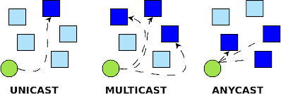

Al igual que con IPv4 existen direcciones IPv6 especiales o **reservadas**:

-  **::** Dirección con todo ceros se utiliza para indicar la ausencia de dirección, y no se asigna ningún nodo.
-  **::1** Dirección de **loopback**

El resto de direcciones usan prefijos concretos:

-  **FF00::** es el prefijo de **multicast**
-  En **unicast** existen múltiples prefijos que estudiaremos a continuación.

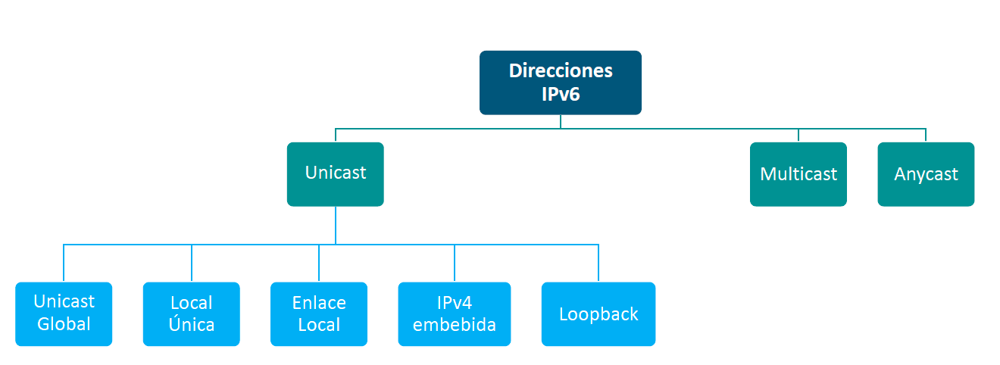

## Direcciones Unicast

Existen diversos tipos de **direcciones Unicast** con sus diferentes rangos, que veremos a continuación*:*

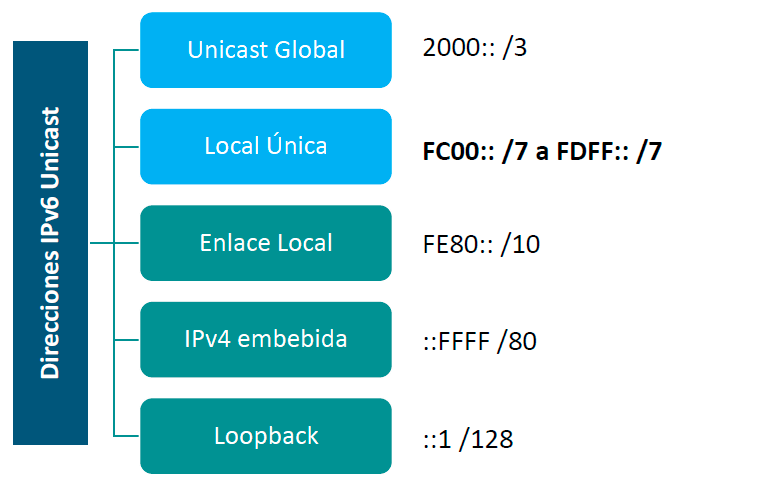

Las direcciones *Global Unicast* son direcciones que se reconocen a **nivel global**, por lo que, a efectos prácticos, juegan el papel de las **direcciones públicas** en IPv4.

Todas las Direcciones Unicast Globales tienen **001** en sus tres bits de mayor peso, por lo que el prefijo es **2000::/3.**

Permiten 2^16= 65536 subredes por organización.

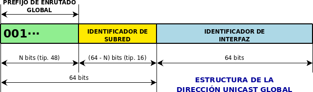

2004:A128::32:FEDC:BA98:7865:4321 /64

### Direcciones Unicast Local Única (ULA)

El equivalente de las **direcciones privadas** en IPv6, son las direcciones **unicast locales únicas** (*ULA)*. A pesar de ser únicas están diseñadas para ser usadas únicamente dentro de una red local y pueden ser enrutadas entre las LAN.

Las direcciones privadas parten del bloque **FC00:: /7** al **FDFF::/7**

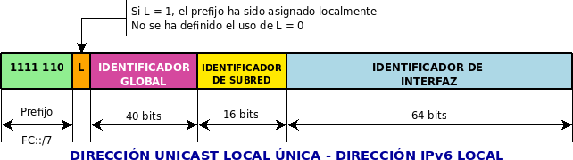

FC02:B234:B1B2:1:DA2C:A367:5A65:B912 /64

### Direcciones Unicast Enlace Local

Las direcciones de enlace local son similares a las direcciones **reservadas** en IPv4 (*169.254.0.0*), que no pueden ser enrutadas fuera de la LAN, que se asignaban cuando no había un mecanismo de configuración de direcciones como *DHCP*. Son direcciones válidas dentro del enlace en el que está conectado la interfaz de red.

Estas direcciones no se usan para el flujo normal de paquetes que contienen datos para aplicaciones, sino que son usadas por protocolos y enrutamiento.

Usan como prefijo de enlace local 1111111010000000. Las direcciones de enlace local parten por tanto de **FE80:: / 10** al **FEBF:: /10**. El resto de los primeros 64bits son 0.

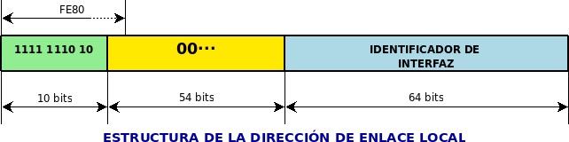

FE80::2E81:58FF:FEE9:64BB/64

### Direcciones Unicast IPv4 embebidas

En entornos mixtos en los que hay nodos **IPv4** e **IPv6** hay un formato válido que permite representar una dirección IPv4 como IPv6 usando direcciones **embebidas**. Esto se hace poniendo 0:0:0:0:0:0:FFFF y a continuación la dirección IPv4.

Hay que tener en cuenta que la representación se puede hacer expresando la dirección IPv4 en decimal o en hexadecimal y que también se puede emplear la notación abreviada.

Teniendo todo esto en cuenta, las siguientes notaciones serían equivalentes:

0:0:0:0:0:FFFF:192.168.44.1
::FFFF:192.168.44.1

0:0:0:0:0:FFFF:C0A8:2C01
::FFFF:C0A8:2C01

### Direcciones Multicast

Las **direcciones multicast** en IPv6 funcionan de manera similar a las broadcast en IPv4, que no existen en IPv6. Se usan para comunicarse con un grupo dinámico.

El rango usado para direcciones multicast es el **FF00::/8** al **FFFF/8.**

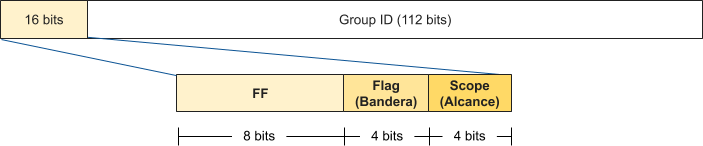

### Resumen IPv6

|                | **Tipo**           | **Prefijos y rangos** | **Enrutable** | **Equivalencia** |            |
|----------------|--------------------|-----------------------|---------------|------------------|------------|
|    **Unicast** | **Unicast Global** | 2000:: /3             |               | Sí               | Públicas   |
|                | **Enlace Local**   | FE80:: /10            | FEBF:: /10    | No               | Reservadas |
|                | **Local Única**    | FC00:: /7             | FDFF:: /7     | Sí               | Privadas   |
|                | **Loopback**       | 1:: /128              |               | No               | Reservadas |
|                | **No asignada**    | :: /128               |               | No               | Reservadas |
|                | **IPv4 embebida**  | ::FFFF:xxxx /80       |               | Sí               |            |
| **Multicast**  |                    | FF00:: /8             | FFFF:: /8     | Sí               | Broadcast  |
