# UT5.6 Servicios en red

## Servicio web

El **servicio web**, conocido técnicamente como *World Wide Web* (o sus siglas **WWW**), es posiblemente el servicio más extendido y utilizado en Internet.

Un servidor web se encarga del almacenaje y la difusión de información mediante la distribución de páginas *HTML*. Su arquitectura se basa en la archiconocida *cliente- servidor*. Ambos se comunican utilizando el protocolo **HTTP**.

-   **Servidor**: Almacena y sirve las páginas HTML. Por ejemplo, *Apache, Nginx, IIS*, etc.
-   **Cliente**: También llamado **navegador**; se encarga de interpretar el contenido de las páginas web: *Mozilla Firefox, Google Chrome, Safari, Edge,* etc.

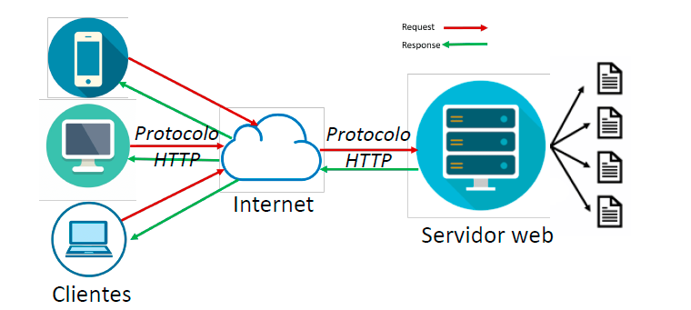

### Protocolo HTTP

El protocolo **HTTP** (*Protocolo de Transferencia de HiperTexto*) se creó para facilitar el intercambio de contenido en la World Wide Web.

Funciona siguiendo cuatro pasos: conexión, solicitud, respuesta y desconexión.

Es un protocolo **sin estado**, ya que no guarda información sobre lo que hace. Cuando se necesita mantener esa información, se hará uso de **cookies**, que guardan información en la máquina del cliente, o en otros casos será necesario pasar parámetros mediante campos de texto o formularios.


Los mensajes más comunes que puede lanzar el protocolo **HTTP:**


## Servicio de correo electrónico

Uno de los primeros sistemas que la digitalización modificó fue precisamente el de los correos. En un principio se trataba solo de texto, pero en su evolución incorporó otros medios que aportan información al contexto.

El **servicio de correo electrónico** es una correspondencia digitalizada, que emplea un conjunto de tecnologías para hacer llegar mensajes con garantías de integridad y privacidad de forma prácticamente instantánea.

El proveedor de correo asigna a cada usuario una dirección única o buzón en el mundo usando el formato [**nombrecorreo@dominio.com.**](mailto:nombrecorreo@dominio.com)

!

El buzón de correo tiene una forma de dar acceso a su contenido. Para ello usa un **programa cliente** con el que administrar correos; leer el correo pendiente, redactar correo, enviarlos o archivarlos entre muchas otras acciones. Ejemplos de programas cliente son *Microsoft Outlook, Mozilla Thunderbird, Samsung Mail o iOS mail*.

Actualmente el correo también puede consultarse desde aplicaciones web en la nube tan completas como un cliente de correo, abriéndose desde un **navegador web**, que sirve de interfaz para gestionar los correos en los Dominios de las empresas (como *Gmail, EducaMadrid, Outlook web*…).

El correo electrónico hace uso de los **protocolos** vistos en la unidad anterior:

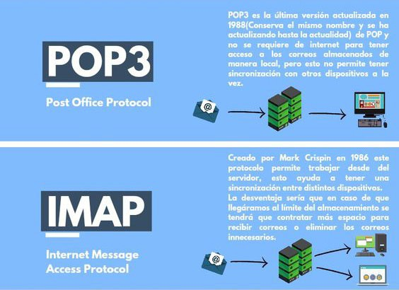

## Servicio DNS

El **servicio DNS** como sabemos es el encargado de traducir/interpretar nombres de dominio a direcciones IP y viceversa tal y como hemos visto con su protocolo.

Los usuarios generalmente no se comunican directamente con el servidor DNS: la resolución de nombres se hace de forma transparente por las aplicaciones cliente.

Al realizar una petición que requiera una búsqueda de DNS, la petición primero se gestiona por la caché del SO local del equipo y si no se puede resolver desde ahí se enviará al servidor DNS determinado por nuestra configuración de red, que si no está determinado será el servidor DNS del ISP por defecto.

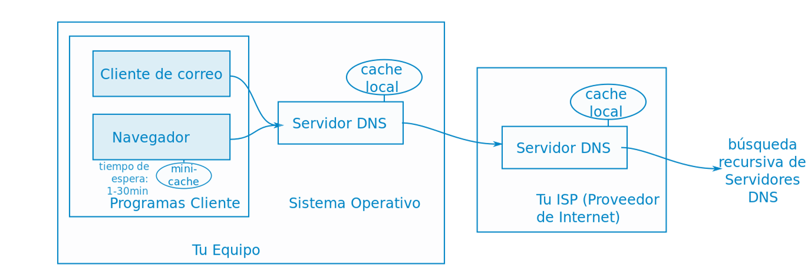

### Esquema de funcionamiento

1. Un navegador solicita resolver una dirección, **example.com***,* a su servidor DNS. 
    > Nota: Damos por hecho que la dirección IP a resolver no está en la caché del equipo local ni en el servidor ISP asociado.
2. El servidor (*DNS resolver*) al no tenerle en caché enviará la consulta a un servidor de nombres **raíz** de DNS (.).
3. El servidor raíz responderá con la dirección de un servidor DNS de dominio de primer nivel (TLD). El TLD del **.com**
4. El servidor TLD responderá a continuación con la dirección del servidor de nombres del Dominio. El de **example**.com. 
5. Por último, se enviará una consulta al servidor de nombres del Dominio **example**
6. Dicho servidor, conocido también como *servidor autoritativo*, devolverá la **dirección IP** al servidor DNS que lo solicitó originalmente (*DNS resolver*)
7. El servidor DNS (*DNS resolver*) responderá finalmente al navegador web con la dirección IP del dominio solicitado inicialmente.

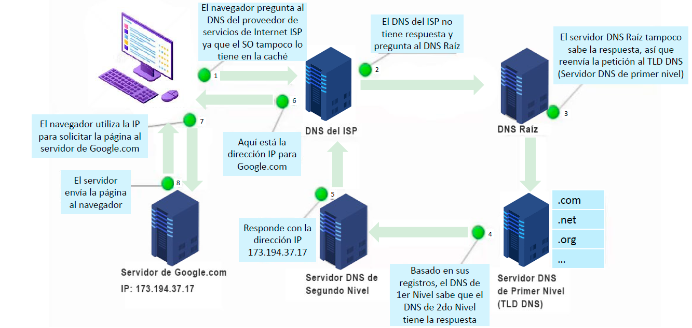

## Servicio DHCP

El mantenimiento y la configuración de red de los equipos de una red pequeña es relativamente fácil. Sin embargo, cuando se dispone de una red grande con equipos heterogéneos, la administración y asignación de direcciones IPs, se convierte en una tarea de difícil gestión. Es por ello que es necesario el **servicio DHCP**.

Los **datos mínimos** que un servidor de DHCP proporciona a cada cliente son:

-   *Dirección IP.*
-   *Máscara de red.*
-   *Puerta de enlace o gateway.*
-   *Dirección IP del servidor DNS.*


Ya sabemos además que el protocolo **DHCP** incluye tres métodos de asignación de configuración de red vistos en la unidad anterior:
-   Asignación **manual**: Un administrador configura de forma previa y manual la configuración de red para cada equipo.
-   Asignación **automática**: Se asigna automáticamente la configuración.
-   Asignación **dinámica**: Se asigna una configuración automática temporal.

### Servicio CDN

```note
Un CDN(Content DeliveryNetwork) es una red de servidores distribuidos geográficamente que trabajan juntos para entregar contenido de manera eficiente y rápida a los usuarios finales.
```

El contenido se almacena en múltiples ubicaciones (puntos de presencia o PoPs) para reducir la latencia.

El objetivo principal de un CDN es mejorar la velocidad de carga, reducir la latencia y aumentar la disponibilidad del contenido al ubicar los datos en servidores más cercanos al usuario final.

Un ejemplo práctico de CDN es cuando vemos un video de una plataforma como YouTube: el contenido se carga desde un servidor cercano en lugar de un servidor central, mejorando la experiencia, latencia y velocidad para el usuario.

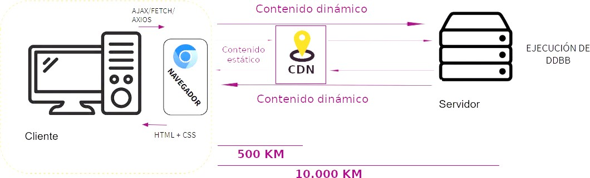

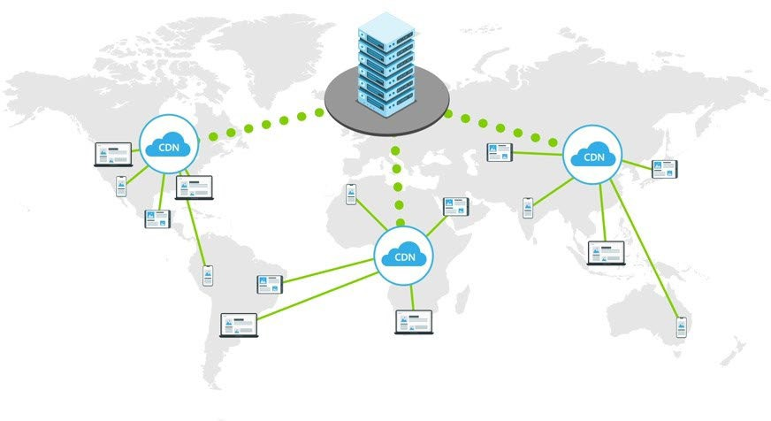

### Servicio de búsqueda web

El servicio de búsqueda de Internet o motor de búsqueda es un servicio especializado en la búsqueda de información en la web. Los resultados de búsqueda de una consulta suelen aparecer en forma de lista y pueden consistir en páginas web, imágenes, vídeos y otros formatos.

Los buscadores de Internet son aplicaciones que recopilan una gran cantidad de información. Utilizan técnicas como el rastreo, indexación de páginas y búsqueda. Deciden qué páginas se deben rastrear, seleccionan las páginas que se van a indexar y deciden aspectos como qué anuncios se deben añadir, cómo se clasifican las páginas.

Se trata, hasta ahora, de la herramienta digital más usada en todo el mundo, ya que da la oportunidad de encontrar en la World Wide Web información que queramos en forma de resultados, aunque en los últimos años está en declive.


Los motores de búsqueda funcionan rastreando la web con bots llamados *arañas*. Estos rastreadores web siguen enlaces de página a página para encontrar contenido nuevo que añadir al índice de búsqueda. Al usar un motor de búsqueda los resultados relevantes se extraen del índice y se ordenan usando un algoritmo.

Cada motor de búsqueda consiste de dos partes principales:
-   **Índice de búsqueda**. Una biblioteca digital de información sobre páginas web que se ha rastreado y procesado previamente.
-   **Algoritmo de búsqueda**. Programas informáticos que procesan y ordenan los resultados coincidentes con el índice de búsqueda en base a varios parámetros.

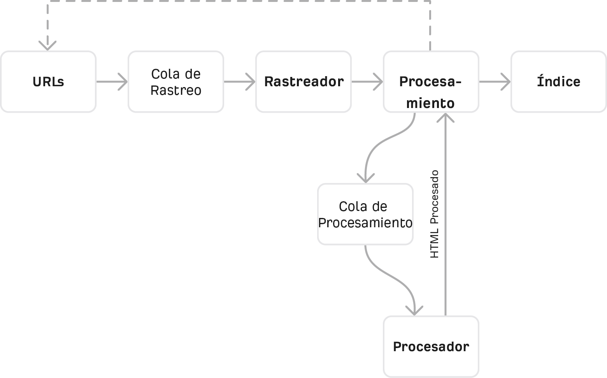

### SEO

**SEO** (*Search Engine Optimization)* es la rama de la informática relacionada con el posicionamiento en los buscadores web. Es el conjunto de técnicas y estrategias centradas en optimizar el posicionamiento orgánico en buscadores de Internet.

 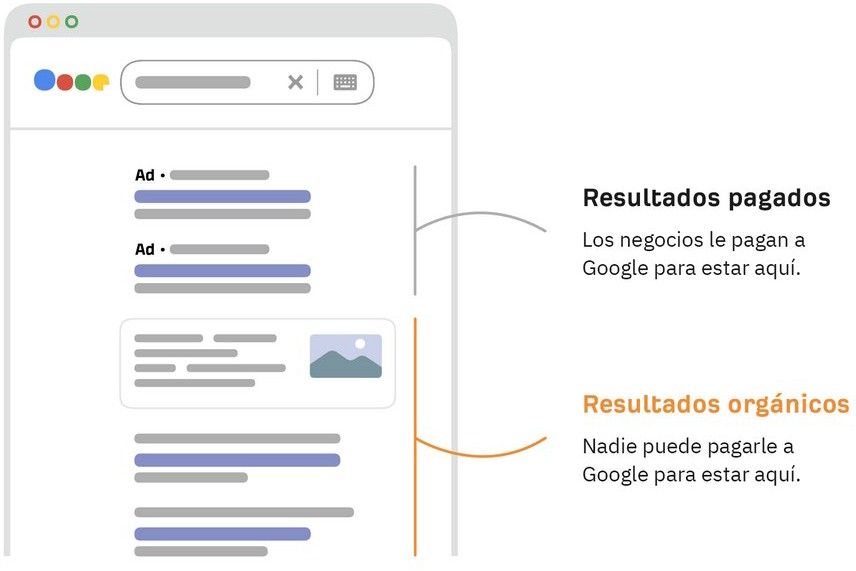

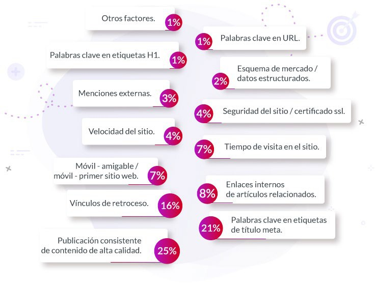

## Servicios de Directorio en red

Los **servicios de directorio (SD)** son sistemas de almacenamiento y recuperación de información jeráquica que organizan y gestionan los recursos y las entidades dentro de una red de ordenadores en una organización concreta (oficinas, centros de trabajo, etc.)

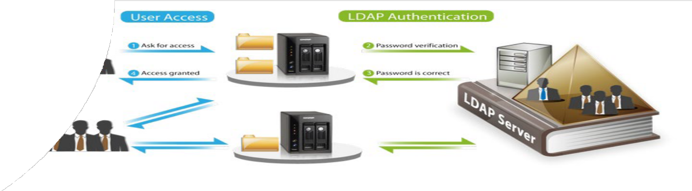

Estos servicios actúan como una **base de datos centralizada** que almacena información sobre usuarios, grupos, dispositivos, aplicaciones y otros recursos de red creando lo que se conocen como Dominios de computadoras a los cuales se les pueden asignar a su vez un conjunto de reglas de seguridad u organización unificadas.

## Servicio de Acceso Remoto

Los servicios de **acceso remoto** son servicios muy útiles y bastante utilizados. Permiten acceder de forma remota a un equipo a través de la red.

Pueden clasificarse en dos categorías:

-   **Acceso remoto en modo terminal**. Para acceder a un servidor en modo terminal se procede generalmente a través de **SSH** (*Secure SHell*). Antiguamente se accedía también a través de *Telnet*, pero ya apenas se usa por ser inseguro.
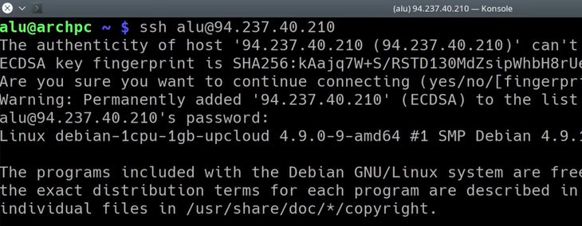

-   **Acceso remoto en modo gráfico**. Para acceder en modo gráfico a un servidor se puede utilizar el servicio *VNC* (Windows y Linux) o el servicio de Escritorio remoto en sistemas Windows. También existen aplicaciones como TeamViewer o SupRemo
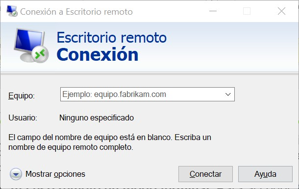
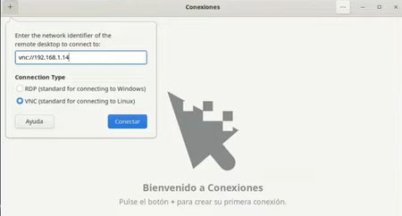

### Servicios de Cloud Computing

El **Cloud Computing** es un servicio ampliamente utilizado en la actualidad y que consiste en ofrecer servicios de computación a través de la red usando el almacenamiento en la nube (hablaremos en unidades posteriores de ello).

En los sistemas Cloud Computing, podemos encontrar dos partes diferenciadas dentro del sistema:

-   El **frontend** (la interfaz cliente del usuario): Cuando hablamos de la interfaz del usuario, incluiremos la red informática, y también la aplicación para acceder al servicio en la nube. Gracias a una interfaz el usuario podrá conectarse al *backend* a través de Internet.
-   El **backend**: Es decir, el servicio de la nube en sí mismo. Nos referimos a todos los sistemas que usa la nube para el almacenamiento y procesamiento de la información, es decir, los servidores.

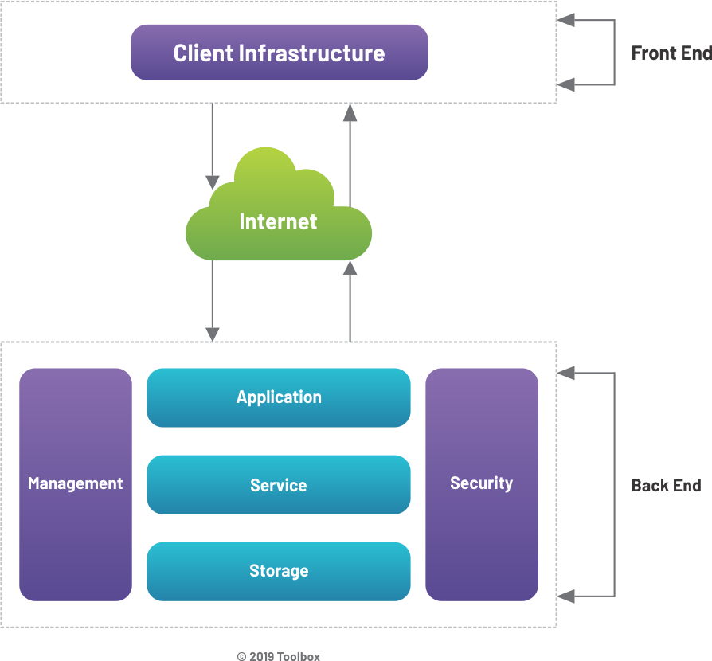

El Cloud Computing permite alquilar las tecnologías de la información en lugar de comprarlas. En lugar de realizar grandes inversiones en bases de datos, software y hardware, las empresas deciden acceder a su capacidad de computación a través de Internet, o la nube, y pagar según el uso que hagan de esa capacidad.

Estos servicios de nube ofrecen, entre otros, servidores, almacenamiento, bases de datos, redes, software, análisis e inteligencia empresarial.

Entre las ventajas que tiene el uso de este tipo de soluciones:

-   Coste: se reducen los gastos de material y mantenimiento.
-   Velocidad: se aprovisiona espacio al instante para el desarrollo y pruebas.
-   Escala global y flexible.
-   Productividad: mayor colaboración, rendimiento y aislamiento de clientes
-   Rendimiento: mejor relación precio-rendimiento para las cargas en la nube
-   Confiabilidad: sistemas distribuidos, escalables y tolerantes a fallos en todos los servicios.

Existen diversos niveles de Cloud Computing (*SaaS, PaaS y IaaS*) que hemos visto en unidades anteriores:

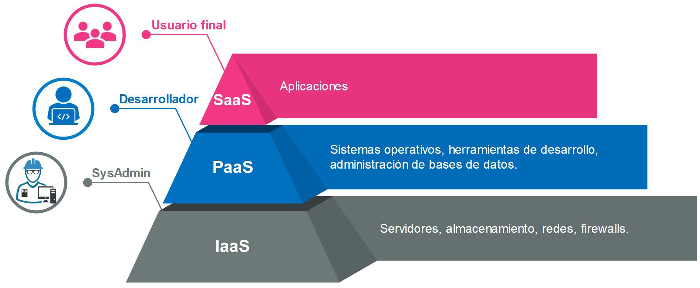

## Servicios de transferencia de archivos

### FTP, FTPS, SFTP

El servicio de transferencia de archivos basado en el protocolo **FTP** (*File Transfer Protocol*) es uno de protocolos más antiguos de la capa de aplicación que todavía se utilizan. **FTPS** es la variante segura de FTP que usa TLS/SSL para cifrar la comunicación.

Las cuentas de FTP son el medio estándar para gestionar el contenido alojado en un servidor web. Cada cuenta FTP se identifica por su nombre de usuario y se valida utilizando una contraseña.

**SFTP** está basado en *SSH* (*Secure Shell*) proporcionando cifrado en la transferencia.


### P2P

La transferencia de archivos mediante **P2P**, que significa *Peer-to-Peer* o de igual a igual, es un método para compartir archivos entre usuarios conectados a una red, sin necesidad de un servidor centralizado. En lugar de depender de un servidor central, los usuarios se conectan directamente entre sí para intercambiar archivos.

Ejemplos de servicios P2P son BitTorrent, eMule, entre otros.

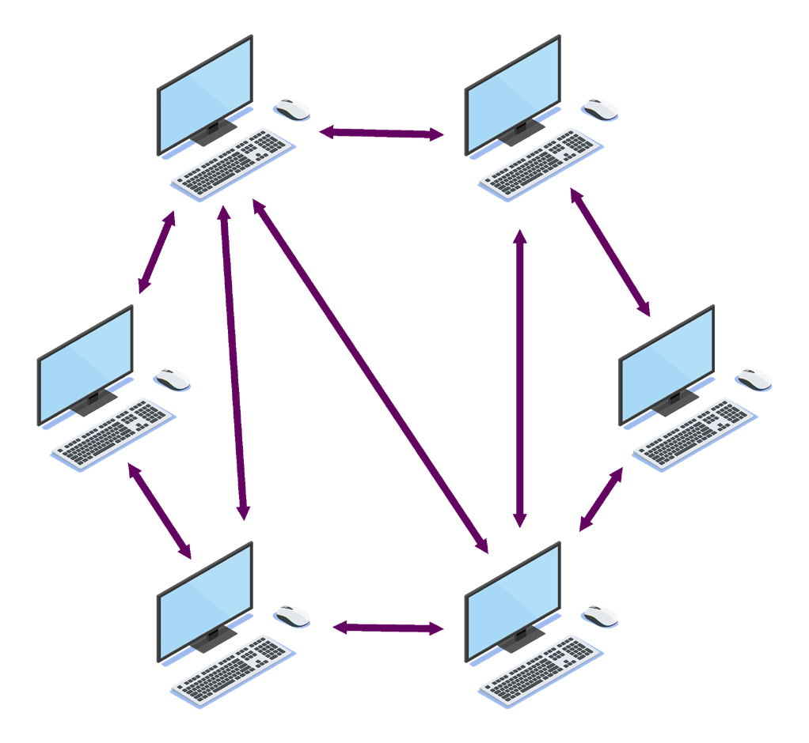
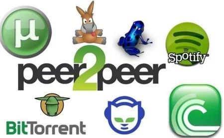

### Servicios de archivos en redes locales

Para compartir archivos en una red local se suelen utilizar **SMB** (Server Message Block) o **NFS** (Network File System):

-   **SMB** es usado en sistemas Windows para compartir archivos e impresoras. Implementado en Samba en Linux.
-   **NFS** es un protocolo nativo de Unix/Linux para compartir archivos en red. Permite montar directorios remotos como si fueran locales.

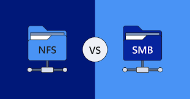

|                                | **SMB (Server Message Block)**                                                     | **NFS (Network File System)**                                        |
|--------------------------------|------------------------------------------------------------------------------------|----------------------------------------------------------------------|
| **Desarrollador**              | Microsoft (originalmente IBM)                                                      | Sun Microsystems (ahora parte de Oracle)                             |
| **Compatibilidad**             | Windows, Linux, macOS (con Samba)                                                  | Linux, Unix, macOS, Windows (con software adicional)                 |
| **Protocolo de transporte**    | TCP/IP, NetBIOS                                                                    | TCP/IP (originalmente también UDP)                                   |
| **Seguridad**                  | Puede encriptar tráfico y autenticación robusta con Active Directory               | Mejor seguridad en NFSv4 con Kerberos, pero NFSv3 es menos seguro    |
|  **Rendimiento**               | Más optimizado para entornos Windows, mayor sobrecarga por cifrado y autenticación | Mejor rendimiento en entornos Linux/Unix con menos sobrecarga        |
| **Facilidad de configuración** | Fácil en entornos Windows, Samba lo hace posible en Linux                          | Más simple en Linux/Unix, pero requiere más configuración en Windows |
| **Uso típico**                 | Compartición de archivos en redes Windows y entornos mixtos                        | Compartición de archivos en entornos Linux/Unix                      |

### Resumen de servicios


| **Protocolo/Servicio** | **Seguridad**                        | **Uso Típico**                                                                  |
|------------------------|--------------------------------------|---------------------------------------------------------------------------------|
| FTP                    | Inseguro                             | Transferencias simples en redes internas                                        |
| FTPS                   | Cifrado SSL/TLS                      | Transferencia segura en Internet                                                |
| SFTP                   | SSH                                  | Transferencias seguras en servidores Linux                                      |
| SMB                    | Soporta autenticación                | Compartición de archivos en redes Windows                                       |
| NFS                    |                                      | Compartición de archivos en entornos Linux/Unix                                 |
| P2P                    | Variable (depende del cifrado usado) | Transferencia distribuida de archivos, uso en torrents y redes descentralizadas |

## Redes sociales, mensajería y VoIP

Sin duda las redes sociales y los servicios de mensajería intantánea son dos de los servicios más ampliamente utilizados y conocidos por la población mundial.

Las **redes sociales** son plataformas o herramienta digitales que permite a los usuarios crear y compartir contenido rápidamente con una comunidad o público concreto con diversos fines.

La **mensajería instantánea** es otro servicio online de comunicación que permite a dos o más personas enviar y recibir mensajes de texto en tiempo real, así como compartir contenido multimedia.

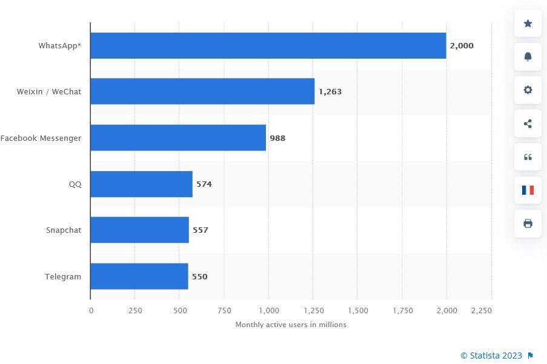 
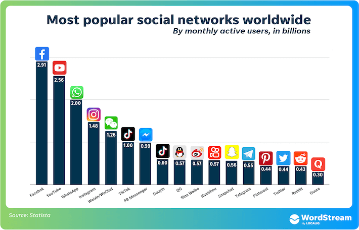

### VOIP

La Voz sobre Protocolo de Internet (**VoIP**) es una tecnología que permite la transmisión de señales de voz a través de la red. En lugar de utilizar las redes telefónicas tradicionales basadas en circuitos, VoIP aprovecha la infraestructura de Internet para transmitir llamadas de voz de manera eficiente y económica.

En el proceso de VoIP, la voz se convierte en datos digitales que pueden ser transmitidos a través de redes IP. Esto se logra mediante el uso de **códecs** (codificadores-decodificadores) que comprimen la señal de voz para su transmisión eficiente.

## Servicios de IA y Streaming

### Servicios de IA

Los servicios de IA se pueden clasificar en varias categorías según su función y aplicación:

-   **IA Generativa**: Crea contenido (texto, imágenes, audio, video). Ej.: ChatGPT, Gemini, Copilot, DALL·E, Midjourney.
-   **IA Conversacional**: Chatbots y asistentes virtuales. Ej.: ChatGPT, Gemini, DeepSeek, Watson Assistant.
-   **Análisis de Datos e IA Predictiva**: Detecta patrones y da predicciones. Ej.: Google AutoML, IBM Watson.
-   **Procesamiento de Lenguaje Natural** (NLP): Traducción, análisis de texto y sentimiento. Ej.: DeepL, OpenAI Whisper.
-   **Visión por Computadora**: Reconocimiento de imágenes y objetos. Ej.: Amazon Rekognition, Google Vision AI.
-   **Automatización y Robótica**: Procesos industriales y RPA. Ej.: UiPath, Tesla Autopilot.

### Streaming

Los servicios de streaming de contenido audiovisual en la red permiten la transmisión de contenido multimedia de todo tipo, como música, video y realidad virtual a través de Internet.

Estos servicios y han vivido una reciente explosión de contenidos creados por autores, streamers, compañías y conglomerados audiovisuales/musicales que incluyen también recientemente todos aquellos contenidos creados por IA generativa.


