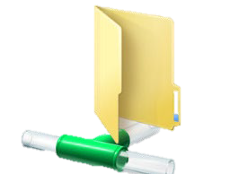
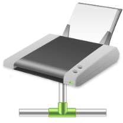
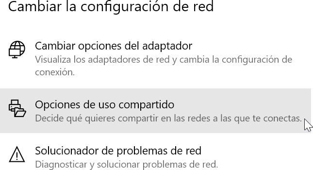
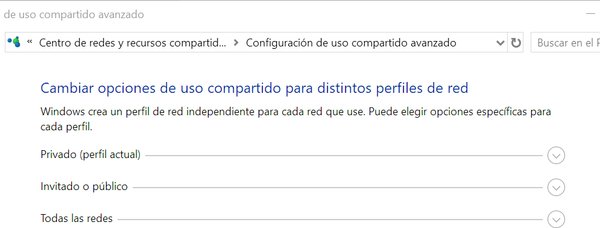
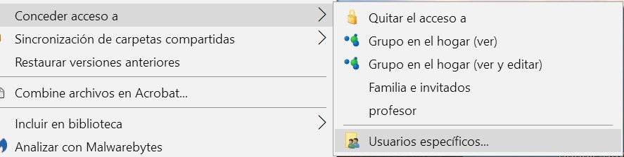
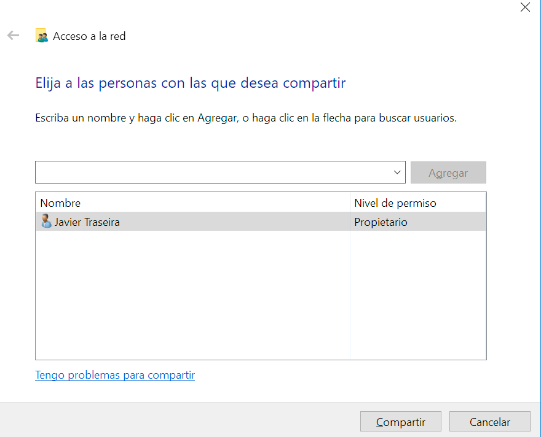
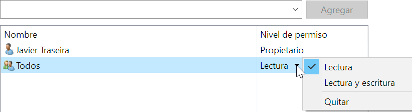
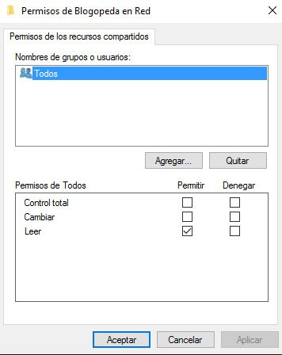
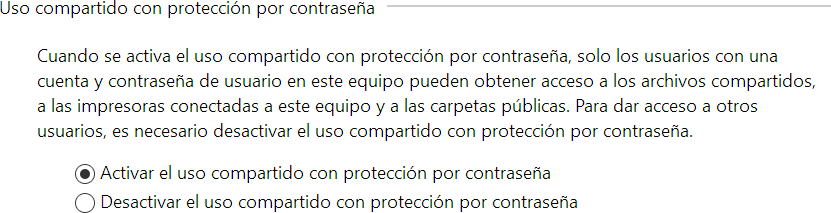
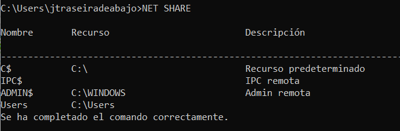

# UT6.1 Administración de recursos en red y Dominios en Windows

## Compartir recursosde una red Windows

El principal motivo por el que crear redes donde hay varios equipos funcionando y utilizar SO en red, es para compartir recursos entre ellos. Las redes dan muchas posibilidades, pero básicamente en un grupo de trabajo lo que se comparten son carpetas y dispositivos tales como impresoras.

Una vez configurada una red podemos utilizarla para trabajar de forma compartida con los **recursos** de los que dispongamos en ella:

-   Archivos
-   Carpetas
-   Impresoras

 

### Verifcaciones previas

Para poder **compartir recursos** de un equipo en red y que lo puedan utilizar otros usuarios de dicha red, deberemos comprobar que:

-   Nuestro equipo deberá tener un **nombre diferente** a cualquier otro de la red.
-   Los equipos deberán pertenecer al mismo **grupo de trabajo** o un **Dominio**.
-   La dirección IP de cada equipo de la red local deberá ser distinta y tener todos la misma máscara de subred.
-   El usuario **administrador** de cada equipo deberá contar con contraseña y la cuenta del mismo deberá estar habilitada.

### Compartir carpetas en red

Para poder **compartir recursos** como **carpetas en red** debemos primeramente tener habilitado la **compartición de archivos e impresoras.**

Para ello se deberá acceder desde opciones de uso compartido y habilitar y según el acceso que se le quiera dar a esos recursos:

-   **Privado** (perfil actual): para usuarios identificados dentro de una misma red local.
-   **Invitado o público**: para usuarios dentro de una misma red local no identificados.
-   **Todas las redes**: para usuarios dentro o fuera de una red local.

Para **compartir carpetas en red** y los ficheros que contiene, deberemos seleccionamos la carpeta o directorio que deseamos compartir en red y pulsar con el botón derecho del ratón seleccionando la opción de *Conceder acceso \> Usuarios específicos* o dentro de la pestaña *compartir* en *propiedades de la carpeta.*

Dentro del cuadro anterior deberemos elegir con que **equipos de nuestra red compartir la carpeta y su contenido**. Se puede compartir el contenido con todos los equipos conectados a nuestra red, seleccionando **Todos y Agregar**. Podemos asignarla dos niveles de permiso: *Lectura o Lectura y escritura.*

También podemos establecer una serie de permisos a los usuarios que se conecten a la carpeta compartida para según que permiso, tener unas prioridades con los archivos o no.

Al acceder a la carpeta compartida Windows pedirá un usuario y contraseña. Para configurar dicho comportamiento deberemos acceder desde el Panel de Control de nuestro equipo a las opciones del **Centro de redes y recursos compartidos**, y pulsar sobre *Cambiar configuración de uso compartido avanzado.*

Dentro de las opciones que se abren dentro de campo Todas las redes, podemos marcar la opción de **Desactivar el uso compartido con protección por contraseña**. De esta manera evitaremos que Windows solicite un usuario y contraseña cuando intentemos acceder a las carpetas compartidas.

Para compartir carpetas en red desde la línea de comandos utilizaremos el comando *NET SHARE*.

    NET SHARE \<sharename=drive:path\>

Por ejemplo, para compartir una carpeta denominada recurso situada en la unidad C, en la ruta de acceso \\Usuarios\\miNombre, escriba:

    NET SHARE myshare=C:\Users\Myname

Usando el comando sin parámetros nos mostrará los elementos en red compartidos:

