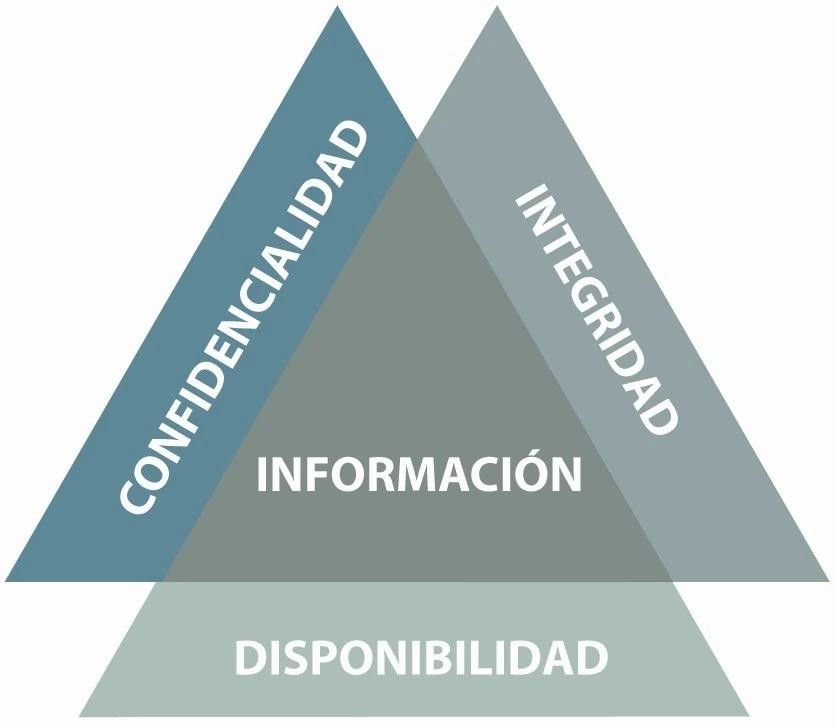
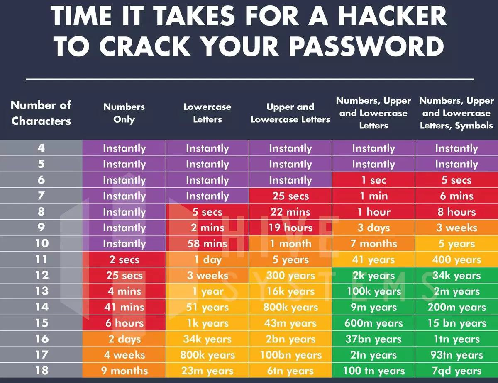
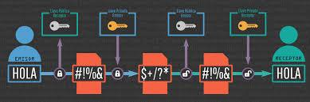
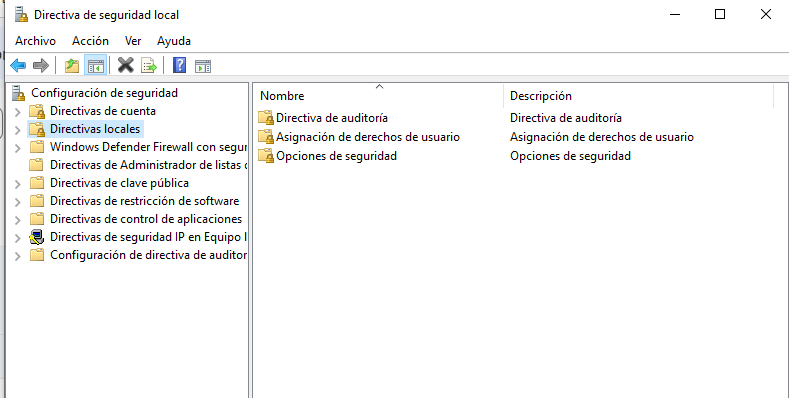
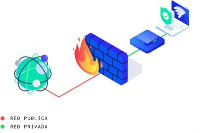
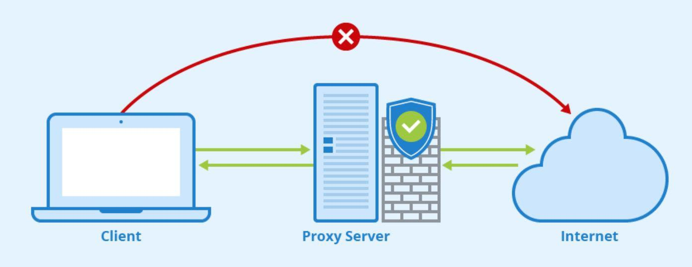
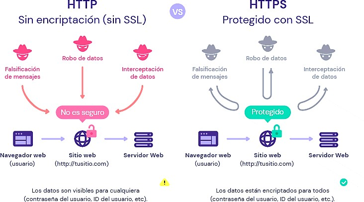
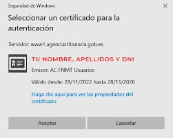

# UT8.1: Seguridad de sistemas informáticos

## Introducción

```note
La seguridad informática es una rama de la informática que se dedica a proteger los sistemas informáticos de amenazas externas e internas y daños causados de forma o no intencionada.
```

Las **amenazas externas** son aquellas que provienen del entorno exterior en el que se encuentra el sistema como, por ejemplo: ataques informáticos, virus, robos de información, etc.

Las **amenazas internas** son aquellas que provienen del propio sistema, como: errores humanos, exposición pública de credenciales, fallos o desactualizaciones en el software y fallos en el hardware, entre otros.

### Pilares de la seguridad informática

Estos son los **cuatro pilares** en los que se basa la seguridad informática:

-   **Disponibilidad**. Los sistemas deben permitir el acceso a la información cuando el usuario lo requiera, sin perder de vista la privacidad.
-   **Confidencialidad**. La información solo debe ser accesible para las personas autorizadas.
-   **Integridad**. Los sistemas deben garantizar la integridad de la información, sin errores ni modificaciones.
-   **Autenticación**. La información que procede de un usuario debe verificarse para garantizar que es quien dice ser.



### Tipos de seguridad informática

Existen tres tipos de seguridad informática: de **hardware**, de **software** y de **red**.

-   La **seguridad de hardware** se encarga de la protección de los datos y los equipos y sistemas de hardware de la entidad del robo o el sabotaje, entre otros daños.
-   La **seguridad de software** tiene como misión proteger la infraestructura relacionada con el software de una organización, así como los datos relacionados con ella. Es decir, intenta evitar ataques de malware, phishing o virus, entre otros peligros.
-   La **seguridad de red** protege la información y la infraestructura relacionada con la red de una entidad. Cualquier problema que haya en ella puede derivar en ataques al software y a los datos, por lo que proteger la integridad de la red es crucial.

### Factores de requisitos de seguridad

Antes de implementar cualquier medida de protección, es fundamental determinar qué aspectos del sistema y de los datos deben protegerse, por qué, y hasta qué punto, especialmente aquellos **factores** que afectan a los requisitos de seguridad.

- Tipo de datos que maneja el sistema: Datos sensibles (personales, financieros, clínicos...) requieren medidas estrictas.
- Entorno legal y normativo: RGPD, LOPDGDD, ISO 27001 pueden imponer requisitos obligatorios.
- Criticidad del sistema: Un servidor web público tendrá necesidades distintas a un servidor de copias de seguridad interno.
- Tamaño y estructura de la organización: No es lo mismo una pyme que una multinacional con sedes en varios países.
- Amenazas y riesgos detectados: Análisis de riesgos para determinar las prioridades de protección.

## Seguridad activa y pasiva

Llamamos **seguridad activa** al conjunto de acciones encaminadas a proteger un sistema informático y su contenido. Se trata de reducir vulnerabilidades todo lo posible. Medidas de seguridad activa:

-   Uso de contraseñas y credenciales seguras.
-   Software y SO actualizado.
-   Protección de datos mediante encriptación y cifrado.
-   Protección de las comunicaciones y red: uso firewalls, servidores proxy, protocolos inalámbricos seguros, navegación segura.
-   Formación y concienciación de los usuarios.

Se conoce como **seguridad pasiva** a la que pretende minimizar el impacto y consecuencias de un posible daño informático :

-   Respaldos del sistema periódicos.
-   Realización de particionamiento en discos.
-   Software de desinfección de malware detectado.

## Seguridad activa 

### Seguridad de las contraseñas

- Utiliza contraseñas **largas y complejas**. Deben tener al menos 8 caracteres y combinar letras, números y símbolos.
- No uses la misma clave para todos tus sitios web y cuentas.
- No uses palabras del diccionario o frases comunes. Son fáciles de adivinar por los hackers mediante **fuerza bruta**. Tampoco utilices información personal en tus claves ya que son fáciles de adivinar.
- Usa la autenticación de **dos factores o MFC** siempre que sea posible. Requiere que ingreses un código de seguridad además de tu contraseña para acceder a tu cuenta. Esto dificulta el hecho de que los hackers accedan a tus cuentas.
- Puedes ayudarte de **gestores de contraseñas** locales para ayudarte a recordarlas. Son programas que las almacenan y encriptan para que solo tú puedas acceder a ellas.



### Seguridad usuarios y equipos

La seguridad informática se puede organizar en distintos **niveles de protección**, según a **quién o qué** se apliquen las medidas.

Dos de los niveles más comunes y esenciales son:

- **Seguridad a nivel de usuarios**
- **Seguridad a nivel de equipos o sistemas**

Dividir la seguridad en niveles permite aplicar **controles específicos y personalizados** para cada ámbito, logrando una defensa más eficaz y estructurada.

#### Seguridad a nivel de usuarios

Este nivel se centra en controlar quién accede al sistema, qué puede hacer y cómo se comporta.

Es uno de los puntos más vulnerables, ya que el usuario puede ser el **eslabón más débil** (por desconocimiento, descuidos o mala intención).

#### Seguridad a nivel de equipos

El enfoque se centra en proteger los dispositivos físicos y los sistemas operativos contra accesos no autorizados, fallos, malware o pérdida de información. Afecta a servidores, ordenadores personales, portátiles, móviles.

### Formación del personal

Formar al personal en seguridad informática es fundamental para proteger los datos y los sistemas de una organización, así como elcumplimiento de la legislación de protección de datos vigente(**RGPD de 2016 de la UE** y la *LOPDGDD de 2018* de Protección de datos y Derechos Digitales de los ciudadanos españoles).

Algunos **métodos efectivos** para llevar a cabo esta formación:

- Concientización y capacitación regulares: Organiza sesionesde capacitación periódicas sobre seguridad informática paratodo el personal, desde empleados de nivel básico hasta directivos. Difundir la legislación de protección de datos vigente y actualizada es vital.

- Políticas de seguridad claras y actualizadas: Desarrollar y comunica políticas de seguridad informática claras y comprensiblespara todo el personal.

### Cifrado de datos

El **cifrado de datos** es sin duda uno de los sistemas más antiguos para proteger las comunicaciones. Consiste en convertir información legible en un formato ilegible para protegerla del acceso no autorizado mediante el uso de una clave.

- **Cifrado simétrico**. Utiliza la misma clave para cifrar y descifrar. La clave es compartida por el emisor y por el receptor del mensaje, usándola el primero para codificar el mensaje y el segundo para descodificarlo.

- **Cifrado asimétrico**. Utiliza dos claves distintas, una para cifrar y otra para descifrar. La clave para cifrar es compartida y pública, la clave para descifrar es secreta y privada. El emisor utiliza la clave pública del receptor para cifrar el mensaje y, al recibirlo, el receptor utiliza su propia clave privada para descifrarlo. Este tipo de criptografía es también llamada de clave pública.



**Ejemplo cifrado simétrico**

Una empresa quiere enviar un archivo cifrado a un empleado.

1. La empresa y el empleado acuerdan una misma clave secreta (por ejemplo 123).
2. La empresa cifra el archivo con esa clave.
3. El empleado usa la misma clave “123" para descifrarlo.

El problema de este sistema es cómo compartir la clave de forma segura sin que nadie la intercepte por el camino.

**Ejemplo cifrado asimétrico**

Alguien quiere enviarte un mensaje seguro sin haber hablado contigo antes.

1.  Tú tienes **dos claves**:
    -   Una clave **pública** (que puedes compartir con todo el mundo).
    -   Una clave **privada** (que solo tú conoces y guardas en secreto).
2.  Esa persona usa tu clave pública para cifrar el mensaje.
3.  Solo tú puedes descifrarlo, usando tu clave privada.

El **cifrado de datos** que se aplica es distinto si los datos están en reposo o en tránsito, ya que se requieren enfoques técnicos diferentes:

- **Datos en reposo:** Se cifran utilizando algoritmos como **AES** (*Advanced Encryption Standard*). Este cifrado simétrico se aplica sobre discos duros, bases de datos, objetos almacenados (S3, Blob Storage, etc.).
- **Datos en tránsito:** Se protegen usando protocolos como **SSL/TLS**, que aseguran las comunicaciones entre clientes, servidores y servicios pudiendo usar cifrado simétrico o asimétrico.

### Permisos y control de acceso

Uno de los pilares de la seguridad activa es el **control de acceso**, es decir, decidir **quién puede acceder a qué** dentro del sistema, y qué está autorizado a hacer.

Ejemplos de **permisos** ya vistos en Unidades anteriores:
-   Lectura (*read*): ver el contenido.
-   Escritura (*write*): modificar o eliminar el contenido.
-   Ejecución (*execute*): ejecutar un archivo o script.

En sistemas Windows y Linux, los **permisos** pueden aplicarse a:
-   Usuarios individuales
-   Grupos de usuarios
-   Otros (resto de usuarios del sistema)

### Derechos (políticas de seguridad)

Los **derechos** (también llamados privilegios o políticas de seguridad) se refieren a acciones que el sistema permite realizar a un usuario sobre el propio sistema operativo, más allá de los archivos o carpetas.

Ejemplos:
-   Apagar el equipo.
-   Iniciar sesión local o por red.
-   Instalar software.
-   Realizar copias de seguridad.
-   Cambiar la hora del sistema.

En Windows, los derechos se gestionan mediante las **políticas de seguridad local** o mediante **directivas de grupo (GPO)**

### Directivas de seguridad

Las directivas de seguridad son conjuntos de reglas configuradas por el administrador del sistema para definir el comportamiento de seguridad del sistema operativo. 

Permiten automatizar y estandarizar medidas de protección en todos los equipos de una red o Dominio.



Tipos de directivas comunes:

**Directivas de cuenta**
- Política de contraseñas (longitud mínima, caducidad, historial).
- Bloqueo de cuenta tras intentos fallidos.

**Directivas de inicio de sesión**
- Quién puede iniciar sesión localmente o remotamente.
- Horarios de acceso permitidos.

**Directivas de auditoría**

Registrar eventos como inicio de sesión, acceso a archivos, configuraciones..

**Directivas de seguridad del sistema**
- Configuración del UAC (Control de cuentas de usuario).
- Acceso a dispositivos externos.
- Permitir o denegar ejecución de software.

### Protección de las comunicaciones

#### Firewall

Un firewall, o cortafuegos, es un programa informático (o hardware) que brinda protección a ordenador o dispositivo en una red frente a intrusos y accesos no autorizados.

Un firewall monitorea el tráfico de una red, ya sea entrante o saliente y decide si permite o bloquea dicho tráficoen función de un conjunto definido de reglas de seguridad.



En un Firewall existen dos tipos de reglas:

- **Reglas de entrada**: Controlan el tráfico que se permite o bloquea desde fuentes externas, es decir, las conexiones que se generan en Internet y que llegan a nuestro equipo.
- **Reglas de salida**: Controla las conexiones que se generan en nuestro ordenador y que tengan como objetivo salir a Internet.

El Firewall más extendido para sistemas Linux es **ufw** (*Uncomplicated Firewall*) y hace referencia a una aplicación que tiene como objetivo establecer reglas en **iptables**, las tablas de firewall nativas en Linux. Puesto que iptables tiene una sintaxis relativamente compleja, utilizar ufw para realizar su configuración es una alternativa útil sin escatimar en seguridad.

Ejemplos de comportamiento del firewall de *ufw*:

```bash
#Denegar conexiones entrantes/salientes que no coincidan con ninguna regla:
ufw default deny incoming/outgoing
#Permite conexiones entrantes/salientes que no coincidan con ninguna regla.:
ufw default allow incoming/outgoing
#Permitir conexiones tráfico entrante del puerto 22 de SSH:
ufw allow 22
#Permite solo las conexiones entrantes con el protocolo TCP por el puerto 80.
ufw allow 80/tcp
```

#### Servidor proxy

Un **servidor proxy** es un equipo que hace de intermediario entre un cliente y un destino. Cuando un cliente desea una información, conecta con el servidor proxy en lugar de hacerlo con el servidor de destino. El servidor proxy contacta con el servidor de destino como si fuese el propio cliente y, una vez obtenida la información se la envía al ordenador que inició la petición.

En una **red local** un servidor proxy puede dar este servicio a todos los ordenadores, de forma que las comunicaciones no se realizan con el exterior sino únicamente con el servidor proxy. Por otro lado, este servidor es el único que accede e intercambia datos con la red externa.



#### Seguridad redes Wi-Fi

Ya hemos hablado de las vulnerabilidades que sufren las redes inalámbricas al ser accesibles en un amplio radio de acción. Para proteger redes Wi-Fi se usan diversos protocolos de seguridad los más habituales son: **WEP**, **WPA**, **WPA2** y el más reciente **WPA3**. Siempre que se pueda se ha de utilizar los dos últimos puesto que son los más seguros.

#### Navegación segura

Los navegadores y operadores de red han promovido el cambio al protocolo **HTTPS**. HTTPS a diferencia de HTTP cifra los datos usando un protocolo de seguridad llamado **SSL/TLS**. Es imprescindible su uso en comunicaciones seguras con entidades bancarias o tiendas online. En otros casos también ayuda a proteger la privacidad y los datos de los usuarios.



Un **certificado digital** (también conocido como certificado de clave pública o certificado de identidad) es un documento digital mediante el cual una autoridad de certificación garantiza la vinculación entre la identidad de un sujeto o entidad (por ejemplo: nombre, dirección y otros aspectos de identificación) y una clave pública.

En la actualidad comienza a ser obligatorio para la mayoría de trámites con administraciones Estatales o autonómicas que pueden hacerse vía telemática. Dichos certificados garantizan nuestra identidad en Internet y evitan el fraude o suplantación de identidades (tanto por parte de la administración como del usuario que se identifica). Además, evitan que otras personas puedan conocer la información que se intercambia.

En particular, se llama **firma electrónica** al tipo de certificado digital que tiene la misma validez que una firma manuscrita.



## Seguridad pasiva

### Clonación

Hacer una imagen del sistema consiste en clonar sus discos o particiones completos. Un disco está formado por particiones e información de arranque. Esta información de arranque es importante si hay instalado un sistema operativo en dicho disco.

Las herramientas de clonación pueden tanto **clonar discos** como **clonar particiones**. La diferencia entre ambas resulta obvia. Al clonar dos discos, ambos discos serán iguales; pero si se clonan todas las particiones de un disco a otro, puede ser que no se clone el cargador que contenga el disco de origen.

### Copias de seguridad

Las copias de seguridad, **backup** o copias de respaldo consisten en duplicar todo o parte de un sistema para poder afrontar un fallo en el mismo, un borrado accidental, una corrupción de datos, etc.

La **restauración** de la copia de seguridad recuperará la información disponible en la fecha de la realización de dicha copia. Por lo tanto, si en una empresa se realizan copias de seguridad todos los domingos y el viernes por la tarde se avería el disco del servidor, el resultado es la pérdida de todos los datos de la semana.

Existen diversos tipos de copias de seguridad que veremos a continuación.

-   **Copia de seguridad completa**: Este tipo de copia de seguridad realiza una copia completa de todos los datos seleccionados en un momento dado. Es útil para restaurar todo el sistema en caso de fallo total del hardware o del software. Se suele hacer periódicamente.
-   **Copia de seguridad incremental**: En este tipo de copia de seguridad, solo se copian los archivos que han cambiado o sido creados desde la última copia de seguridad completa o incremental.
-   **Copia de seguridad en la nube**: Consiste en almacenar copias de seguridad de los datos en servidores remotos a través de internet. Es una solución conveniente y escalable que proporciona protección contra desastres, robo o pérdida física de los dispositivos de almacenamiento locales.

### Sistemas RAID

Un **RAID** (*Redundant Array of Independent Disk*) es un grupo de discos que actúan colectivamente como un único sistema de almacenamiento, que, en la mayoría de los casos, soporta el fallo de uno de los discos sin perder información de modo que puedan operar con independencia.

lógica, donde los mismos datos son almacenados en todos los discos (redundancia). De esta forma si un disco se daña y deja de funcionar, los datos podrán ser recuperados del resto de discos.
- Existen diversos tipos de RAID como el RAID 1 o el RAID 5.
- Un RAID nunca debería de utilizarse como sistema de copia de seguridad.

## Malware

El **malwareo** software malicioso, es un término que se refiere a cualquier tipo de software diseñado con el propósito de dañar, infiltrarse, robar datos o causar molestias en un dispositivo o sistema informático sin el consentimiento de sus usuarios/adminitradores.

El malware son programas o aplicaciones *disfrazados* con el objetivo de engañar al usuario. Los virus informáticos son el tipo más común de malware, por lo que es habitual ese nombre para denominar a todos los tipos de programas hostiles.

Hoy en día el malware se utiliza para:

- Robar información como datos personales, contraseñas, números de cuenta.
- Crear red de ordenadores zombies o botnet para utilizarlos para el envío masivo de spam, phishing o realización de ataques de denegación de servicio.
- Vender falsas soluciones de seguridad para solucionar el problema que no existe.
- No dejar arrancar un equipo crítico o personal y cifrar el contenido de determinados archivos solicitando el pago de una cantidad para solucionarlo.

### Virus

Un virus informático es un malware que tiene por objeto alterar el normal funcionamiento del ordenador, sin el permiso o el conocimiento del usuario. Los virus, habitualmente, reemplazan archivos ejecutables por otros infectados con el código de este. Los virus actúan cuando se ejecuta un programa que está infectado, en la mayoría de las ocasiones, por desconocimiento del usuario.

El código del virus queda residente (alojado) en la memoria RAM de la computadora, aun cuando el programa que lo contenía haya terminado de ejecutarse. El virus toma entonces el control de los servicios básicos del sistema operativo, infectando, de manera posterior, archivos ejecutables que sean llamados para su ejecución. Finalmente se añade el código del virus al programa infectado con lo cual el proceso de replicado se completa.

### Gusanos y troyanos

- Los **gusanos** muy parecidos a los virus pero la gran diferencia es que se propagan solos, sin la necesidad de ser ejecutados por un ser humano. Esto hace que los gusanos sean muy peligrosos ya que tienen la capacidad de replicarse en el sistema. El daño que puede causar un gusano es que consume mucha memoria del sistema, logrando que los servidores y ordenadores no respondan.

- Los **troyanos** son tipo de virus en el que se han introducido, camufladas en otro programa, instrucciones encaminadas a destruir la información almacenada en los discos o bien a recabar información. Su nombre hace referencia al caballo de Troya porque estos virus suelen estar alojados en elementos aparentemente inofensivos, como una imagen o un archivo de música, y se instalan en el sistema al abrir el archivo que los contiene. Son programas que disfrazan y esconden una función no deseada en un programa aparentemente inofensivo.

### Ransomware

El **ransomware** es un tipo de software malicioso diseñado para bloquear el acceso a un sistema informático, archivos o datos, generalmente mediante el cifrado de los archivos, hasta que se pague un rescate a los atacantes. Los ransomware suelen infectar los sistemas a través de correos electrónicos de phishing, descargas de software malicioso o explotando vulnerabilidades en sistemas no actualizados.

Una vez que el ransomware ha infectado un sistema, muestra un mensaje o pantalla de bloqueo que informa al usuario que sus archivos están cifrados y que solo se desbloquearán si se paga un rescate, a menudo en criptomonedas para dificultar su rastreo. Pagar el rescate no garantiza siempre que los archivos se recuperen y, además, puede incentivar a los ciberdelincuentes a continuar con sus actividades.


### Otro malware

- Software espía o **spyware**: Una vez instalado envía al exterior información proveniente del ordenador del usuario de forma automática, pudiendo luego ser usada contra este. No todos los programas espía son malintencionados.
- **Hijackers**: Son programas que “secuestran” a otros programas para usar sus derechos o para modificar su comportamiento. El caso más habitual es el ataque a un navegador.
- **Adware**: software de publicidad es publicidad incluida en programas que la muestran después de instalados. Algunos de ellos tienen licencia shareware o freeware e incluyen publicidad para subvencionarse, de forma que si el usuario quiere una versión sin publicidad puede optar por pagar la versión con licencia registrada. El problema viene cuando estos programas actúan como spyware, incluyendo código para recoger información personal del usuario.
- **Spam**: Los términos correo basura y mensaje basura hacen referencia a los mensajes no solicitados, no deseados o con remitente no conocido (correo anónimo), habitualmente de tipo publicitario, generalmente son enviados en grandes cantidades (incluso masivas) que perjudican de alguna o varias maneras al receptor, pudiendo ser considerados como medios para un ataque.
- **Cookies**: Una cookie es información enviada por un sitio web y almacenada en el navegador del usuario, de manera que el sitio web puede consultar la actividad previa del usuario. En un principio se puede considerar spyware no dañino pues es con fines puramente publicitarios, pero algunos actúan como virus rootkits.

## Tipos de ataques

### Ingeniería social

A la hora de poner una **contraseña**, los usuarios no suelen utilizar combinaciones aleatorias de caracteres. En cambio, recurren a palabras conocidas para ellos: el mes de su cumpleaños, el nombre de su calle, su mascota, su futbolista favorito, etc. Si conocemos bien a esa persona, podemos intentar adivinar su contraseña.

La Ingeniería social es una técnica que emplean los ciberdelincuentes para ganarse la confianza del usuario y conseguir así que haga algo bajo su manipulación y engaño. Se suele recurrir a contactos o suplantación de identidad (ojo a las nuevas herramientas de IA generativa), dando información parcial del usuario obtenida previamente por otras herramientas, para solicitar sus crendenciales de acceso.

### Phising

Es un tipo de ataque basado en ingeniería social. El atacante se pone en contacto con la víctima (generalmente, un correo o sms) haciéndose pasar por una empresa con la que tenga alguna relación (su banco, su empresa de telefonía, etc.). En el contenido del mensaje intenta convencerle para que pulse un enlace que le llevará a una (falsa) web de la empresa.